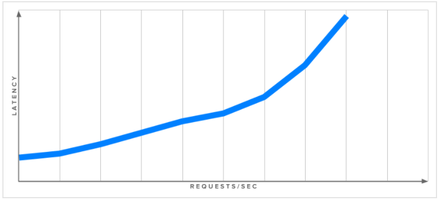

# Giới thiệu về Load Testing

## Giới thiệu
- Khi mà các web sites và web ứng dụng có nhiều tính năng và phức tạp, hiệu năng đều trở thành mối quan tâm của cả các nhà phát triển và cả người dùng. Các nghiên cứu cho thấy rằng các trang web nhanh hơn mang lại nhiều người tham gia hơn, bán được nhiều hơn và tăng lưu lượng truy cập, và điều quan trọng là chú ý đến làm thế nào để nhanh hơn trong việc bạn cung cấp trang web của bạn đến người dùng của bạn và làm cho nó hiện thị trong trình duyệt của họ.
- Thuật ngữ chung trong lĩnh vực này là tối ưu hóa hiệu suất trang web, và trong vài năm qua nhiều phương pháp, các kỹ thuật và công nghệ tốt nhất được phát triển để cải thiện kinh nghiệm phát triển web. Đa số các kỹ thuật này tập trung vào việc giảm kích thước tải xuống của trang web, tối ưu hóa JavaScript và giới hạn số lượng truy cập HTTP riêng lẻ.
- Trong bài này, chúng tôi sẽ nói về một khía cạnh khác của hiện năng web: Làm thế nào để server của bạn có thể trả lời các yêu cầu của người dùng nhanh hơn? Chúng tôi sẽ xem xét cảnh quan chung của load testing, thông qua các bước để thực hiện kế hoạch tìm kiếm tốc độ đáp ứng tối đa thực tế server của bạn và bàn về một số phần mềm mã nguồn mở load testing.

## Thuật ngữ
- **Latency** là tiêu chuẩn đánh giá tốc độ server đáp ứng các yêu cầu từ client. Thông thường được đo bằng mili giây (ms), latency thường được gọi là thời gian đáp ứng. Số thấp cho thấp đáp ứng nhanh hơn. Latency được đo ở phía khách hàng, thời gian tính từ khi yêu cầu được gửi đến khi nhận được trả lời. Tổng chi phí mạng bao gồm trong số này.
- **Throughput** là có bao nhiêu request mà server có thể xử lý trong khoảng thời gian cụ thể, thường được tính trong mỗi giây.
- **Percentiles** là một cách để nhóm kết quả theo tỷ lệ phần trăm của toàn bộ mẫu. Nếu phần trăm thời gian trả về thứ 50 của bạn là 100ms, có nghĩa là 50% các request được trả về trong 100ms hoặc ít hơn. <tí coi lại>

## Cơ bản Load Testing
- Load Testing là thực hiện gửi các mô phỏng lưu lượng truy cập HTTP tới server để đo hiệu và trả lời vài câu hỏi quan trọng như là: 
	- Liệu server có đủ tài nguyên (cpu, ram, etc) để xử lý lượng tải định trước?
	- Liệu server có phản hồi đủ nhanh để cung cấp tốt cho trải nghiệm người dùng?
	- Ứng dụng có hoạt động tốt không?
	- Có cần nâng cấp phần cứng server hoặc thêm nhiều server không?
	- Liệu có lời gọi nào một trang bất kỳ hoặc gọi API đến tài nguyên đặc biệt?
	
- Load testing được thực hiện bằng cách chạy phần mềm testing trên một máy (hoặc một cụm các máy) để sinh ra một lượng lớn requests tới web server trên máy thứ 2 (hoặc nền tảng dịch vụ web phức tạp hơn). Có nhiều công cụ có sẵn, và chúng ta sẽ xem xét một vài ứng dụng cụ thể. Bây giờ, chúng ta sẽ bàn về những điều trong load testing mà sẽ liên quan đến bất kỳ một phần mềm nào được chọn.
- Phổ biến sử dụng trong phần mềm load testing là tìm `maximum requests per second` (số lượng tối đa yêu mỗi giây) mà server có thể xử lý. Điều này được thực hiện bằng cách gửi càng nhiều request càng tốt đến server và xem có bao nhiêu kết quả được trả về.
- Đây là bước hiệu quả để hiểu khả năng lớn nhất server của bạn, nhưng nó không cho chúng ta nhiều thông tin về độ trễ và năng suất hằng ngày mà người dùng sẽ tìm ra. Một server chịu tải nặng là server có thể trả về hàng ngàn trả lời mỗi giây, ngược lại, nếu mỗi trả lời mất 10s thì người dùng sẽ không vui.
- Hình sau đây cho thấy mỗi quan hệ giữa throughput (reponses per second) và latency:

	
	
- Đây chỉ là một ví dụ, và mỗi thiết lập sẽ có một bộ phản hồi duy nhất, nhưng xu hướng chung là tải cao (nhiều request mỗi giây) dẫn đến độ trễ cao (latency cao). Để có được ý tưởng thực tế về độ trễ của server ở một tải nhất định, chúng ta sẽ cần kiểm tra nhiều lần tại nhiều với các mức độ khác nhau. Không phải tất cả phần mềm load testing có khả năng là việc này, như sau này chúng tôi sẽ bàn về `wrk2`, một công cụ dòng lệnh mà có thể thực hiện chức năng này.

	```sh
	Mục tiêu của độ trễ hợp lý là gì?
	
	Mặc dù thời gian tải website trong khoảng 2-5 giây là phổ biến, nhưng phần đo độ trễ
	
	
	
	
	
	
	
	
	
	
	
	
	
	
	
	
	
	
	
	
	
	
	
	
	
	
	
	
	
	
	