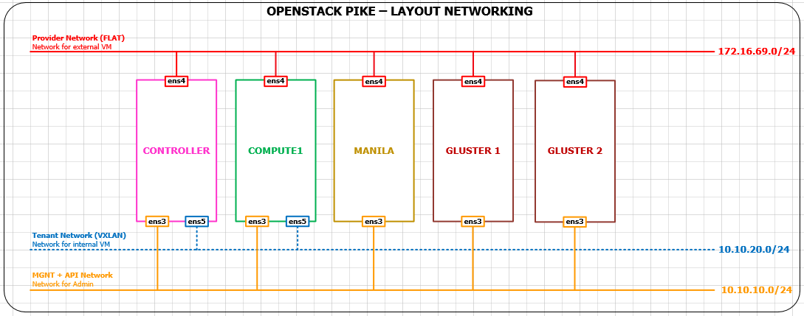

## Cài đặt manila với Glusterfs

## Mô hình cài đặt
- Mô hình

	
	
- Tất cả đều được cài đặt trên ubuntu 16.04 64-bit


## 1. Cài đặt trên 2 node glusterfs. 
### Thực hiện trên Glusterfs - 1.
- 1. Cấu hình địa chỉ IP.
- sửa trong file `/etc/network/interfaces` có nội dung như sau

	```sh
	auto ens3
	iface ens3 inet static
	address 10.10.10.193
	netmask 255.255.255.0

	auto ens4
	iface ens4 inet static
	address 172.16.69.193
	netmask 255.255.255.0
	gateway 172.16.69.1
	dns-nameservers 8.8.8.8
	```
	
- 2. Sửa hostname `vi /etc/hostname`

	```sh
	glusterfs-1
	```
	
- 3. Cấu hình DNS `vi /etc/hosts`

	```sh
	10.10.10.190    controller
	10.10.10.191    compute1
	10.10.10.193    glusterfs-1
	10.10.10.194    glusterfs-2
	10.10.10.195    manila
	```
	
### Thực hiện trên Glusterfs - 2. Tượng tự như trên glusterfs-1, chỉ cần đổi địa chỉ ip với tên hostname
- 1. Cấu hình địa chỉ IP.
- sửa trong file `/etc/network/interfaces` có nội dung như sau

	```sh
	auto ens3
	iface ens3 inet static
	address 10.10.10.194
	netmask 255.255.255.0

	auto ens4
	iface ens4 inet static
	address 172.16.69.194
	netmask 255.255.255.0
	gateway 172.16.69.1
	dns-nameservers 8.8.8.8
	```
	
- 2. Sửa hostname `vi /etc/hostname`

	```sh
	glusterfs-2
	```
	
- 3. Cấu hình DNS `vi /etc/hosts`

	```sh
	10.10.10.190    controller
	10.10.10.191    compute1
	10.10.10.193    glusterfs-1
	10.10.10.194    glusterfs-2
	10.10.10.195    manila
	```
	
### Thực hiện các bước sau trên cả 2 node
- 1. Cài đặt NTP service:
- Cài đặt các gói

	```sh
	apt install chrony -y
	```
	
- Sửa file `/etc/chrony/chrony.conf` và comment hoặc xóa tất cả dòng có chứa server và thêm dòng sau:

	```sh
	server controller iburst
	```
	
- 2. Cài đặt Glusterfs

	```sh
	apt install software-properties-common -y
	add-apt-repository ppa:gluster/glusterfs-3.12
	apt -y update && apt -y dist-upgrade
	apt install -y glusterfs-server
	```
	
- Kiểm tra trạng thái running của glusterfs

	```sh
	root@glusterfs-1:~# systemctl status glusterfs-server.service
	● glusterfs-server.service
		Loaded: not-found (Reason: No such file or directory)
		Active: inactive (dead)
	```
	
- Cài đặt và tạo thin LV và gluster volume

	```sh
	apt install thin-provisioning-tools -y
	```
	
- Tạo thin pool

	```sh
	apt-get install xfsprogs -y  
	
	pvcreate /dev/vdb
	
	vgcreate myVG /dev/vdb
  
	lvcreate -L 8G -T myVG/thinpool
  
	for ((i = 1;i<= 5; i++ ))  
	do  
	mkdir -p /manila/manila-"$i"  
	for (( j = 1; j<= 5; j++))  
	do  
	lvcreate -V "${i}"Gb -T myVG/thinpool -n vol-"$i"-"$j"  
	mkfs.xfs /dev/myVG/vol-"$i"-"$j"  
	mkdir -p /manila/manila-"$i"/manila-"$j"  
	mount /dev/myVG/vol-"$i"-"$j" /manila/manila-"$i"/manila-"$j"  
	echo "/dev/myVG/vol-"$i"-"$j" /manila/manila-"$i"/manila-"$j" xfs 0 2" >> /etc/fstab  
	done  
	done  
	```
	
---
- Sau khi thực hiện các bước trên ở trên cả 2 glusterfs server, kiểm tra trạng thái của storage pool. Thực hiện các lệnh sau trên 1 node glusterfs bất kỳ.

	```sh
	root@glusterfs-1:~# gluster peer probe glusterfs-2
	peer probe: success.
	```
	
	```sh
	root@glusterfs-1:~# gluster peer status
	Number of Peers: 1

	Hostname: glusterfs-2
	Uuid: 2df773a6-3c69-48c0-bd0d-40fba4401a4f
	State: Peer in Cluster (Connected)
	```
	
	```sh
	root@glusterfs-1:~# gluster pool list
	UUID                                    Hostname        State
	2df773a6-3c69-48c0-bd0d-40fba4401a4f    glusterfs-2     Connected
	276f8565-fafe-49e9-9d3d-2e532f0b780a    localhost       Connected
	```
	
- Tạo các volume

	```sh
	for (( i= 1 ; i <= 5; i++))  
	do  
	for(( j= 1; j<=5 ;j++))  
	do  
	gluster volume create manila-"$i"-"$j" replica 2 glusterfs-1:/manila/manila-"$i"/manila-"$j"/br glusterfs-2:/manila/manila-"$i"/manila-"$j"/br  
	gluster volume start manila-"$i"-"$j"  
	done  
	done
	```
	
## 2. Thực hiện các bước sau trên node manila-share
- 1. Thêm các dòng cấu hình sau vào file `/etc/hosts` 

	```sh
	10.10.10.193    glusterfs-1
	10.10.10.194    glusterfs-2
	```
	
- Với backend là GlusterFS việc quản lý truy cập vào share file trên manila sẽ thông qua certificate do vậy ta cần cấu hình SSL cho client và server.
- Tạo key và CA trên server. Mình sẽ copy key và ca tới tất cả server glusterfs. 

	```sh
	cd /etc/ssl  
	openssl genrsa -out glusterfs.key 1024  
	openssl req -new -x509 -key glusterfs.key -subj /CN=Thuctap2o17 -out glusterfs.pem  
	cp glusterfs.pem glusterfs.ca
	```
	
- Sau đấy dùng lệnh sau để copy file key và ca lên 2 server glusterfs.

	```sh
	scp glusterfs.key glusterfs.ca glusterfs.pem root@glusterfs-1:/etc/ssl/
	scp glusterfs.key glusterfs.ca glusterfs.pem root@glusterfs-2:/etc/ssl/
	```
	
- 3. Cấu hình manila-share. Sửa file `/etc/manila/manila.conf`
- Enable backend glusterfsnative và protocol GLUSTERFS trong section `[DEFAULT]`

	```sh
	enabled_share_backends = glusterfsnative  
	enabled_share_protocols=NFS,CIFS,GLUSTERFS 
	```

- Thêm các dòng cấu hình sau vào cuối file

	```sh
	[glusterfsnative]
	share_backend_name = glusterfsnative
	glusterfs_servers = root@glusterfs-1 
	glusterfs_volume_pattern = manila-#{size}-.*
	share_driver = manila.share.drivers.glusterfs.glusterfs_native.GlusterfsNativeShareDriver 
	driver_handles_share_servers = False 
	glusterfs_server_password = Thuctap2o17
	```
	- Thuctap2o17 là password của user root trên server glusterfs-1.
	
- 4. Cài đặt thêm gói glusterfs-client

	```sh
	add-apt-repository ppa:gluster/glusterfs-3.12
	apt install -y glusterfs-client
	```
	
	
- Kết thúc cấu hình, restart service manila-share

	```sh
	service manila-share restart  
	```
	
- Thực hiện cấu hình trên node controller. Cấu hình cho phép các giao thức cần sử dụng với glusterfs, sửa trong file `/etc/manila/manila.conf`
- Thêm dòng cấu hình sau vào section `[DEFAULT]`

	```sh
	enabled_share_protocols=NFS,CIFS,GLUSTERFS 
	```
	
- Restart manila

	```sh
	service manila-api restart  
	service manila-scheduler restart  
	```
	
## 3 Tạo share
- Tạo share-type

	```sh
	manila type-create glusterfsnative False
	manila type-key glusterfsnative set share_backend_name=glusterfsnative
	```
	
- Tạo share

	```sh
	manila create glusterfs 2 --name gluster-1 --share-type glusterfsnative  
	```
	
- Tạo access-allow cho CA có CN=Thuctap2o17

	```sh
	manila access-allow gluster-1 cert Thuctap2o17
	```
	
- Kiểm tra lại đường dẫn mount

	```sh
	root@controller:~# manila show gluster-2
	+---------------------------------------+----------------------------------------------------------+
	| Property                              | Value                                                    |
	+---------------------------------------+----------------------------------------------------------+
	| status                                | available                                                |
	| share_type_name                       | glusterfsnative                                          |
	| description                           | None                                                     |
	| availability_zone                     | nova                                                     |
	| share_network_id                      | None                                                     |
	| export_locations                      |                                                          |
	|                                       | path = glusterfs-1:/manila-3-1                           |
	|                                       | preferred = False                                        |
	|                                       | is_admin_only = False                                    |
	|                                       | id = c1689280-524c-4a6c-9b43-d4122dee1fe5                |
	|                                       | share_instance_id = fbb8f868-84aa-4e18-8e67-f61bcf4f2ccb |
	| share_server_id                       | None                                                     |
	| share_group_id                        | None                                                     |
	| host                                  | manila@glusterfsnative#glusterfsnative                   |
	| revert_to_snapshot_support            | False                                                    |
	| access_rules_status                   | active                                                   |
	| snapshot_id                           | None                                                     |
	| create_share_from_snapshot_support    | False                                                    |
	| is_public                             | False                                                    |
	| task_state                            | None                                                     |
	| snapshot_support                      | False                                                    |
	| id                                    | 2d108c96-31e7-4988-b143-83c24c447e4e                     |
	| size                                  | 3                                                        |
	| source_share_group_snapshot_member_id | None                                                     |
	| user_id                               | de6faf4fb0484e90a21bd63c4cffa465                         |
	| name                                  | gluster-2                                                |
	| share_type                            | 835f5055-6360-4a02-a5d1-e413ccfdab10                     |
	| has_replicas                          | False                                                    |
	| replication_type                      | None                                                     |
	| created_at                            | 2017-11-23T18:13:05.000000                               |
	| share_proto                           | GLUSTERFS                                                |
	| mount_snapshot_support                | False                                                    |
	| project_id                            | ca6e13d11f564a90aca3cd13c6eaf8e7                         |
	| metadata                              | {}                                                       |
	+---------------------------------------+----------------------------------------------------------+
	```
	
## 4. Thực hiện cài đặt các gói cho client
- Cài glusterfs-client.
	
	```sh
	add-apt-repository ppa:gluster/glusterfs-3.12
	apt-get update  
	apt install -y glusterfs-client
	```
	
- Ở client cần ca có CN=Thuctap2o17. Lấy 3 file ở ca, key, và pem đã tạo ở trên copy vào thư mục `/etc/ssl` ở trên cho client.
- Thực hiện lệnh mount

	```sh
	mount -t glusterfs glusterfs-1:/manila-3-1 /mnt/
	```
	