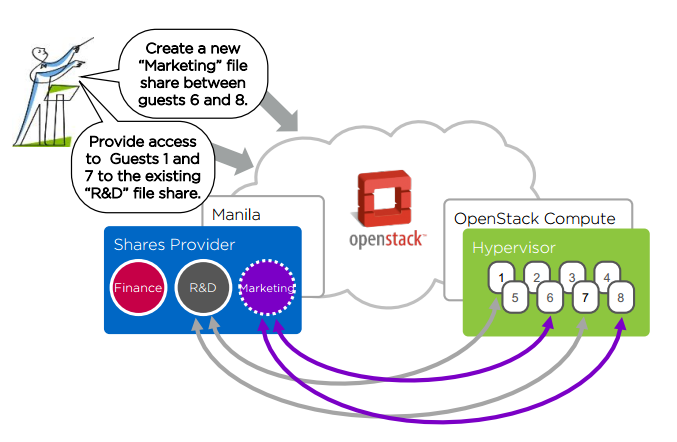
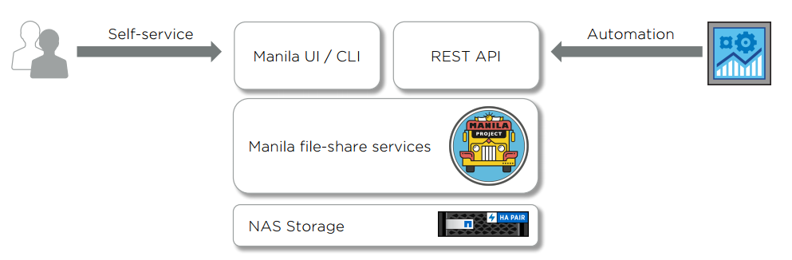
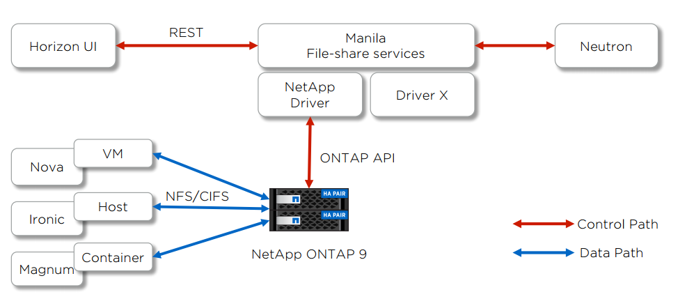

## Tổng hợp về manila

## Tổng quan về manila
- Manila project là dịch vụ cung cấp `shared file system` cho các máy ảo trong openstack
- Dịch vụ Shared File Systems cung cấp một cơ sở hạ tầng để quản lý và cung cấp các file chia sẻ. 
- Dịch vụ cũng cho phép quản lý các kiểu chia sẻ cũng như các share snapshot nếu driver hỗ trợ chúng.
- ví dụ shared file system:

	

- Manila như một thành phần trung gian giữa VMs và dịch vụ lưu trữ

	
	
- Manila được các driver hỗ trợ kiểm soát hệ thống back end lưu trữ: tạo shared, kiểm soát truy cập shared, etc.
- Manila hỗ trợ các giao thức NFS, CIFS cho phép VMs truy cập và sử dụng shared.

	
	
## Thành phần của dịch vụ Shared File System.
- Project thực hiện chức năng Shared File System có tên là Manila. Manila gồm các thành phần sau:

	

- `manila-api`: xác thực và route các request tới dịch vụ. Nó hỗ trợ các API Openstack.

- `manila-scheduler`: Lập lịch và chuyển các requét với share service thích hợp. Scheduler sử dụng các cấu hình lọc có thể cấu hình được và weigh để route các request. Filter Scheduler là  mặc định và cho phép filter dựa trên: Khả năng lưu trữ (Capacity), Các zone (Availability Zone), Kiểu share (share-type) và các filter custom.

- `manila-share`: quản lý các backend cung cấp shared file system. Một tiến trình manila-share có thể chạy trên 1 hoặc 2 node.

## Các khái niệm chính trong manila
- `Share`: là một đơn vụ của storage với một giao thức, một kích thước và một danh sách được phép truy cập. Tất cả các share tồn tại trên một backend. Các giao thức chính được hỗ trợ là NFS và CIFS, ngoài ra còn có các giao thức khác được hỗ trợ như GLUSTERFS, ...
- `Share access rules (ACL)`: định nghĩa các client có thể truy cập shared
- `Share network`: định nghĩa mạng và mạng con trong neutron mà thông qua đó, client có thể truy cập share. một share chỉ có thể được liên kết với một share network
- `Security service`: xác thực client truy cập share. Share có thể được liên kết đến nhiều Security service.
- `Snapshots`: một bản sao nội dung của share chỉ để đọc. Một share mới có thể được tạo từ snapshot.
- `Backend`: Backend cung cấp shared, nơi mà share tồn tại trên một back end.
- `Driver`: các công nghệ, các kỹ thuật để giao tiếp với backend.

## Use cases
- Big data
- Database as a service
- Support legacy enterprise applications
- Chia sẻ dữ liệu giữa nhiều người dùng.
- On-demand development and build environments
- Hybrid cloud shares

