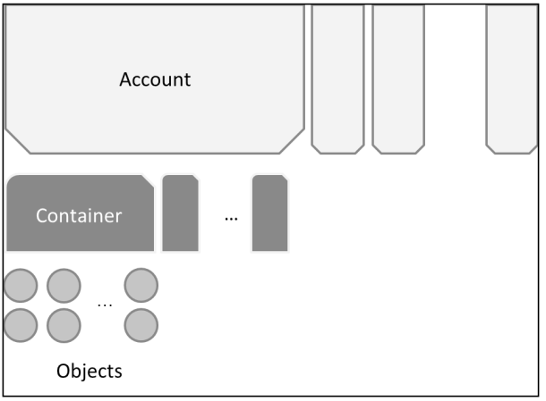

# Kiến trúc của Openstack Swift.

## Mục lục.
[1. Kiến trúc logic](#1)
[2. Kiến trúc vật lý](#2)

# 1. Kiến trúc logic

	
	
- Mỗi tenant được gán một **Account**. 
- Trong account, có thể chứa nhiều **container** (tương tự như folder).
- Container sẽ chứa các **Object**.
- Người dùng lưu trữ các đối tượng mà không phải quan tâm đến phần cứng.
- Vấn đề đặt tên: các account phải có tên khác nhau và là duy nhất. Trong một account, tên của các containers cũng phải khác nhau, nhưng trên 2 account khác nhau thì tên container có thể trùng nhau. Với object cũng tương tự như thế.
- Trong lưu trữ swift, các containers là ngang hàng nhau. Như vậy sẽ không có tạo subcontainer. Tuy nhiên, swift hỗ trợ cơ chế giả thư mục để hỗ trợ cho việc quản lý.

# 2. Kiến trúc vật lý

	