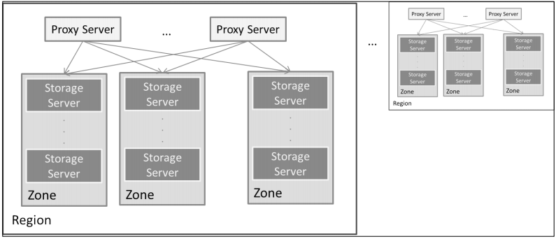

# Kiến trúc của Openstack Swift.

## Mục lục.
- [1. Kiến trúc logic](#1)
- [2. Kiến trúc vật lý](#2)
- [3. Tổng quan về kiến trúc phần mềm trong Swift](#3)
- [4. Kiến trúc xác thực trong Swift](#4)
- [5. Mô hình triển khai](#5)

# 1. Kiến trúc logic
- Tổ chức logic.

	

	
- Mỗi tenant được gán một **Account**. 
- Trong account, có thể chứa nhiều **container** (tương tự như folder).
- Container sẽ chứa các **Object**.
- Người dùng lưu trữ các đối tượng mà không phải quan tâm đến phần cứng.
- Vấn đề đặt tên: các account phải có tên khác nhau và là duy nhất. Trong một account, tên của các containers cũng phải khác nhau, nhưng trên 2 account khác nhau thì tên container có thể trùng nhau. Với object cũng tương tự như thế.
- Trong lưu trữ swift, các containers là ngang hàng nhau. Như vậy sẽ không có tạo subcontainer. Tuy nhiên, swift hỗ trợ cơ chế giả thư mục để hỗ trợ cho việc quản lý.

### Chi tiết về từng thành phần
## 1. account
- Account là gốc của vị trí lưu trữ data. 
- Thường so sánh với filesystem volume, account là tên duy nhất trong hệ thống.
- Mỗi account có một database lưu trữ metada của bản thân nó và cả danh sách các containers ở trong account đó.
- Metada headers của account được lưu với cặp key-value đảm bảo lưu trữ lâu dài cùng với tất cả dữ liệu trong swift.
- Cơ sở dữ liệu account không chứa các objects và metada của object.
- Cơ sở dữ liệu của account được truy cập khi người dùng (người được cho phép hoặc services) yêu cầu metada về một account hoặc danh sách containers trong account.
- Account có thể được chỉ định cho đơn người dùng truy cập hoặc nhiều người dùng truy cập tùy thuộc vào quyền mà nó được thiết lập.
- Đơn người dùng với người dùng các nhân hoặc các dịch vụ accounts như là backups, đa người dùng truy cập với project nơi nhiều thành viên của nhóm truy cập account.
- Người dùng swift với các quyền chính xác có thể tạo, thay đổi, xóa các container và các objects trong container với một account.
- Trong swift, account là lưu trữ account, không phải là định danh user.

## 2. container
- Container được người dùng định nghĩa phân đoạn của không gian tên account mà cung cấp vị trí lưu trữ nơi các objects được tìm thấy.
- Mặc dù các container không thể lồng vào nhau, nhưng có khái niệm tương tự như thư mục trong filesystem.
- Container không có ràng buộc về tên duy nhất.
- Không có giới hạn về số lượng container trong một account.
- Cũng như cơ sở dữ liệu account, mỗi container database chứa metada của container và danh sách các object trong container đó.
- Và metada headers cũng được lưu dưới dạng key-value.
- Database container không chứa objects thực và metada của object.
- Database container được truy cập khi user yêu cầu danh sách tất cả các object trong container hoặc metada về container đó.
- Trong một account, bạn có thể tạo và sử dụng các containers để nhóm dữ liệu theo cách logic. Bạn cũng có thể gán metada cho containers, và sử dụng vài tính năng Swift để cho các thuộc tính containers khác nhau.

## 3. Objects.
- Object là dữ liệu được lưu trong Openstack Swift. Chúng có thể là ảnh, videos, tài liệu, logfiles, database backups, fileysystem snapshots, hoặc bất kỳ dữ liệu khác. Mỗi đối tượng thường bao gồm bản thân dữ liệu của nó và metada.
- Metada headers được lưu với cặp key-value, đảm bảo lâu dài với dữ liệu object, và đòi hỏi không thêm chút độ trễ để khôi phục. Metada có thể cung cấp các thông tin quan trọng về object. Ví dụ, một nhà sản xuất video có thể lưu định dạng video và khoảng thời gian dọc theo nội dụng; một tài liệu có thể chứa thông tin tác giả.
- Mỗi object phải thuộc một container. Khi một object được lưu trong cụm, người dugnf sẽ luôn để ý đến vị trí lưu trữ object (/account/container/object). Không có giới hạn số lượng object mà user có thể lưu trong container.
- Vị trí lưu trữ object là nơi để tìm object. Swift sẽ lưu nhiều bản sao của object để đảm bảo sự tin cậy và độ khả dụng của dữ liệu. Swift làm điều này bằng cách đặt đối tượng trong nhóm logic gọi là partition. Một partition sẽ liên kết đến nhiều thiết bị, mỗi thiết bị sẽ có object được ghi vào. User truy cập object thông qua vị trí của nó. User không biết và không cần biết nơi nào trong hệ thống dữ liệu được đặt.

# 2. Kiến trúc vật lý
- Tổ chức vật lý.

	

- Hệ thống phân cấp trong tổ chức vật lý của Swift như sau:
	- Region: Tại mức cao nhất, Swift lưu trữ dữ liệu trong các regions (gọi là khu vực) bị chia cắt về mặt vật lý - phân chia theo địa lý.
	- Zone: Bên trong các regions là các zones. Zone là tập các máy chủ riêng biệt, các máy chủ này được gọi là node storage. Khi có máy chủ xảy ra lỗi, Swift sẽ tách biệt các zone có máy chủ bị lỗi đó với các zone khác.
	- Storage server (máy chủ lưu trữ): Trong các zones sẽ chứa các máy chủ để lưu trữ.
	- Disk (ổ đĩa hoặc là thiết bị lưu trữ): Là một phần của storage server, có thể là các đĩa cứng cắm trực tiếp bên trong storage server hoặc được liên kết qua mạng.
	

# 3. Tổng quan về kiến trúc phần mềm trong Swift.
- Trong Swift có 4 service chính. Document của swift gọi là Servers:
	- Proxy server
	- Account server
	- Container server
	- Object server
	
- Thông thường, proxy server được cài đặt trên một node riêng, còn 3 server còn lại sẽ được cài đặt trên cùng một node gọi là storage server.

	
	
- Chức năng chính của từng server:
	- Proxy server: Thịu trách nhiệm nhận các yêu cầu HTTP từ người dùng. Nó sẽ tìm kiếm vị trí của storage server nơi mà yêu cầu cần được chuyển tiếp bằng cách sử dụng ring phù hợp. Proxy server tính toán các node bị hư hại bằng cách tìm kiếm các handoff node và thực hiện đọc/ghi.
	
	- Account server: Theo dõi tên các containers có trong account. Dữ liệu được lưu trữ trong cơ sở dữ liệu SQL, các files cơ sở dữ liệu sẽ được lưu trong filesystem. Server này cũng theo dõi thống kê nhưng không có bất kỳ thông tin nào về vị trí của các containers. Proxy server xác định vị trí container dựa trên container ring. Thông thường, account server sẽ được cài đặt với container server và object server trên cùng một máy chủ vật lý. Tuy nhiên, với một hệ thống lớn thì có thể cài đặt các server trên các máy chủ riêng biệt.
	
	- Container server: Giống như account server, ngoại trừ container server quản lý các objects bên trong nó.
	
	- Object server: Đơn giản là server quản lý lưu trữ đối tượng. Trên các ổ đĩa có các filesystem, và các đối tượng được lưu trên đó.
	

# 4. Kiến trúc xác thực trong Swift
- Xác thực là một phần quan trọng trong swift. 
- Các thành phần trong swift đều dạng module, do vậy thành phần xác thực cũng là một project riêng.
- Người dùng có thể lựa chọn các hệ thống xác thực khác nhau. Keystone là project xác thực ở trong Openstack mà có thể được sử dụng cho Swift.

	
	
- Luồng làm việc của Swift với keystone.
	- 1. Người dùng cung cấp thông tin xác thực cho hệ thống xác thực. Điều này được thực hiện bằng cách thực hiện thông qua lời gọi HTTP REST API.
	- 2. Hệ thống xác thực cung cấp cho người dùng một mã (token) thông báo AUTH.
	- 3. Mã thông báo AUTH không phải là duy nhất cho mọi yêu cầu và hết hạn sau một khoảng thời gian nhất định. Mọi yêu cầu được gửi cho Swift đều phải kèm theo token.
	- 4. Swift kiểm tra mã thông báo với hệ thống xác thực và lưu trữ kết quả vào bộ nhớ đệm. Kết quả được làm sạch khi hết hạn.
	- 5. Thông thường, hệ thống xác thực có khái niệm tài khoản quản trị và không quản trị. Các yêu cầu của quản trị viên rõ ràng sẽ được thông qua.
	- 6. Các yêu cầu không quản trị được kiểm tra dựa vào danh sách kiểm soát truy cập mức kho chứa (ACL – access control lists). Các danh sách này cho phép quản trị viên thiết lập các quyền đọc ghi cho người dùng không phải quản trị.
	- 7. Như vậy, với các yêu cầu không phải quản trị, ACL được kiểm tra trước khi proxy server có các bước xử lý tiếp theo với yêu cầu này.
	

# 5. Mô hình triển khai
- Với hệ thống không yêu cầu đặc biệt về hiệu năng, proxy server sẽ được cài đặt trên một server riêng. Account server, container server và object server sẽ được cài trên cùng một server, và server đó được gọi là storage server.

	
	