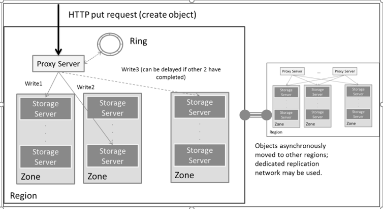

# Tổng quan các quá trình xử lý object

# Các thao tác
## Tạo mới object
- Một yêu cầu tạo được gửi thông qua lời gọi HTTP PUT API đến một proxy server. 
- Trong hệ thống có thể có nhiều proxy server, và không quan trọng proxy server nào nhận được yêu cầu bởi vì Swift là một hệ thống phân phối, do đó các proxy server có vai trò như nhau. 
- Proxy server tương tác với Ring liên kết với chính sách của container để lấy danh sách disk và các object servers liên kết với container đó để ghi dữ liệu vào. 
- Disk để ghi có thể là duy nhất. Nếu disk này bị hưng hại, hoặc không sẵn sàng để sử dụng thì ring sẽ cung cấp các thiết bị handoff. Một khi đa số các disk đã xác nhận là đã ghi dữ liệu vào (ví dụ, hai trong ba bản sao đã được ghi vào disk) thì thao tác ghi đã được thực hiện thành công. Giả sử bản sao thứ 3 vẫn được ghi thành công. Nếu không, quá trình sao chép, được minh họa trong hình dưới đây, để đảm bảo rằng bản sao còn lại cuối cùng cũng được tạo ra:
	
	
	
- Thao tác tạo này có thể hơi khác đối với hệ thống đa vùng (multi-region). Tất cả các bản sao của object sẽ được ghi vào local region. Sau đó chúng sẽ được chuyển không đồng bộ đến một hoặc nhiều region khác. Một mạng chuyên dụng sẽ được sử dụng để thực hiện công việc này.

## Thao tác đọc object:
- Yêu cầu đọc được gửi đi thông qua HTTP Get API sẽ gọi đến proxy server. 
- Bất kỳ proxy server nào cũng có thể lại nhận yêu cầu này một lần nữa. 
- Tương tự như thao tác tạo, proxy server tương tác với ring thích hợp để có được danh sách các disk và các object servers liên quan. Yêu cầu đọc này sẽ được đưa đến các object server trong region với proxy server. Đối với hệ thống đa vùng, xuất hiện vấn đề về sự nhất quán, vì các region khác nhau có thể lưu các phiên bản khác nhau của object. Để giải quyết vấn đề này, Swift sử dụng một trường là `timestamp` để đánh dấu thời gian trên object, đảm bảo object được đọc là phiên bản mới nhất. 
- Khi có yêu cầu đọc, proxy server sẽ yêu cầu các object server cung cấp timestamp. Sau đó dựa vào timestamp để xác định phiên bản mới nhất và thực hiện đọc từ object server chứa phiên bản mới nhất của object. Cũng giống như thao tác tạo, khi có thiết bị bị hư hỏng, thiết bị handoff có thể được yêu cầu.

## Thao tác update:
- Yêu cầu update về cơ bản được xử lý giống như một yêu cầu tạo. 
- Object được lưu lại cùng với timestamp của chúng để đảm bảo rằng khi đọc, phiên bản mới nhất của object được trả về. Swift cũng hỗ trợ tính năng version trên mỗi container. Khi tính năng này được bật, các phiên bản cũ của object cũng được tạo sẵn trong một kho chứa đặc biệt gọi là versions_container.

## Thao tác xóa:
- Yêu cầu xóa được gửi qua lời gọi HTTP DELETE API được xử lý như update, nhưng thay vì phiên bản mới, sẽ có một phiên bản "bia mộ" với kích thước 0-byte được thay thế. 
- Một hoạt động xóa là rất khó khăn trong một hệ thống phân phối, vì hệ thống sẽ tái tạo bản sao đã bị xóa để đảm bảo rằng một đối tượng có đúng số lượng bản sao. Các giải pháp Swift đã loại bỏ khả năng các đối tượng bị xóa đột nhiên xuất hiện trở lại.

# Các tiến trình xử lý
## Replication
- Replication là một khía cạnh rất quan trọng của Swift. Nó đảm bảo tính nhất quán cho hệ thống; đó là, tất cả các servers và disks được chỉ định bởi các ring để giữ phiên bản mới nhất của các bản sao object hoặc bản sao database. 
- Quá trình này nhằm đảm bảo tránh sự hỏng hóc dữ liệu, di chuyển phần cứng, và tái cân bằng vòng (đây là nơi vòng được thay đổi và dữ liệu phải được di chuyển xung quanh). Điều này được hoàn thành bằng cách so sánh dữ liệu cục bộ với các bản sao từ xa. Nếu các bản sao từ xa cần được cập nhật. Trình replication sẽ đẩy một bản sao để thay thế. 
- Quá trình so sánh hiệu quả và được thực hiện đơn giản bằng cách so sánh danh sách băm chứ không phải là mỗi byte của một object (hoặc database account, hoặc database container). 
- Replication sử dụng rsync, tiện ích đồng bộ hoá tệp tin từ xa trên Linux, để sao chép dữ liệu. Có một số phương pháp sẵn có như là ssync, và trong bản thân swift có thể thay thế lẫn nhau để thực hiện replicate.

## Updaters
- Trong một số tình huống nào đó, account server hoặc container server có thể bận do tải nặng hoặc không khả dụng. Trong trường hợp này, bản cập nhật được đưa vào hàng đợi lưu trữ cục bộ của máy chủ lưu trữ. Có 2 updaters xử lý các mục trong hàng đợi. Object updater sẽ cập nhật các đối tượng vào container database, trong khi đó container updater sẽ cập nhật các container vào account database.

## Auditor (trình kiểm toán)
- Auditor sẽ kiểm tra tính chân thực dữ liệu của mỗi object, container và account. 
- Việc kiểm tra này được thực hiện bằng cách tính giá trị băm MD5 và so sánh giá trị băm MD5 được lưu với khóa Etag trong metadata của object. 
- Khóa Etag được tạo ra khi object được tạo lần đầu tiên. 
- Nếu object được phát hiện là có sai sót, nó sẽ được đưa đến thư mục kiểm dịch, và trong thời gian này, quá trình replication sẽ tạo ra một bản sao “sạch”. Đây là cách hệ thống tự sửa chữa. 
- Giá trị băm MD5 cũng có sẵn cho người dùng, do vậy họ có thể thực hiện các thao tác như là so sánh giá trị băm trong cơ sở dữ liệu của họ với giá trị được lưu trong Swift.
