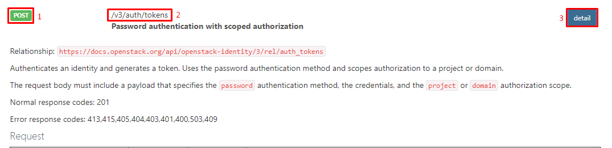
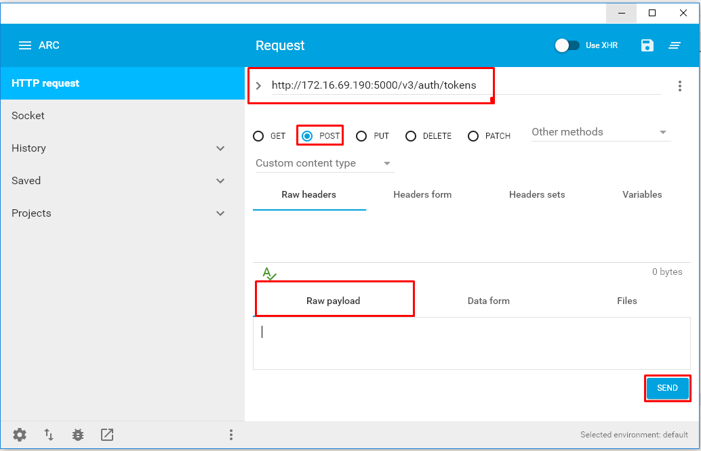
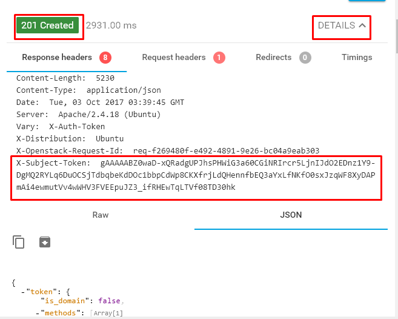
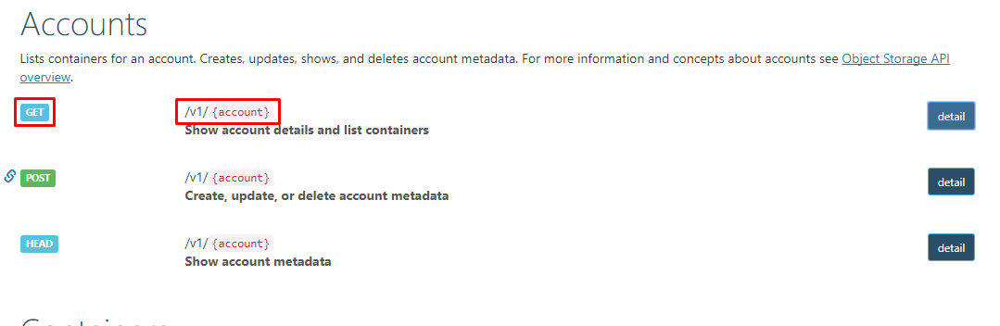
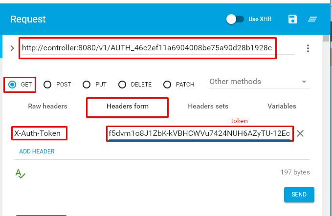
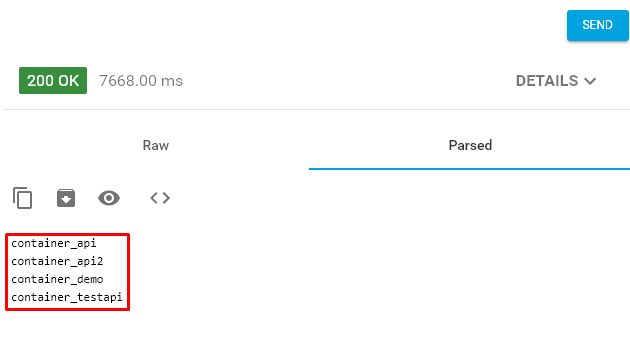

# Test API
- Thực hành test một số api mà swift cung cấp để phục vụ cho việc lập trình.
- Sử dụng Advanced REST Client để test

# Lấy token 
- Để lấy token, chúng ta sử dụng api của keystone. [docs api keystone](https://developer.openstack.org/api-ref/identity/v3/index.html)
- Truy cập đường dẫn trên để xem docs api mà openstack keystone cung cấp.
- Chúng ta cần thông tin về phương thức truy cập, đường dẫn và các thông tin yêu cầu

	
	
	- 1: là phương thức `POST`
	- 2: đường link, `/v3/auth/tokens`
	- 3: click vào **3** để xem thông tin chi tiết về api
	- Thông tin mà api yêu cầu
	
- Ví dụ dữ liệu yêu cầu cần gửi đi, ở đây dạng json

	```sh
	{
		"auth": {
			"identity": {
				"methods": [
					"password"
				],
				"password": {
					"user": {
						"name": "demo",
						"password": "Welcome123",
						"domain": {
							"name": "default"
						}
					}
				}
			},
			"scope": {
				"project": {
					"name": "demo",
					"domain": {
						"name": "default"
					}
				}
			}
		}
	}
	```
	
- Sử dụng Advanced REST client để lấy token.
	
	
	
- Điền thông tin json trên vào `Raw payload` rồi click vào send để gửi đi
- Kết quả trả về mã `201` là đã thành công.

	
	
- click vào `DETAILS` để xem thông tin response header, trong này chứa token.
- Token là giá trị `X-Subject-Token`
	
- Copy toàn bộ nội dung của kết quả trả về ở trên trong tab `json` lên web http://jsoneditoronline.org/ để lấy url.

	
	
	- tìm trong `catalog` có `name: swift`. Lấy url trong endpoint có interface là public.
	
- Chúng ta đã có token và url để gọi đến các api của swift. Bước tiếp theo thực hiện test các api của swift.

# Test api của Swift
- Truy cập vào docs api của swift để xem chi tiết. link https://developer.openstack.org/api-ref/object-store/
- List danh sách containers có trong account.

	
	
- Thực hiện điền đầy đủ thông tin về url vừa nhận được và thêm token vào headers để lấy danh sách containers.

	
	
- Click send và chờ kết quả, nếu thành công sẽ trả về mã 200.
	
	
	
	- như vậy đã lấy được danh sách containers.
	

<Còn một số api nữa sẽ update sau>