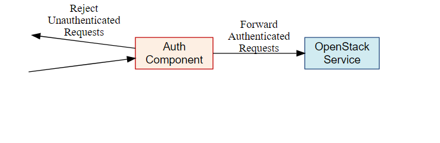
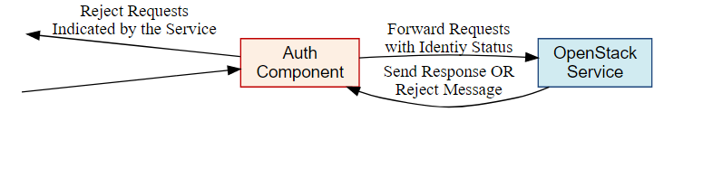

# Middleware architecture

## Abstract
Kiến trúc KeystoneMiddleware hỗ trợ một giao thức xác thực phổ biến được sử dụng giữa các project trong openstack. Bằng cách sử dụng keystone như một công cụ xác thực, ủy quyền phổ biến, các project khác có thể tận dụng được hệ thống xác thực và ủy quyền hiện đang sử dụng.

## Specification Overview
- `Authentication` là quá trình xác định các users, người mà nói rằng họ là ai.
- Thông thường `Authentication protocol` như là **HTTP Basic Auth,  Digest Access, public key, token, etc** được sử dụng để kiểm chứng định danh của user.
- Hiện nay, sử dụng token là giao thức xác thực phổ biến nhất trong Openstack.
- Ở một mức độ cao, một thành phần xác thực trung gian là một proxy để chặn những lời gọi HTTP từ client
- Các bước để middlware thực hiện:
	- Xóa sạch toàn bộ sự ủy quyền ở trường header để chặn sự giả mạo
	- Tổng hợp token trong trường header của HTTP request.
	- Xác nhận token:
		- Nếu hợp lệ, phần thêm trong header đại diện cho danh tính được chứng thực và ủy quyền.
		- Nếu không hợp lệ, hoặc không có token, thì từ chối request (HTTPUnauthorized) hoặc thông qua header cho biết request không được xác thực
		- Nếu dịch vụ keystone không có sẵn để xác nhận token, sẽ từ chối request với HTTPServiceUnavailable.

## Thành phần xác thực
- Sau đây cho thấy các hành vi mặc định của thành phần xác thực được triển khai phía trước một dịch vụ Openstack:

  

- Thành phần xác thực có thể được cấu hình để chạy trong `delegated mode`. Trong chế độ này, để quyết định chặn hay đồng ý một client đã không xác thực được ủy quyền tới dịch vụ Openstack

  

## Cấu hình
- Middleware được cấu hình trong file cấu hình của ứng dụng chính.
- Các dịch vụ mà có file paste-deploy ini riêng, auth_token middleware có thể được cấu hình thay thế trong section [keystone_authtoken] của file cấu hình chính.
- Cho ví dụ trong nova, tất cả middleware parameters có thể được remove từ *api-paste.ini*.

	```sh
	[filter:authtoken]
	paste.filter_factory = keystonemiddleware.auth_token:filter_factory
	```
và set trong file *nova.conf*.

	```sh
	[DEFAULT]
	auth_strategy=keystone

	[keystone_authtoken]
	auth_host = 127.0.0.1
	auth_port = 35357
	auth_protocol = http
	admin_user = admin
	admin_password = SuperSekretPassword
	admin_tenant_name = service
	# Any of the options that could be set in api-paste.ini can be set here
	```

- Chú ý: Middleware parameters trong paste config để lấy priority (độ ưu tiên) và phải được removed để sử dụng tùy chọn trong [keystone_authtoken] section.

- Tham khảo: [tài liệu trên docs openstack](https://docs.openstack.org/developer/keystonemiddleware/middlewarearchitecture.html#configuration)
---
Trên đây ghi chép của mình về cấu trúc của Middleware cho xác thực.