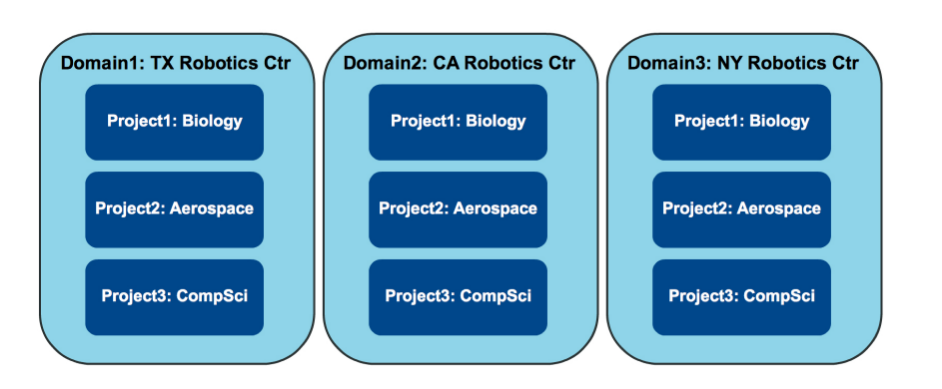
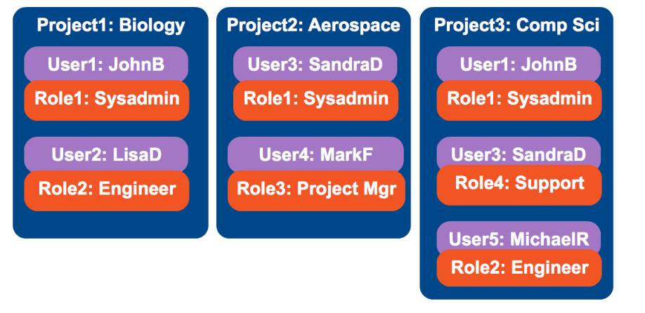

# Thực hiện quản trị trong Keystone

## Bài lab:
- Tạo 3 domain có các project như sau:



- Trong mỗi project có các user và role như sau:



## Thực hành lab
Sử dụng lệnh mà keystone cung cấp để thực hiện bài lab.

### 1. Tạo domain
- Tạo 3 domain:
  ```sh
  # 1. Tạo domain TXRobotics
  
  root@controller:~# openstack domain create --description "Domain TX Robotics ctr" --enable --or-show TXRobotics
  +-------------+----------------------------------+
  | Field       | Value                            |
  +-------------+----------------------------------+
  | description | Domain TX Robotics ctr           |
  | enabled     | True                             |
  | id          | 33f3bd5c8cf74c9b810d3ba8c178f920 |
  | name        | TXRobotics                       |
  +-------------+----------------------------------+
  
  # 2. Tạo domain CARobotics
  root@controller:~# openstack domain create --description "Domain CA Robotics ctr" --enable --or-show CARobotics
  +-------------+----------------------------------+
  | Field       | Value                            |
  +-------------+----------------------------------+
  | description | Domain CA Robotics ctr           |
  | enabled     | True                             |
  | id          | 97948488d9d64cb7a78fa00c73fd9379 |
  | name        | CARobotics                       |
  +-------------+----------------------------------+
  
  # 3. Tạo domain NYRobotics
  root@controller:~# openstack domain create --description "Domain NY Robotics ctr" --enable --or-show NYRobotics
  +-------------+----------------------------------+
  | Field       | Value                            |
  +-------------+----------------------------------+
  | description | Domain NY Robotics ctr           |
  | enabled     | True                             |
  | id          | 1f47671fe982438a9f213693d40625c6 |
  | name        | NYRobotics                       |
  +-------------+----------------------------------+
  ```
  
- List ra danh sách các domain có trong openstack:
  ```sh
  root@controller:~# openstack domain list
  +----------------------------------+-------------+---------+------------------------+
  | ID                               | Name        | Enabled | Description            |
  +----------------------------------+-------------+---------+------------------------+
  | 1f47671fe982438a9f213693d40625c6 | NYRobotics  | True    | Domain NY Robotics ctr |
  | 33f3bd5c8cf74c9b810d3ba8c178f920 | TXRobotics  | True    | Domain TX Robotics ctr |
  | 97948488d9d64cb7a78fa00c73fd9379 | CARobotics  | True    | Domain CA Robotics ctr |
  | default                          | Default     | True    | The default domain     |
  +----------------------------------+-------------+---------+------------------------+
  ```
  
### 2. Tạo project bên trong domain đã tạo
- Tạo projects *Biology*, *Aerospace*, *Comp Sci* trong domain *TXRobotics*
  ```sh
  # 1. Project Biology
  root@controller:~# openstack project create --description "Biology project in NYRobotics domain" --domain TXRobotics Biology
  +-------------+--------------------------------------+
  | Field       | Value                                |
  +-------------+--------------------------------------+
  | description | Biology project in NYRobotics domain |
  | domain_id   | 33f3bd5c8cf74c9b810d3ba8c178f920     |
  | enabled     | True                                 |
  | id          | 0cbc47afdcbe449aac460f8917965ef0     |
  | is_domain   | False                                |
  | name        | Biology                              |
  | parent_id   | 33f3bd5c8cf74c9b810d3ba8c178f920     |
  +-------------+--------------------------------------+

  # 2. Project Aerospace
  root@controller:~# openstack project create --description "Aerospace project in TXRobotics domain" --domain TXRobotics Aerospace
  +-------------+----------------------------------------+
  | Field       | Value                                  |
  +-------------+----------------------------------------+
  | description | Aerospace project in TXRobotics domain |
  | domain_id   | 33f3bd5c8cf74c9b810d3ba8c178f920       |
  | enabled     | True                                   |
  | id          | 2c50d94687b043b0bb6335cd538f879a       |
  | is_domain   | False                                  |
  | name        | Aerospace                              |
  | parent_id   | 33f3bd5c8cf74c9b810d3ba8c178f920       |
  +-------------+----------------------------------------+

  # 3. Project Comp Sci
  root@controller:~# openstack project create --description "CompSci project in TXRobotics domain" --domain TXRobotics Compsci
  +-------------+--------------------------------------+
  | Field       | Value                                |
  +-------------+--------------------------------------+
  | description | CompSci project in TXRobotics domain |
  | domain_id   | 33f3bd5c8cf74c9b810d3ba8c178f920     |
  | enabled     | True                                 |
  | id          | f568fc2a8d2248739e682592691ee4ad     |
  | is_domain   | False                                |
  | name        | Compsci                              |
  | parent_id   | 33f3bd5c8cf74c9b810d3ba8c178f920     |
  +-------------+--------------------------------------+
  ```
  
- Kiểm tra lại xem trong domain *TXRobotics* có những projects nào
  ```sh
  root@controller:~# openstack project list --domain TXRobotics
  +----------------------------------+-----------+
  | ID                               | Name      |
  +----------------------------------+-----------+
  | 2c50d94687b043b0bb6335cd538f879a | Aerospace |
  | 0cbc47afdcbe449aac460f8917965ef0 | Biology   |
  | f568fc2a8d2248739e682592691ee4ad | Compsci   |
  +----------------------------------+-----------+
  ```

### 3. Tạo các user bên trong domain *TXRobotics*
- Tạo các users
  ```sh
  # 1. Tạo user JohnB
  root@controller:~# openstack user create --description "User JohnB in TXRobotics domain" --domain TXRobotics --password Welcome123 --enable JohnB
  +---------------------+----------------------------------+
  | Field               | Value                            |
  +---------------------+----------------------------------+
  | description         | User JohnB in TXRobotics domain  |
  | domain_id           | 33f3bd5c8cf74c9b810d3ba8c178f920 |
  | enabled             | True                             |
  | id                  | 8f71a10a18cf4ae191b9648de94c2171 |
  | name                | JohnB                            |
  | options             | {}                               |
  | password_expires_at | None                             |
  +---------------------+----------------------------------+
  
  # 2. Tạo user LisaD 
  root@controller:~# openstack user create --description "User LisaD in TXRobotics domain" --domain TXRobotics --password Welcome123 --enable LisaD
  +---------------------+----------------------------------+
  | Field               | Value                            |
  +---------------------+----------------------------------+
  | description         | User LisaD in TXRobotics domain  |
  | domain_id           | 33f3bd5c8cf74c9b810d3ba8c178f920 |
  | enabled             | True                             |
  | id                  | 0dc680d8f2cb409493fe0b928b29b3b2 |
  | name                | LisaD                            |
  | options             | {}                               |
  | password_expires_at | None                             |
  +---------------------+----------------------------------+
  
  # 3. Tạo user SandraD
  root@controller:~# openstack user create --description "User SandraD in TXRobotics domain" --domain TXRobotics --password Welcome123 --enable SandraD
  +---------------------+-----------------------------------+
  | Field               | Value                             |
  +---------------------+-----------------------------------+
  | description         | User SandraD in TXRobotics domain |
  | domain_id           | 33f3bd5c8cf74c9b810d3ba8c178f920  |
  | enabled             | True                              |
  | id                  | be7c96e613c5434d9ab0906bb57885fd  |
  | name                | SandraD                           |
  | options             | {}                                |
  | password_expires_at | None                              |
  +---------------------+-----------------------------------+
  
  # 4. Tạo user MarkF
  root@controller:~# openstack user create --description "User MarkF in TXRobotics domain" --domain TXRobotics --password Welcome123 --enable MarkF
  +---------------------+----------------------------------+
  | Field               | Value                            |
  +---------------------+----------------------------------+
  | description         | User MarkF in TXRobotics domain  |
  | domain_id           | 33f3bd5c8cf74c9b810d3ba8c178f920 |
  | enabled             | True                             |
  | id                  | 9684027645ad470aa3d3494ec8a2110e |
  | name                | MarkF                            |
  | options             | {}                               |
  | password_expires_at | None                             |
  +---------------------+----------------------------------+
  
  # 5. Tạo user MichaceIR
  root@controller:~# openstack user create --description "User MichaceIR in TXRobotics domain" --domain TXRobotics --password Welcome123 --enable MichaceIR
  +---------------------+-------------------------------------+
  | Field               | Value                               |
  +---------------------+-------------------------------------+
  | description         | User MichaceIR in TXRobotics domain |
  | domain_id           | 33f3bd5c8cf74c9b810d3ba8c178f920    |
  | enabled             | True                                |
  | id                  | b61b6d4adde644fc84224f88fe1ca3ca    |
  | name                | MichaceIR                           |
  | options             | {}                                  |
  | password_expires_at | None                                |
  +---------------------+-------------------------------------+
  ```

- Kiểm tra lại xem trong domain *TXRobotics* có những users nào
  ```sh
  root@controller:~# openstack user list --domain TXRobotics
  +----------------------------------+-----------+
  | ID                               | Name      |
  +----------------------------------+-----------+
  | 0dc680d8f2cb409493fe0b928b29b3b2 | LisaD     |
  | 8f71a10a18cf4ae191b9648de94c2171 | JohnB     |
  | 9684027645ad470aa3d3494ec8a2110e | MarkF     |
  | b61b6d4adde644fc84224f88fe1ca3ca | MichaceIR |
  | be7c96e613c5434d9ab0906bb57885fd | SandraD   |
  +----------------------------------+-----------+
  ```

### 4. Tạo các *role* trong domain *TXRobotics*
- Tạo các roles
  ```sh
  # 1. role sysadmin
  root@controller:~# openstack role create --domain TXRobotics sysadmin
  +-----------+----------------------------------+
  | Field     | Value                            |
  +-----------+----------------------------------+
  | domain_id | 33f3bd5c8cf74c9b810d3ba8c178f920 |
  | id        | 44b5037cf54b4399816d532a58ffb667 |
  | name      | sysadmin                         |
  +-----------+----------------------------------+
  
  # 2. role engineer
  root@controller:~# openstack role create --domain TXRobotics engineer
  +-----------+----------------------------------+
  | Field     | Value                            |
  +-----------+----------------------------------+
  | domain_id | 33f3bd5c8cf74c9b810d3ba8c178f920 |
  | id        | b126085494b742f495c0797cd33a3706 |
  | name      | engineer                         |
  +-----------+----------------------------------+
  
  # 3. role project_mgnt
  root@controller:~# openstack role create --domain TXRobotics project_mgnt
  +-----------+----------------------------------+
  | Field     | Value                            |
  +-----------+----------------------------------+
  | domain_id | 33f3bd5c8cf74c9b810d3ba8c178f920 |
  | id        | 5f644fcfeabd4ea6a678db1a2797e87e |
  | name      | project_mgnt                     |
  +-----------+----------------------------------+
  
  # 4. role support
  root@controller:~# openstack role create --domain TXRobotics support
  +-----------+----------------------------------+
  | Field     | Value                            |
  +-----------+----------------------------------+
  | domain_id | 33f3bd5c8cf74c9b810d3ba8c178f920 |
  | id        | d64ea8300d4a4d8b938d29272208c656 |
  | name      | support                          |
  +-----------+----------------------------------+
  ```
  
- List các roles trong project TXRobotics
  ```sh
  root@controller:~# openstack role list --domain TXRobotics
  +----------------------------------+--------------+------------+
  | ID                               | Name         | Domain     |
  +----------------------------------+--------------+------------+
  | 44b5037cf54b4399816d532a58ffb667 | sysadmin     | TXRobotics |
  | 5f644fcfeabd4ea6a678db1a2797e87e | project_mgnt | TXRobotics |
  | b126085494b742f495c0797cd33a3706 | engineer     | TXRobotics |
  | d64ea8300d4a4d8b938d29272208c656 | support      | TXRobotics |
  +----------------------------------+--------------+------------+
  ```

## 5. Add role cho từng user cụ thể.
- Việc quản lý role với domain thì có thể tham khảo [tại đây](./Define_role.md). 

- Với bài toán đặt ra từ đầu sẽ là quản lý theo multi-domain. Mục này mình chưa thực hiện được. Mong nhận được sự góp ý của mọi người. Địa chỉ thư điện tử `pxduc96@gmail.com`