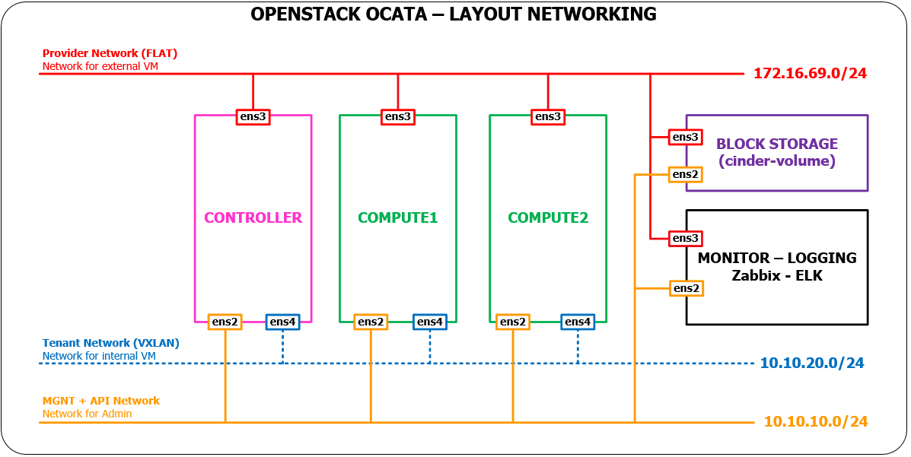
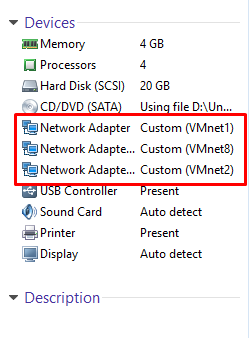

# Cài đặt OpenStack OCATA bằng scripts
---

## Mục lục
- [I. Cài đặt cơ bản](#I)
- [II. Cài đặt node controller](#II)

<a name=I></a>
## I. Cài đặt cơ bản
---

## 1. Chuẩn bị môi trường
### 1.1 Mô hình mạng
- Mô hình đầy đủ 



- Script này tiến hành cài đặt 2 nodes là **controller** và **compute1**

### 2 Yêu cầu phần cứng cho 2 nodes `controller` và `computer1`


### Tải các scripts cài đặt
```sh
su -
apt-get update
apt-get -y install git 

git clone https://github.com/pxduc96/Opensack-Ocata-scripts.git
mv /root/Opensack-Ocata-scripts/scripts/ /root/
rm -rf Opensack-Ocata-scripts/
cd scripts/
chmod +x *.sh
```
**Lưu ý**:

- Tiến hành cài đặt trên hệ điều hành **Ubuntu Server 16.04 64bit**.
- Các nodes đều là máy ảo chạy trên VMware Workstation
- Node controller và compute1 đều có các card mạng như sau

	

	- VMnet1 (hostonly): có dải địa chỉ `10.10.10.0/24`
	- VMnet8 (NAT): có dải địa chỉ `172.16.69.0/24`
	- VMnet2 (hostonly): có dải địa chỉ `10.10.20.0/24`

<a name=II></a>
## II. Cài đặt node controller
##### Cài đặt địa chỉ IP cho node controller và repos cho Ocata
- Sửa đổi thông tin địa chỉ ip trong file `/root/scripts/variable.cfg` mà bạn muốn sử dụng
```sh
bash ctl-1-Configure-Ipadd.sh
```

##### Cài đặt NTP, RabbitMQ, Memcached, MariaDB.
```sh
bash ctl-2-environment.sh
```

##### Cài đặt Keystone
```sh
bash ctl-3-keystone.sh
```