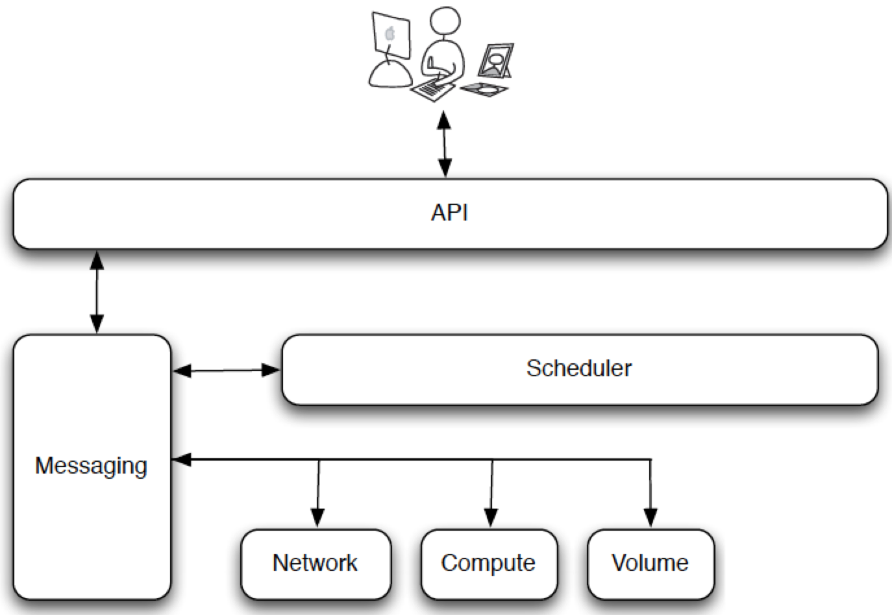

# Tổng quan về Nova

## Mục lục
- [1. Giới thiệu về Nova](#1)
- [2. Các thành phần của Nova](#2)
- [3. Compute Service](#3)

## 1. Giới thiệu về Nova
- Nova là thành phần quan trọng và phức tạp nhất trong các project của openstack.
- Nova chịu trách nhiệm quản lý các instance: tạo, lập lịch, ngưng hoạt động các VMs.

## 2. Các thành phần của Nova
- **database**: Nova lưu trữ tất cả các instances, users, groups và networks trong database và được theo dõi bằng cách sử dụng một cơ sở dữ liệu quan hệ mà bạn có thể truy vấn để lấy thông tin.
- **API**: Nova API lắng nghe các yêu cầu API và truyền đạt thông tin đến các dịch vụ khác sử dụng Advanced Message Queuing Protocol (AMQP), ứng dụng được biết đến như RabbitMQ
- **Scheduler**: Nova scheduler là dịch sắp xếp các yêu cầu mà nó nhận được từ hàng đợi. Ví dụ, nova scheduler xác định host nào sẽ được cung cấp máy ảo. Scheduler lựa chọn host sử dụng các bộ lọc khác nhau.
- **Network**: Quản lý tất cả các chức năng network như là IP Forwarding, Bridging và VLANs. Nova-network cung cấp các mạng ảo để cho phép các *compute servers* tác động qua lại lẫn nhau và với mạng public bên ngoài.
- **Compute**: Compute là một phần lớn của hệ thống Infrastructure-as-a-Service (IaaS). Nova-compute là dịch vụ chính của Nova Compute.
- **Conductor**: dịch vụ nova-conductor cho phép Openstack thực hiện chức năng truy cập database mà không có node compute.

Nova sử dụng thiết kế *shared-nothing*, như vậy bạn có thể chạy tất cả các thành phần trên các servers riêng lẻ. Trạng thái của mỗi dịch vụ được lưu trong database. Hàng đợi thông điệp (message queue) xử lý tất cả các yêu cầu và chuyển đến cho scheduler. Nova compute hỗ trợ nhiều hypervisors phổ biến. Docker, Hyper-V, Kernel-based Virtual Machine (KVM), Linux Containers (LXC), Quick Emulator (QEMU), VMware vSphere and Xen to name a few.

Hệ thống compute được thiết kế cho khách hàng chia sẻ một tài nguyên chung. Có một role dựa trên *access assignments* nơi mà các user có thể làm những gì mà học được phép làm. Role kiểm soát các hoạt động mà user được chỉ định thực hiện.

- **Storage**: Ephemeral storage and Persistent volume
Mỗi instance cần một nơi để lưu trữ dữ liệu, và Openstack cung cấp hai phương thức để lưu trữ dữ liệu - Ephemeral storage and Persistent volume.

	- Ephemeral Storage có thể được coi như root volume của instance. Nó sẽ tồn tại từ khi khởi động instance cho đến khi instance kết thúc. Kích thước của storage có thể được định nghĩa trong flavors. Cloud-aware Operating System image có thể discover, format, và mount như một thiết lưu trữ. Bạn cũng có thể định nghĩa mặc định *file system* để sử dụng. Nó giúp user định nghĩa **EXT** cho linux và **NTFS** cho windows.

	- Persistent Storage bao gồm storage thứ cấp tương tự như *Elastic Block Storage* (EBS) của Amazon. Cái này có thể gắn hoặc tách ra và từ instance. Bạn không thể cắm thiết bị đồng thời cho 2 instance đang chạy và chỉ có thể gắn và đang được sử dụng bởi một instance đơn tại một thời điểm.

## 3. Compute Service.
Compute nodes chia sẻ processor và memory của nó cho VMs.

- **API**: Giao diện người dùng với hệ thống openstack thông qua API. Nó là "trái tim" của cloud framework. Nó tạo hypervisor, storage và network để sẵn sàng cho người dùng. Tại endpoint của API, có dịch vụ web cơ bản là RESTful HTTP mà xử lý xác thực, ủy quyền, và lệnh cơ bản và kiểm soát các chức năng. Bạn có thể sử dụng API và các tiện ích sau khi bạn xác thực thông qua Identity API. Để đổi lấy một tập hợp các thông tin xác thực, dịch vụ Identity sinh ra các token. Một token tượng trung cho đã xác thực bởi Identity của một user và, tùy chọn, ủy quyền trên một project hoặc domain cụ thể.

- **Message queue**: Nó phối hợp sự tác động qua lại lẫn nhau giữa các compute nodes, network, controllers, scheduler và các thành phần giống nhau. Khi server API nhận yêu cầu từ người dùng, nó xác thực người dùng, xử lý yêu cầu và sau đó chuyển đến công cụ xếp hàng (queuing engine) cho các worker thực hiện phù hợp. Khi worker nhập được công việc mà nó đã được chỉ định làm, nó đồng ý nhiệm vụ và bắt đầu thực hiện công việc đó. Lúc hoàn thành, một response được gửi đến hàng đợi.

- **Compute**: Compute workers quản lý nodes compute. Nó chịu trách nhiệm chạy, kết thúc, reboot instances, gắn/tháo volumes và set đầu ra console.

- **Network Controller**: Quản lý tài nguyên mạng trên host. Một số công việc bao gồm cấp phát địa chỉ IP cố định, cấu hình VLANs và cấu hình mạng cho các node compute.
---
**source**: http://www.sparkmycloud.com/blog/464/