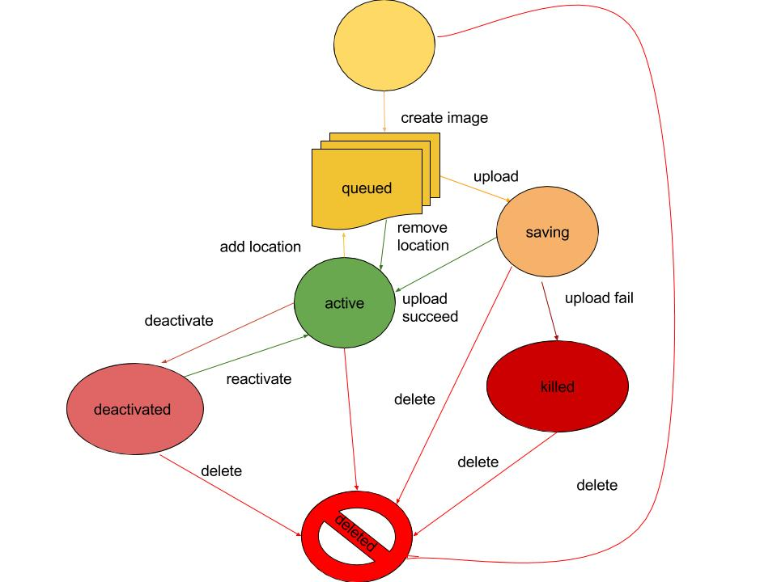

# Thực hành bằng lệnh trong Glance

- Một Image có thể tồn tại ở một trạng thái nhất định trong các trạng thái sau:
	- Create: chúng ta tạo một image sẵn trước để có thể upload lên glance
	- Queued: Image đang ở trong hàng đợi (hàng đợi chỉ dành cho image). Registry Glance sẽ đảm nhận chức năng nhận diện image. Ở trạng thái này, dữ liệu của image chưa được tải lên Glance
	- Saving: Dữ liệu của image đang được upload lên Glance.
	- Active: Dữ liệu của image đã hoàn toàn được tải lên Glance.
	- Deactivated: Image không được phép truy cập vào, kể cả admin
	- Killed: Có lỗi xảy ra trong quá trình truyền tải dữ liệu của image.
	- Deleted: Glance dữ lại các thông tin về image nhưng image không còn được sử dụng. Image này sẽ được xóa đi vào một ngày sau đó.
- Chuyển các trạng thái của image được tóm tắt trong sơ đồ sau



- Chúng ta sẽ thực hành với một số lệnh cơ bản trong glance để quản trị images.

Trước khi thực hành với glance, cần khai báo biến môi trường để xác thực.
	```sh
	export OS_PROJECT_DOMAIN_NAME=Default
	export OS_USER_DOMAIN_NAME=Default
	export OS_PROJECT_NAME=admin
	export OS_USERNAME=admin
	export OS_PASSWORD=Welcome123
	export OS_AUTH_URL=http://controller:35357/v3
	export OS_IDENTITY_API_VERSION=3
	export OS_IMAGE_API_VERSION=2
	```
	Thay thế giá trị của OS_PASSWORD bằng mật khẩu của tài khoản admin của bạn

1. Liệt kê các image có sẵn trong 
	```sh

	root@controller:~# openstack image list
	+--------------------------------------+--------+--------+
	| ID                                   | Name   | Status |
	+--------------------------------------+--------+--------+
	| c051e5d4-89d2-4a3f-973e-eb307a9b551d | cirros | active |
	+--------------------------------------+--------+--------+
	```
Như vậy trong Glance có một image đang ở trạng thái active.

- Để xem thông tin chi tiết của image, sử dụng lệnh sau: `openstack image show <tên image>`
	```sh
	root@controller:~# openstack image show cirros
	+------------------+------------------------------------------------------+
	| Field            | Value                                                |
	+------------------+------------------------------------------------------+
	| checksum         | f8ab98ff5e73ebab884d80c9dc9c7290                     |
	| container_format | bare                                                 |
	| created_at       | 2017-04-19T08:38:30Z                                 |
	| disk_format      | qcow2                                                |
	| file             | /v2/images/c051e5d4-89d2-4a3f-973e-eb307a9b551d/file |
	| id               | c051e5d4-89d2-4a3f-973e-eb307a9b551d                 |
	| min_disk         | 0                                                    |
	| min_ram          | 0                                                    |
	| name             | cirros                                               |
	| owner            | 1667a274e14647ec8f2c0dd593e661de                     |
	| protected        | False                                                |
	| schema           | /v2/schemas/image                                    |
	| size             | 13267968                                             |
	| status           | active                                               |
	| tags             |                                                      |
	| updated_at       | 2017-04-19T08:38:30Z                                 |
	| virtual_size     | None                                                 |
	| visibility       | public                                               |
	+------------------+------------------------------------------------------+
	```
- Kiểm tra thông tin của image trong database đăng nhập vào database và thực hiện lệnh sau: `select * from glance.image_locations\G`
	```sh
	MariaDB [(none)]> select * from glance.image_locations\G
	*************************** 1. row ***************************
	        id: 1
	  image_id: c051e5d4-89d2-4a3f-973e-eb307a9b551d
	     value: file:///var/lib/glance/images/c051e5d4-89d2-4a3f-973e-eb307a9b551d
	created_at: 2017-04-19 08:38:30
	updated_at: 2017-04-19 08:38:30
	deleted_at: NULL
	   deleted: 0
	 meta_data: {}
	    status: active
	1 row in set (0.00 sec)
	```
2. Deactivated một image
- Sử dụng lệnh `openstack image set --deactivate <tên hoặc id của image>` (nên sử dụng id vì có thể có hai image cùng tên với nhau)
	```sh
	root@controller:~# openstack image set --deactivate cirros

	root@controller:~# openstack image list
	+--------------------------------------+--------+-------------+
	| ID                                   | Name   | Status      |
	+--------------------------------------+--------+-------------+
	| c051e5d4-89d2-4a3f-973e-eb307a9b551d | cirros | deactivated |
	+--------------------------------------+--------+-------------+
	```
Chúng ta thấy trạng thái của image đã thay đổi từ **active** sang **deactivated**.

3. Reactivate một image
- Sử dụng lệnh `openstack image set --activate <tên hoặc id của image>`
	```sh
	root@controller:~# openstack image set --activate cirros
	root@controller:~# openstack image list
	+--------------------------------------+--------+--------+
	| ID                                   | Name   | Status |
	+--------------------------------------+--------+--------+
	| c051e5d4-89d2-4a3f-973e-eb307a9b551d | cirros | active |
	+--------------------------------------+--------+--------+
	```

4. Delete một image
- Sử dụng lệnh `openstack image delete <tên hoặc id của image>`
	```sh
	root@controller:~# openstack image delete cirros
	root@controller:~# openstack image list
	# Kết quả hiện thị trống nếu không có image nào trong hệ thống

	# Kiểm tra thông tin trong database
	# Đăng nhập vào database

	MariaDB [(none)]> select * from glance.image_locations\G
	*************************** 1. row ***************************
	        id: 1
	  image_id: c051e5d4-89d2-4a3f-973e-eb307a9b551d
	     value: file:///var/lib/glance/images/c051e5d4-89d2-4a3f-973e-eb307a9b551d
	created_at: 2017-04-19 08:38:30
	updated_at: 2017-05-14 02:25:29
	deleted_at: 2017-05-14 02:25:29
	   deleted: 1
	 meta_data: {}
	    status: deleted
	1 row in set (0.00 sec)
	```
Như vậy chúng ta đã xóa thành công một image.

5. Upload một image lên glance
- Chúng ta có thể tải một file image có sẵn trên internet rồi sau đó upload lên glance.
- Thực hiện tải image về máy. 
	```sh
	wget http://download.cirros-cloud.net/0.3.5/cirros-0.3.5-x86_64-disk.img
	```
- upload image vừa tải về lên glance
	```sh
	openstack image create "cirros-test-upload-image" \
 	--file cirros-0.3.5-x86_64-disk.img \
 	--disk-format qcow2 --container-format bare \
 	--public
 	```

- Kiểm tra lại 
	```sh
	root@controller:~# openstack image list
	+--------------------------------------+--------------------------+--------+
	| ID                                   | Name                     | Status |
	+--------------------------------------+--------------------------+--------+
	| 615af8b9-9c04-4f0a-94d7-e1ed4516e247 | cirros-test-upload-image | active |
	+--------------------------------------+--------------------------+--------+
	```

