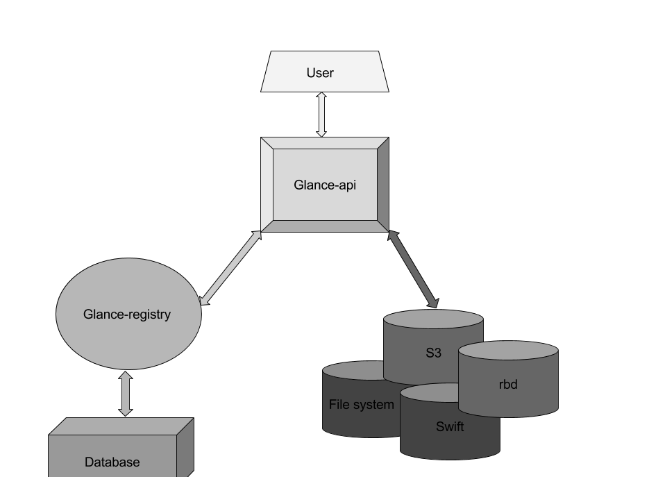
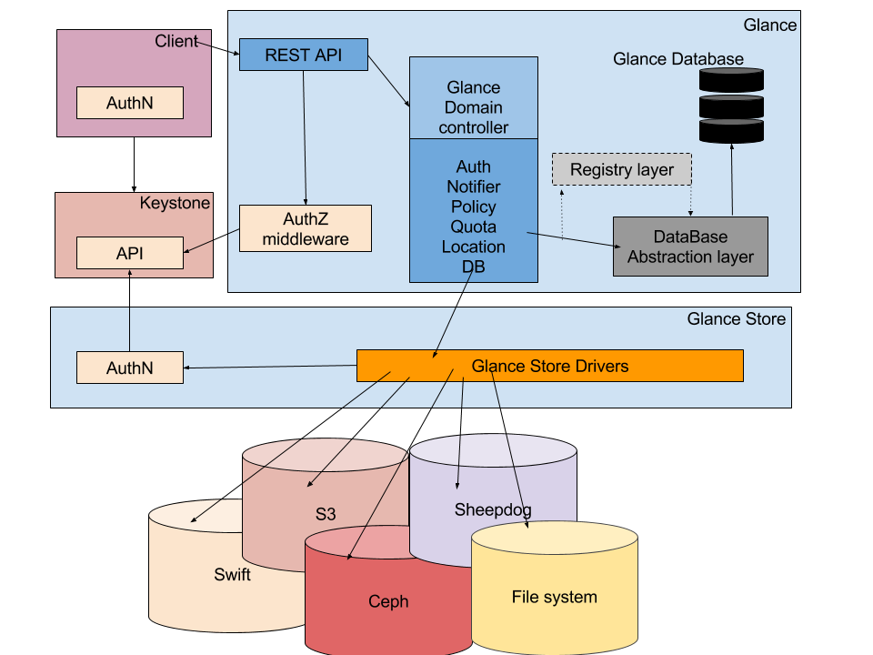
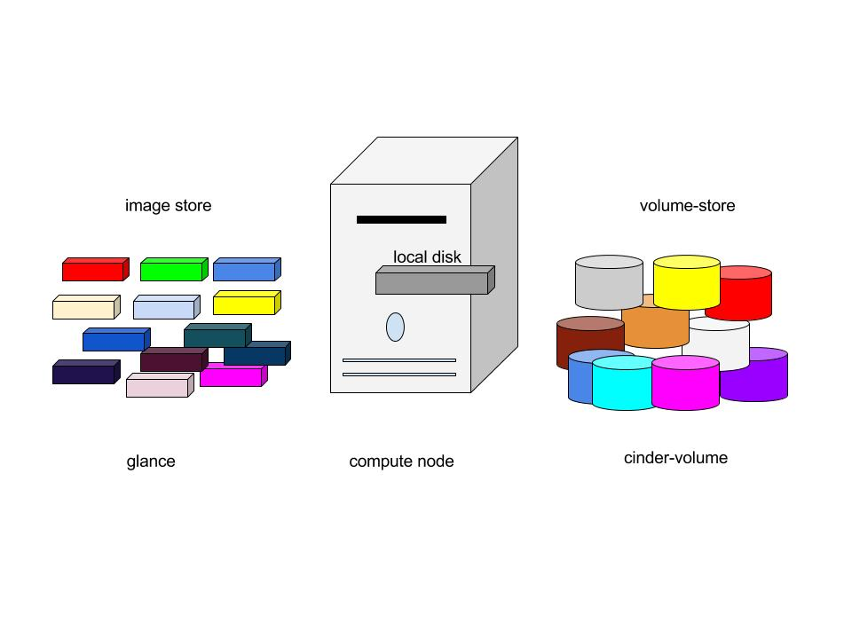
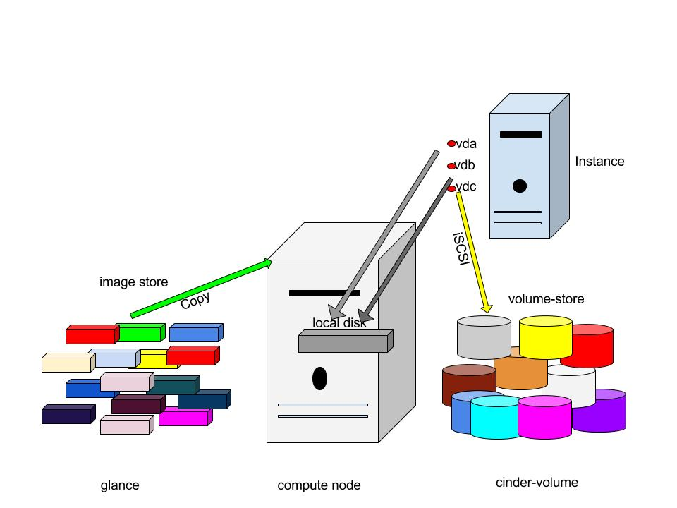

# Tổng quan Image service (glance) project

## Mục lục
- [1. Glance là gì?](#1)
- [2. Glance Components](#2)
- [3. Glance Architecture](#3)
- [4. Glance Formats](#4)
- [5. Glane Status Flow](#5)
- [6. Glance Configuration Files](#6)
- [7. Image and instance.](#7)

### 1. Glance là gì?
- Openstack glance là một dịch vụ image mà cung cấp các chức năng: discovering, registering, retrieving for disk and server images.
- Openstack glance là một trung tâm lưu trữ các virtual image.
- Glance có RESTful API cho phép truy vấn vào VM image cũng như khôi phục lại các image hiện tại.
- VM image được tạo sẵn, thông qua glance có thể được lưu trữ trong nhiều vị trí khác nhau từ các hệ thống tệp tin đơn giản đến các hệ thống lưu trữ đối tượng như là OpenStack Swift project.
- Trong glance, các image được lưu trữ như các mẫu mà có thể được sử dụng để tạo các máy ảo mới. 
- Glance được thiết kế trở thành một dịch vụ độc lập cho những người cần tổ chức các bộ virtual disk images lớn.
- Glance cung cấp giải pháp end-to-end cho quản lý disk image trên cloud. 
- Nó cũng có thể snapshots từ các máy ảo đang chạy để sao lưu trạng thái của VM.

### 2. Glance Components
- Glane có các thành phần sau :
  - Glane-api : Chấp nhận các lời gọi đến API để phát hiện, truy xuất và lưu trữ image.
  - Glane-registry: lưu trữ, xử lý, và lấy thông tin cho image.
  - database : Là nơi lưu trữ metadata của image.
  - storage repository : Tích hợp các thành phần bên ngoài OpenStack khác nhau như hệ thống tập tin thông thường, Amazon S3 và HTTP để lưu trữ image.
  
  
  
- Glance chấp nhận các yêu cầu API cho image từ end-users hoặc các thành phần của Nova và có thể lưu trữ các tệp của nó trong dịch vụ object storage, kho lưu trữ swift hoặc kho lưu trữ khác.
- Glance hỗ trợ backend để lưu trữ image như sau:
  - **File system**: các image được lưu trữ trong hệ thống file, đây là backend mặc định. Nó đơn giản chỉ là viết file image vào thư mục nào đó.
  - **Object Storage**: Dịch vụ OpenStack có sẵn để lưu trữ các Object.
  - **Block Storage**: Dịch vụ OpenStack có sẵn để lưu trữ các Block.
  - **VMware**: ESX/ESXi hoặc vCenter server mục tiêu hướng đến hệ thống.
  - **HTTP**: OpenStack Image Service có thể đọc các vitual machine service có sẵn trên internet sử dụng giao thức HTTP. Lưu trữ này chỉ có thể đọc.
  - **RADOS Block Device (RBD)**: Kho image bên trong một cluster lưu trữ Celp sử dụng Celp interface.
  - **Sheepdog**: Một hệ thống phân phối lưu trữ cho QEMU/KVM.
  - **GridFS**: Lưu trữ image sử dụng mongoDB.

### Glance Architecture
- Glance có cấu trúc theo mô hình client-server và cung cấp RESTful API mà thông qua đó các yêu cầu được gửi đến server để thực hiện. Yêu cầu từ các client được chấp nhận thông qua RESTful API và chờ keystone xác thực.
- Glance Domain controller thực hiện quản lý tất cả các hoạt động bên trong. Các hoạt động được chia ra thành các tầng khác nhau. Mỗi tầng thực hiện một chức năng riêng biệt.
- Glane store là lớp giao tiếp giữa glane và storage back end ở ngoài glane hoặc local filesystem và nó cung cấp giao diện thống nhất để truy cập. Glane sử dụng SQL central Database để truy cập cho tất cả các thành phần trong hệ thống.
- Glance bao gồm một vài thành phần sau:
  - **Client**: Bất kỳ ứng dụng nào sử dụng Glance server đều được gọi là client.
  - **REST API**: dùng để gọi đến các chức năng của Glance thông qua REST.
  - **Database Abstraction Layer (DAL)**: một API để thống nhất giao tiếp giữa Glance và database.
  - **Glance Domain Controller**: là middleware thực hiện các chức năng chính của Glance là: authorization, notifications, policies, database connections.
  - **Glance Store**: tổ chức các tác động giữa Glance và lưu trữ dữ liệu khác.
  - **Registry Layer**: Tùy chọn tổ chức một lớp trao đổi thông tin an toàn giữa các miền và các DAL bằng cách sử dụng một dịch vụ riêng biệt.

  
  

### 4. Glance Formats
- Khi upload một image lên glance, chúng ta phải chỉ rõ định dạng của Virtual machine images.
- Glane hỗ trợ nhiều kiểu định dạng như Disk format và Contianer format. 
- Virtual disk tương tự như server’s boot driver vật lý, chỉ tập trung vào trong một tệp tin. Điều khác là Virtualation hỗ trợ nhiều định dạng disk khác nhau.

#### Disk format
Các định dạng trên đĩa (Disk Formats) của một image máy ảo là định dạng của hình ảnh đĩa cơ bản. Sau đây là các định dạng đĩa được hỗ trợ bởi OpenStack Glance.

#### Container Formats
- OpenStack Glance cũng hỗ trợ các khái niệm về container format. Mô tả các định dạng tệp tin và chứa thêm các metadata về máy ảo.

- Lưu ý rằng Container Formats không được Glance hoặc các thành phần OpenStack sử dụng.

### 5. Glane Status Flow
- Glane Status Flow cho chúng ta thấy tình trạng của Image trong khi chúng ta tải lên. Khi chúng ta khởi tại một image, bước đầu tiên là queuing. Image sẽ được sắp xếp vào một hàng đợi trong một thời gian ngắn để định danh (hàng đợi này dành cho image) và sẵn sàng được upload. Sau khi kết thúc thời gian queuing thì image sẽ được upload đến "Saving" , tuy nhiên ở đây không phải image nào cũng được tải lên hoàn toàn. Những Image nào được tải lên hoàn toàn sẽ trong trạng thái "Active". Khi upload không thành công nó sẽ đến trạng thái "killed" hoặc "deleted" . Chúng ta có thể tắt và tái kích hoạt một Image đang "Active" hoàn toàn bằng một lệnh.
- Sơ đồ về Glance Status Flow

- Các trạng thái:
  - **queued**: Bộ nhận diện image đã được dành riêng cho một image trong registry Glance. Không có dữ liệu nào trong image được tải lên Glance và kích thước image không rõ ràng sẽ được đặt thành 0 khi tạo.
  - **saving**: Biểu thị rằng dữ liệu của image đang được upload lên glance. Khi một image đăng ký với một call đến POST/image và có một x-image-meta-location vị trí tiêu đề hiện tại, image đó sẽ không bao giờ được trong tình trạng saving (dữ liệu Image đã có sẵn ở vị trí khác).
  - **active**:  Biểu thị một image đó là hoàn toàn có sẵn trong Glane. Điều này xảy ra khi các dữ liệu image được tải lên hoặc kích thước image được rõ ràng để thiết lập được tạo.
  - **deactivated**: Biểu thị rằng quyền truy cập vào Image không được phép truy cập từ bất kỳ ai cả admin-user.
  - **killed**: Biểu thị một lỗi xảy ra trong quá trình truyền tải dữ liệu của một image, và image là không thể đọc được.
  - **deleted**: Trong Glane đã giữ lại các thông tin về image, nhưng không còn có sẵn để sử dụng. Một image trong trạng thái này sẽ được gỡ bỏ tự động vào một ngày sau đó.

### 6. Glance Configuration Files
- **Glance-api.conf**: File cấu hình cho API của dịch vụ image
- **Glance-registry.conf**: Fiel cấu hình cho đăng ký image mà các lưu trữ metadata về các image.
- **glance-scrubber.conf** : Sử dụng tiện ích này để xóa sạch các images mà đã bị xóa. 
- **policy.json**: Bổ sung truy cập kiểm soát áp dụng cho các image service. Trong này, chúng tra có thể xác định vai trò, chính sách, làm tăng tính bảo mật trong Glane OpenStack.

### 7. Image and instance.
- Khi image được lưu trữ như các mẫu. Image service điều khiểu lưu trữ và quản lý image. Instance là những máy ảo độc lập chạy trên các compute node, compute node quản lý các instance. Người dùng có thể khởi động với số lượng bất kỳ các máy ảo cùng một image. Mỗi lần chạy một máy ảo thì được thực hiện bằng cách sao chép từ base image, bất kỳ sửa đổi nào trên instance không ảnh hưởng đển các base image. Chúng ta có thể snaphost một instance đang chạy và có thể chạy chúng như một instance khác.
- Khi chạy một instance chúng ta cần xác định các flavor. Đó là đại diện cho tài nguyên ảo. Flavor định xác định bao nhiêu CPU ảo cho một Instance cần có và số lượng RAM sẵn có cho nó, và kích thước của nó trong bộ nhớ tạm của mình. OpenStack cung cấp một thiết lập flavor được xác định từ trước, chúng ta có thể chỉnh sửa các flavor riêng của chúng ta. Sơ đồ dưới đây cho biết tình trạng của hệ thống trước khi lauching an instance. Các image store có số lượng image được xác định trước, compute node chứa CPU có sẵn, bộ nhớ và tài nguyên local disk và cinder-volume chứa số lượng đã được xác định từ trước .

- Trước khi chạy một instance chọn một image, flavor và bất kỳ thuôc tính tùy chọn nào . Chọn flavor cung cấp một root volume, nhãn (lable) là "vda" và một bổ sung vào bộ nhớ tạm thời dán nhãn là "vdb" và cinder-volume được ánh xạ tới ổ đĩa thứ 3 gọi là "vdc".

- VDA : Các image được sao chép vào các local disk. VDA là disk đầu tiên mà các instance được truy cập.
- VDB : là một disk tạm có các sản phẩm tạo ra cùng với instance sẽ bị xóa khi kết thức instance.
- VDC : kết nối với cinder-volume sử dụng iSCSI. Sau khi compute node quy định vCPU và tài nguyên bộ nhớ. Các instance boots up từ root volume VDA. Instance chạy và thay đổi dữ liệu trên disk . Nếu volume store nằm trên một mạng riêng biệt , tùy chọn my_block_storage_ip trong tập tin cấu hình storage node sẽ chỉ đạo giao tiếp với compute node.
  
<<<<<<< HEAD
### Source: 
http://www.sparkmycloud.com/blog/openstack-glance/
=======
# Source: http://www.sparkmycloud.com/blog/openstack-glance/
>>>>>>> origin/master
