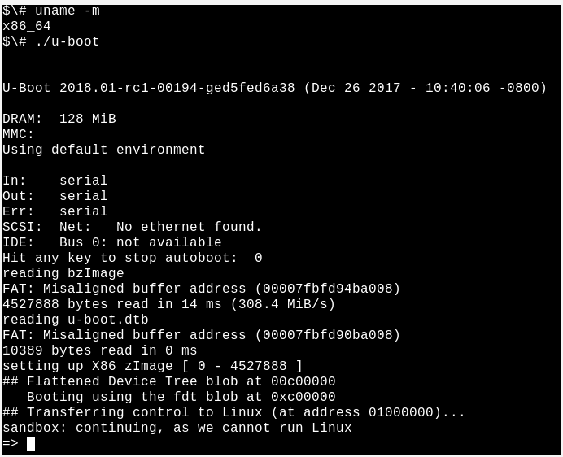
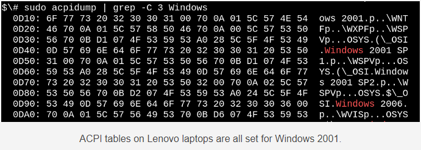
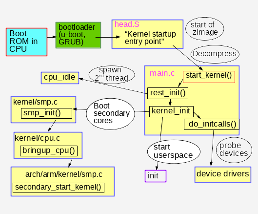
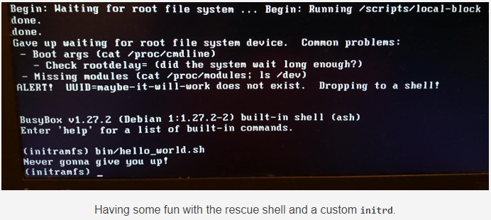

# Phân tích quá trình khởi động Linux
- Hiểu hệ thống là hoạt động tốt để chuẩn bị đối phó với các lỗi phát sinh không thể tránh khỏi

## Nội dung
- Câu nói đùa kinh điển trong mã nguồn mở là `Code chính là tài liệu`. Kinh nghiệm cho thấy việc đọc mã nguồn giống như việc xem dự báo thời tiết:  Những người nhạy cảm vẫn ra ngoài và kiểm tra bầu trời. Dưới đây sẽ là những mẹo để kiểm tra và quan sát các hệ thống Lĩnh khi khởi động bằng cách tận dụng kiến thức về các công cụ gỡ lỗi quen thuộc. Phân tích quá trình boot của hệ thống là hoạt động tốt để người dùng và các nhà phát triển chuẩn bị đối phó với các lỗi phát sinh không thể tránh khỏi.
- Trong một vài cách, việc tiến trình khởi động có thể xem là vô cùng đơn giản. Kernel bắt đầu đọc từng luồng (thread) đơn và đồng bộ trên một nhân đơn (single core) và có vẻ như khá là dễ hiểu. Nhưng bản thân kernel bắt đầu như thế nào? Chức năng của `initrd (initial ramdisk)` và bootloaders` thực hiện được những gì? Và tại sao đèn LED trên cổng Ethernet luôn sáng.

## Bắt đầu khởi động: trạng thái OFF
### Wake-on-LAN
- Liệu có phải trạng thái OFF là hệ thống không có nguồn? dĩ nhiên là không. Cho ví dụ, tín hiệu Ethernet LED vẫn sáng vì Wake-on-LAN (WOL) được bật trên hệ thống. Kiểm tra bằng cách nhận lệnh

```
sudo ethtool <interface name>

~# ethtool ens38
Settings for ens38:
        Supported ports: [ TP ]
        Supported link modes:   10baseT/Half 10baseT/Full
                                100baseT/Half 100baseT/Full
                                1000baseT/Full
        Supported pause frame use: No
        Supports auto-negotiation: Yes
        Advertised link modes:  10baseT/Half 10baseT/Full
                                100baseT/Half 100baseT/Full
                                1000baseT/Full
        Advertised pause frame use: No
        Advertised auto-negotiation: Yes
        Speed: 1000Mb/s
        Duplex: Full
        Port: Twisted Pair
        PHYAD: 0
        Transceiver: internal
        Auto-negotiation: on
        MDI-X: off (auto)
        Supports Wake-on: d
        Wake-on: d
        Current message level: 0x00000007 (7)
                               drv probe link
        Link detected: yes
```

- Nếu `Wake-on` là `g`, thì máy tính từ xa có thể khởi động hệ thống bằng cách gửi một gói đặc biệt MagicPacket. Nếu bạn không có ý định khởi động hệ thống từ xa và không muốn người khác làm việc này, hãy tắt WOL trong BIOS menu hoặc thông qua lệnh

```
sudo ethtool -s <interface name> wol d
```

- Bộ xử lý trả về MagicPacket, nó có thể là một phần của network interface hoặc Baseboard Management Controller (BMC)

## Intel Management Engine, Platform Controller Hub, and Minix
- BMC không phải là bộ vi điều khiển (microcontroller - MCU) duy nhất có khả năng lắng nghe khi hệ thống tắt. Các hệ thống x86_64 cũng bao gồm bộ phần mềm quản lý Intel (IME) để quản lý các hệ thống từ xa. Một loạt các thiết bị, từ máy chủ (server) cho đến laptops, bao gồm công nghệ này, cho phép các chức năng như là KVM Remote Control và Capability Licensing Service. IME có lỗ hổng chưa được vá, theo công cụ phát hiện riêng của Intel. Tin xấu là, rất khó để vô hiệu hóa IME. Trammell Hudson đã tạo ra một dự án me_cleaner kiểm tra một số thành phần IME khắt khe hơn, như máy chủ web nhúng, nhưng cũng có thể chèn vào hệ thống mà nó chạy.
- IME firmware và phần mềm Quản lý Hệ thống (System Management Mode software - SMM) theo sau nó khi khởi động được dựa trên hệ điều hành Minix và chạy trên bộ xử lý Bộ xử lý Nền tảng Riêng biệt chứ không phải CPU của hệ thống chính. Sau đó, SMM sẽ chạy phần mềm Universal Extensible Firmware Interface (UEFI) - những gì đã được ghi trong bộ vi xử lý chính. Nhóm Coreboot tại Google đã bắt đầu một dự án đầy tham vọng, phần mềm NERF (Non-Extensible Reduced Firmware) hướng tới việc thay thế không chỉ UEFI mà có cả các thành phần của người dùng Linux ban đầu như systemd. Trong khi chờ đợi kết quả của những nỗ lực mới này, người dùng Linux bây giờ có thể mua laptops từ Purism, System76 hoặc Dell với IME bị vô hiệu hóa , cộng thêm chúng ta có thể hy vọng với các laptops có bộ xử lý ARM 64-bit.
 
## Bootloaders
- Bên cạnh việc khởi động phần mềm gián điệp lỗi, chức năng gì boot firmware phục vụ đầu? Công việc của bootloader là cung cấp cho bộ xử lý mới được hỗ trợ tài nguyên cần thiết để chạy một mục đích chung của các hệ điều hành như Linux. Khi bật nguồn lên, không có bộ nhớ ảo, bộ nhớ DRAM cho đến khi bộ điều khiển của nó được nạp. Bootloader sau đó bật nguồn và quét các bus, các interface để xác định vị trí của kernel và root filesystem. Các bootloaders phổ biến như U-Boot và GRUB có hỗ trợ các interfaces như USB, PCI, và NFS, cũng như nhiều thiết bị nhúng đặc biệt như NOR và NAND flash. Bootloader cũng tương tác với các thiết bị bảo mật phần cứng như Trusted Platform Modules (TPMs) để thiết lập một chuỗi tin cậy từ khi khởi động.

	 chạy U-boot bootloader
	
- Mã nguồn mở, U-Boot bootloader được hỗ trợ trên các hệ thống từ Raspberry Pi đến thiết bị Nintendo cho tới Chromebook. Không có syslog, khi mọi thứ đi ngang qua, thậm chí không có bất kỳ kết quả trả về ở console. Để tạo điều kiện gỡ lỗi (debugging), nhóm U-Boot cung cấp một sandbox, trong đó các bản vá có thể được kiểm tra trên máy chủ lưu trữ hoặc ngay cả trong một hệ thống tích hợp liên tục. Việc sử dụng sandbox của U-boot tương đối đơn giản trên hệ thống đã được cài các bộ công cụ phát triển như Git và GNU Compiler Collection (GCC):

```sh
$# git clone git://git.denx.de/u-boot; cd u-boot
$# make ARCH=sandbox defconfig
$# make; ./u-boot
=> printenv
=> help
```

- Chỉ có vậy thôi: hiện tại bạn đang chạy U-boot trên x86_64 và có thể thử nghiệm các tính năng như phân vùng lại thiết bị lưu trữ mô phỏng, thao tác khóa bí mật dựa trên TPM và hotplug của thiết bị USB.
	
## Starting up the kernel - Khởi động kernel
### Cung cấp khởi động kernel
- Sau khi hoàn thành nhiệm vụ của nó, bootloader sẽ thực hiện một bước nhảy tới mã kernel mà nó đã nạp vào bộ nhớ chính và bắt đầu thực hiện, thông qua các tùy chọn dòng lệnh mà người dung đã chỉ định. Vậy loại chương trình nào thì được xem là kernel? file `/boot/vmlinuz` chỉ ra nó là một bzlmage, có nghĩa là một tệp nén lớn. Cây mã nguồn Linux chứa công cụ `extract-vmlinux` có thể được sử dụng để giải nén file này:

```sh
$# scripts/extract-vmlinux /boot/vmlinuz-$(uname -r) > vmlinux
$# file vmlinux 
vmlinux: ELF 64-bit LSB executable, x86-64, version 1 (SYSV), statically 
linked, stripped
```

- Kernel là một chương trình binary (nhị phân) có khả năng thực thi và định dạng liên kết Executable and Linking Format - ELF như các chương trình người dùng Linux. Điều này có nghĩa là chúng ta có thể sử dụng các lệnh từ gói `binutils` giống như `readelf` để quan sát nó. Hãy so sánh đầu ra của chúng, ví dụ:

```sh
$# readelf -S /bin/date
$# readelf -S vmlinux
```
danh sách các phần trong các file nhị phân này phần lớn là giống nhau

- Kernel phải bắt đầu một số thứ giống như các chương trình Linux ELF nhị phân khác, ... nhưng làm thế nào để chương trình người dùng (userspace) thực sự bắt đầu? Trong hàm main()? Không phải vậy.
- Trước khi hàm main() có thể chạy, các chương trình cần thực thi phần gồm có bộ nhớ heap và stack cộng thêm các tệp tin mô tả stdio, stdout, và stderr. Chương trình người dùng có được những tài nguyên này từ thư viện chuẩn glibc trên hầu hết các hệ thống Linux. Xem xét ví dụ sau:

```sh
$# file /bin/date 
/bin/date: ELF 64-bit LSB shared object, x86-64, version 1 (SYSV), dynamically 
linked, interpreter /lib64/ld-linux-x86-64.so.2, for GNU/Linux 2.6.32, 
BuildID[sha1]=14e8563676febeb06d701dbee35d225c5a8e565a,
stripped
```

- ELF nhị phân có một trình thông dịch, giống như Bash và Python, nhưng trình thông dịch này không cần chỉ định với #! như các kịch bản bash hay python. Trình thông dịch ELF cung cấp một số bit nhị phân với các tài nguyên cần thiết bằng cách gọi hàm _start() - một hàm có sẵn trong gói glibc. Kernel hy vọng không có trình thông dịch và phải tự nó cung cấp, nhưng như thế nào?

- Xem xét quá trình khởi động của kernel với GDB sẽ cho câu trả lời. Đầu tiên cài đặt gói debug cho kernel chứa một phiên bản của vmlinux, cho ví dụ `apt-get install linux-image-amd64-dbg` hoặc biên dịch và cài đặt kernel của riêng bạn từ nguồn. gdb vmlinux tiếp theo là info files cho thấy phần ELF init.text. Danh sách bắt đầu thực hiện chương trình trong init.text với l*(address) trong đó address có thể là phần địa chỉ dạng hexadecimal bắt đầu init.text. GDB sẽ chỉ ra rằng kernel x86_64 khởi động trong tệp tin của kernel arch/x86/kernel/head_64.S - nơi mà có thể tìm thấy hàm nhúng (assembly function) start_cpu0() và code tạo ra một một stack và giải nén zImage trước khi gọi tới hàm x86_64 start_kernel(). Kernel ARM 32bit cũng tương tự có arch/arm/kernel/head.S. start_kernel() không phải là kiến trúc đặc trưng, vì vậy các hàm chứa trong init/main.c của kernel. start_kernel() được xem là một hàm main() thực sự của Linux.

## Từ start_kernel () đến PID 1
### Phần kê khai phần cứng của kernel: bảng cây thiết bị và các bảng ACPI
- Khi khởi động, kernel cần thông tin về phần cứng ngoài các loại vi xử lý. Khi khởi động, kernel cần thông tin về phần cứng. Có hai phương thức chính để lưu trữ dữ liệu này: cây thiết bị (devices-tree) và bảng ACPI . Kernel học được phần cứng nào nó phải chạy ở mỗi lần khởi động bằng cách đọc các tập tin này.
- Với các thiết bị nhúng, cây thiết bị là một bảng kê khai của phần cứng đã cài đặt. Cây thiết bị đơn giản một file đã được biên dịch cùng lúc với mã nguồn kernel và thường nằm ở /boot bên cạnh vmlinux. Để xem những gì trong cây thiết bị nhị phân trên thiết bị ARM, chỉ cần sử dụng lệnh strings từ gói binutils trên một tệp có tên dạng `/boot/*.dtb`. Rõ ràng cây thiết bị có thể được sửa đổi bằng cách chỉnh sửa các tập tin giống như file JSON và biên soạn nó rồi trả tới một dtc compiler đặc biệt được cung cấp với nguồn kernel (kernel source). Mặc dù cây thiết bị là một tệp tin tĩnh nhưng đường dẫn tệp (file path) thường được đưa tới kernel thông qua bootloaders qua dòng lệnh. Một device-tree overlay đã được thêm vào trong những năm gần đây, nơi mà kernel có thể tải các mảnh bổ sung để đáp ứng với các sự kiện hotplug sau khi khởi động.

- Họ thiết bị x86 và nhiều thiết bị ARM-64 được cấp cho doanh nghiệp sử dụng cơ chế cấu hình và giao diện cấp cao ( Advanced Configuration and Power Interface - ACPI ) để thay thế. Trái ngược với cây thiết bị, thông tin ACPI được lưu trữ trong `/sys/firmware/acpi/tables`. Hệ thống tập tin ảo (virtual filesystem) được tạo ra bởi kernel khi khởi động bằng cách truy cập vào ROM trên máy. Cách dễ dàng để đọc bảng ACPI là với lệnh `acpidump` từ gói acpica-tools. Đây là một ví dụ:

	
	
- Hệ thống Linux của bạn đã sẵn sàng cho Windows 2001, bạn nên cẩn thận để cài đặt nó. ACPI có cả phương thức và dữ liệu, không giống như cây thiết bị vốn là ngôn ngữ mô tả phần cứng. Các phương thức của ACPI tiếp tục được hoạt động sau khi khởi động. Ví dụ, thực hiện lệnh: `acpi_listen`, từ gói apcid sau đó mở và đóng nắp laptop sẽ cho thấy rằng chức năng của ACPI đang chạy tất cả thời gian. Trong khi việc tạm thời và tự động `overwriting the ACPI tables` là có thể xảy ra. Việc thay đổi vĩnh viễn chúng liên quan đến tương tác với BIOS menu lúc khởi động hoặc reflashing ROM. Nếu bạn đang gặp rắc rối đó, có lẽ bạn nên cài đặt `coreboot` - phần mềm nguồn mở thay thế.

## Từ start_kernel () đến không gian người dùng (userspace)
- Code bên trong `init/main.c` thật đáng kinh ngạc là có thể đọc vẫn mang bản quyền gốc của Linus Torvalds từ năm 1991-1992. Các dòng được tìm thấy trong `dmesg | head` của một hệ thống mới khởi động bắt nguồn chủ yếu từ tập tin nguồn này. Đầu tiên, CPU sẽ đăng ký với hệ thống, các cấu trúc dữ liệu chung được khởi tạo, với trình lập lịch, bộ xử lý ngắt (IRQs), bộ đếm thời gian và giao diện điều khiển được đặt theo thứ tự nghiêm ngặt, có sẵn. Cho đến khi hàm `timekeeping_init()` chạy, tất cả timestamps là 0. Phần khởi tạo này của kernel được đồng bộ, có nghĩa là việc thực hiện xảy ra ở chính xác một luồng và không có hàm nào được thực hiện cho đến khi kết thúc và trả về kết quả cuối cùng. Kết quả là `dmesg` trả về sẽ được hoàn toàn tái tạo được ngay cả giữa hai hệ thống, miễn là họ có cùng một thiết bị cây hoặc bảng ACPI. Linux đang hoạt động giống như một trong những hệ điều hành RTOS (real-time operating systems) chạy trên các MCU, ví dụ như QNX hoặc VxWorks. Tình huống vẫn tồn tại trong hàm rest_init(), được gọi bằng cách thực hiện câu lệnh `start_kernel()`.

	
	
- Khi gọi đến hàm `rest_init()`, hàm sẽ thực hiện tạo ra một luồng mới gọi đến hàm `kernel_init()` và hàm này gọi đến hàm `do_initcalls()`. Người dùng có thể kiểm tra các hành động ở `initcalls` bằng cách thêm `initcall_debug` vào dòng lệnh của kernel. Kết quả trả về trong `dmesg` mỗi khi có một hàm `initcall` được chạy. initcalls đều thông qua bảy mức độ tuần tự đó là `early, core, postcore, arch, subsys, fs, device, and late`. Phần người dùng dễ nhìn thấy nhất của initcalls đó là việc dò tìm và thiết lập các thiết bị ngoại vi của bộ vi xử lý: buses, network, storage, display, ... cùng với việc tải các modul của kernel. Hàm rest_init() cũng gọi một thread tới bộ xử lý, việc khởi động bắt đầu bằng cách chạy hàm cpu_idle() trong khi chờ đợi trình lên lịch gàn nó làm việc.

- Hàm `kernel_init()` cũng thiết lập symmetric multiprocessing - smp (đa tiến trình đối xứng). Với nhiều loại kernel gần đây, tìm đầu ra của `dmesg` bằng cách thực hiện tìm kiếm ""Bringing up secondary CPUs..." SMP xử lý bởi "hotplugging" CPUs, có nghĩa là nó sẽ quản lý vòng đời của chúng với một trạng thái máy tương tự như các thiết bị như "hotplugged" USB sticks. Hệ thống quản lý nguồn điện của kernel thường lấy các core offline riêng lẻ, sau đó đánh thức chúng khi cần thiết, do đó cùng một mã CPU hotplug được gọi lặp đi lặp lại trên một máy không bận. Quan sát lời gọi của hệ thống quản lý điện của CPU hotplug bằng công cụ BCC được gọi là offcputime.py.

- Lưu ý rằng mã trong `init/main.c` gần được hoàn thành khi `smp_init()` chạy. Bộ xử lý khởi động (boot processor) đã hoàn thành hầu hết việc khởi tạo một lần mà các lõi khác không cần phải lặp lại. Tuy nhiên, các chuỗi cho mỗi CPU phải được sinh ra cho mỗi core để quản lý các ngắt (IRQs), workqueues, timer, và các sự kiện.

- Ví dụ, xem các chuỗi cho mỗi CPU phục vụ softirqs và workqueues đang hoạt động thông qua lệnh `ps -o psr`.

```sh
$\# ps -o pid,psr,comm $(pgrep ksoftirqd)  
 PID PSR COMMAND 
   7   0 ksoftirqd/0 
  16   1 ksoftirqd/1 
  22   2 ksoftirqd/2 
  28   3 ksoftirqd/3 

$\# ps -o pid,psr,comm $(pgrep kworker)
PID  PSR COMMAND 
   4   0 kworker/0:0H 
  18   1 kworker/1:0H 
  24   2 kworker/2:0H 
  30   3 kworker/3:0H
[ . .  . ]
```

- trong đó: PSR là viết tắt của "processor". Mỗi core cũng phải lưu trữ bộ đếm giờ và bộ cpuhp hotplug điều khiển của riêng nó.

## Không gian người dùng đầu tiên: người ra lệnh cho initrd là ai?
- Bên cạnh cây thiết bị, một đường dẫn tệp khác được cung cấp cho kernel khi khởi động là đường dẫn `initrd`. initrd thường được chứa trong `/boot` cùng với tệp `bmlImage` trên x86, hoặc bên cạnh tệp giống `uImage` và cây thiết bị cho ARM. Danh sách các nội dung của initrd, với công cụ `lsinitramfs` trong gói `initramfs-tools-core`. Distro initrd schemes tối thiểu bao gồm có `/bin, /sbin và /etc` cùng với modul của kernel và một vài file trong `/scripts`. Tất cả trông khá là quen thuộc, vì hầu hết `initrd` chỉ là phần tối thiểu của hệ thống tệp tin root linux. Sự giống nhau này sẽ tạo ra một chút nhầm lẫn, gần như tất cả thư mục `/bin`, `/sbi`n bên trong ramdisk được liên kết tới BusyBox binary, kết quả là trong thư mục `/bin` và `/sbin` nhỏ hơn 10 lần so với của glibc.

- Tại sao phải tạo ra một initrd nếu tất công việc của nó là tải một số modul và sau đó bắt đầu init trên filesystem. Xem xét một hệ thống tập tin gốc được mã hóa. Việc giải mã có thể dựa vào việc tải một modul kernel được lưu trữ trong `/lib/modules` trong root filesystem và cũng không có gì đáng ngạc nhiên với initrd. Crypto module có thể được biên dịch tĩnh trong kernel thay vì được load từ một tệp nhưng có nhiều lý do khác nhau khiến bạn không muốn làm như vậy. Ví dụ, việc biên dịch kernel bằng các modul có thể làm cho nó quá lớn để phù hợp với dung lượng có sẵn, hoặc việc biên dịch tĩnh có thể vi phạm các điều khoản của một giấy phép phần mềm. Không ngạc nhiên khi các trình điều khiển thiết bị đầu vào (HID) lưu trữ, network và con người (HID) cũng có thể có mặt trong initrd. Về cơ bản bất kỳ code nào không phải là một phần của kernel thích hợp mà là cần thiết để gắn kết các root filesystem. initrd cũng là nơi người dùng có thể lưu trữ mã bảng ACPI tuỳ chỉnh của riêng họ.

	
	
- `initrd` cũng tuyệt vời cho việc thử nghiệm các hệ thống file và các thiết bị lưu trữ dữ liệu. Giữ các công cụ kiểm tra trong `initrd` và chạy kiểm tra của bạn từ bộ nhớ hơn là từ các đối tượng test.

- Cuối cùng, khi init chạy, hệ thống bật. Vì bộ xử lý thứ cấp hiện đang chạy, máy trở nên không đồng bộ, không thể đoán trước, hiệu quả cao. Quả thực, ps -o pid,psr,comm -p 1 có thể cho thấy tiền trình init của userspace không cọn chạy trên bộ xử lý boot nữa.

## Tổng kết
- Quá trình khởi động của Linux nghe có vẻ khó hiểu, việc xem xét số lượng các phần mềm khác nhau tham gia các sự kiện trên một thiết bị nhúng đơn giản. Nhìn vào những sự khác biệt, quá trình khởi động lại khá là đơn giản, vì sự phức tạp gây bối dối do các tính năng như preemption, RCU, và các điều kiện bị thiếu trong khi khởi động. Tập trung vào kernel và PID 1 nhìn thấy một lượng lớn công việc mà bootloader và bộ vi xử lý phụ trợ có thể làm trong việc chuẩn bị platform cho kernel chạy. Trong khi kernel chắc chắn là duy nhất giữa các chương trình linux, một số cái nhìn sâu vào cấu trúc có thể áp dụng một số công cụ tương tự dùng để kiểm tra các chương trình ELF khác. Nghiên cứ về quá trình khởi động khi hệ thống bảo trò tốt để chuẩn bị sửa các lỗi có thể xảy ra sau này.

Link bài gốc: https://opensource.com/article/18/1/analyzing-linux-boot-process