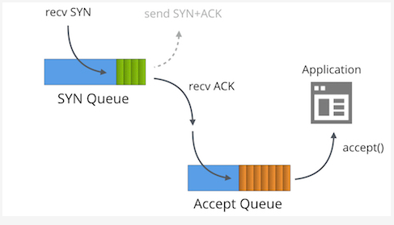
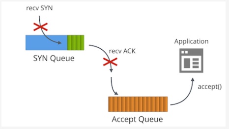
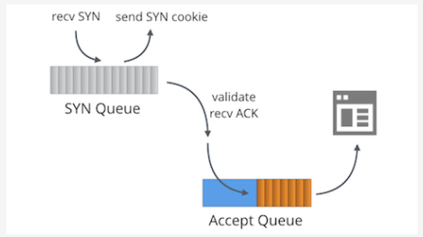
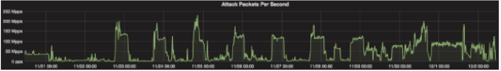

# SYN packet handling in the wild
- Tại Cloudflare, chúng tôi có nhiều kinh nghiệm vận hành các server trên Internet. Nhưng chúng tôi luôn nâng cao khả năng của chúng tôi trong lĩnh vực nghệ thuật này. Trên bài viết này, chúng tôi đề cập đến nhiều khía cạnh của các giao thức internet: như [hiểu về FIN-WAIT-2](https://blog.cloudflare.com/this-is-strictly-a-violation-of-the-tcp-specification/) hay là [nhận điều chỉnh bộ đệm](https://blog.cloudflare.com/the-story-of-one-latency-spike/)
- Một chủ đề chưa được quan tâm đúng mức - ngập lụt SYN (SYN floods). Chúng tôi sử dụng Linux và nó chỉ ra rằng xử lý gói SYN trong Linux thực sự phức tạp. Trong bài viết này, chúng tôi sẽ làm rõ một số điểm trên chủ đề này.

## Câu chuyện về 2 hàng đợi (queue)
- Đầu tiên chúng ta phải hiểu về sự ràng buộc socket, trong trạng thái "LISTENING" của TCP có 2 hàng đợi riêng biệt:
	- SYN Queue
	- Accept Queue
- Cũng có các tên khác để gọi những hàng đợi này như "reqsk_queue", "ACK backlog", "listen backlog" hay là "TCP backlog", nhưng tôi sẽ sử dụng tên ở trên để tránh sự nhầm lẫn.

	
	
## Hàng đợi SYN (SYN Queue)
- Hàng đợi SYN lưu các gói SYN đi vào (đặc biệt: [struct inet_request_sock](https://elixir.free-electrons.com/linux/v4.14.12/source/include/net/inet_sock.h#L73)). Nó chịu trách nhiệm gửi đi các gói SYN + ACK và thử lại khi timeout. Trên Linux, số lần thử lại được cấu hình với:

```sh
$ sysctl net.ipv4.tcp_synack_retries
net.ipv4.tcp_synack_retries = 5
```

- [Tài liệu mô tả chuyển đổi này](https://www.kernel.org/doc/Documentation/networking/ip-sysctl.txt):

```sh
tcp_synack_retries - INTEGER
	Số lần SYNACKs cho một nỗ lực kết nối TCP sẽ được phát lại. Không nên đặt cao hơn 255. Giá trị mặc định là 5, tương ứng với 31 giây cho đến lần truyền lại cuối cùng với hiện tại RTO ban đầu 1 giây. Với thời gian chờ cuối cùng cho một kết nối TCP thụ động sẽ xảy ra sau 63 giây.
```

- Sau khi chuyển SYN+ACK, hàng đợi SYN chờ một gói ACK từ máy khách - gói cuối cùng trong bắt tay 3 bước. Tất cả các gói ACK nhận được đầu tiên phải được hợp lại dừa vào bảng kết nối được thiết lập đầy đủ, và sau đó chỉ dựa vào dữ liệu trong hàng đợi SYN có liên quan. Trên hàng đợi SYN, kernel loại bỏ các mục từ SYN hàng đợi, tạo xong một kết nối, và thêm nó vào hàng đợi Accept.

## Hàng đợi Accept
- Hàng đợi Accept chứa toàn bộ các kết nối đã thiết lập: sẵn sàng được rước bởi các ứng dụng. Khi một tiến trình gọi accept(), các sockets này được ra khỏi hàng đợi và chuyển đến cho ứng dụng.
- Đây là một cái nhìn khá đơn giản về xử lý gói SYN trên Linux. Với các móc nối socket như `TCP_DEFER_ACCEPT` và `TCP_FASTOPEN` làm việc hơi khác một chút.

## Kích thước giới hạn của hàng đợi
- Kích thước tối đa cho phép của cả hàng đợi Accept và SYN được lấy từ tham số `backlog` chuyển đến lời gọi hệ thống `listen(2)` bởi ứng dụng. Cho ví dụ, đây là đặt kích thước hàng đợi Accept và SYN là 1024 byte:

```sh
listen(sfd, 1024)
```

- Chú ý: các kernel trước 4.3 [độ dài hàng đợi SYN được tính khác](https://github.com/torvalds/linux/commit/ef547f2ac16bd9d77a780a0e7c70857e69e8f23f#diff-56ecfd3cd70d57cde321f395f0d8d743L43)

- Khả năng của hàng đợi SYN sử dụng được cấu hình bằng `net.ipv4.tcp_max_syn_backlog`, nhưng đây không phải là một trường hợp khác nữa. Ngày nay, `net.core.somaxconn` cho cả 2 hàng đợi. Trên các server chúng tôi đặt 16k:

```sh
$ sysctl net.core.somaxconn
net.core.somaxconn = 16384
```

## Giá trị backlog hợp lý
- Biết được tất cả điều đó, chúng ta có thể đặt câu hỏi - giá trị tham số backlog lý tưởng là gì?

- Câu trả lời là: tùy. Đối với hầu hết các máy chủ nhỏ thì không quan trọng. Ví dụ như [Golang nổi tiếng không hỗ trợ tùy chỉnh backlog](https://github.com/golang/go/issues/6079) và hardcodes của nó đến 128. Có những lý do hợp lệ để tăng giá trị này mặc dù:
	- Khi tỷ lệ kết nối thực sự lớn, thậm chí với một ứng dụng thực hiện, hàng đợi SYN có thể cần một số lượng lớn các khe.
	- Giá trị `backlog` kiểm soát kích thước hàng đợi SYN. Điều này có hiệu quả có thể được đọc là "gói ACK trong chuyến bay". Thời gian đi lại trung bình càng lớn cho khách hàng, càng có nhiều khe cắm sẽ được sử dụng. Trong trường hợp nhiều khách hàng ở xa máy chủ, hàng trăm mili giây đi, nó có ý nghĩa để tăng giá trị backlog.
	- Tùy chọn `TCP_DEFER_ACCEPT` gây ra các socket duy trì trạng thái SYN-RECV lâu hơn và đóng góp vào các giới hạn hàng đợi.

- Việc vượt qua `backog` cũng xấu: Mỗi khe trong hàng đợi SYN sử dụng một số bộ nhớ. Trong một trận lũ SYN, bạn sẽ không lãng phí tài nguyên khi lưu các gói tin tấn công. Mỗi mục `struct inet_request_sock` trong hàng đợi SYN mất 256 byte bộ nhớ trên kernel 4.14.

- Để nhìn vào hàng đợi SYN trên Linux chúng ta có thể sử dụng lệnh `ss` và tìm các socket `SYN-RECV`. Ví dụ: trên một trong các máy chủ của Cloudflare, chúng ta có thể thấy 119 khe cắm được sử dụng trong tcp / 80 SYN Queue và 78 trên tcp / 443.

```sh
$ ss -n state syn-recv sport = :80 | wc -l
119
$ ss -n state syn-recv sport = :443 | wc -l
78
```

- Dữ liệu tương tự có thể được hiển thị với [kịch bản SystemTap overengineed](https://github.com/cloudflare/cloudflare-blog/blob/master/2018-01-syn-floods/resq.stp): `resq.stp`

## Ứng dụng chậm
- Điều gì sẽ xảy ra nếu ứng dụng không thể theo kịp với lời gọi `accept()` đủ nhanh?

	
	
- Đây là khi sự kỳ diệu xảy ra! Khi hàng đợi Accept đầy (có kích thước của backlog + 1) sau đó:
	- Các gói SYN đi vào hàng đợi SYN đều bị xóa bỏ
	- Các gói ACK đi vào hàng đợi SYN đều bị xóa bỏ
	- Bộ đếm `TcpExtListenOverflows / LINUX_MIB_LISTENOVERFLOWS` được tăng lên
	- Bộ đếm `TcpExtListenDrops / LINUX_MIB_LISTENDROPS` được tăng lên.

- Có một lý do chính đáng cho việc xóa các gói tin gửi đến: nó là một cơ chế `push-back`. Bên kia sớm hay muộn sẽ gửi lại gói tin SYN hoặc ACK theo thời điểm đó, hy vọng là, ứng dụng chậm sẽ hồi phục.

- Đây là một hành vi mong muốn cho hầu hết các máy chủ. Để hoàn thành: nó có thể được điều chỉnh bằng `net.ipv4.tcp_abort_on_overflow`, nhưng tốt hơn không động vào nó.

- Nếu máy chủ của bạn cần phải xử lý một số lượng lớn các kết nối gửi đến và đang gặp khó khăn với thông lượng `accept()`, hãy xem xét việc chỉnh sửa [Nginx / Epoll bài viết phân phối công việc](https://blog.cloudflare.com/the-sad-state-of-linux-socket-balancing/) và theo dõi một [kịch bản hữu ích SystemTap](https://blog.cloudflare.com/perfect-locality-and-three-epic-systemtap-scripts/)

- Bạn có thể theo dõi số liệu hàng đợi accept tràn bằng cách nhìn vào các bộ đếm `nstat`:

```sh
$ nstat -az TcpExtListenDrops
TcpExtListenDrops     49199     0.0
```

- Đây là một bộ đếm toàn cục. Nó không phải là lý tưởng - đôi khi chúng ta thấy nó tăng lên, trong khi tất cả các ứng dụng trông ổn định! Bước đầu tiên phải là in các kích cỡ hàng đợi Accept bằng ss:

```sh
$ ss -plnt sport = :6443|cat
State   Recv-Q Send-Q  Local Address:Port  Peer Address:Port
LISTEN  0      1024                *:6443             *:*
```

- Cột Recv-Q cho thấy số sockets trong hàng đợi Accept, và Send-Q cho thấy tham số backlog. Trong trường hợp này, chúng ta thấy không có socket nào được accept(), nhưng chúng ta vẫn thấy số lượng bộ đếm ListenDrops ngày càng tăng.

- Nó chỉ ra ứng dụng của chúng ta đã bị mắc kẹt trong một phần của một giây. Điều này đã đủ để cho tràn hàng đợi Accept trong một khoảng thời gian rất ngắn. Khoảnh khắc sau đó nó sẽ phục hồi. Các trường hợp như thế này rất khó để gỡ rối với ss, vì vậy chúng tôi đã viết một kịch bản [SystemTap acceptq.stp](https://github.com/cloudflare/cloudflare-blog/blob/master/2018-01-syn-floods/acceptq.stp) để giúp chúng ta. Nó nối vào kernel và in các gói tin SYN đang bị bỏ:

```sh
$ sudo stap -v acceptq.stp
time (us)        acceptq qmax  local addr    remote_addr
1495634198449075  1025   1024  0.0.0.0:6443  10.0.1.92:28585
1495634198449253  1025   1024  0.0.0.0:6443  10.0.1.92:50500
1495634198450062  1025   1024  0.0.0.0:6443  10.0.1.92:65434
...
```

- Ở đây bạn có thể thấy chính xác những gói tin SYN nào bị ảnh hưởng bởi ListenDrops. Với kịch bản này nó tầm thường để hiểu được ứng dụng đang giảm các kết nối.

## Lũ SYN (SYN Flood)
- Nếu có thể tràn hàng đợi Accept, nó cũng có thể tràn lên hàng đợi SYN. Điều gì xảy ra trong trường hợp đó?

	
	
- Đây là tất cả những gì về cuộc [tấn công SYN Flood](https://en.wikipedia.org/wiki/SYN_flood). Trong quá khứ lũ lụt hàng đợi SYN với giả mạo giả mạo các gói tin SYN  là một vấn đề thực sự. Trước năm 1996, có thể từ chối dịch vụ của hầu hết các máy chủ TCP với băng thông rất nhỏ, chỉ bằng cách điền hàng đợi SYN.

- Giải pháp là [SYN Cookies](https://lwn.net/Articles/277146/). SYN Cookies là một cấu trúc cho phép SYN + ACK được tạo ra không trạng thái, mà không thực sự lưu SYN vào và lãng phí bộ nhớ hệ thống. SYN Cookies không phá vỡ lưu lượng truy cập hợp pháp. Khi bên kia là có thật, nó sẽ trả lời với một gói ACK hợp lệ bao gồm số đánh dấu thứ tự, có thể được xác minh bằng mật mã.

- Theo mặc định, SYN Cookies được kích hoạt khi cần thiết - cho socket với một hàng đợi SYN đã đầy. Linux cập nhật một vài bộ đếm trên SYN Cookies. Khi một SYN cookie đang được gửi đi:
	- `TcpExtTCPReqQFullDoCookies / LINUX_MIB_TCPREQQFULLDOCOOKIES` được tăng lên.
	- `TcpExtSyncookiesSent / LINUX_MIB_SYNCOOKIESSENT` được tăng lên.
	- Linux dùng để tăng `TcpExtListenDrops` nhưng không phải từ [kernel 4.7](https://github.com/torvalds/linux/commit/9caad864151e525929d323de96cad382da49c3b2)
	
- Khi một ACK gửi đến đang hướng vào hàng đợi SYN với cookie SYN:
	- `TcpExtSyncookiesRecv / LINUX_MIB_SYNCOOKIESRECV` được tăng lên khi xác thực crypto thành công.
	- `TcpExtSyncookiesFailed / LINUX_MIB_SYNCOOKIESFAILED` tăng khi crypto thất bại.
	
- Một sysctl `net.ipv4.tcp_syncookies` có thể vô hiệu hóa SYN Cookies hoặc kích hoạt chúng. Mặc định là tốt, không thay đổi nó.

## SYN Cookies và TCP Timestamps
- SYN Cookies hoạt động thần kỳ, nhưng không phải là không có bất lợi. Vấn đề chính là có rất ít dữ liệu có thể được lưu trong một Cookie SYN. Cụ thể, chỉ có 32 bit của chuỗi số được trả về trong ACK. Các bit này được sử dụng như sau:

```sh
+----------+--------+-------------------+
|  6 bits  | 2 bits |     24 bits       |
| t mod 32 |  MSS   | hash(ip, port, t) |
+----------+--------+-------------------+
```

- Với các thiết lập MSS [cắt ngắn chỉ có 4 giá trị riêng biệt](https://github.com/torvalds/linux/blob/5bbcc0f595fadb4cac0eddc4401035ec0bd95b09/net/ipv4/syncookies.c#L142), Linux không biết bất kỳ tham số tùy chọn TCP của bên kia. Thông tin về Dấu thời gian, ECN, ACK chọn lọc, hoặc Quy mô cửa sổ bị mất và có thể dẫn đến hiệu suất phiên TCP bị giảm.

- May mắn thay Linux có một công việc xung quanh. Nếu TCP Timestamps được kích hoạt, kernel có thể sử dụng lại một khoảng 32 bit khác trong trường Timestamp. Nó chứa:

```sh
+-----------+-------+-------+--------+
|  26 bits  | 1 bit | 1 bit | 4 bits |
| Timestamp |  ECN  | SACK  | WScale |
+-----------+-------+-------+--------+
```

- TCP Timestamps nên được kích hoạt theo mặc định, để xác minh xem sysctl:

```sh
$ sysctl net.ipv4.tcp_timestamps
net.ipv4.tcp_timestamps = 1
```

- Trong lịch sử đã có rất nhiều cuộc thảo luận về tính hữu ích của TCP Timestamps.
	- Trong timestamps quá khứ bị rò rỉ thời gian hoạt động của máy chủ (cho dù đó là thảo luận vấn đề khác). Điều này [được khắc phục 8 tháng trước](https://github.com/torvalds/linux/commit/95a22caee396cef0bb2ca8fafdd82966a49367bb)
	- TCP Timestamps sử dụng [số lượng không nhỏ của băng thông](http://highscalability.com/blog/2015/10/14/save-some-bandwidth-by-turning-off-tcp-timestamps.html) - 12 byte trên mỗi gói tin.
	- Chúng có thể thêm ngẫu nhiên thêm vào gói checksums có thể giúp với một số phần cứng bị hỏng.
	- Như đã đề cập ở trên, TCP Timestamps có thể tăng hiệu suất của các kết nối TCP nếu Cookies SYN được đính kèm.

- Hiện tại trên Cloudflare, chúng tôi đã tắt chức năng Dấu thời gian TCP.

- Cuối cùng, với Cookie SYN có một số tính năng mát mẻ sẽ không hoạt động - những thứ như `TCP_SAVED_SYN`, `TCP_DEFER_ACCEPT` hoặc `TCP_FAST_OPEN`

## SYN Lũ lụt ở quy mô Cloudflare
- SYN Cookies là một phát minh tuyệt vời và giải quyết vấn đề lũ nhỏ SYN. Tại Cloudflare, chúng tôi cố gắng tránh chúng nếu có thể. Trong khi gửi đi một vài nghìn gói tin SYN + ACK có thể kiểm chứng được về mật mã trong một giây thì không sao, chúng ta thấy [các cuộc tấn công của hơn 200 triệu gói dữ liệu trên giây](https://blog.cloudflare.com/the-daily-ddos-ten-days-of-massive-attacks/). Ở cấp độ này, phản hồi của chúng tôi SYN + ACK sẽ chỉ litter internet, mang lại hoàn toàn không có lợi.

- Thay vào đó, chúng tôi cố gắng để thả các gói SYN độc hại vào lớp tường lửa. Chúng tôi sử dụng các dấu vân tay p0f SYN được biên dịch cho BPF. Đọc thêm trong bài đăng trên [blog Giới thiệu trình biên dịch BPF p0f](https://blog.cloudflare.com/introducing-the-p0f-bpf-compiler/). Để phát hiện và triển khai các biện pháp giảm nhẹ chúng tôi phát triển một hệ thống tự động hóa mà chúng tôi gọi là "Gatebot". Chúng tôi mô tả ở đây [Meet Gatebot - bot cho phép chúng ta ngủ](https://blog.cloudflare.com/meet-gatebot-a-bot-that-allows-us-to-sleep/)
	
	
	
## Phong cảnh phát triển (Evolving landscape)
- Để biết thêm - hơi lạc hậu - dữ liệu về chủ đề này đã được [giải thích bởi Andreas Veithen từ năm 2015](https://veithen.github.io/2014/01/01/how-tcp-backlog-works-in-linux.html) và một [bài báo toàn diện của Gerald W. Gordon từ năm 2013](https://www.giac.org/paper/gsec/2013/syn-cookies-exploration/103486)

- Phong cảnh xử lý gói tin SYN Linux luôn phát triển. Cho đến gần đây SYN Cookies đã chậm, do một khóa cổ điển trong kernel. Điều này đã được khắc phục trong 4.4 và bây giờ bạn có thể dựa vào hạt nhân để có thể gửi hàng triệu Cookies SYN mỗi giây, thực tế giải quyết vấn đề lũ SYN cho hầu hết người dùng. Với việc điều chỉnh thích hợp, nó có thể giảm nhẹ ngay cả những lũ SYN gây phiền nhiễu nhất mà không ảnh hưởng đến hiệu suất của các kết nối hợp pháp.

- Hiệu suất ứng dụng cũng nhận được sự chú ý đáng kể. Những ý tưởng gần đây như `SO_ATTACH_REUSEPORT_EBPF` giới thiệu một lớp lập trình hoàn toàn mới vào ngăn xếp mạng.

- Thật tuyệt vời khi thấy được những đổi mới và tư duy mới mẻ được lồng vào mối liên kết mạng, trong môi trường điều hành bị trì hoãn.

---
Link gốc: https://blog.cloudflare.com/syn-packet-handling-in-the-wild/