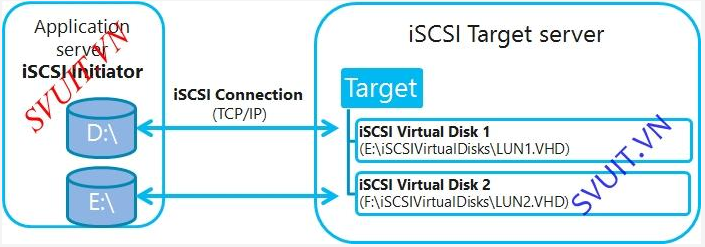

# Báo cáo tìm hiểu iSCSI - internet Small Computer System Interface

## Mục lục
- [1. SAN – Storage Area Network](#1)
- [2. iSCSI - internet Small Computer System Interface](#2)
- [3. Thực hiện lab cơ bản](#3)

<a name=1></a>
# 1. SAN – Storage Area Network

## 1.1 Tổng quan về SAN - Storage Area Network
- SAN là từ viết tắt của **Storage Are Network**
- Cung cấp tài nguyên lưu trữ **Block level access**.
- Việc quản lý file thực hiện ở trên client.
- Client sẽ truy cập đến tài nguyên mà nó được cung cấp. Client sẽ nhìn thấy tài nguyên này như một ổ đĩa cứng được cắm vào máy local.
- Client sẽ phải thực hiện định dạng "ổ đĩa này" trước khi sử dụng.

## 1.2 Các loại giao thức của SAN
- FC – Fibre Channel
- iSCSI – Internet Small Computer System Interface
- FCoE – Fibre Channel over Ethernet

<a name=2></a>
# 2. iSCSI - internet Small Computer System Interface
- iSCSI là từ viết tắt của internet Small Computer System Interface
- Là một giao thức chạy trên nền TCP/IP, cho phép kết nối tới Storage bằng đường Network (LAN/WAN).
- Được định nghĩa bởi IETF, giao thức cho phép truyền các lệnh SCSI trên đường Network.
- Mô hình hoạt động của iSCSI

  
  
<a name=3></a>
# 3. Thực hiện lab cơ bản
- Hệ thống lab gồm 1 server cung cấp tài nguyên lưu trữ và 1 client để sử dụng.
- Thực hiện lab trên Ubuntu server 14.04 64-bit.

## 3.1 Cài đặt trên server
- Trong iSCSI, server cung cấp tài nguyên gọi là **iSCSI target server**.
- Thiết lập địa chỉ IP, dùng vi chỉnh sửa file `/etc/network/interfaces`

  ```sh
  auto eth0
  iface eth0 inet static
  address 172.16.1.10
  netmask 255.255.255.0
  gateway 172.16.1.1
  dns-nameservers 8.8.8.8
  ```
  
- Cài đặt các gói

  ```sh
  apt-get install iscsitarget -y
  ```
  
- Enable iSCSI target trong file `vi /etc/default/iscsitarget`.

  ```sh
  ISCSITARGET_ENABLE=true
  ```
  
- Tạo `logical volume` để cấp tài nguyên cho client.

  ```sh
  lvcreate -L 9G -n lv-storage-iscsi vg-iscsi
  ```
  
  - Tạo 1 logical volume có tên là `lv-storage-iscsi` từ volume group `vg-iscsi`
  
- Cấu hình iSCSI target `vi /etc/iet/ietd.conf`

  ```sh
  Target iqn.2017-07.com.storage:storage.iscsi

  IncomingUser usernameX passwordX

  OutgoingUser

  Lun 0 Path=/dev/vg-iscsi/lv-storage-iscsi,Type=fileio

  Alias LUN1
  ```

  - `iqn.2017-07.com.storage:storage.iscsi`: tên server được đặt theo mẫu [iqn.yyyy-mm.<reversed domain name>[:identifier]]
  - usernameX và passwordX là thông tin cho client đăng nhập. Nếu cho phép người dùng sử dụng mà không cần đăng nhập có thể bỏ dòng này
  - `Path=/dev/vg-iscsi/lv-storage-iscsi` đường dẫn đến logical volume đã tạo ở trên.
  
- Có thể giới hạn truy cập bằng cách sửa trong file `/etc/iet/initiators.allow` như sau:

  ```sh
  iqn.2017-07.com.storage:storage.iscsi 172.16.1.0
  ```
  
  - chỉ cho phép các máy trong mạng 172.16.1.0 truy cập đến và sử dụng
  
- Restart iSCSI server

  ```sh
  service iscsitarget restart
  ```
  
## 3.2 Cài đặt trên client
- Client được gọi là `iSCSI initiator`
- Cài đặt các gói

  ```sh
  apt-get install open-iscsi -y
  ```
  
- Cấu hình `/etc/iscsi/iscsid.conf`. Sửa `node.startup = manual` thành `node.startup = automatic`
- Restart iSCSI initiator service

  ```sh
  service open-iscsi restart
  ```
  
- Tìm server target.

  ```sh
  iscsiadm -m discovery -t st -p 172.16.1.10
  ```
  
- Thiết lập xác thực sử dụng `CHAP`

  ```sh
  iscsiadm -m node --targetname "iqn.2017-07.com.storage:storage.iscsi" --portal "172.16.1.10" --op=update --name node.session.auth.authmethod --value=CHAP
  ```
  
- Xác thực tên đăng nhập

  ```sh
  iscsiadm -m node --targetname "iqn.2017-07.com.storage:storage.iscsi" --portal "172.16.1.10" --op=update --name node.session.auth.username --value=usernameX
  ```
  
- Xác thực password

  ```sh
  iscsiadm -m node --targetname "iqn.2017-07.com.storage:storage.iscsi" --portal "172.16.1.10" --op=update --name node.session.auth.password --value=passwordX
  ```
  
- Đăng nhập vào server target

  ```sh
  iscsiadm -m node --targetname "iqn.2017-07.com.storage:storage.iscsi" --portal "172.16.1.10:3260" --login
  ```
  
  - thấy có thông báo như sau là đã đăng nhập thành công.
  
  ```sh
  Login to [iface: default, target: iqn.2017-07.com.storage:storage.iscsi, portal: 172.16.1.10,3260] successful.
  ```
- Nếu muốn đăng xuất khỏi server target, dùng lệnh sau

  ```sh
  iscsiadm -m node --targetname "iqn.2017-07.com.storage:storage.iscsi" --portal "172.16.1.10:3260" --logout
  ```
  
- Sau khi đăng nhập thành công, sử dụng lệnh `lsblk` để kiểm tra trên hệ thống có những ổ đĩa nào.
- Chúng ta sẽ thấy xuất hiện một ổ đĩa mới. Thực hiện tạo phân vùng và định dạng và mount để sử dụng bình thường như một ổ đĩa được gắn trực tiếp lên máy.