## Cấu hình email cho osticket

## Cấu hình gmail cho phép truy cập tài khoản
- Ở trên cùng bên phải, hãy nhấp vào Cài đặt Cài đặt.
- Nhấp vào Cài đặt.
- Nhấp vào tab Chuyển tiếp và POP/IMAP.
- Trong mục "Truy cập qua IMAP", chọn Bật IMAP.
- Nhấp vào Lưu thay đổi.

	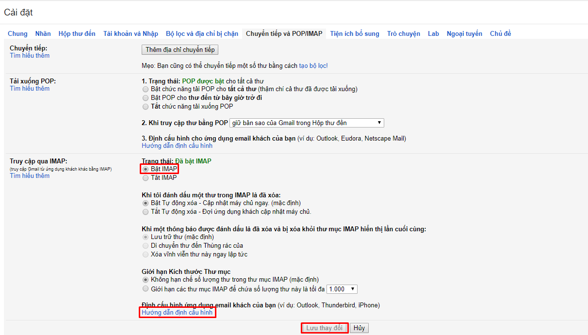
	
- sau đó click vào ` hướng dẫn cấu hình ` để xem các thông tin server imap.

	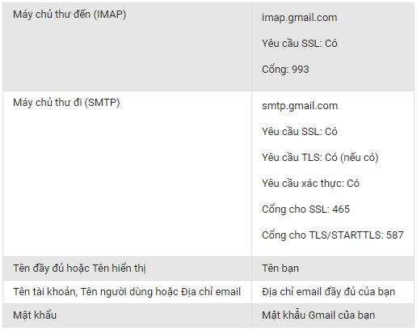
	
- Truy cập vào https://myaccount.google.com/security để tạo mật khẩu cho phép ứng dụng truy cập gmail

	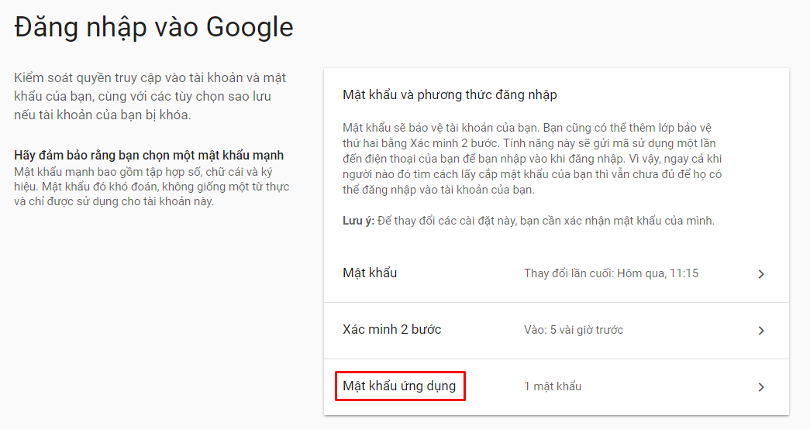
	
- Tạo mật khẩu cho osticket

	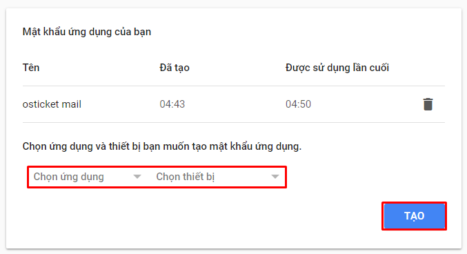
	
- Sau khi tạo mật khẩu, ta nhận được một mật khẩu. Copy mật khẩu này để cấu hình mail cho osticket

	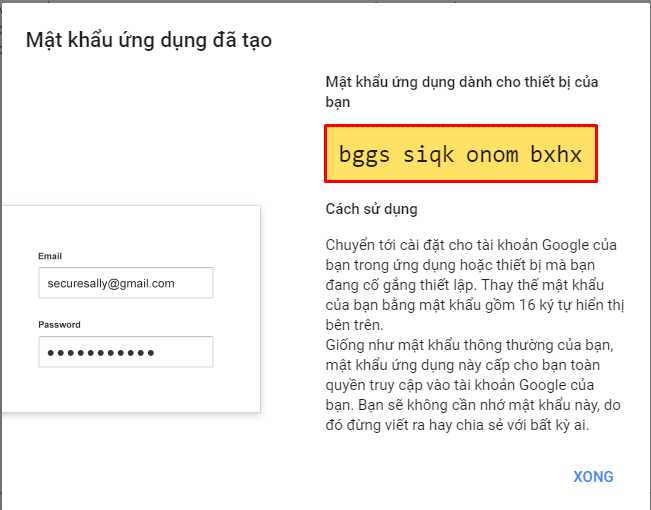 
	
## Cấu hình trên osticket
- Đăng nhập vào osticket với tài khoản quản trị
- Vào tab `Admin panel` => `Email`

	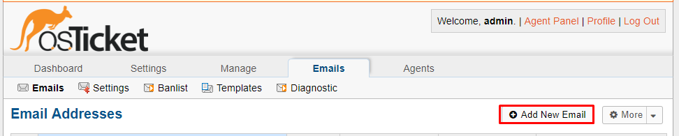
	
- Điền các thông tin vào form

	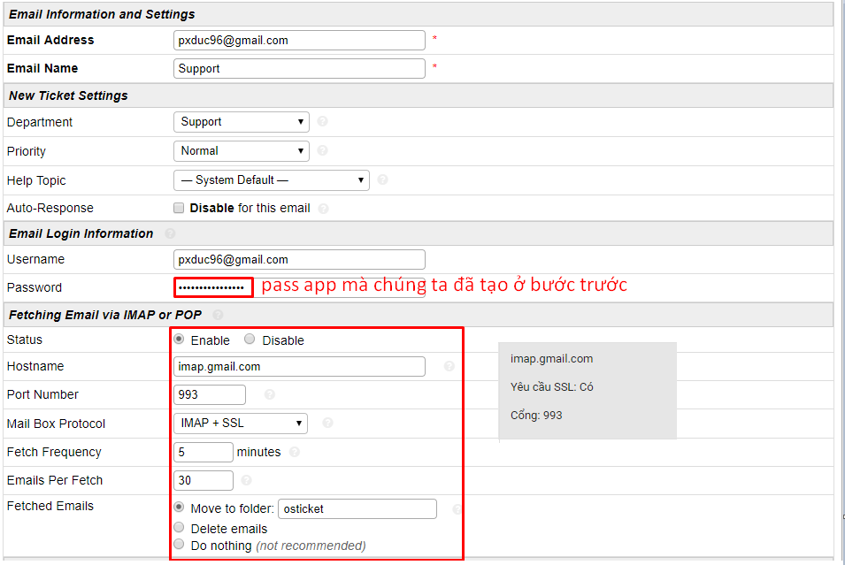
	
	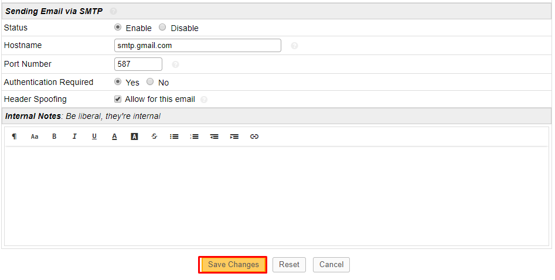
	
- Thiết lập email mặc định cho hệ thống

	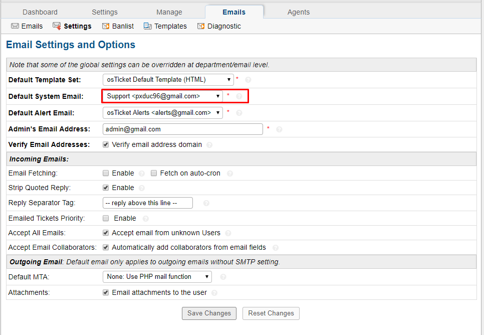
	
## Tạo ticket để kiểm tra email
- Tạo ticket mới
		
	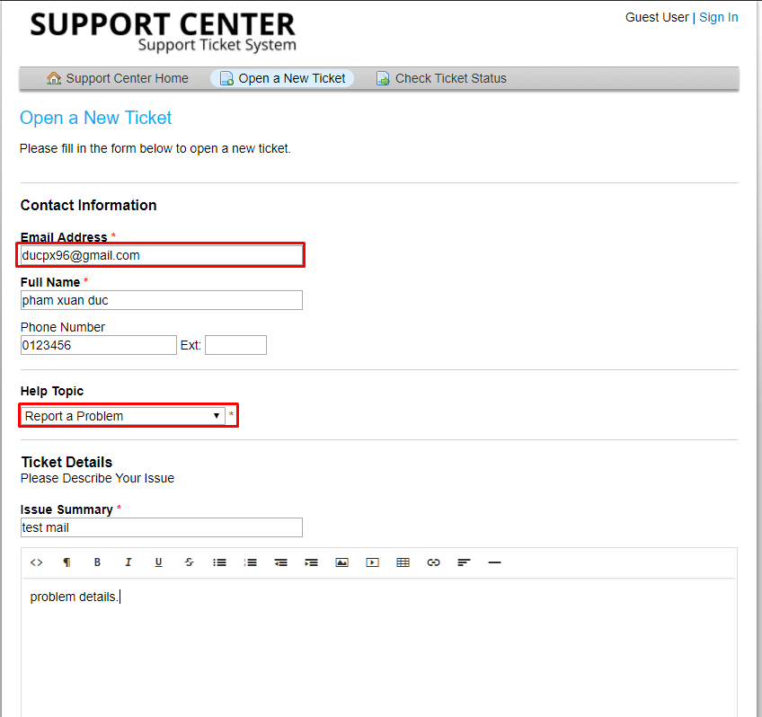
	
- Đăng nhập vào trang quản trị và reply ticket

	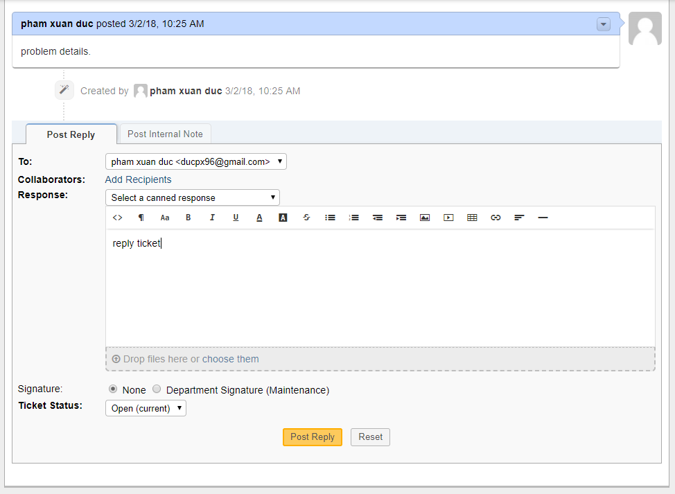
	
- Check mail

	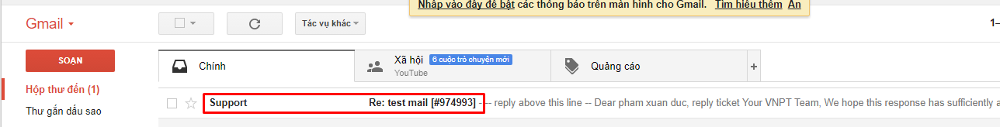
	
- Như vậy là việc cấu hình mail đã hoàn thành.