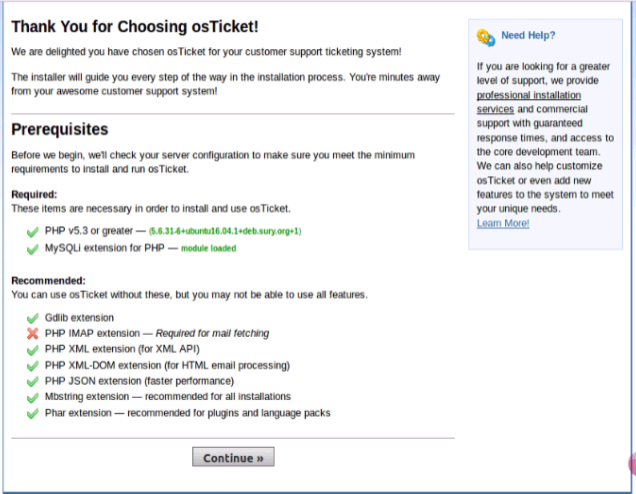
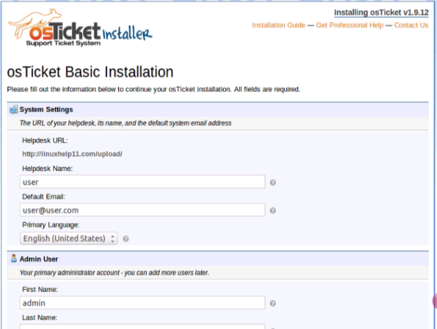

# Hướng dẫn cài đặt osTicket trên Ubuntu 16.04 64-bit
- Ở bài này mình hướng dẫn các bạn các bước cài đặt osTicket trên máy chủ Ubuntu 16.04
- Trước khi bắt đầu, máy chủ nên được cập nhật phiên bản mới nhất. Đăng nhập với user có quyền root.

```sh
sudo apt update -y
sudo apt dist-upgrade -y
```

## Thực hiện cài đặt
- 1. Cài đặt LAMP stack

```sh
apt install -y apache2 mysql-server php7.0-cli php7.0-mysql php7.0-cgi php7.0-fpm php7.0-gd php7.0-imap php7.0-xml php7.0-mbstring php7.0-intl php-apcu libapache2-mod-php7.0
```

- Trong quá trình cài đặt, hệ thống sẽ yêu cầu mật khẩu cho tài khoản root của mysql.

- Chuyển sang thư mục của HTML

```sh
cd /var/www/html/
```

- Tải gói cài đặt osTicket vào thư mục này.

```sh
wget http://osticket.com/sites/default/files/download/osTicket-v1.10.1.zip
```

- Giải nén file vừa tải về

```sh
unzip osTicket-v1.10.1.zip -d osticket
```

- Thay đổi ownership thư mục osticket vừa giải nén

```sh
chown -R www-data:www-data osticket/
```

- Copy file cấu hình mẫu

```sh
cp osticket/upload/include/ost-sampleconfig.php osticket/upload/include/ost-config.php
```

- Thay đổi quyền cho thư mục osticket

```sh
chmod -R 777 osticket/
```

- Cấu hình DocumentRoot

```sh
vi /etc/apache2/sites-enabled/000-default.conf
```

- Thay đổi giá trị DocumentRoot như sau

```sh
DocumentRoot /var/www/html/osticket/
```

- Restart apache 

```sh
service apache2 restart
```

- Mở trình duyệt truy cập vào đường dẫn `http://your_ip/`

	
	
- Click vào `Continue`

- Điền các thông tin sau đó click vào `install now`

	
	
	
- Đến đây thực hiện xong cài đặt

### Tham khảo
https://www.linuxhelp.com/how-to-install-osticket-on-ubuntu-16-04/