# Sử dụng osTicket cơ bản
- Đăng nhập vào giao diện Web bằng tài khoản admin
- Truy cập vào theo đường dẫn http://your_ip/upload/scp

	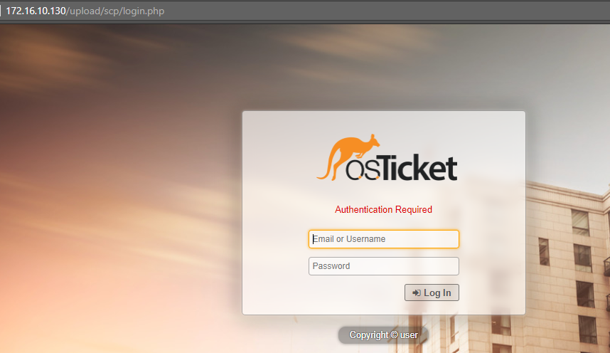
	
- Giao diện sau khi đăng nhập

	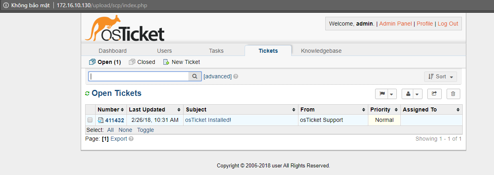
	
## 1. Quản lý các đầu mục hỗ trợ trong osTicket
- Sau khi đăng nhập với tài khoản admin, chọn `Admin Panel` => `Manage` để xem các đầu mục đang được hỗ trợ

	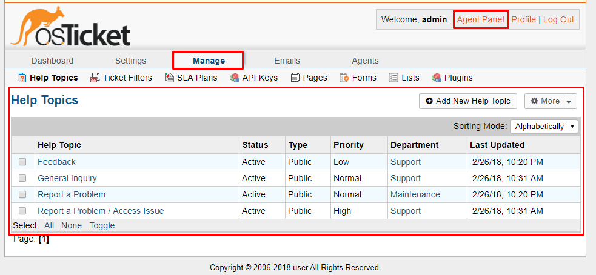
	
- Tại đây ta có thể thấy các đầu mục hỗ trợ, trạng thái của đầu mục, độ ưu tiên cũng như bộ phận đảm nhiệm.

### 1.1 Thêm đầu mục hỗ trợ mới
- Click vào `Add new help topic` để thêm đầu mục mới

	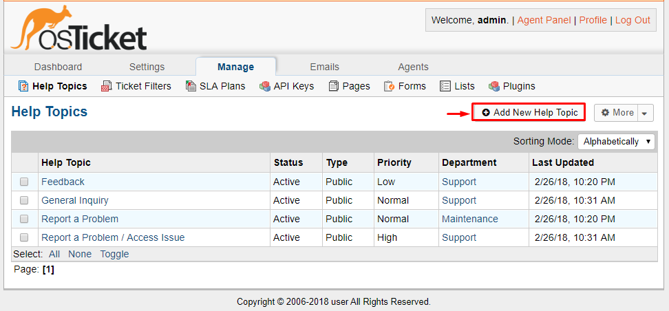
	
- Sau đó điền các thông tin theo form

	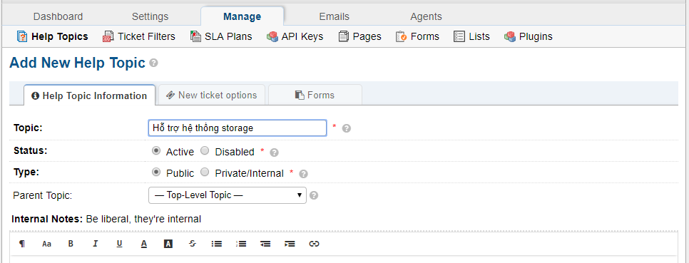
	
- Chọn team sẽ giải quyết các vấn đề liên quan đến đầu mục này. Ngoài các team có sẵn, bạn có thể thêm mới team khác. Sau đó click vào `add topic` để thêm.

	
	
### 1.2 Thêm team/group để hỗ trợ khách hàng
- Chọn `Agents`

	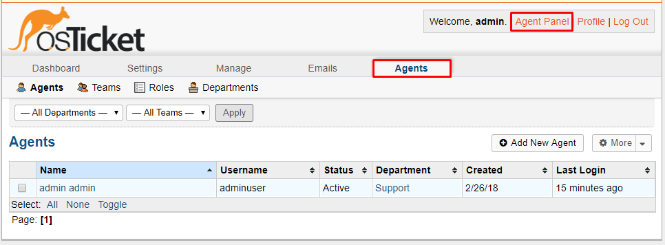
	
- Thêm team mới

	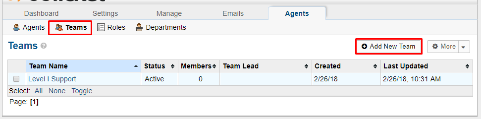
	
- Điền thông tin về team. click `Create team` để tạo mới

	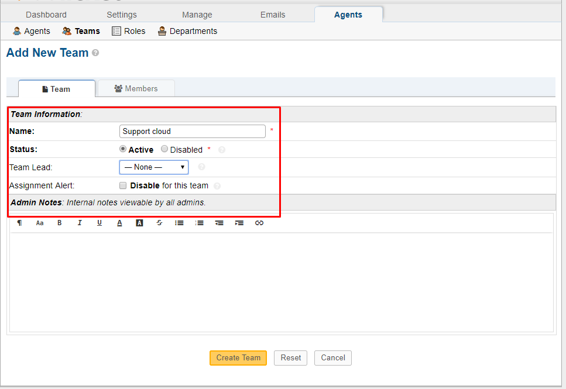
	
- Như vậy chúng ta đã tạo thêm một team mới để hỗ trợ khách hàng. Bước tiếp theo cần tạo các user và add họ vào từng team cụ thể

### 1.3 Thêm user mới
- Chọn tab `Agents`

	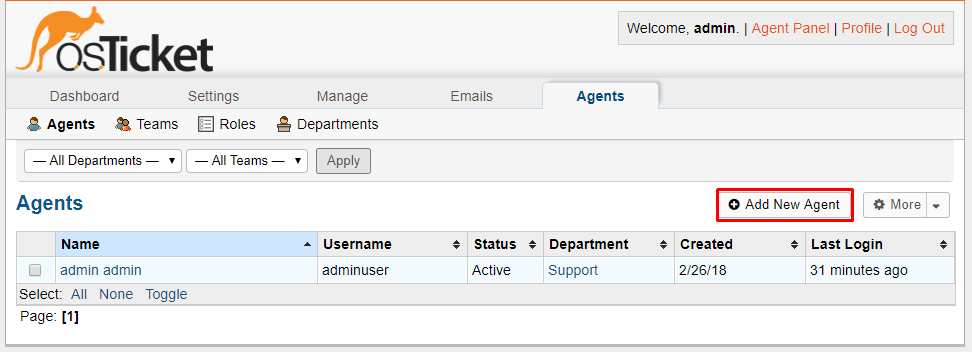
	
- Điền thông tin cho user

	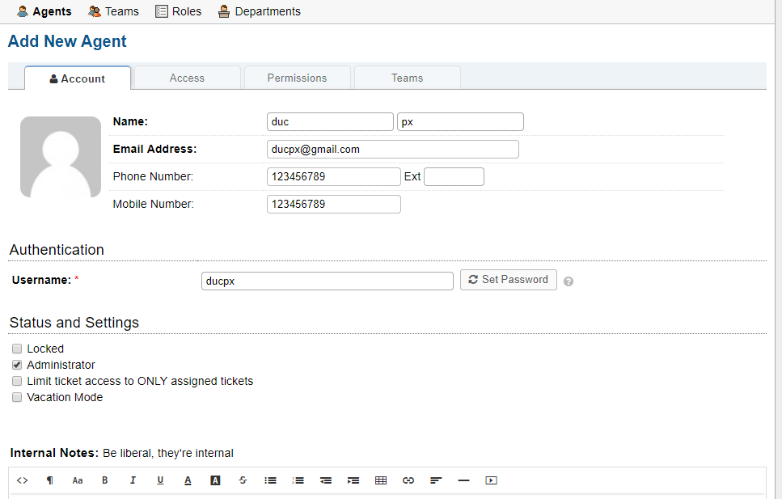

- set password cho user

	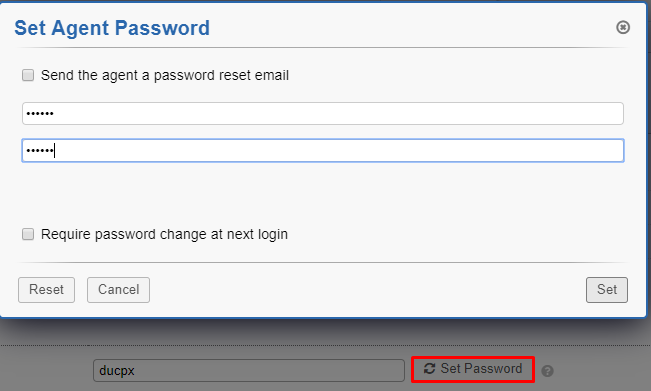

- Chọn phòng ban cho user

	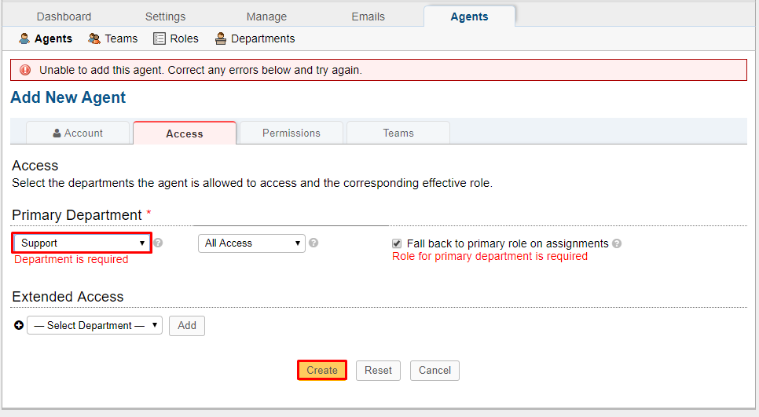
	
- Có thể thêm phòng ban ở tab `Department`

	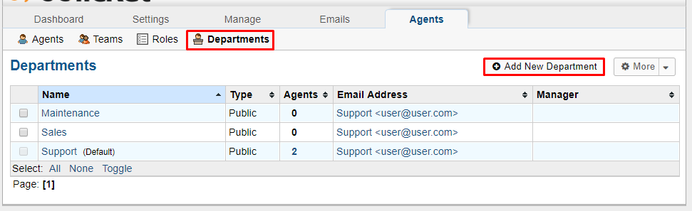
	
- Điền thông tin cho department

	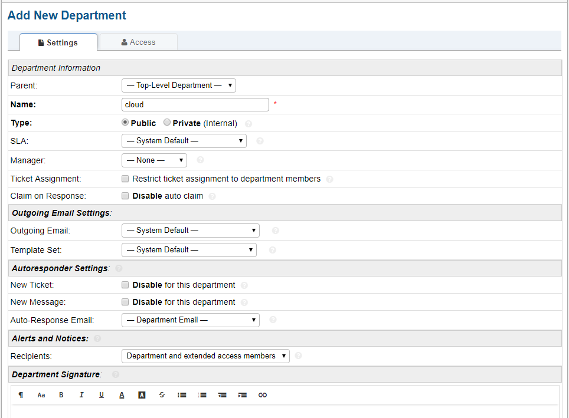

- Như vậy đã xong cấu hình cơ bản cho phần quản trị. Bài tiếp theo sẽ nói về cấu hình cho user
	