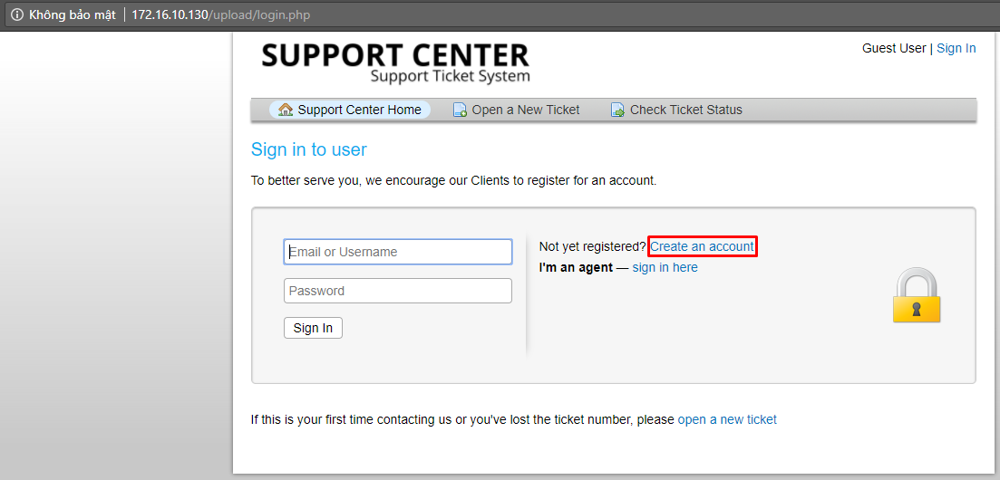
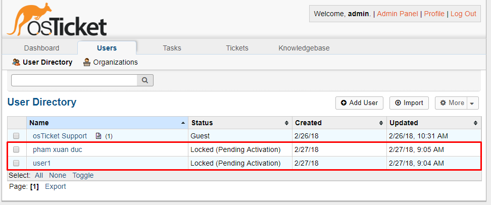
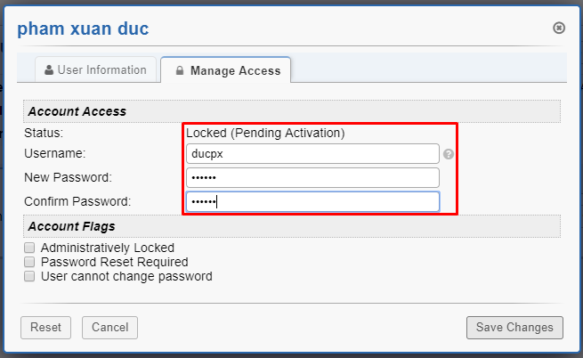
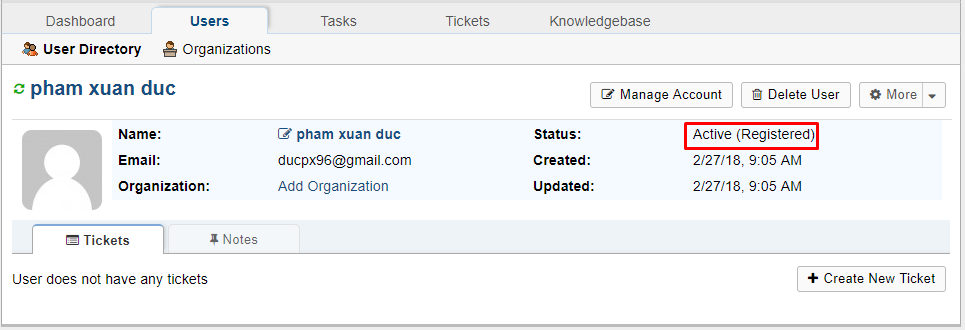
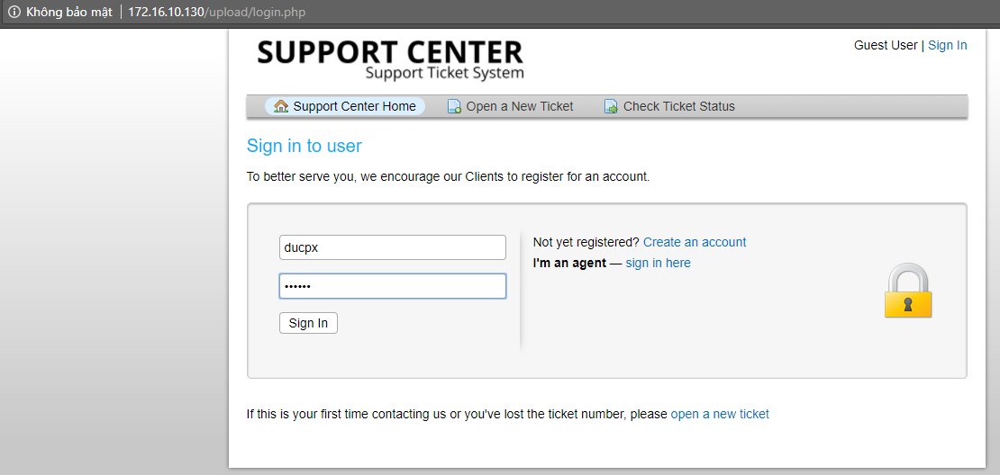
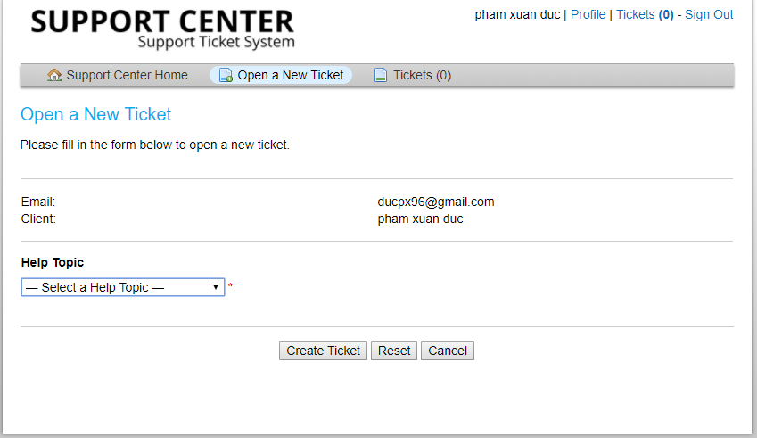
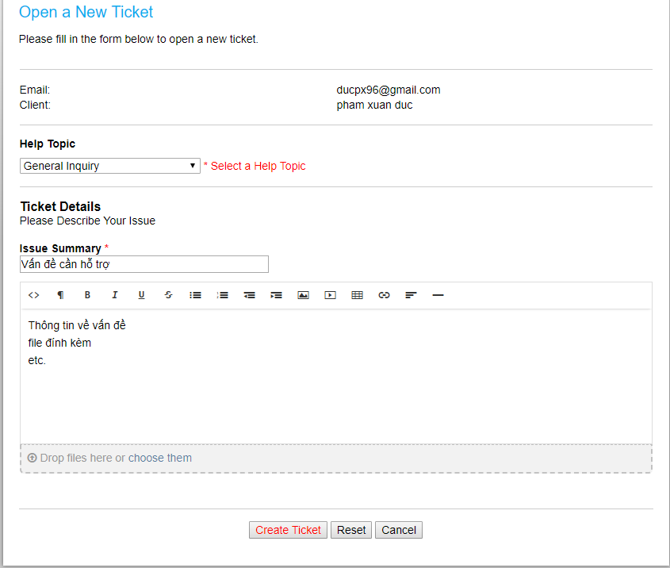
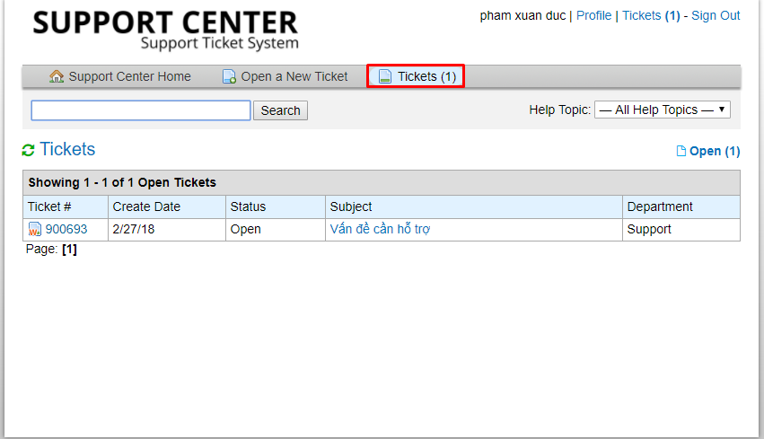
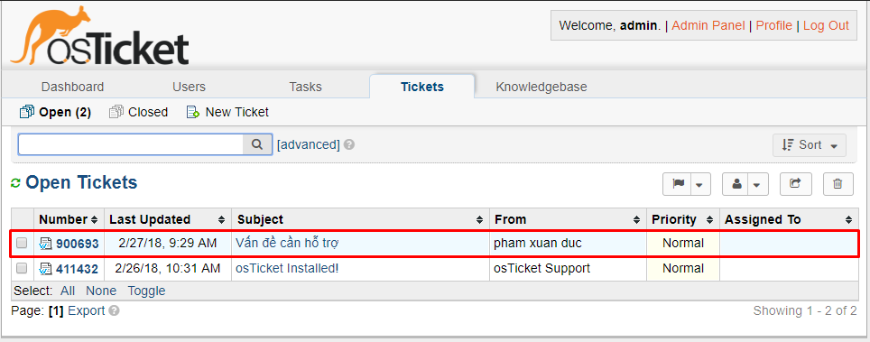
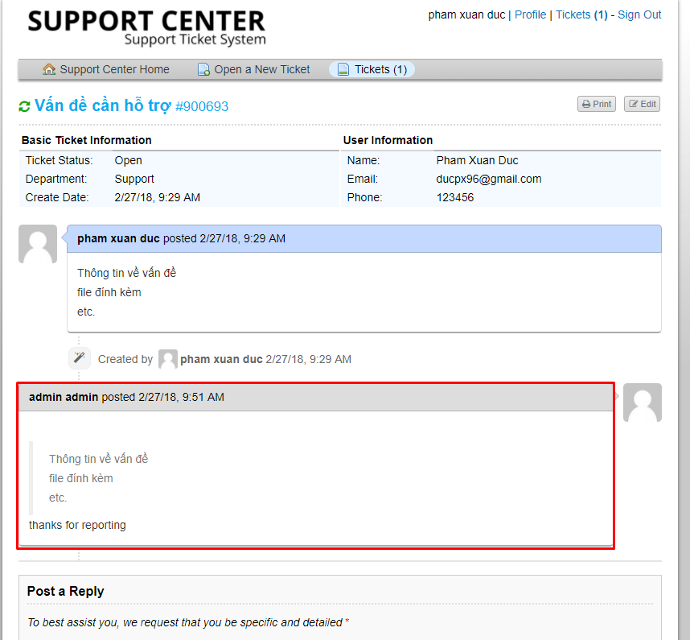

# Đăng ký user.

## Đăng ký tài khoản khách hàng
- Truy cập theo đường dẫn http://your_ip/upload, sau đó chọn `Sign In`

	
	
- Chọn `Create an account` để tạo tài khoản

- Điền thông tin và click `Register`

- Sau khi đăng ký, các tài khoản này phải được admin active mới có thể sử dụng dịch vụ. Đăng nhập hệ thống với tài khoản quản trị để active các tài khoản này.
- Vào tab `Users`, ta thấy danh sách các user đã đăng ký

	
	
- Click vào một account và chọn `Manage account`. Điền các thông tin theo form

	
	
- Chọn `Save changes`. status của user đã được active

	
	
- Sau khi tài khoản được active. Đăng nhập hệ thống với tài khoản này theo đường dẫn http://your_ip/upload/login.php

	
	
## Tạo mới ticket từ khách hàng
- Giao diện sau khi đăng nhập thành công

	
	
- Tạo ticket mới

	
	
- Xem danh sách các ticket đã tạo

	
	
- Id của ticket là `900639`

- Kiểm tra từ quản trị

	
	
- Rep lại ticket này và check kết quả trả về ở bên khách hàng

	
	
- Như vậy đã sử dụng cơ bản osTicket.