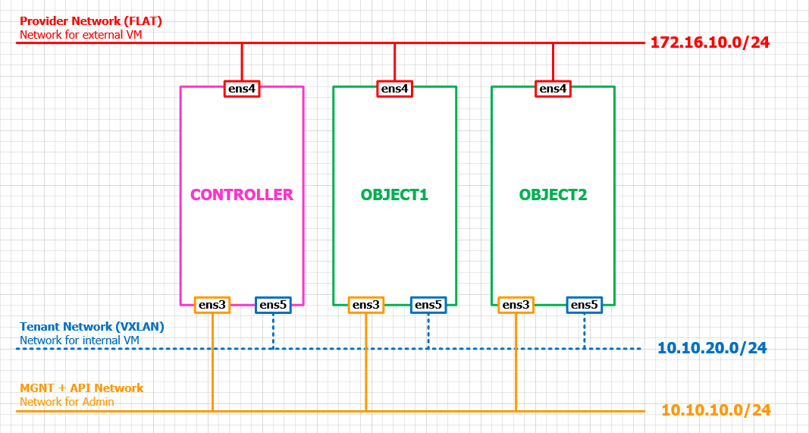

# Hướng dẫn sử dụng Scripts để cài đặt Swift với keystone trên Ubuntu server 16.04 64-bit

# Mô hình cài đặt

  

# Yêu cầu phần cứng
- Các node cần có 3 card mạng với thứ tự như trên
- 2 nodes object cần có 3 ổ cứng: ổ `sda` dùng để cài os và 2 ổ `sdb` và `sdc` dùng để lưu trữ object.

## Lưu ý:
- Hướng dẫn này được thực hiện trên môi trường VMware Workstation.
- Các card được hiện thị theo thứ thự tự là `ens33`, `ens38` và `ens39`.
- Các ổ đĩa sẽ là dạng **sda, sdb,...**.
- Đăng nhập vào hệ thống với quyền root

## Thực hiện chạy script
- Cài đặt git và tải script. Thực hiện tất cả các nodes

  ```sh
  su -
  apt update
  apt -y install git

  git clone https://github.com/pxduc96/Script-install-swift-keystone.git
  mv /root/Script-install-swift-keystone/scripts/ /root/
  rm -rf /root/Script-install-swift-keystone/
  cd scripts/
  chmod +x *.sh
  ```

## Cài đặt trên node **Controller**
## I. Cài đặt môi trường
## 1. Thiết lập địa chỉ IP và repo của openstack PIKE
- Sửa các địa chỉ IP ở trong file `variable.cfg` với địa chỉ IP mà bạn muốn sử dụng

  ```sh
  bash ctl_1_environment.sh
  ```

## 2. Cài NTP, RabbitMQ, memcached, SQL

  ```sh
  bash ctl_2_environment.sh
  ```

## II. Cài keystone

  ```sh
  bash ctl_3_keystone.sh
  ```

## III. Cài Swift

  ```sh
  bash ctl_4_swift.sh
  ```

## Cài đặt trên nodes object
## I. Cài môi trường
## 1. Cài đặt địa chỉ IP và repo của openstack PIKE
- Sau khi tải scripts về, thực hiện các bước sau để cài đặt các thành phần của swift trên 2 node object
  - Trên node object1

  ```sh
  bash ob1_1_environment.sh
  ```

  - Trên node object2

  ```sh
  bash ob2_1_environment.sh
  ```

## 2. Cài NTP
- Thực hiện trên cả 2 nodes object

  ```sh
  bash ob_2_environment.sh
  ```

## II. Cài đặt swift trên object nodes
- Trên object1

  ```sh
  bash ob1_3_swift.sh
  ```

- Trên object2

  ```sh
  bash ob2_3_swift.sh
  ```

 ## Tạo ring.
 - Thực hiện trên node controller

  ```sh
  bash ctl_5_ring.sh
  ```

## Hoàn thành cài đặt
- Thực hiện trên controller

  ```sh
  bash ctl_6_finally.sh
  ```

- Thực hiện trên 2 node object

  ```sh
  bash ob_finally.sh
  ```

## Kiểm tra lại bước cài đặt
- Thực hiện trên node controller

  ```sh
  bash test.sh
  ```