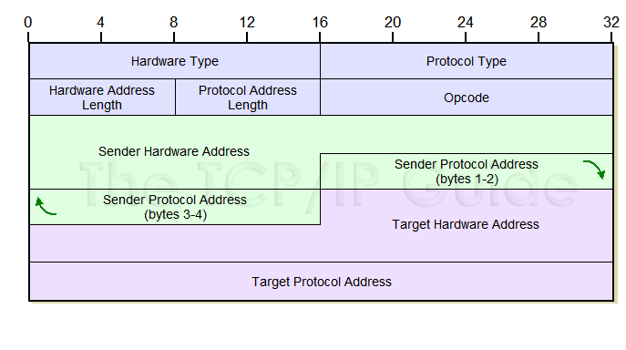
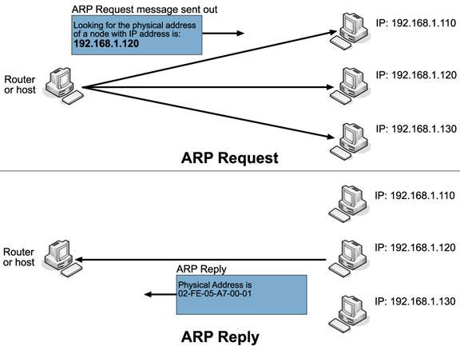

# Báo cáo: Tìm hiểu và phân tích về giao thức ARP.

> ARP: Address Resolution Protocol

## 1. Mở đầu
        Các thiết bị máy tính ngày nay có 2 loại địa chỉ đó là:
- Địa chỉ vật lý (MAC - Media Address Control):
    > Là địa chỉ được gắn liền với máy từ khi xuất xưởng.
    > Thực tế, các NIC (Network Interface Card) chỉ có thế liên lạc với nhau bằng địa chỉ này.

- Địa chỉ logic (IP Address):
	> Loại địa chỉ này mang tính chất tương đối, có thể thay đổi theo người sử dụng.
	> Gồm 2 phần:
	- Phần địa chỉ Network
	- Phần địa chỉ Host

- Các máy muốn liên lạc với nhau trong môi trường mạng cần phải có một cơ chế để giúp các thiết bị liên lạc giữa 2 địa chỉ IP và MAC.
	> `ARP` ra đời nhằm phục vụ cho điều trên.

## 2. Nội dung

- ### 2.1 Cấu trúc của gói tin sử dụng ARP
	

    Ý nghĩa của các gói tin trong header gói tin ARP là:
    - Hardware Type
        + Xác định bộ giao tiếp phần cứng máy gửi cần biết.
	    + Có giá trị là 1 với đường truyền Ethernet.
	    + Nằm trong 16 bit đầu tiên của gói tin
    - Protocol Type
    	+ Chiếm 16 bit của gói tin.
        + Xác định kiểu giao thức máy gửi cung cấp.
        + Có giá trị là 080016 cho giao thức IP
    - HLEN (`Hardware Address Length`)
    	+ Độ dài địa chỉ vật lý tính theo bit.
    - PLEN (`Protocol Address Length`)
    	+ Độ dài địa chỉ logic tính theo bit.
    		- Giá trị là 1: cho biết đây là một gói tin ARP request.
    		- Giá trị là 2: cho biết đây là một goi tin ARP reply.
    		- Giá trị là 3: cho biết đây là một gói tin RARP request.
    		- Giá trị là 4: cho biết đây là một gói tin RARP reply.
    - Sender Hardware Address
    	+ Chứa địa chỉ MAC của máy gửi.
    - Sender Protocol Address
    	+ Chứa địa chỉ IP của máy nhận.
	- Target Hardware Address
		+ Chứa địa chỉ MAC của máy nhận.
	- Target Hardware Address
		+ Chứ địa chỉ IP cuar máy nhận.

- ### 2.2 Cơ chế hoạt động của ARP

	

	Hình ảnh phía trên, chính là hình ảnh mô phỏng cách hoạt động của ARP.
	Nhìn vào hình ảnh ta thấy được rằng:

	1. Quá trình đầu tiên, Router (Host) sẽ kiểm tra cache của mình. Nếu địa chỉ của Host đích đã có trong đó. Thì ngay lập tức gói tin sẽ được gửi tới đích.
	Vậy trong trường hợp ngược lại thì sao???

	2. Router (Host) sẽ gửi một gói tin `ARP Request` quảng bá tới tất cả các máy trong hệ thống mạng với nội dung gói tin có chứa địa chỉ của nó cùng với địa chỉ máy nhận.

	3. Sau khi tất cả các thiết bị mạng nhận được gói tin, chúng sẽ kiểm tra trường địa chỉ `Target Protocol Address`. Nếu trùng với địa chỉ của chúng thì gói tin sẽ được tiếp tục xử lý. Còn không gói tin đó sẽ bị hủy.

	4. Giả sử thiết bị B có IP: 192.168.1.20 có IP trùng với IP đích trong gói tin. Thì nó sẽ khởi tạo quá trình 1 gói tin là `ARP Reply` bằng cách đảo ngược lại vị trí thứ tự các gói tin. Nghĩa là:
		Đưa Sender Hardware Address và Sender Protocol Address lần lượt thành Target Hardware Address và Target Protocol Address và ngược lại.

	5. Sau đó thiết bị B cập nhật địa chỉ IP và MAC của thiết bị gửi gói tin nguồn vào bảng ARP cache để rút ngắn thời gian xử lý cho các lần sau.

	6. Thiết bị B bắt đầu gửi ngược trở lại gói tin `ARP Reply`.

	7. Thiết bị Router (Host) sau khi nhận được gói tin sẽ xử lý và lưu thông tin ở trường Sender Hardware Address, Sender Protocol Hardware vào bảng ARP Cache.

	8. Router (Host) bắt đầu thực hiện quá trình gửi các gói tin đến thẳng đích và không cần gửi các gói tin request.

- ### 3. Mở rộng
	Ngoài ARP ta còn có giao thức RARP