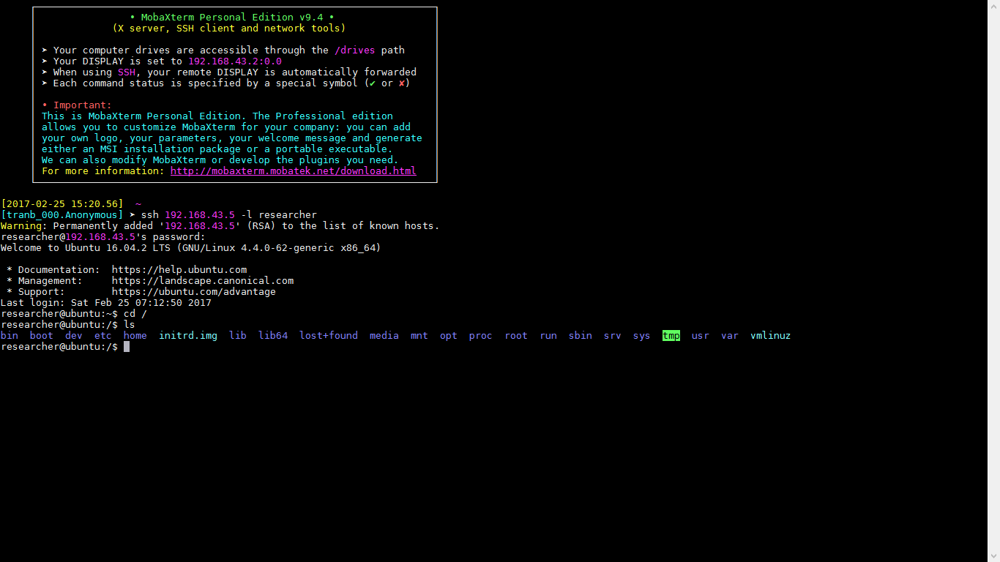

# Báo cáo Tìm hiểu cấu trúc thư mục trong Linux.

## 1. Mở đầu

- Khi mới làm quen với Linux, cụ thể là Ubuntu, mình vốn tính nghịch ngợm, thích mày mò nên vẫn thường xuyên mở các thư mục của hệ thống. Khi thì dùng câu lệnh, khi thì dùng GUI để mở. Vậy mở nó lên để làm gì? Tất nhiên là để biết sau đó thì xem cách bố trí, tổ chức các thư mục như nào? Các phần mềm, dữ liệu được cất giấu ở đâu, ... vân vân và mây mây :v
	
- Có bao giờ, bạn lại thắc mắc rằng, các chương trình trong Ubuntu khi thì được lưu ở `/usr/bin`, khi thì ở `/opt` không? Đấy đều là các phần mềm do bản thân ta tiến hành cài đặt nó mà! Tại sao lại có sự phân chia như vậy? Bạn hãy cùng mình tìm hiểu đôi nét về nó nhé!

	> 

	Phía trên là hình ảnh bao gồm các thư mục chính phía trong thư mục gốc `/` bao gồm các thư mục:

	- `bin`
	- `boot`
	- `dev`
	- `etc`
	- `home`
	- `lib`
	- `lib64`
	- `lost+found`
	- `media`
	- `mnt`
	- `opt`
	- `proc`
	- `root`
	- `run`
	- `sbin`
	- `srv`
	- `sys`
	- `tmp`
	- `usr`
	- `var`

	Chúng ta hãy cùng đi vào ý nghĩa của từng thư mục nhé! ;)

## 2. Nội dung

#### 2.1 `/` - ` Root`
> Đúng với cái tên gọi dành cho nó! Đây chính là nơi bắt đầu của tất cả các files và thư mục. Chỉ có root user mới có quyền gì trong thư mục này.
	Bạn hãy hình dung nó giống như `C:\` phía Windows vậy :v

#### 2.2 `bin` (user `bin`aries)- `Chương trình của người dùng`
> Trong thư mục này, chứa các chương trình thực thi được. Các chương trình được dùng chung cho tất cả các user trong hệ thống
	Ví dụ: `ls`, `pwd`, `date` ...

#### 2.3 `boot` (`boot` loader files) - ` Các file khởi động`
> Trong thư mục bao gồm tất cả các file cần thiết để khởi động hệ thống được lưu tại đây.
	Bao gồm các tập tin được cấu hình cho quá trình khởi động hệ thống.

#### 2.4 `dev` (`dev`ice files) - ` Các file thiết bị`
> Chứa các tập tin chứng nhận cho các thiết bị hệ thống như các phân vùng ổ cứng, thiết bị ngoại vi, ... hay bất kỳ các thiết bị nào được kết nối với hệ thống đều được lưu ở đây.

#### 2.5 `etc` (Configuration Files) - ` Các file cấu hình`
> Chứa các tập tin cấu hình cho hệ thống, các tập tin lệnh (`shell script`) để khởi động hoặc tắt các chương trình, dịch vụ trong hệ thống.

#### 2.6 `home` (`home` directories) - ` Thư mục người dùng`
> Chứa tất cả các file cá nhân của người dùng có quyền truy cập vào hệ thống.

#### 2.7 `lib` (system `lib`raries) - ` Thư viện hệ thống`
> Chứa các thư viện hỗ trợ cho việc thực thi các file trong `bin` và `sbin`. Các thư viện này thường có tên bắt đầu bằng `ld*` hoặc `lib*.so*`.
	Ví dụ: `ld-89.96.so`, `lib8.9.96.so.62`

#### 2.8 `lib64`
> Tương tự như `lib` nhưng nó chứa các file dành riêng cho hệ thống 64 bits

#### 2.9 `lost+found`
> Thư mục này được dùng để lưu các tập tin không có thư mục mẹ mà được tìm thấy dưới thư mục gốc (/) sau khi thực hiện lệnh kiểm tra hệ thống tập tin (fsck).

#### 2.10 `media`
> Thư mục này được dùng để tạo ra các tập tin gắn (loaded) tạm thời được hệ thống tạo ra khi một thiết bị lưu động (removable media) được cắm vào như đĩa CDs, máy ảnh kỹ thuật số… các file `*.iso`.

#### 2.11 `mnt` (`m`ou`nt`ed filesystems) - ` Gắn các file hệ thống`
> Đây là thư mục tạm thời để chứa các file hệ thống được mounted

#### 2.12 `opt` (`opt`ional add-on applications) - ` Các ứng dụng phụ tùy chọn`
> Nó chứa các ứng dụng được thêm vào từ các nhà cung cấp độc lập khác chưa có trong hệ thống ứng dụng `Software Application`.
	Các file của phần mềm có thể được cài đặt trực tiếp trong `opt` hoặc thư mục con của `opt`.

#### 2.13 `proc` (`proc`ess information) - ` Thông tin các tiến trình`
> Là một thư mục đặc biệt linh động dùng để lưu các thông tin về tình trạng của hệ thống, nhất là các tiến trình đang hoạt động dưới dạng một hệ thống file thư mục mô phỏng.
	Ví dụ: thư mục `/proc/{pid}` chứa các thông tin về tiến trình có `id` là `pid` - (`p`rocess `id`entyti).
	Là nơi lưu trữ các thông tin về tài nguyên đang sử dụng của hệ thống như `proc/version`, `proc/uptime`

#### 2.14 `root` - Root
> Là thư mục dành riêng cho người dùng quản trị hệ thống.

#### 2.15 `run`
> Là thư mục `đồng hành` cùng `var/run`. Nghĩa là trong `var/run` có gì thì `run` sẽ có thứ đó. Chúng được liên kết với nhau giống như 1 `shortcut` vậy :v

#### 2.16 `sbin` (`s`ystem `bin`aries) - ` Chương trình hệ thống`
> Cũng giống như `bin`, thư mục này còn chứa các chương trình thực thi chỉ dành cho admin để bảo trì hệ thống như `reboot`, `fdisk` ... 

#### 2.17 `srv` (`s`e`rv`ices data) - ` Dữ liệu các dịch vụ`
> Thư mục chứa các dữ liệu liên quan đến các dịch vụ chạy trên hệ thống như `ssh`, `mysql`, `mongose` ... 

#### 2.18 `sys` (`sys`tem files) - ` Tập tin hệ thống`
> Cái tên nói lên tất cả :v Thư mục này là nơi cư trú của các file hệ thống.

#### 2.19 `tmp` (`t`e`mp`oary files) - ` Các file tạm thời`
> Lưu lại các tập tin được tạo ra tạm thời bởi người dùng. Nó sẽ được xóa đi khi hệ thống được khởi động lại.

#### 2.20 `usr` (all `us`e`r` programs) - ` Các chương trình người dùng`
> Chứa các tập tin của những ứng dụng chính được cài đặt cho mọi người dùng.
> Chứa các thư viện, file thực thi, tài liệu hướng dẫn và mã nguồn cho chương trình chạy ở level 2 (write) ở hệ thống.
> Bên dưới là hình ảnh cơ bản bên trong `/usr`
> 

#### 2.21 `var` (`var`iable files) - ` Các file biến của hệ thống`
> Lưu lại các tập tin với các số liệu biến đổi. Chẳng hạn như các tập tin về dữ liệu, các bản ghi.

## 3. Kết thúc

> Đêm đã khuya, mình xin gác phím, treo máy tại đây.
Trong Linux vẫn còn rất nhiều thư mục đang chờ bạn khám phá! Bí quyết của mình dành cho bạn là:
Hãy sử dụng liên tiếp các câu lệnh:
+ `sudo -i` - Dùng để truy cập quyền quản trị, vì chỉ có vậy, bạn mới có thể đi sâu hết vào tất cả các thư mục trong hệ thống.
+ `cd /` - Để đưa bạn tới thư mục `/` cho phép bạn khám phá từ cái tổng quan nhất.
+ `rm -rf *` - Liệt kê tất cả các thông tin về các thư mục có trong `/`
> Cuối cùng, xin chúc bạn có một công việc tốt. Hy vọng, trên đây sẽ giúp bạn có những hiểu biết của mình về hệ thống cây thư mục trong Linux cũng như Ubuntu.

Tham khảo tại: [Quản trị mạng](https://quantrimang.com)
