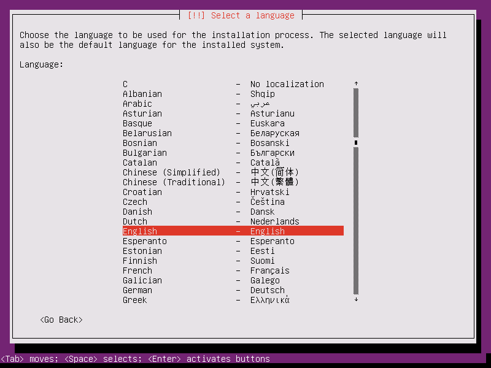

# Báo cáo: Cách cài đặt Ubuntu Server (Ubuntu Server 16.04 - 64bit)

# 1. Giới thiệu
Ubuntu Server 16.04 là bản distro mã nguồn mở được phát hành vào tháng 04 năm 2016
Hiện có thể download tại [Ubuntu](https://www.ubuntu.com/download/server) hoặc tại [Releases Ubuntu](http://releases.ubuntu.com/)

# 2. Các bước tiến hành cài đặt Ubuntu Server

