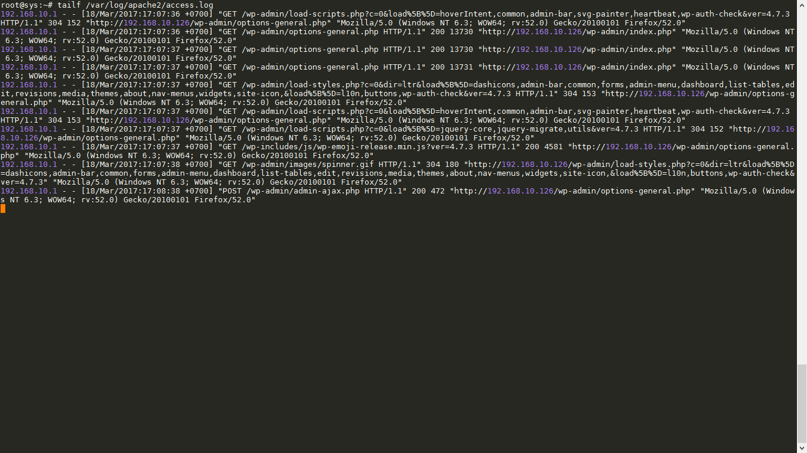
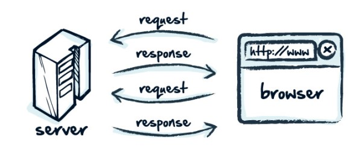
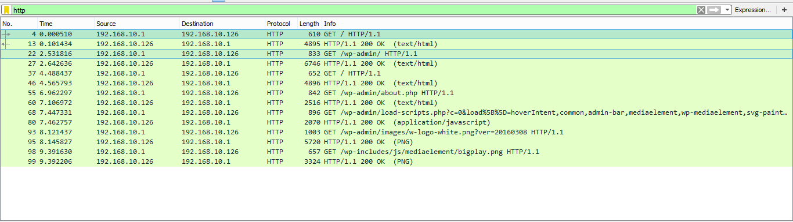
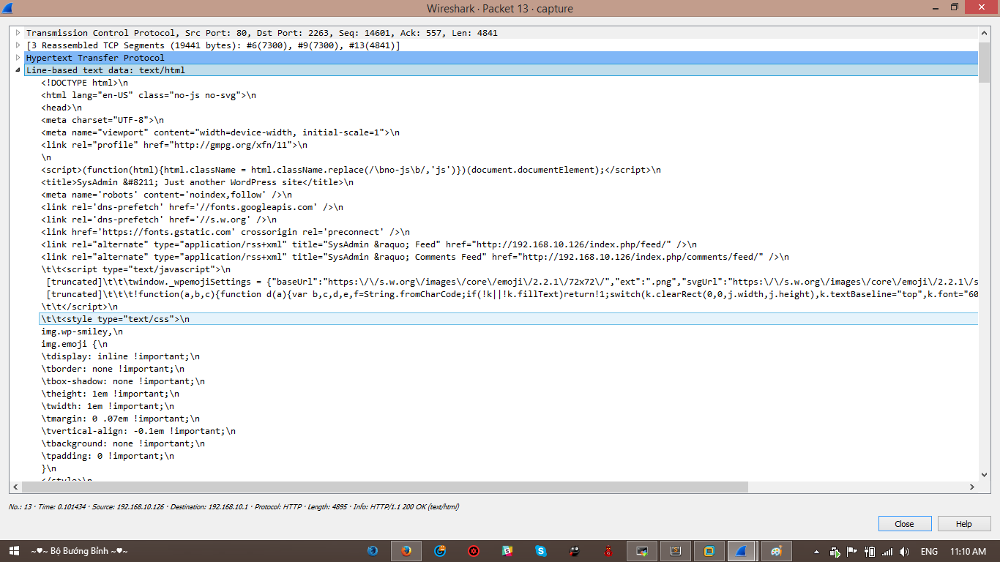
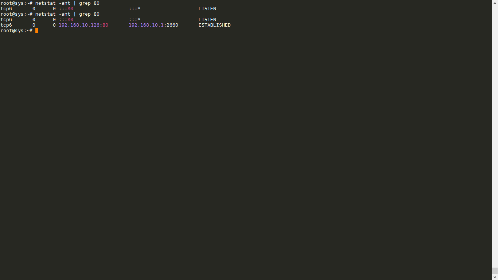

# Báo cáo tìm hiểu HTTP và dựng web server (Apache)

## Mục lục
- 1 Apache
	- 1.1 [Apache là gì?](#apache)
	- 1.2 [Cài đặt và cấu hình Apache](#setupApache)
	- 1.3 [Đọc file log Apache, log HTTP](#readlog)
- 2 HTTP
	- 2.1 [HTTP là gì?](#http)
	- 2.2 [Tóm lược các HTTP Status Messages](#httpCode)
	- 2.3 [Phân tích gói tin HTTP](#httpAla)
	- 2.4 [Kiểm tra HTTP có đang hoạt động không bằng cầu lệnh netstat](#test)

## 1. Apache
### 1.1 Apache là gì?

- Apache là một phần mềm mã nguồn mở miễn phí được cài đặt trên các máy chủ web server (phần cứng) để xử lý các yêu cầu gửi tới máy chủ dưới giao thức HTTP.

### 1.2 Cài đặt và cấu hình Apache

- Để cài đặt apache trên ubuntu server ta dùng câu lệnh:
	> `sudo apt-get install apache2 -y`
- Cấu hình Apache
(Mọi cấu hình về apache đều được lưu trữ trong cây thư mục /etc/apache2)

- Cấu hình server http response header
	> `vi /etc/apache2/conf-enabled/security.conf`

	Tại dòng thứ 26 của file trên bạn thấy `ServerTokens OS` hãy đổi `OS` thành `Prod` để gửi đến server ít thông tin nhất.
	> `ServerTokens Prod`

- Cấu hình thứ tự ưu tiên hiển thị file index
	> `vi /etc/apache2/mods-enabled/dir.conf`

	Tại dòng thứ 2 thêm `index.php` vào sau `DirectoryIndex`:
	> `DirectoryIndex index.php index.html index.cgi index.pl index.php index.xhtml index.htm`

- Chuyển đường dẫn root document
	vi `/etc/apache2/sites-enabled/000-default.conf`

	Tại dòng thứ 12 hãy đổi `/var/www/html` thành đường dẫn chứa nội dung website của bạn. Ví dụ:
	> `DocumentRoot /var/www/wordpress`

### 1.3 Đọc file log Apache

- Trong ubuntu các file log của hệ thống được lưu trong cây thư mục `var/log`. Để đọc được các file log của Apache, bạn có thể đọc như sau:
    > `tailf /var/log/apache2/access.log`
	
	Nội dung file log sẽ được nhìn thấy tương tự như sau:
	
## 2. HTTP
### 2.1 HTTP là gì?

- HTTP là chữ viết tắt của HyperText Transfer Protocol (giao thức truyền tải siêu văn bản). Đây là một giao thức ứng dụng trong bộ các giao thức TCP/IP (gồm một nhóm các giao thức nền tảng cho internet).
	> 
- HTTP hoạt động dựa trên mô hình Client – Server. Trong mô hình này, các máy tính của người dùng sẽ đóng vai trò làm máy khách (Client). Sau một thao tác nào đó của người dùng, các máy khách sẽ gửi yêu cầu đến máy chủ (Server) và chờ đợi câu trả lời từ những máy chủ này. Để có thể nói chuyện được với nhau, các máy chủ và máy khách phải thực hiện việc trao đổi thông qua các giao thức. Một trong những giao thức được sử dụng thường xuyên nhất chính là HTTP.

### 2.2 Tóm lược các HTTP Status Messages

- Các HTTP Status Messages hay còn được biết đển là các http code có 5 loại chính và ý nghĩa các mã cơ bản đó là:
	+ 1xx: Thông tin (yêu cầu (request) đã được nhận, tiếp tục tiến trình xử lí)
		- `100 Continue`: Server đã nhận được yêu cầu header
		- `101 Switching Protocols`
		- `103 Checkpoint`
	+ 2xx: Thành công
		- `200 OK`: yêu cầu gửi lên server đã được tiếp nhận thành công
		- `201 Created`
		- `202 Accepted`
		- `203 Non-Authoritative Information`
		- `204 No Content`
		- `205 Reset Content`
		- `206 Partial Content`
	+ 3xx: Điều hướng
		- `300 Multiple Choices`
		- `301 Moved Permanently`: Trang web yêu cầu đã được chuyển đến một địa chỉ URL mới
		- `302 Found` : Trang web yêu cầu đã được chuyển tạm thời đến một địa chỉ URL mới
		- `303 See Other`
		- `304 Not Modified`
		- `306 Switch Proxy`
		- `307 Temporary Redirect`
		- `308 Resume Incomplete`
	+ 4xx: Lỗi Client
		- `400 Bad Request`: Lỗi cú pháp, yêu cầu không thể thực hiện được
		- `401 Unauthorized`
		- `402 Payment Required`
		- `403 Forbidden`: Không được phép truy cập vào đây
		- `404 Not Found`: Không tìm thấy trang địa chỉ với URL hiện tại
	+ 5xx: Lỗi Server
		- `500 Internal Server Error`: Một thông báo lỗi chung, được đưa ra khi không có thông báo cụ thể nào khác phù hợp
		- `501 Not Implemented`: Máy chủ hoặc không nhận ra phương thức yêu cầu, hoặc nó không có khả năng thực hiện yêu cầu
		- `502 Bad Gateway`: Máy chủ đã hoạt động như một cổng hoặc proxy và nhận được phản hồi không hợp lệ từ máy chủ
		- `503 Service Unavailable`: Máy chủ hiện không có (quá tải)
		- `504 Gateway Timeout`: Máy chủ hoạt động như một gateway hoặc proxy và không nhận được phản hồi kịp thời từ máy chủ phía trên
- Ngoài ra, còn có nhiều mã trạng thái http khác. Bạn có thể xem thêm [tại đây](https://www.w3schools.com/tags/ref_httpmessages.asp)

### 2.3 Phân tích gói tin HTTP

- Để bắt 100 gói tin http sử dụng tcpdump, ta thực hiện câu lệnh `tcpdump -i eth1 -w capture.pcap -t tcp port 80 -c 100
`
	> Bạn có thể download file mà mình đã bắt được [tại đây](../Files/capture.pcap)
Giờ hãy cùng mình xem bên trong các gói tin http có những gì nhé!

- Trong gói tin trên có chứa 14 gói tin http:
	> 
- Ta hãy cùng nhau phân tích gói tin thứ 3 nhé:
	> 
	
	+ Nhận thấy rằng gói tin http này cũng tương tự như các gói tin cơ bản khác, ngoài 2 trường `Hypertext Transfer Protocol`. Đây chính là trường lưu trữ mã trạng thái của gói tin `200 OK` và các thông tin khác như `Link`, `Content-Type`. Đây có thể được xem như là nội dung của một gói tin header response.

	> 

	+ Đây là trường chưa nội dung của toàn bộ trang web mà server gửi về cho trình duyệt xử lý và hiển thị nó.

### 2.4 Kiểm ta port HTTP bằng netstat

- Netstat là câu lệnh cho phép hiển thị các trạng thái mạng của các interface mạng hay các cổng đang giao tiếp mạng
- HTTP thường được sử dụng cổng mặc định là 80. Vì vậy, ta sử dụng câu lệnh `netstat -ant | grep 80` để in ra trạng thái của http tại công 80
- Kết quả của mình như sau:
	> 
	
Vậy là xong rồi nha =))