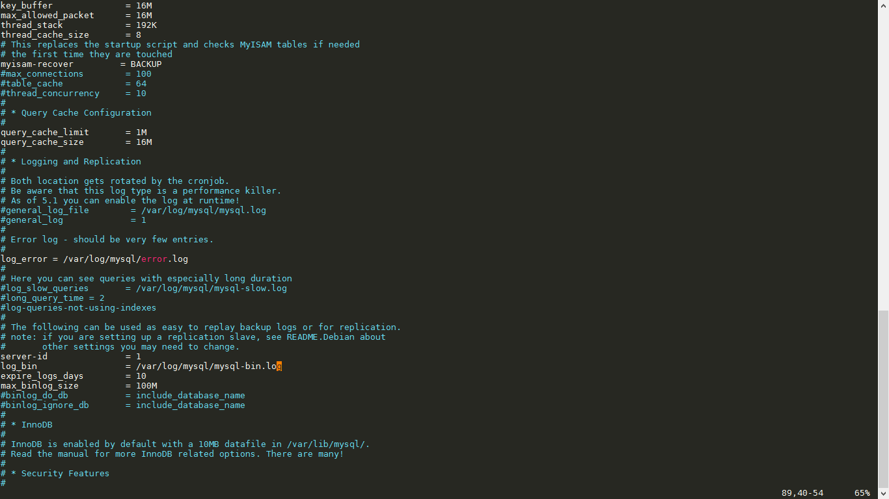

# Báo cáo: Tìm hiểu về MySQL

# Mục lục
* 1. Giới thiệu
	+ 1.1 [MySQL là gì?](#whatms)
	+ 1.2 [Chức năng của MySQL](#chucnang)
* 2. Cài đặt
	+ 2.1 [Cài đặt](#setup)
	+ 2.2 Hướng dẫn sử dụng, cấu hình
		- Các câu lệnh cơ bản sử dụng trên terminal
			+ [Kiểm tra các user trong database, các database đã tạo](#show)
			+ [Kiểm tra dung lượng của một database](#test)
			+ [Backup database](#backup)
			+ [Restore database](#restore)
		- Cấu hình
			+ [Cho phép kết nối từ xa](#remote)

# 1. Giới thiệu

* ## 1.1 MySQL là gì?
	+ MySQL là một hệ quản trị cơ sở dữ liệu cho phép người sử dụng tạo và sử dụng các database để lưu trữ các thông tin của một trang web, một ứng dụng, ...
	+ MySQL được miễn phí hoàn toàn và có thể được tải về trừ trang chủ
	+ Hỗ trợ nhiều hệ điều hành khác nhau

* ## 1.2 Chức năng của MySQL
	+ Tạo, lưu trữ các database
	+ Truy xuất dữ liệu trong database

# 2. Cài đặt

* ## 2.1 Cài đặt MySQL
	+ Trên windows, bạn có thể download về máy [tại đây](https://www.mysql.com/downloads/)
	+ Trên Linux (Ubuntu)
		- > `sudo apt-get update`
		- > `sudo apt-get install mysql-server`

* ## 2.2 Hướng dẫn sử dụng, cấu hình

+ ### Kiểm tra các database đã tạo
	Để hiển thị ra các thông tin về database, mysql có hỗ trợ câu lệnh `show`. Ví dụ:
	- Hiển thị ra các database
		> `show databases;`

	- Hiển thị các table
		> `use database-name;`

		> `show tables;`
		
+ ### Kiểm tra các user trong database
	- Để hiển thị ra các user trong mysql, ta sử dụng câu lệnh truy vấn sau:
    
    > `select User from mysql.user;`
	   

- ### Kiểm tra dung lượng của database
	- Trong mysql, các thông tin về từng mọi bảng được lưu trong database `information_schema` tại bảng `tables`. Để kiểm tra được các danh sách các database và kích thước (tính theo bit) ta sử dụng câu lệnh truy vấn sau:
		> `use information_schema;`

		> `select table_schema "Name", sum(index_length + data_length) "Size" from tables group by table_schema;`

	- Ngoài ra, bạn còn có thể sử dụng kết hợp với các câu lệnh truy vấn điều kiện để có thể cho ra kết quả nhanh nhất. (where table = "database-name")

- ### Backup database
	- Ta có thể sử dụng trực tiếp câu lệnh sau trên dòng lệnh để backup database:
		> `mysqldump --option -u [username] -p[password] [dbname] > backupfile.sql`

- ### Restore database
	- Sử dụng câu lệnh sau:
		> `mysql -u [uname] -p[pass] [db_to_restore] < backupfile.sql;`
	- Nếu như database mà bạn restore đang tồn tại trong hệ thống của bạn thì cần bắt buộc phải sử dụng câu lệnh sau:
		> `mysqlimport -u [uname] -p[pass] [dbname] backupfile.sql`
		

- ### Cấu hình cho phép truy cập từ xa
	- Giải sử mysql được cài tại server có địa chỉ là 192.168.10.126. Để cấu hình cho phép truy cập database từ xa, bạn cần phải khai báo địa chỉ ip này trong file cấu hình của mysql tại `/etc/mysql/my.cnf`.
	- > `sudo vi /etc/mysql/my.cnf`
	- > Trên dòng thứ 47 với nội dung `bind-address	= 127.0.0.1`. Bạn hãy thay vào đó là địa chỉ ip của mình và bỏ comment đi nếu có.
	- > `bind-address = 192.168.10.126`
	- Tiếp theo là bỏ comment tại 2 dòng 88 và 89 để có thể xem log của mysql:
		> 
	- Giờ bạn cần phải cấp quyền cho phép user remote từ xa. Giả sử: bạn muốn cho root kết nối tới tất cả các database từ xa. Thì cần làm như sau:
		> `mysql -u root -p`

		> `mysql> grant all privileges on *.* to root@'%' identified by '[password];'`

		> `flush privileges;`
	- Tiếp theo cần phải tắt firewall đi:
		> `sudo ufw stop`

	- Câu lệnh cho phép kết nối từ xa là:
		> `mysql -u root -p -h 192.168.10.126 [-P 3306]`

Chúc các bạn thành công.