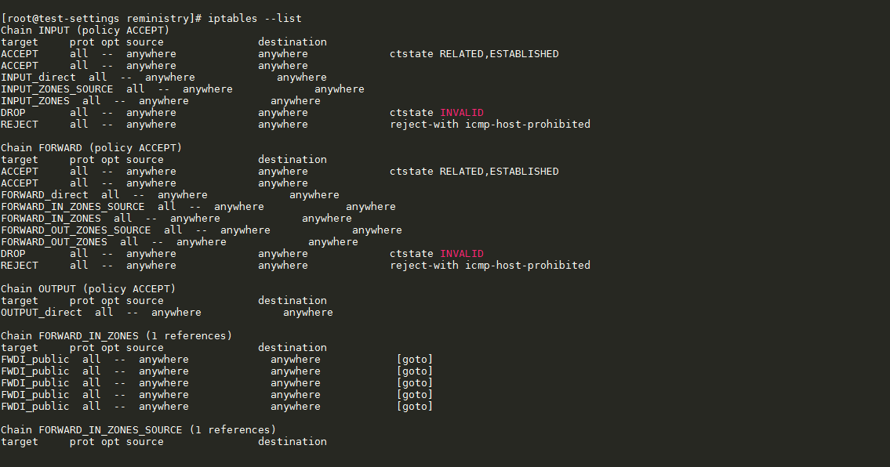

# 2. Cách sử dụng cơ bản về iptables

____

# Mục lục

- [2.1 Ý nghĩa một vài tham số tùy chọn trong câu lệnh iptables](#concept-options)
- [2.2 Xem rules và ý nghĩa các cột trong iptables](#watch-rules)
- [2.3 Các thao tác với chain trong iptables](#execute-chain)
- [2.4 Các thao tác với rule trong iptables](#execute-rule)
- [Các nội dung khác](#content-others)

____

# <a name="content">Nội dung</a>

- ### <a name="concept-options">2.1 Ý nghĩa một vài tham số, tùy chọn trong câu lệnh iptables</a>

    <table>
        <tr>
            <th>Tùy chọn đầy đủ</th>
            <th>Tùy chọn viết tắt</th>
            <th>Giá trị theo sau tùy chọn</th>
            <th>Ý nghĩa sử dụng tùy chọn</th>
        </tr>
        <tr>
            <td>--append</td>
            <td>-A</td>
            <td>chain_name rule_spec</td>
            <td>Thêm một hoặc nhiều rules tới chain đã khai báo có tên là chain_name</td>
        </tr>
        <tr>
            <td>--check</td>
            <td>-C</td>
            <td>chain_name rule_spec</td>
            <td>Kiểm tra xem rule_spec đã khai báo có tồn tại trong chain chain_name hay không</td>
        </tr>
        <tr>
            <td>--delete</td>
            <td>-D</td>
            <td>chain_name rule_spec hoặc chain_name rulenum</td>
            <td>Xóa một hoặc nhiều rules từ chain chain_name</td>
        </tr>
        <tr>
            <td>--insert</td>
            <td>-I</td>
            <td>chain_name [rulenum] rule_spec</td>
            <td>Thêm một hoặc nhiều rule vào trong chain chain_name. Mặc định rule sẽ được thêm vào vị trí đầu của chain hoặc khi rulenum có giá trị là 1.</td>
        </tr>
        <tr>
            <td>--replace</td>
            <td>-R</td>
            <td>chain_name rulenum rule_spec</td>
            <td>Thay thế một rule trong chain chain_name. Nếu source hoặc destination của rule có chứa nhiều địa chỉ thì sẽ xảy ra lỗi. rulenum được bắt đầu từ giá trị 1.</td>
        </tr>
        <tr>
            <td>--list</td>
            <td>-L</td>
            <td>[chain_name]</td>
            <td>Liệt kê tất cả các rule có trong chain chain_name. Nếu chain_name không được khai báo, câu lệnh sẽ liệt kê ra rule của tất cả các chain trong table. Mặc định, câu lệnh sẽ chỉ liệt kê rule có trong table `filter`. Muốn xem các rule có trong table khác, ta cần phải kết hợp với tham số `--table`</td>
        </tr>
        <tr>
            <td>--list-rule</td>
            <td>-S</td>
            <td>[chain_name]</td>
            <td>In ra tất cả các rule có trong chain chain_name. Nếu không khai báochain_name, câu lệnh sẽ in ra tất cả các rule. Mục đích của câu lệnh là in ra rule_spec. Kết quả câu lệnh trả về tương tự như `iptables-save`</td>
        </tr>
        <tr>
            <td>--flush</td>
            <td>-F</td>
            <td>[chain_name]</td>
            <td>Xóa tất cả các rule có trong chain_name hoặc xóa tất cả trong các chain_name</td>
        </tr>
        <tr>
            <td>--zero</td>
            <td>-Z</td>
            <td>[chain_name] [rulenum]</td>
            <td>Đặt lại giá trị bộ đếm byte của packet trong tất cả các chains hoặc chỉ các rule có trong chain_name.</td>
        </tr>
        <tr>
            <td>--new-chain</td>
            <td>-N</td>
            <td>chain_name</td>
            <td>Tạo mới một chain có tên là chain_name nếu nó chưa tồn tại</td>
        </tr>
        <tr>
            <td>--delete-chain</td>
            <td>-X</td>
            <td>[chain_name]</td>
            <td>Xóa tất cả các tùy chọn trong chain_name được khai báo.</td>
        </tr>
        <tr>
            <td>--policy</td>
            <td>-P</td>
            <td>chain_name target</td>
            <td>Thiết lập một chính sách cho chain có tên là chain_name ứng với target khai báo trong câu lệnh. Chỉ các chain_name không phải do người dùng tạo ra mới có thể nhận được target.</td>
        </tr>
        <tr>
            <td>--rename-chain</td>
            <td>-E</td>
            <td>old_chain new_chain</td>
            <td>Đặt lại tên của chain người dùng tạo ra. Trong đó old_chain là tên hiện tại của chain, old_chain là tên mới của chain sẽ được đặt.</td>
        </tr>
    </table>

    <table>
        <tr>
            <th>Tham số đầy đủ</th>
            <th>Tham số viết tắt</th>
            <th>Giá trị theo sau tham số</th>
            <th>Ý nghĩa sử dụng tham số</th>
        </tr>
        <tr>
            <td>[!] --procol</td>
            <td>[!] -p</td>
            <td>protocol_name</td>
            <td>Khai báo protocol của packet mà rule sẽ kiểm tra</td>
        </tr>
        <tr>
            <td>[!] --source, [!] --src</td>
            <td>[!] -s</td>
            <td>address[/mask][,...]</td>
            <td>Khai báo địa chỉ IP nguồn của packet. address có thể là một địa chỉ IP, một hostname, một địa chỉ mạng hay một dải địa chỉ IP</td>
        </tr>
        <tr>
            <td>[!] -destination, [!] --dst</td>
            <td>[!] -d</td>
            <td>address[/mask][,...]</td>
            <td>Khai báo địa chỉ IP đích của packet. address có thể là một địa chỉ IP, một hostname, một địa chỉ mạng hay một dải địa chỉ IP</td>
        </tr>
        <tr>
            <td>--jump</td>
            <td>-j</td>
            <td>target</td>
            <td>Khai báo target của rule sẽ được tạo ra, những gì cần phải làm nếu packet khớp với rule. Có thể được kết hợp để sử dụng với tham số -g hay --goto</td>
        </tr>
        <tr>
            <td>--goto</td>
            <td>-g</td>
            <td>chain</td>
            <td>Khi sử dụng khai báo này, việc xử lý của rule sẽ được xử lý tại chain gọi tới.</td>
        </tr>
        <tr>
            <td>[!] --in-interface</td>
            <td>[!] -i</td>
            <td>name</td>
            <td>Khai báo tên của interface nơi mà gói tin được nhận (chỉ có trong INPUT, FORWARD, PREROUTING chain). Tên của interface có thể khai báo theo dạng name[+]. Nghĩa là nếu có dấu + thì bất cứ interface nào bắt đầu với name sẽ khớp với rule. Nếu không có dấu + thì chỉ có tên interface giống y hệt mới khớp với rule. Ví dụ name+ sẽ khớp với nameinterface, namea, nameb.</td>
        </tr>
        <tr>
            <td>[!] --out-interface</td>
            <td>[!] -o</td>
            <td>name</td>
            <td>Khai báo tên của interface nơi mà gói tin đi ra khỏi hệ thống (chỉ có trong OUTPUT, FORWARD, POSTROUTING chain). Tên của interface có thể khai báo theo dạng name[+]. Nghĩa là nếu có dấu + thì bất cứ interface nào bắt đầu với name sẽ khớp với rule. Nếu không có dấu + thì chỉ có tên interface giống y hệt mới khớp với rule. Ví dụ name+ sẽ khớp với nameinterface, namea, nameb.</td>
        </tr>
        <tr>
            <td>[!] --fragment</td>
            <td>[!] -f</td>
            <td></td>
            <td>Rule sẽ chỉ nhắm đến các gói tin bị phân mảnh. Các gói tin mà không có đích đến hay nguồn đi.</td>
        </tr>
        <tr>
            <td>--set-counters</td>
            <td>-c</td>
            <td>packets bytes</td>
            <td>Cho phép ta khởi tạo các bộ đếm gói tin và byte của một rule</td>
        </tr>
    </table>
    <table>
        <tr>
            <th>Tùy chọn đầy đủ</th>
            <th>Tùy chọn viết tắt</th>
            <th>Giá trị theo sau tùy chọn</th>
            <th>Ý nghĩa sử dụng tùy chọn</th>
        </tr>
        <tr>
            <td>--verbose</td>
            <td>-v</td>
            <td></td>
            <td>Tùy chọn có tác dụng liệt kê ra kết quả của câu lệnh được thực hiện. Các bộ đếm gói tin và byte cũng được liệt kê theo hậu tố K, M, G với cấp nhân 1000, 1 000 000, 1 000 000 000. </td>
        </tr>
        <tr>
            <td>--numeric</td>
            <td>--numeric</td>
            <td></td>
            <td>Tùy chọn có tác dụng khiến kết quả trả về của câu lệnh sẽ cố gắng in ra địa chỉ IP với dạng số thay vì in ra theo hostname.</td>
        </tr>
        <tr>
            <td>--exact</td>
            <td>-x</td>
            <td></td>
            <td>Hiển thị chính xác giá trị của bộ đếm gói tin và byte thay vì chỉ hiển thị số được làm tròn.</td>
        </tr>
        <tr>
            <td>--line-numbers</td>
            <td></td>
            <td></td>
            <td>Khi liệt kê rule sẽ có số thứ tự kèm theo mỗi rule.</td>
        </tr>
        <tr>
            <td>--modprobe=</td>
            <td></td>
            <td>command</td>
            <td>Khi thêm mới hoặc chèn một rule vào chain. Ta sẽ sử dụng command để thêm một module cần thiết cho rule.</td>
        </tr>
    </table>
    <table>
        <tr>
            <th>Tùy chọn đầy đủ</th>
            <th>Tùy chọn viết tắt</th>
            <th>Giá trị theo sau tùy chọn</th>
            <th>Ý nghĩa sử dụng tùy chọn</th>
        </tr>
        <tr>
            <td></td>
            <td></td>
            <td></td>
            <td></td>
        </tr>
        <tr>
            <td></td>
            <td></td>
            <td></td>
            <td></td>
        </tr>
        <tr>
            <td></td>
            <td></td>
            <td></td>
            <td></td>
        </tr>
        <tr>
            <td></td>
            <td></td>
            <td></td>
            <td></td>
        </tr>
        <tr>
            <td></td>
            <td></td>
            <td></td>
            <td></td>
        </tr>
        <tr>
            <td></td>
            <td></td>
            <td></td>
            <td></td>
        </tr>
        <tr>
            <td></td>
            <td></td>
            <td></td>
            <td></td>
        </tr>
        <tr>
            <td></td>
            <td></td>
            <td></td>
            <td></td>
        </tr>
        <tr>
            <td></td>
            <td></td>
            <td></td>
            <td></td>
        </tr>
        <tr>
            <td></td>
            <td></td>
            <td></td>
            <td></td>
        </tr>
        <tr>
            <td></td>
            <td></td>
            <td></td>
            <td></td>
        </tr>
        <tr>
            <td></td>
            <td></td>
            <td></td>
            <td></td>
        </tr>
        <tr>
            <td></td>
            <td></td>
            <td></td>
            <td></td>
        </tr>
        <tr>
            <td></td>
            <td></td>
            <td></td>
            <td></td>
        </tr>
        <tr>
            <td></td>
            <td></td>
            <td></td>
            <td></td>
        </tr>
        <tr>
            <td></td>
            <td></td>
            <td></td>
            <td></td>
        </tr>
        <tr>
            <td></td>
            <td></td>
            <td></td>
            <td></td>
        </tr>
        <tr>
            <td></td>
            <td></td>
            <td></td>
            <td></td>
        </tr>
        <tr>
            <td></td>
            <td></td>
            <td></td>
            <td></td>
        </tr>
        <tr>
            <td></td>
            <td></td>
            <td></td>
            <td></td>
        </tr>
        <tr>
            <td></td>
            <td></td>
            <td></td>
            <td></td>
        </tr>
        <tr>
            <td></td>
            <td></td>
            <td></td>
            <td></td>
        </tr>
        <tr>
            <td></td>
            <td></td>
            <td></td>
            <td></td>
        </tr>
        <tr>
            <td></td>
            <td></td>
            <td></td>
            <td></td>
        </tr>
        <tr>
            <td></td>
            <td></td>
            <td></td>
            <td></td>
        </tr>
        <tr>
            <td></td>
            <td></td>
            <td></td>
            <td></td>
        </tr>
        <tr>
            <td></td>
            <td></td>
            <td></td>
            <td></td>
        </tr>
        <tr>
            <td></td>
            <td></td>
            <td></td>
            <td></td>
        </tr>
        <tr>
            <td></td>
            <td></td>
            <td></td>
            <td></td>
        </tr>
        <tr>
            <td></td>
            <td></td>
            <td></td>
            <td></td>
        </tr>
        <tr>
            <td></td>
            <td></td>
            <td></td>
            <td></td>
        </tr>
        <tr>
            <td></td>
            <td></td>
            <td></td>
            <td></td>
        </tr>
        <tr>
            <td></td>
            <td></td>
            <td></td>
            <td></td>
        </tr>
        <tr>
            <td></td>
            <td></td>
            <td></td>
            <td></td>
        </tr>
        <tr>
            <td></td>
            <td></td>
            <td></td>
            <td></td>
        </tr>
        <tr>
            <td></td>
            <td></td>
            <td></td>
            <td></td>
        </tr>
        <tr>
            <td></td>
            <td></td>
            <td></td>
            <td></td>
        </tr>
        <tr>
            <td></td>
            <td></td>
            <td></td>
            <td></td>
        </tr>
        <tr>
            <td></td>
            <td></td>
            <td></td>
            <td></td>
        </tr>
        <tr>
            <td></td>
            <td></td>
            <td></td>
            <td></td>
        </tr>
        <tr>
            <td></td>
            <td></td>
            <td></td>
            <td></td>
        </tr>
        <tr>
            <td></td>
            <td></td>
            <td></td>
            <td></td>
        </tr>
        <tr>
            <td></td>
            <td></td>
            <td></td>
            <td></td>
        </tr>
        <tr>
            <td></td>
            <td></td>
            <td></td>
            <td></td>
        </tr>
        <tr>
            <td></td>
            <td></td>
            <td></td>
            <td></td>
        </tr>
        <tr>
            <td></td>
            <td></td>
            <td></td>
            <td></td>
        </tr>
        <tr>
            <td></td>
            <td></td>
            <td></td>
            <td></td>
        </tr>
        <tr>
            <td></td>
            <td></td>
            <td></td>
            <td></td>
        </tr>
        <tr>
            <td></td>
            <td></td>
            <td></td>
            <td></td>
        </tr>
        <tr>
            <td></td>
            <td></td>
            <td></td>
            <td></td>
        </tr>
        <tr>
            <td></td>
            <td></td>
            <td></td>
            <td></td>
        </tr>
        <tr>
            <td></td>
            <td></td>
            <td></td>
            <td></td>
        </tr>
        <tr>
            <td></td>
            <td></td>
            <td></td>
            <td></td>
        </tr>
        <tr>
            <td></td>
            <td></td>
            <td></td>
            <td></td>
        </tr>
        <tr>
            <td></td>
            <td></td>
            <td></td>
            <td></td>
        </tr>
        <tr>
            <td></td>
            <td></td>
            <td></td>
            <td></td>
        </tr>
        <tr>
            <td></td>
            <td></td>
            <td></td>
            <td></td>
        </tr>
        <tr>
            <td></td>
            <td></td>
            <td></td>
            <td></td>
        </tr>
        <tr>
            <td></td>
            <td></td>
            <td></td>
            <td></td>
        </tr>
        <tr>
            <td></td>
            <td></td>
            <td></td>
            <td></td>
        </tr>
        <tr>
            <td></td>
            <td></td>
            <td></td>
            <td></td>
        </tr>
        <tr>
            <td></td>
            <td></td>
            <td></td>
            <td></td>
        </tr>
        <tr>
            <td></td>
            <td></td>
            <td></td>
            <td></td>
        </tr>
        <tr>
            <td></td>
            <td></td>
            <td></td>
            <td></td>
        </tr>
        <tr>
            <td></td>
            <td></td>
            <td></td>
            <td></td>
        </tr>
        <tr>
            <td></td>
            <td></td>
            <td></td>
            <td></td>
        </tr>
        <tr>
            <td></td>
            <td></td>
            <td></td>
            <td></td>
        </tr>
        <tr>
            <td></td>
            <td></td>
            <td></td>
            <td></td>
        </tr>
        <tr>
            <td></td>
            <td></td>
            <td></td>
            <td></td>
        </tr>
        <tr>
            <td></td>
            <td></td>
            <td></td>
            <td></td>
        </tr>
        <tr>
            <td></td>
            <td></td>
            <td></td>
            <td></td>
        </tr>
        <tr>
            <td></td>
            <td></td>
            <td></td>
            <td></td>
        </tr>
        <tr>
            <td></td>
            <td></td>
            <td></td>
            <td></td>
        </tr>
        <tr>
            <td></td>
            <td></td>
            <td></td>
            <td></td>
        </tr>
        <tr>
            <td></td>
            <td></td>
            <td></td>
            <td></td>
        </tr>
        <tr>
            <td></td>
            <td></td>
            <td></td>
            <td></td>
        </tr>
        
    </table>
- ### <a name="watch-rules">2.2 Xem rules và ý nghĩa các cột trong iptables</a>

    - Để xem các rule hiện có trong `iptables` ta sử dụng câu lệnh sau:

            iptables --list hoặc iptables -L

        kết quả sẽ hiển thị tương tự như sau:

        > 

        nhìn vào kết quả trên, ta có thể thấy được nội dung với các cột như sau:

        - `target`: Thể hiện giá trị của `target` bao gồm các giá trị: ACCEPT, DROP, REJECT, RETURN, LOG ...
        - `prot`: Quy định protocol của rule được match với rule. chúng bao gồm các protocol có trong `/etc/protocols`.
        - `opt`: Ít khi được sử dụng, nó mô tả các tùy chọn có liên quan đến IP
        - `source`: Chỉ ra một địa chỉ IP, subnet là nơi xuất phát của traffic hoặc có thể bất cứ đâu (anywhere).
        - `destination`: Chỉ ra một địa chỉ IP, subnet là đích đến của traffic hoặc có thể bất cứ đâu (anywhere).

        mỗi một dòng sau `target     prot opt source               destination` được xem là một rule trong 1 `chain`, và `Chain INPUT (policy ACCEPT)` biểu thị `chain` có tên là `INPUT` và `policy` của `chain` là `ACCEPT` và `1 references` biểu thị số lượng `chain` có liên quan đến `chain` này. Điều này đúng cho thông tin của các chain.

    - Mặc định khi sử dụng câu lệnh trên, ta chỉ có thể xem được các rule bên trong table `filter`. Để có thể xem được các rule trong các tables khác, ta cần sử dụng tham số `-t` hoặc `--table` để khai báo tên tables ta muốn xem rules có bên trong. Cụ thể của câu lệnh được thực hiện như sau:

            iptables -t tables_name -L

        hoặc

            iptables --table tables_name --list

        trong đó giá trị của `tables_name` có thể là tên của 1 trong 5 bảng của iptables.

- ### <a name="execute-chain">2.3 Các thao tác với chain trong iptables</a>
- ### <a name="execute-rule">2.4 Các thao tác với rule trong iptables</a>

    Sẽ cập nhật sau

____

# <a name="content-others">Các nội dung khác</a>
