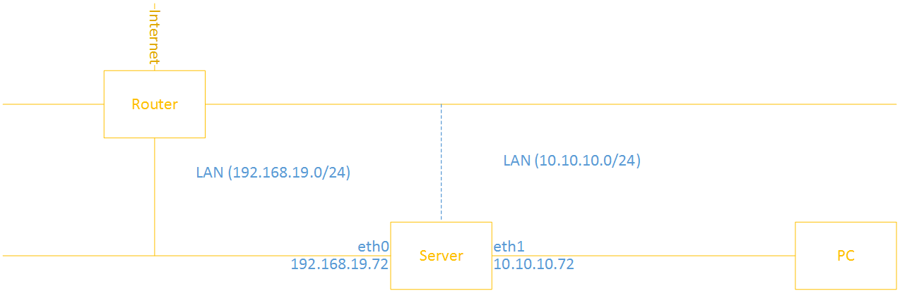

# Bài thực hành số 2. Cấu hình iptables cho các kết nối từ mạng bên ngoài truy cập hệ thống bằng việc sử dụng mạng cục bộ

____

# Mục lục

- [2.1 Đặt vấn đề](#issue)
- [2.2 Mô hình](#models-l2)
- [2.3 Hướng giải quyết](#config)
- [2.4 Kiểm tra kết quả](#checking)
- [Các nội dung khác](#content-others)

____

# <a name="content">Nội dung</a>

- ### <a name="issue">2.1 Đặt vấn đề</a>

    - Trên thực tế, để truy cập vào các dịch vụ hệ thống từ một máy tính phía bên ngoài dải mạng của hệ thống. Máy tính đó cần phải có địa chỉ ip của dải mạng hệ thống. Bởi vì các kết nối trong hệ thống chỉ được phép truy cập cục bộ.

    - Để làm điều này, ta sử dụng NAT trong iptables để giải quyết bài toán chuyển đổi địa chỉ IP.

- ### <a name="models-l2">2.2 Mô hình</a>

    - Hãy cùng theo dõi mô hình của bài thực hành như sau:

        > 

    - Máy chủ sử dụng hệ điều hành CentOS 7 và iptables làm firewall.
    - Cấu hình được thực hiện trên VMWare.

- ### <a name="config">2.3 Hướng giải quyết</a>

    - Với mô hình như trên. Các bước chủ yếu ta cần phải thực hiện trên máy chủ Server là:

        1. Từ chối các kết nối đi tới, các kết nối được chuyển hướng.
        2. Cho phép gói tin đi ra từ hệ thống.
        3. Cho phép thiết lập các kết nối đi vào hệ thống.
        4. Chấp nhận các kết nối loopback
        5. Chấp nhận kết nối SSH cho việc remote xuất phát từ mạng LAN.
        6. Chấp nhận các gói tin đi qua Server từ mạng LAN 10.10.10.0/24 và thực hiện NAT.

    - Chi tiết các bước làm như sau:

        - Có thể thực hiện chạy câu lệnh này nếu bạn muốn xóa các rules đã có của iptables và tạo ra các rule cho các chains mới hoàn toàn:

                iptables -F
                iptables -X

            trong đó:

                - tham số `-F`: có tác dụng xóa tất cả các quy tắc (rules)
                - tham số `-X`: xóa các chain do người dùng khai báo

        - Kích hoạt chế độ chuyển gói tin ở mức kernel (loading module). Tính năng này cần được kích hoạt để iptables có thể chuyển gói tin sang máy khác:

                echo 1 > /proc/sys/net/ipv4/ip_forward

        1. Thực hiện xóa các rule trong bảng NAT:

                iptables -t nat -F

            trong đó:
                - tham số `-t nat`: Khai báo rằng các gói tin sẽ áp dụng rule với bảng NAT.
                - tham số `-F`: Xóa toàn bộ các rule.

        2. Từ chối kết nối đi tới, các kết nối được chuyển hướng:

                iptables -P INPUT DROP
                iptables -P FORWARD DROP

        2. Cho phép gói tin đi ra từ hệ thống:

                iptables -P OUTPUT ACCEPT

        3. Chấp nhận gói tin được chuyển hướng:

                iptables -A FORWARD -i eth1 -o ens34 -s 10.10.10.0/24 -j ACCEPT

            trong đó:
                - `-i eth1`: Khai báo interface mà gói tin đi vào
                - `-o ens34`: Khai báo interface mà gói tin đi ra
                - `-s 10.10.10.0/24`: Khai báo dải mạng của nguồn gói tin gửi đến
                - `-j ACCEPT`: Khai báo hành động xử lý gói tin. Ở đây là `ACCEPT` gói tin

        3. Cho phép thiết lập các kết nối đi vào hệ thống:

                iptables -A FORWARD -m state --state ESTABLISHED,RELATED -j ACCEPT
                iptables -A INPUT -m state --state ESTABLISHED,RELATED -j ACCEPT

        4. Chấp nhận các kết nối loopback:

                iptables -A INPUT -s 127.0.0.1 -d 127.0.0.1 -j ACCEPT

        5. Chấp nhận kết nối SSH cho việc remote xuất phát từ mạng LAN:

                iptables -A INPUT -p tcp -m state -state NEW -m tcp -s 192.168.19.0/24 \
                -d 192.168.19.72 --dport 22 -j ACCEPT

        6. Cho phép các kết nối ping với giới hạn 5 lần 1 phút đối với các kết nối từ mạng cục bộ:

                iptables -A INPUT -p icmp --icmp-type echo-request -s 192.168.19.0/24 \
                -d 192.168.19.72 -m limit --limit 1/m --limit-burst 5 -j ACCEPT

        7. Thực hiện NAT địa chỉ IP.

                iptables -t nat -A POSTROUTING -o ens34 -s 10.10.10.0/24 -j MASQUERADE

        8. Lưu lại cấu hình và khởi động lại iptables

                iptables-save
                systemctl restart iptables

- ### <a name="checking">2.4 Kiểm tra kết quả</a>

        Sẽ cập nhật sau

____

# <a name="content-others">Các nội dung khác</a>
