# 1. Giới thiệu về pfsense

____

# Mục lục

- [1.1 Giới thiệu về pfsense](#about)
- [1.2 Một số lợi ích của pfsense](#useful)
- [1.3 Cài đặt pfsense trên VMWare](#setting)
- [1.4 Cấu hình cho pfSense](#config)
- [Các nội dung khác](#content-others)

____

# <a name="content">Nội dung</a>

- ### <a name="about">1.1 Giới thiệu về pfsense</a>

    > 

    - PfSense là một ứng dụng có chức năng định tuyến, tường lửa và miễn phí, ứng dụng này sẽ cho phép bạn mở rộng mạng của mình mà không bị thỏa hiệp về sự bảo mật. Bắt đầu vào năm 2004, khi m0n0wall mới bắt đầu chập chững – đây là một dự án bảo mật tập trung vào các hệ thống nhúng – pfSense đã có hơn 1 triệu lượt download và được sử dụng để bảo vệ các mạng có tất cả kích cỡ, từ mạng gia đình đến các mạng lớn của các công ty/doanh nghiệp. Ứng dụng này có một cộng đồng phát triển rất tích cực và nhiều tính năng đang được bổ sung trong mỗi lần phát hành nhằm cải thiện hơn nữa tính bảo mật, sự ổn định và khả năng linh hoạt của nó. Và là một trong số ít những firewall có tính năng trạng thái, chỉ thường xuất hiện ở những firewall thương mại lớn như Cisco ASA, Checkpoint, Juniper …

    - PfSense bao gồm nhiều tính năng đặc biệt là firewall trạng thái mà bạn vẫn thấy trên các thiết bị tường lửa hoặc router thương mại lớn, chẳng hạn như giao diện người dùng (GUI) trên nền Web tạo sự quản lý một cách dễ dàng. Trong khi đó phần mềm miễn phí này còn có nhiều tính năng ấn tượng đối với firewall/router miễn phí, tuy nhiên cũng có một số hạn chế.

    - PfSense hỗ trợ lọc bởi địa chỉ nguồn và địa chỉ đích, cổng nguồn hoặc cổng đích hay địa chỉ IP. Nó cũng hỗ trợ chính sách định tuyến và cơ chế hoạt động trong chế độ brigde hoặc transparent, cho phép bạn chỉ cần đặt pfSense ở giữa các thiết bị mạng mà không cần đòi hỏi việc cấu hình bổ sung. PfSense cung cấp cơ chế NAT và tính năng chuyển tiếp cổng, tuy nhiên ứng dụng này vẫn còn một số hạn chế với Point-to-Point Tunneling Protocol (PPTP), Generic Routing Encapsulation (GRE) và Session Initiation Protocol (SIP) khi sử dụng NAT.

    - PfSense được dựa trên FreeBSD và giao thức Common Address Redundancy Protocol (CARP) của FreeBSD, cung cấp khả năng dự phòng bằng cách cho phép các quản trị viên nhóm hai hoặc nhiều tường lửa vào một nhóm tự động chuyển

    - Vì nó hỗ trợ nhiều kết nối mạng diện rộng (WAN) nên có thể thực hiện việc cân bằng tải. Tuy nhiên có một hạn chế với nó ở chỗ chỉ có thể thực hiện cân bằng lưu lượng phân phối giữa hai kết nối WAN và không thể chỉ định được lưu lượng cho qua một kết nối.

- ### <a name="useful">1.2 Một số lợi ích của pfsense</a>

    - Hoàn toàn miễn phí, giá cả là ưu thế vượt trội của tường lửa pfSense. Tuy nhiên, rẻ không có nghĩa là kém chất lượng, tường lửa pfSense hoạt động cực kỳ ổn định với hiệu năng cao, đã tối ưu hóa mã nguồn và cả hệ điều hành. Cũng chính vì thê, pfSense không cần nền tảng phần cứng mạnh.

    - Nếu doanh nghiệp không có đường truyền tốc độ cao, tường lửa pfSense chỉ cần cài đặt lên một máy tính cá nhân là có thể bắt đầu hoạt động. Điều đó càng góp phần làm giảm chi phí triển khai, đồng thời tạo nên sự linh hoạt, tính mở rộng/sẵn sàng chưa từng có, khi doanh nghiệp muốn có nhiều hơn một tường lửa.

    - Không chỉ là một tường lửa, pfSense hoạt động như một thiết bị mạng tổng hợp với đầy đủ mọi tính năng toàn diện sẵn sàng bất cứ lúc nào. Khi có một vấn đề về hệ thống mạng phát sinh, thay vì phải loay hoay tìm thiết bị và mất thời gian đặt hàng, doanh nghiệp có thể kết hợp các tính năng đa dạng trên pfSense để tạo thành giải pháp hợp lý, khắc phục sự cố ngay lập tức.

    - Tóm lại, các tính năng mà pfSense có thể làm như sau:

        1. Cung cấp dịch vụ tường lửa, High Availability, Load Balancing, ...
        2. Sử dụng Web Interface để quản trị vì thể giao tiếp dễ dàng hơn.
        3. Hiệu năng cao, ổn định, ...
        4. Là phần mềm mã nguồn mở, miễn phí.
        5. Cung cấp chức năng tạo VLAN, DNS, ...

- ### <a name="setting">1.3 Cài đặt pfsense trên VMWare</a>

    - #### Chuẩn bị cài đặt pfSense:

        + Ta cần download bản cài đặt pfSense trước khi tiến hành cài đặt tại đây: [pfSense-CE-2.4.1-RELEASE-amd64.iso.gz](https://nyifiles.pfsense.org/mirror/downloads/pfSense-CE-2.4.1-RELEASE-amd64.iso.gz)

        + Máy tính của bạn đã được cài đặt VMWare.

    - #### Tiến hành cài đặt pfSense trên VMWare

        + Để tiện cho các bài thực hành về sau, ta nên chỉnh sửa lại thiết lập về card mạng tại "Virtual Network Editor" với các card mạng như sau:

            > 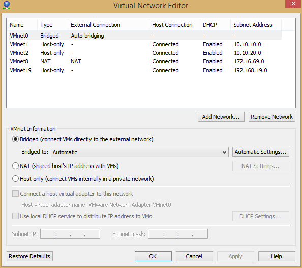

        + Bắt đầu tạo một máy ảo mới. Sử dụng phím tắt `Ctrl + N`:

            > 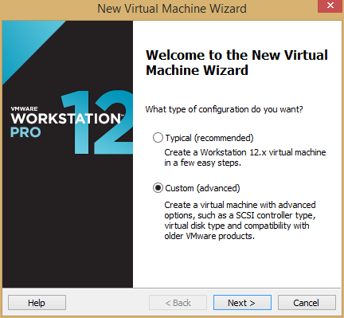

            chọn `Next`:

            > 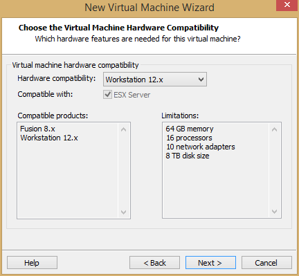

            chọn `Next`:

            > 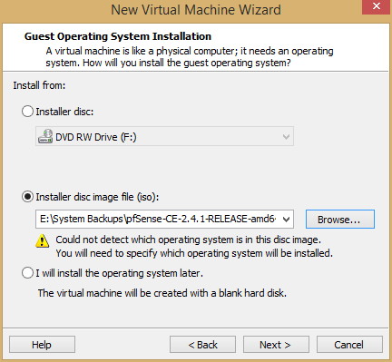

            chọn vào radio `Intaller disc image file (iso):` sau đó chọn `Browser` và tìm đến đường dẫn chứa file cài đặt pfSense.iso ta vừa giải nén được từ file download. Sau đó, chọn `Next`:

            > 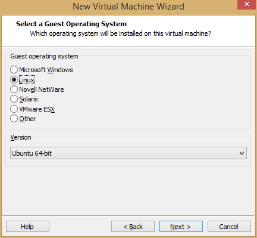

            chọn `Next`:

            > 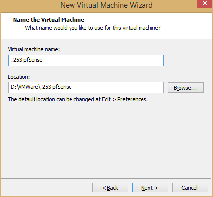

            đặt tên cho máy ảo mới, sau đó chọn `Next`.

            > 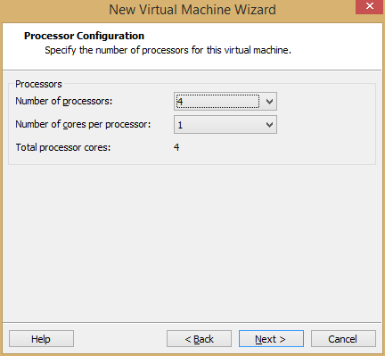

            chọn số core cpu cho máy ảo sau đó chọn `Next`:

            > 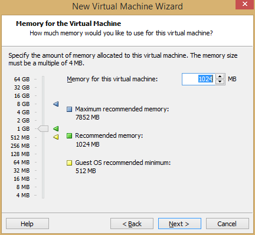

            thiết lập dung lượng RAM cho máy ảo, sau đó chọn `Next`.

            > 

            các bước tiếp theo bạn vẫn cứ chọn `Next` cho đến khi kết thúc. Ta nhận được:

            > 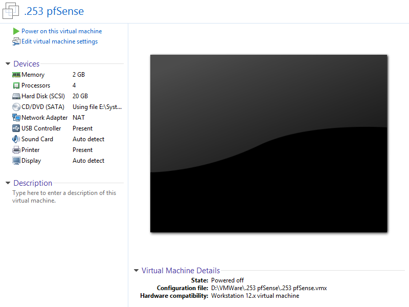

            ta chọn `Power on this virtual machine` để khởi động máy ảo tiến hành quá trình cài đặt pfSense.

        + Khi khởi động máy ảo hoàn tất, pfSense sẽ tự động boot đến màn hình lựa chọn cài đặt:

            > 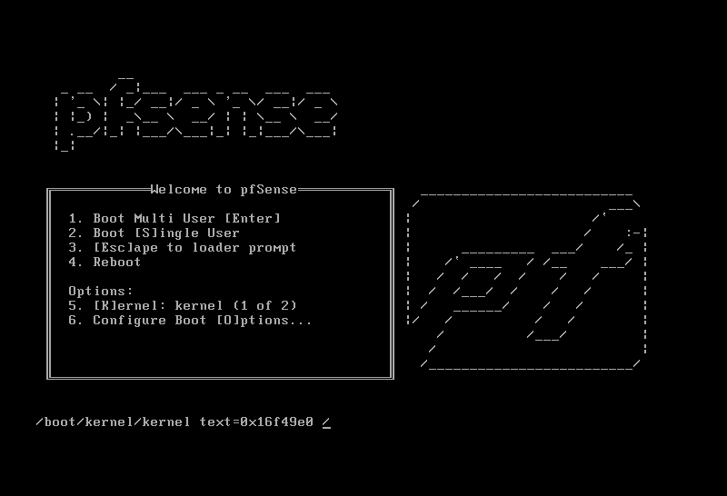

            ta chỉ cần chờ cho đến khi màn hình xuất hiện:

            > 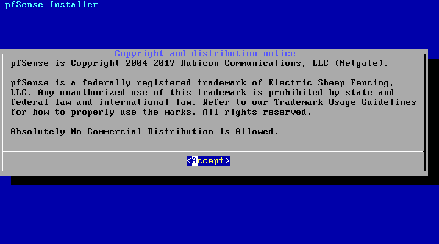
    
            ta nhấn `Enter` để chọn `Accept`. Một màn hình mới xuất hiện ra:

            > 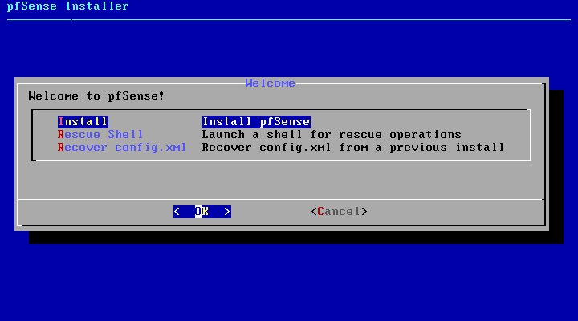

            nhấn `Enter` để tiến hành quá trình cài đặt pfSense lên máy ảo:

            > 

            nhấn `Enter` để chọn mặc định cho loại keyboard:

            > 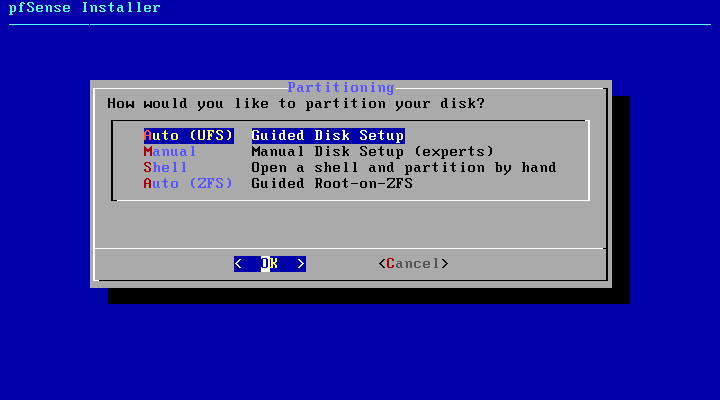

            các bước tiếp theo ta vẫn nhấn Enter để

            > 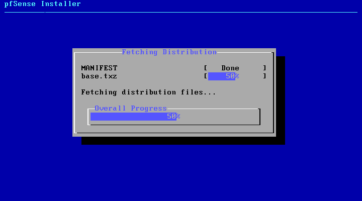

            > 

            cho đến khi màn hình xuất hiện:

            > 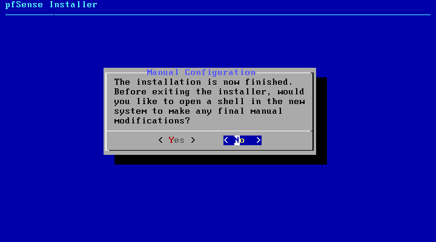

            ta nhấn mũi tên sang trái và nhần `Enter` để chọn `No`.

            > 

            Tiếp tục nhấn `Enter` để thực hiện reboot máy ảo. Kết thúc quá trình cài đặt pfSense.

- ### <a name="config">1.4 Cấu hình cho pfSense</a>

    - Sau khi reboot cho đến khi màn hình xuất hiện như sau:

        > 

        ta nhập `n` và nhấn `Enter` để bỏ qua việc tạo VLAN.

        > 

        ta nhập `em0` và nhấn `Enter` để tự động tạo ra một WAN Interface.

        > 

        nhấn `Enter` để tiếp tục. Một màn hình thông báo hiện ra:

        > 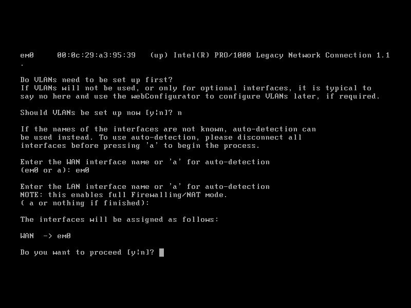

        nhập `y` và nhấn `Enter` để kết thúc. Ta được màn hình hiển thị như sau:

        > 

        Tại màn hình này, ta nhập `2` và nhấn `Enter` để thực hiện gán địa chỉ IP tĩnh cho WAN vừa tạo.

        > 

        nhập `n` vần nhấn `Enter` để thực hiện gán địa chỉ IP tĩnh cho máy ảo pfSense.

        > 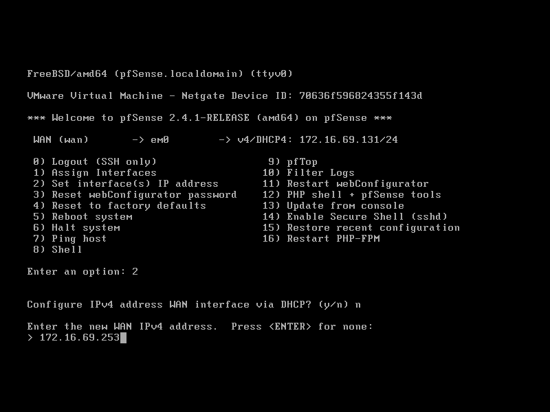

        nhập địa chỉ IP gán cho máy ảo pfSense sao cho phù hợp với dải mạng NAT mà mạng đã tạo ra. Sau đó nhấn `Enter`.

        > 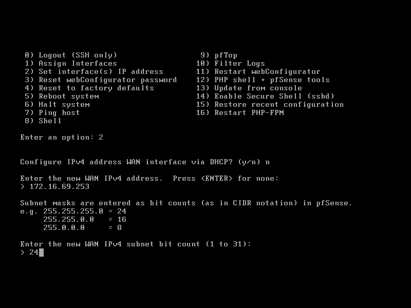

        nhập vào số bit của địa chỉ mạng của mạng. Sau đó nhấn `Enter`.

        > 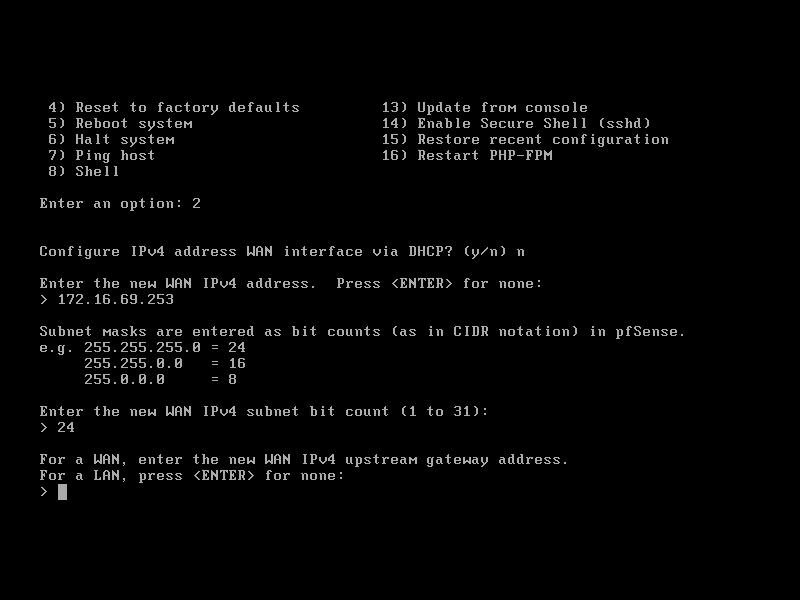

        tiếp tục nhấn `Enter`

        > 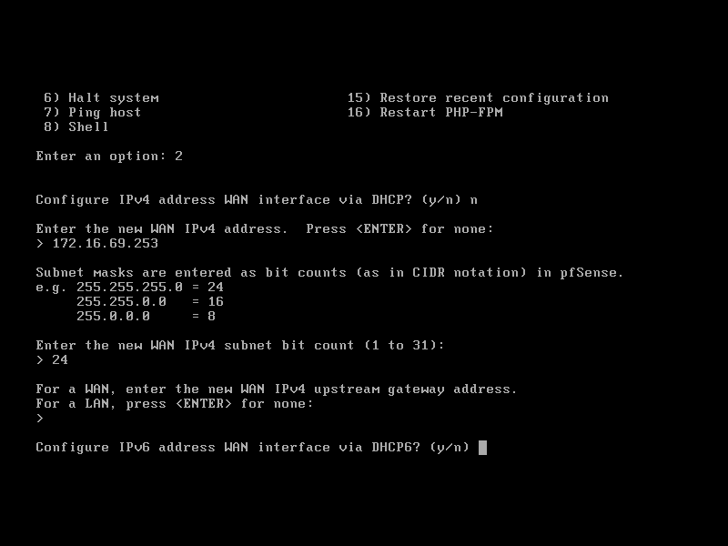

        nhập `y` và nhấn `Enter` để tự động cấp phát địa chỉ IPv6 cho WAN.

        > 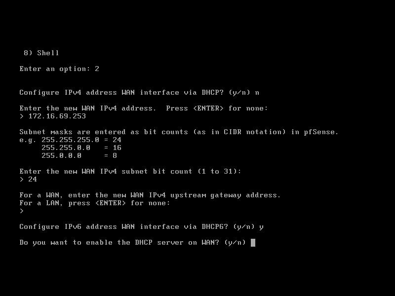

        nhập `n` và nhấn `Enter` để bỏ qua việc khởi tạo DHCP Server trên máy ảo pfSense.

        > 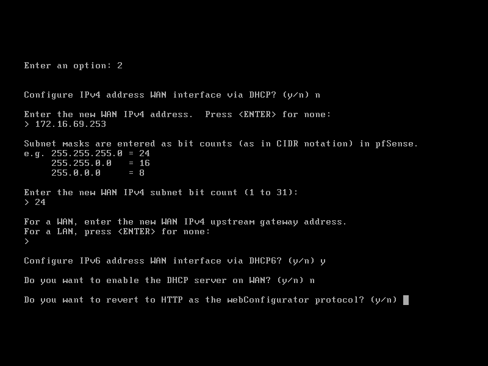

        nhập `y` và nhấn `Enter` để hoàn tất quá trình.

    - Truy cập giao diện Web Interface của pfSense:

        + Từ cửa sổ trình duyệt, ta truy cập theo đường dẫn:

                http://ip_address

            trong đó: ip_address là địa chỉ IP của interface WAN em0 trong máy ảo pfSense

            > 

        + Thực hiện đăng nhập với:

            - username là `admin`
            - password là pfsense

        + Sau khi đăng nhập thành công, ta thực hiện nhấn `F5` để bỏ qua quá trình cài đặt thuật sĩ. Cuối cùng ta được kết quả như sau:

            > 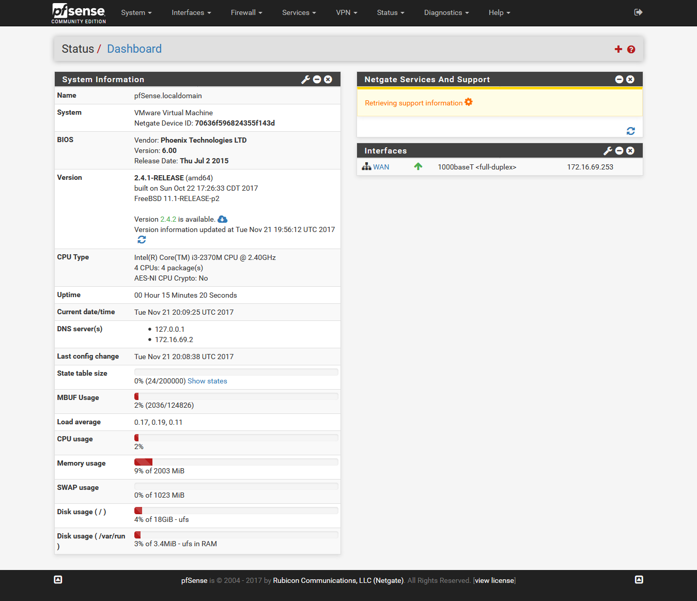

____

# <a name="content-others">Các nội dung khác</a>
