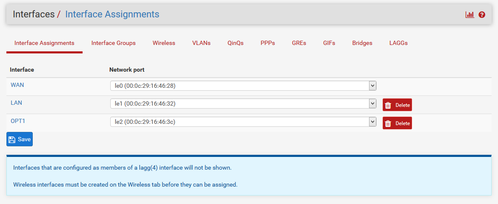
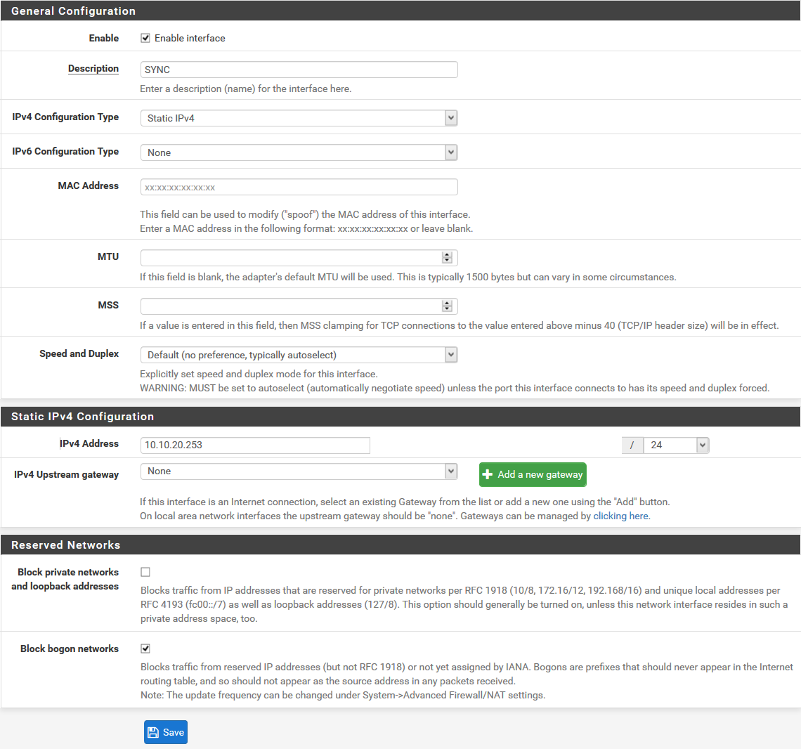
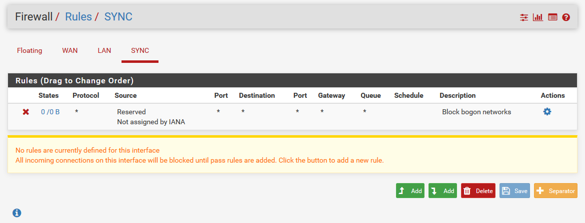
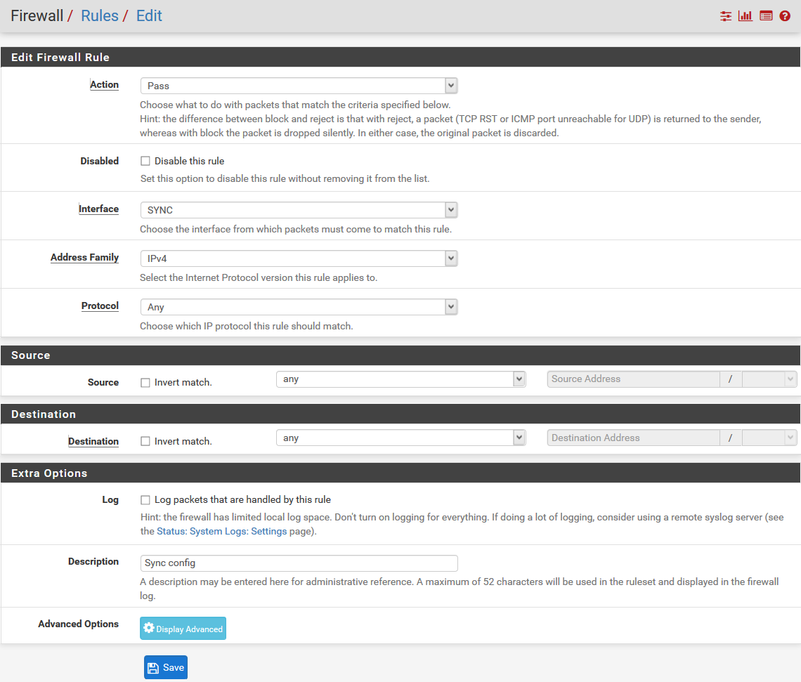
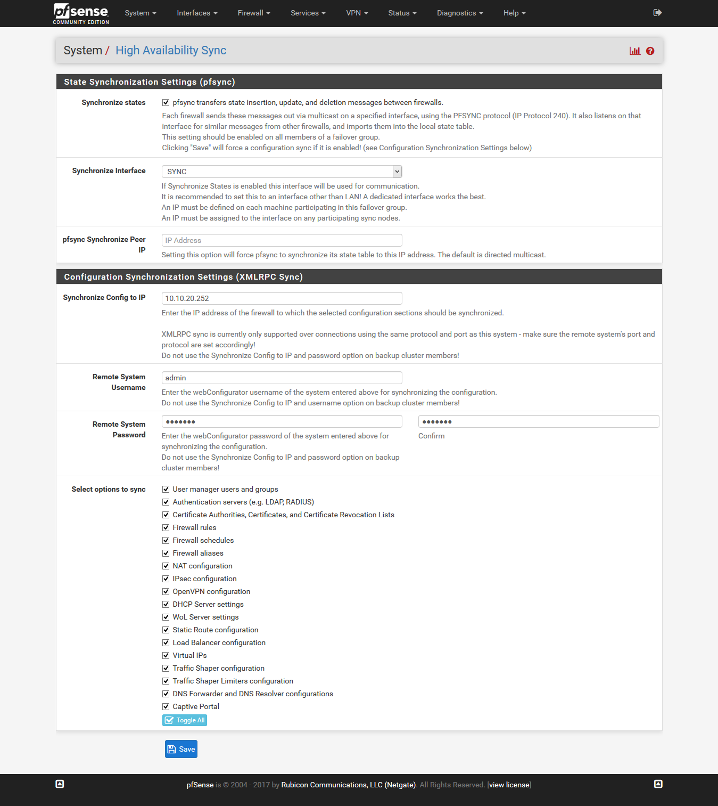
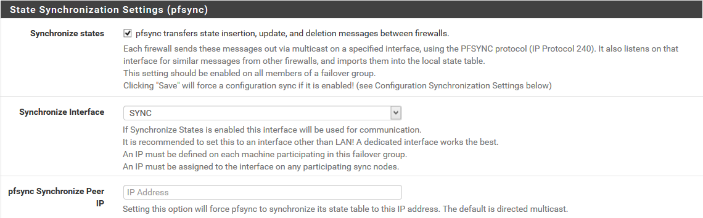
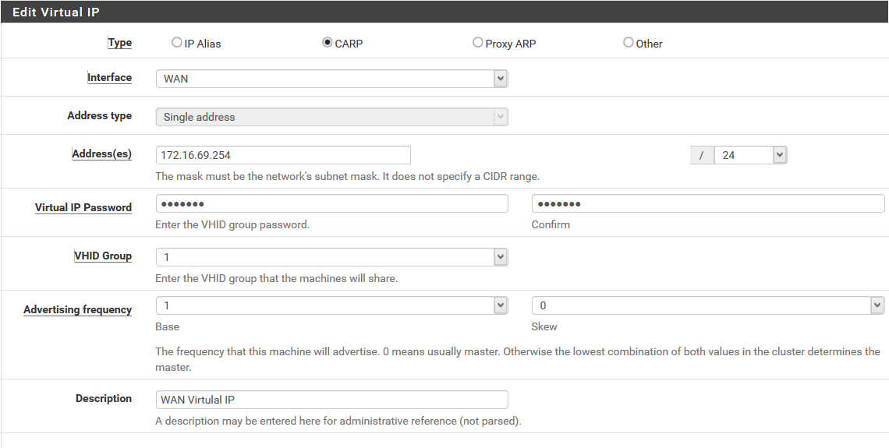
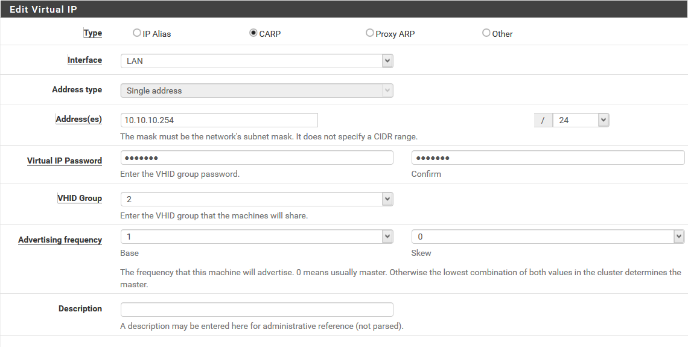
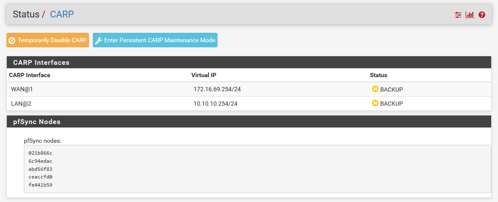

# 4. Thực hiện cấu hình tạo pfSense Cluster

____

# Mục lục

- [4.1 Vai trò, chức năng](#about)
- [4.2 Mô hình](#models)
- [4.3 Thực hiện cấu hình](#config)
- [4.4 Kiểm tra kết quả](#checking)
- [Các nội dung khác](#content-others)

____

# <a name="content">Nội dung</a>

- ### <a name="about">4.1 Vai trò, chức năng</a>

    - Vai trò của việc cấu hình pfSense Cluster là đảm bảo cho việc cung cấp firewall ở mức ổn định nhất có thể. Phòng trường hợp khi phát sinh lỗi buộc firewall ngừng hoạt động gây ra sự trì trệ trong hệ thống.

    - Với tính năng đồng bộ và sao lưu cấu hình cần thiết như các rule, pfSense Cluster là một giải pháp toàn vẹn nhất tính đến thời điểm hiện tại.

    - Việc đồng bộ sử dụng giao thức CARP, dữ liệu đồng bộ được gửi qua http(s).

- ### <a name="models">4.2 Mô hình</a>

    - Mô hình thực hiện cấu hình có thể mô tả giống như hình sau:

        > 

    - Yêu cầu:

        + Các máy ảo cài đặt pfSense có chứa 3 card mạng

        + Nội dung cấu hình là phần tiếp theo của bài viết [1. Cài đặt pfSense](pfsense-about.md)

        + Việc cấu hình được thực hiện qua giao diện Web Interface của pfSense.

- ### <a name="config">4.3 Thực hiện cấu hình</a>

    - Bước 1. Cấu hình thêm card mạng cho máy ảo pfSense bằng cách chọn menu `Interfaces`, rồi chọn `Assignments` chọn `Add` để thêm một interface mới. Kết quả như sau:

        > 

        - Nhấp chuột double vào interface `OPT1`. rồi thực hiện lựa chọn và điền các thông tin tương tự như hình sau:

            > 

        chọn `Save` để lưu lại cấu hình cho interface và chọn `Apply Changes` để thực hiện thay đổi cấu hình. Hãy thực hiện tương tự để cấu hình cho máy chủ pfSense còn lại.

    - Bước 2. Thực hiện tạo rule firewall cho phép dữ liệu đồng bộ có thể truy qua lại giữa 2 máy chủ. Các bước thực hiện như sau:

        - Chọn menu `Firewall`, sau đó chọn `Rules` chuyển sang tab `SYNC`. Hình ảnh thu được tương tự như sau:

            > 

        - Chọn `Add` để thêm mới một rule, thông tin nhập vào tương tự như sau:

            > 

            sau khi hoàn tất, chọn `Save` và `Apply Changes` để lưu lại cấu hình.

        - Hãy thực hiện tạo mới rule tương tự trên máy chủ pfSense còn lại.

    - Bước 3. Thực hiện cấu hình CARP trên pfSense master. Cách thực hiện như sau:

        - Chọn menu `System`, rồi chọn `High Avail. Sync`. Hãy lựa chọn và điền thông tin tương tự như hình sau đây:

            > 

            trong đó: `Remote System Username`, `Remote System Password` lần lượt là tên người dùng và mật khẩu tương ứng có vai trò cao trong máy ảo pfSense slave. Ở đây là `admin`.

            chọn `Save` để lưu lại cấu hình.

    - Bước 4. Thực hiện cấu hình CARP trên pfSense slave. Cách thực hiện như sau:

        - Chọn menu `System`, rồi chọn `High Avail. Sync`. Hãy lựa chọn và điền thông tin tương tự như hình sau đây (ta chỉ cần lựa chọn thông tin tại mục này):

            > 

    - Bước 5. Tạo Virtual IP WAN và Virtual IP LAN. Việc thực hiện chỉ cần thực hiện trên pfSense master. Vì lúc này, quá trình đồng bộ đã bắt đầu xảy ra. Cách thực hiện như sau:

        + Chọn `Firewall`, sau đó chọn `Virtual IPs`, tiếp tục chọn Add để thêm mới một Virtual IP cho WAN. Hãy lựa chọn và nhập thông tin tương tự như sau:

            > 

            chọn `Save` để lưu lại và tiếp tục chọn `Appy Changes` để chấp nhận thay đổi cấu hình.

        + Tương tự, ta thực hiện thêm một Virtual IP cho LAN. Hãy lựa chọn và nhập thông tin tương tự như sau:

            > 

        + Trong quá trình thực hiện `Virtual IP Password` ta đều để là `pfsense`.

- ### <a name="checking">4.4 Kiểm tra kết quả</a>

    - Để kiểm tra kết quả của quá trình thực hiện cấu hình và quá trình đồng bộ. Ta thực hiện như sau:

        + Chọn menu `Status` sau đó chọn `CARP (failover)`. Kết quả:

            - Trên máy chủ pfSense master ta sẽ thấy như sau:

                > 

            - Trên máy chủ pfSense slave ta sẽ thấy như sau:

                > 

        + Thực hiện thêm mới một rule trên máy chủ pfSense để kiểm tra kết quả. Ngoài ra hãy thực hiện tắt máy chủ pfSense master rồi kiểm tra lại trang thái CARP như trên và tự đưa ra nhận xét.

____

# <a name="content-others">Các nội dung khác</a>
