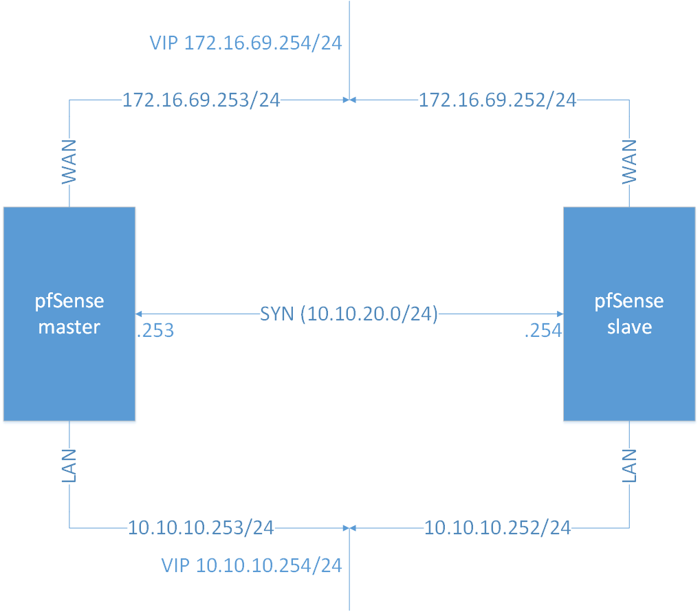

# 4. Thực hiện cấu hình tạo pfSense Cluster

____

# Mục lục

- [4.1 Vai trò, chức năng](#about)
- [4.2 Mô hình](#models)
- [4.3 Thực hiện cấu hình](#config)
- [4.4 Kiểm tra kết quả](#checking)
- [Các nội dung khác](#content-others)

____

# <a name="content">Nội dung</a>

- ### <a name="about">4.1 Vai trò, chức năng</a>

    - Vai trò của việc cấu hình pfSense Cluster là đảm bảo cho việc cung cấp firewall ở mức ổn định nhất có thể. Phòng trường hợp khi phát sinh lỗi buộc firewall ngừng hoạt động gây ra sự trì trệ trong hệ thống.

    - Với tính năng đồng bộ và sao lưu cấu hình cần thiết như các rule, pfSense Cluster là một giải pháp toàn vẹn nhất tính đến thời điểm hiện tại.

    - Việc đồng bộ sử dụng giao thức CARP

- ### <a name="models">4.2 Mô hình</a>

    - Mô hình thực hiện cấu hình có thể mô tả giống như hình sau:

        > 

    - Yêu cầu:

        + Các máy ảo cài đặt pfSense có chứa 3 card mạng

        + Nội dung cấu hình là phần tiếp theo của bài viết [1. Cài đặt pfSense](pfsense-about.md)

        + Việc cấu hình được thực hiện qua giao diện Web Interface của pfSense.

- ### <a name="config">4.3 Thực hiện cấu hình</a>

    - Bước 1. Cấu hình thêm card mạng cho máy ảo pfSense bằng cách chọn menu `Interfaces`, rồi chọn `Assignments` chọn `Add` để thêm một interface mới. Kết quả như sau:
- ### <a name="checking">4.4 Kiểm tra kết quả</a>

____

# <a name="content-others">Các nội dung khác</a>
