# 5. Thực hiện cấu hình VPN mode tun trong pfSense xác thực tài khoản người dùng

____

# Mục lục

- [5.1 Vai trò, chức năng](#about)
- [5.2 Mô hình, yêu cầu](#models)
- [5.3 Thực hiện cấu hình](#config)
- [5.4 Kiểm tra kết quả](#checking)
- [Các nội dung khác](#content-others)

____

# <a name="content">Nội dung</a>

- ### <a name="about">5.1 Vai trò, chức năng</a>

    - Sử dụng pfSense để cấu hình openVPN đóng vai trò như một Server.

- ### <a name="models">5.2 Mô hình, yêu cầu</a>

    - Thực hiện cấu hình theo mô hình sau:

        > 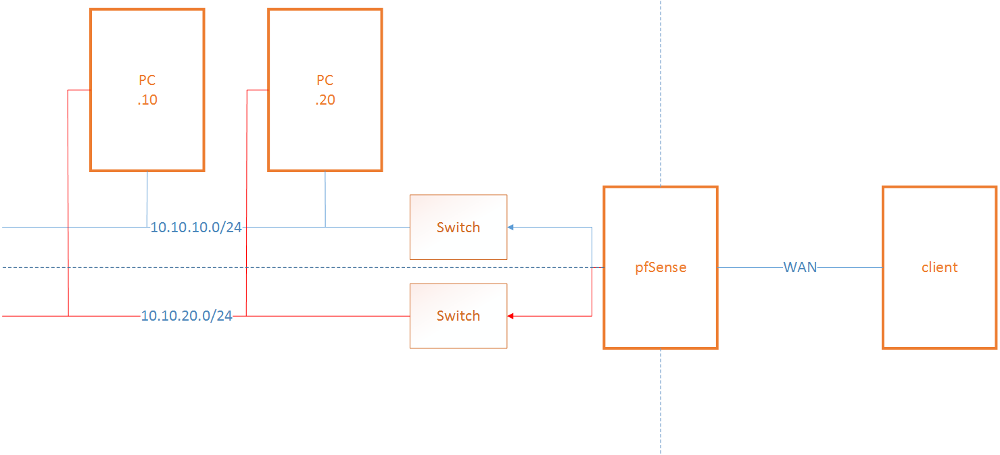

    Yêu cầu:

        - Khi máy client kết nối VPN qua pfSense thì có thể ping đến cac máy trong mạng LAN sau pfSense.

        - Việc cấu hình được thực hiện qua giao diện Web Interface của pfSense.

        - Client kết nối đến VPN server thông qua đường hầm có dải mạng 192.168.20.0/24

- ### <a name="config">5.3 Thực hiện cấu hình</a>

    - Tại giao diện Web Interface của pfSense, việc đầu tiên ta cần làm để chuẩn bị cấu hình openVPN cho pfSense đó là tạo ra một chứng chỉ xác thực người dùng (CA). Hãy chọn menu `System`, tiếp theo chọn `Cert. Manager`:

        > 

        chọn `Add` để thêm một CA mới:

        > 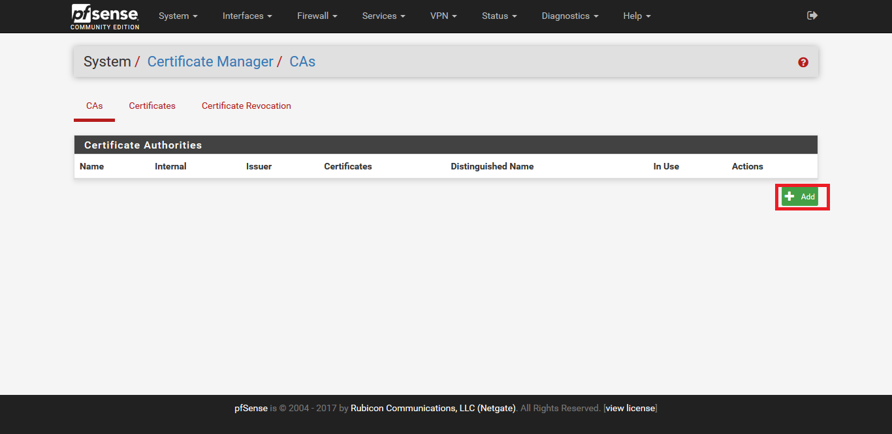

        - Hãy nhập thông tin như hình dưới đây: 

            > 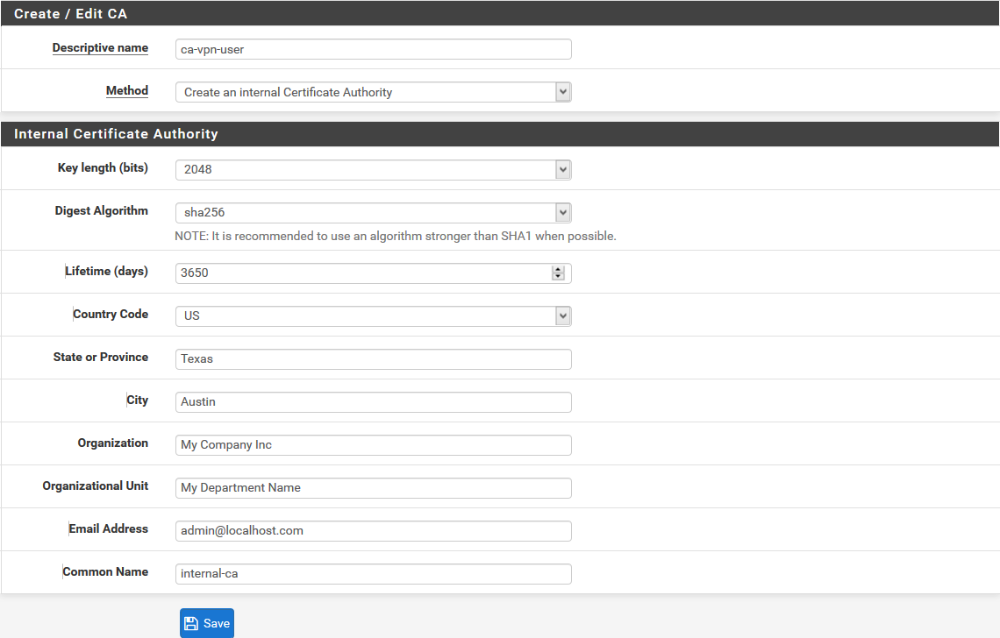

            chọn `Save` để lưu lại. Kết quả ta có được như sau:

            > 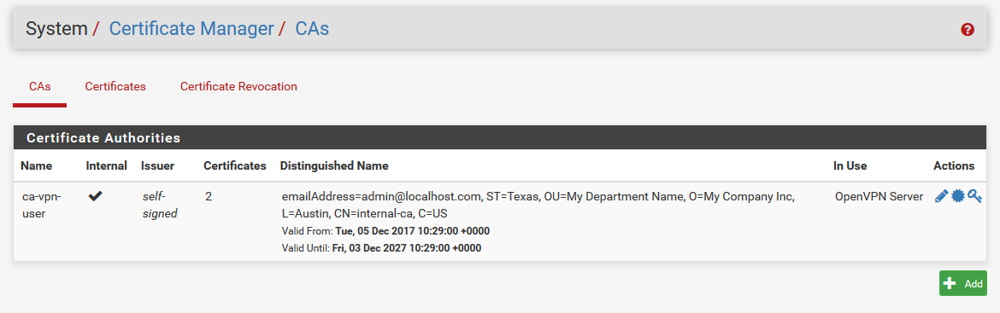

    - Bước 1. Tạo người dùng cho phép sử dụng tài khoản để đăng nhập VPN. Thực hiện như sau:
    
        + Chọn `System`, sau đó chọn `User Manager`, tiếp tục chọn `Add` rồi nhập thông tin giống như hình sau:

            > 

            trong đó, tên `Username`, `Password` và `Confirm Password` để là `guest`.
    
        + Tại mục `Certificate` tích chọn `Click to create a user certificate`. Sau đó nhập thông tin như sau:
            
            > 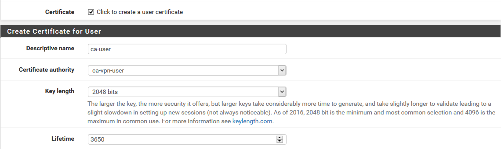

            + Chọn `Save` để lưu lại thông tin

    - Bước 2. Cài đặt package `openvpn-client-export` bằng việc thực hiện như sau:

        + Tại giao diện của Web Interface, ta chọn `System`. Sau đó chọn `Package Manager`:

            >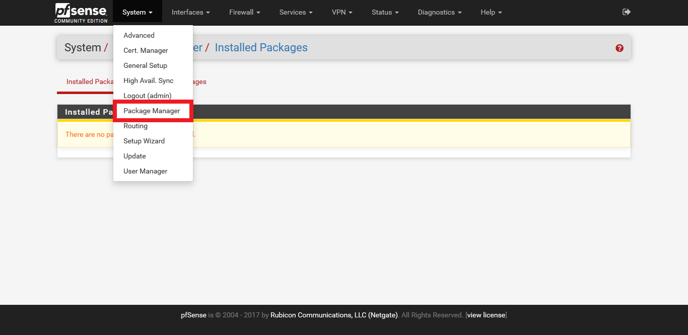

        + Chọn tab `Available Packages`. Sau đó nhập `openvpn` vào ô tìm kiếm và chọn `Search` để thực hiện tìm kiếm packages:

            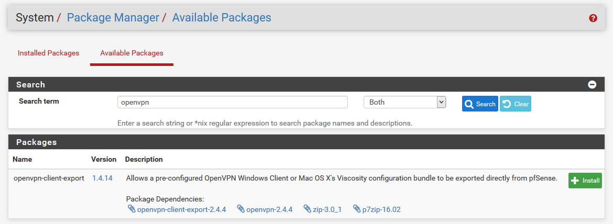

        +   Chọn `Install` cùng với hàng của tên gói packages để tiến hành cài đặt packages tương ứng:

            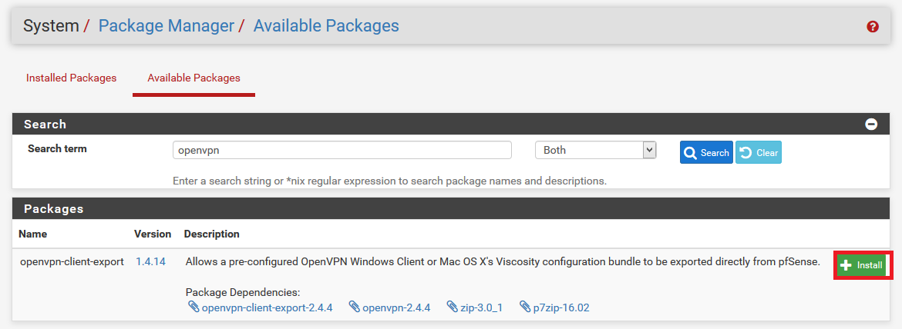

        + Tiếp tục chọn `Confirm` để xác nhận cài đặt packages:

            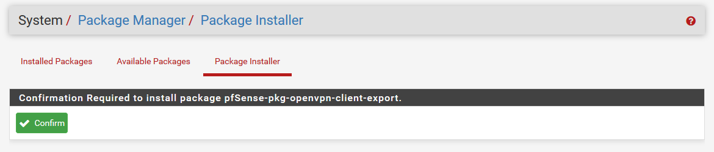

        + Hãy chờ một vài phút cho đến khi hệ thống cài đặt xong packages sẽ hiển thị thông báo như sau:

            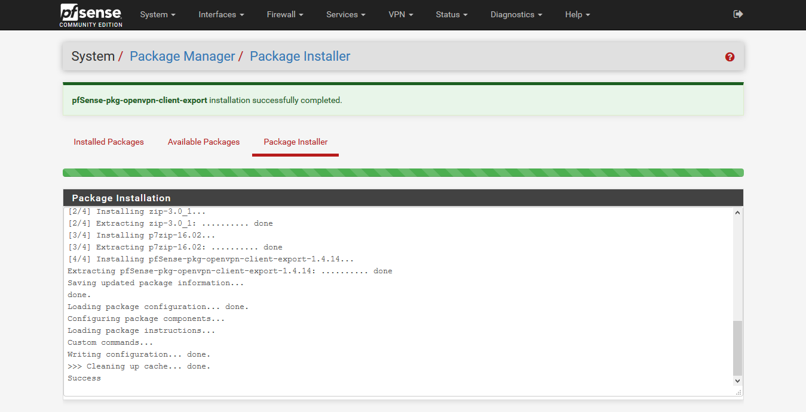

    
    - Bước 3. Tạo server VPN sử dụng pfSense. Cách thực hiện như sau:

        + Ta chọn menu `VPN` sau đó chọn `openVPN` rồi chuyển sang tab `Wizards`. Kết quả nhận được như sau:

            > 

        chọn `Next` ta được:

            > 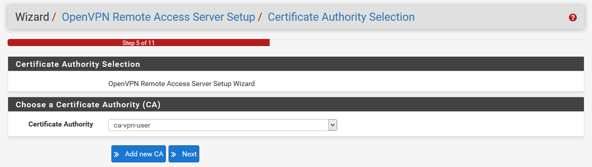

        tiếp tục chọn `Next` ta thu được:

            > 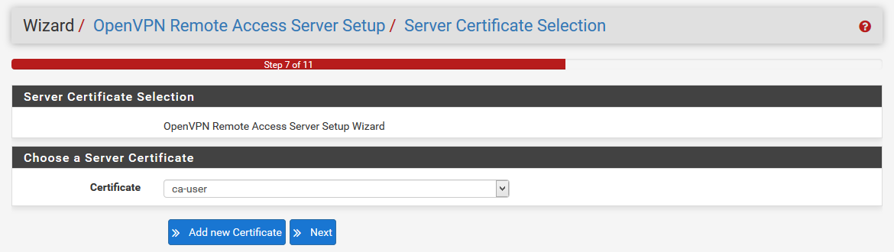
        
        chọn `Add new Certificate` để tạo ra một CA cho server openVPN sử dụng trong quá trình xác thực. Hãy nhập thông tin tương tự như hình sau:

            > 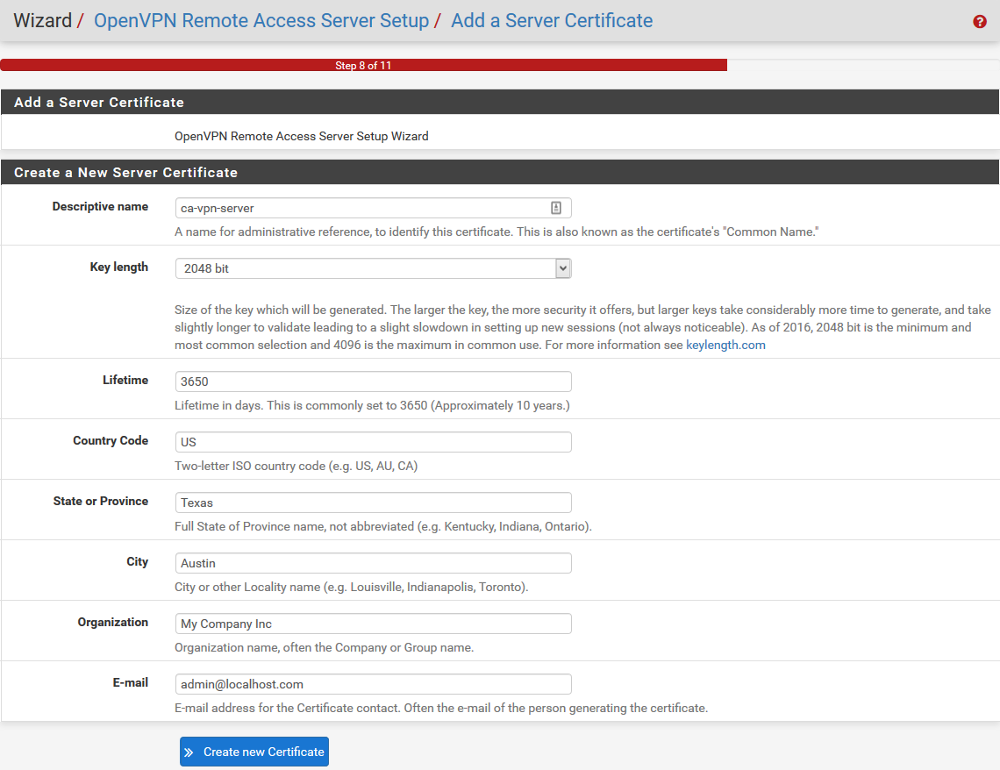

        tiếp tục chọn `Create new Certificate` ta sẽ được chuyển sang phần cấu hình chính cho server openVPN. Hãy thực hiện lựa chọn và điền các giá trị tương tự như hình sau:

            > 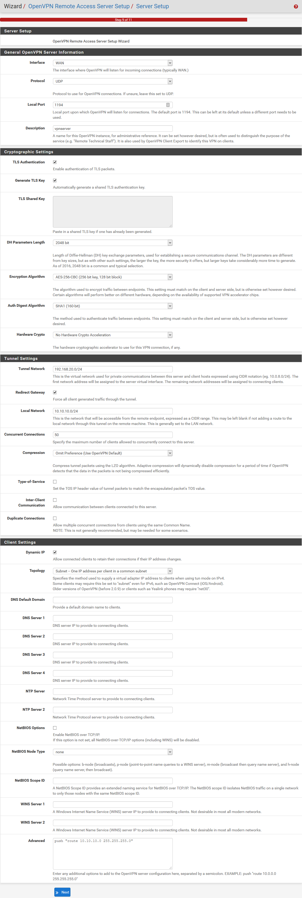

        chọn `Next`, sau đó tích chọn vào `Firewall Rule` và `openVPN rule` để tự động tạo ra rule firewall cho phép thiết lập các kết nối:
        
            > 

        Cuối cùng, ta chọn `Next` sau đó là `Finish` để kết thúc quá trình `Wizards` này. Kết quả ta nhận được một server openVPN với mode là tun.

            > 

    - Bước 4. Thực hiện export cấu hình và file cài đặt cho client.

        + Nhấp chuột double vào server openVPN vừa tạo, chuyển sang tab `Client Export`. Tại mục `OpenVPN Clients` ta chọn các file download phù hợp với hệ điều hành hiện đang sử dụng.

            > 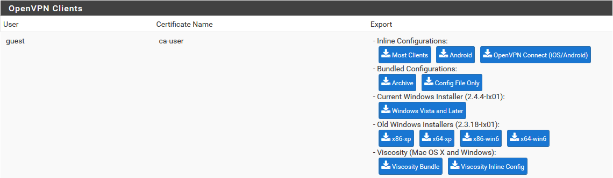

    Như vậy, ta đã hoàn tất quá trình cấu hình đối với server openVPN.

- ### <a name="checking">5.4 Kiểm tra kết quả</a>

    Sẽ cập nhật sau

____

# <a name="content-others">Các nội dung khác</a>
