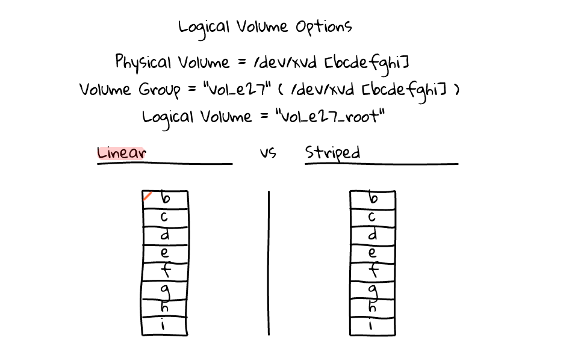
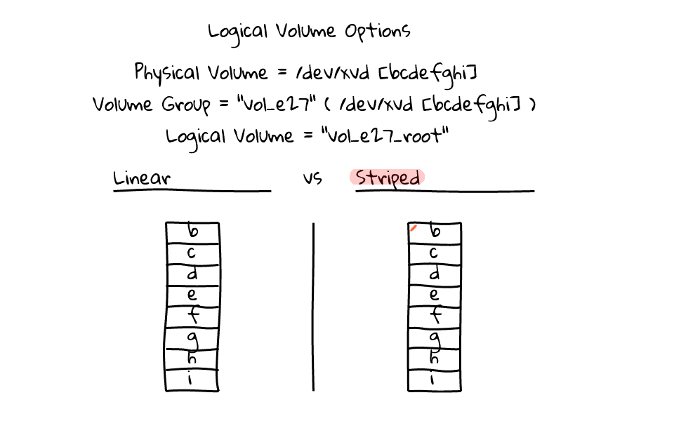
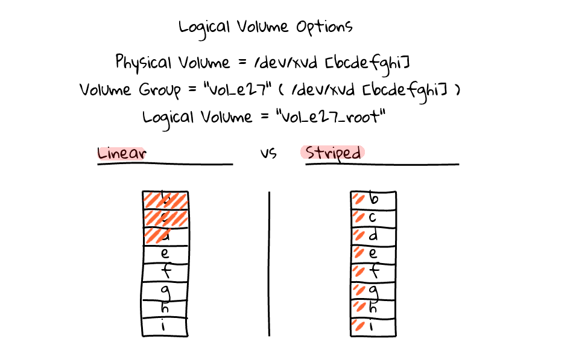

# 5. Cơ chế ghi đĩa Striping - LVM Stripe

____

# Mục lục

- [5.1 Giới thiệu về LVM Stripe](#about)
- [5.2 Cách thực hiện tạo một Logical Volume với LVM Stripe](#setup)
- [5.3 Kiểm tra kết quả](#check_result)
- [Các nội dung khác](#content-others)

____

# <a name="content">Nội dung</a>

- ### <a name="about">5.1 Giới thiệu về LVM Stripe</a>

    - `LVM Stripe` là một tính của LVM quy định cách ghi dữ liệu lên các đĩa hình thành lên Logical Volume. Nó dùng để thay thế cho cách ghi mặc định đó là việc ghi dữ liệu lần lượt lên từng Physical Volume. Khi dữ liệu được ghi đầy lên Physical Volume nó mới thực hiện ghi dữ liệu lên Physical Volume khác mà tạo lên Logical Volume chúng ta đang thực hiện ghi dữ liệu vào. Ví dụ:

        - Ta có một Logical Volume tên là `LV_Download` được hình thành từ 2 Physical Volume là `/dev/sdb` và `/dev/sdc`. Khi ta thực hiện ghi dữ liệu theo cách thông thường và `LV_Download` thì dữ liệu sẽ được ghi đầy vào `/dev/sdb` trước sau đó thì mới ghi vào `/dev/sdc`. 

        - Khi ta sử dụng LVM Stripe, dữ liệu ghi vào `LV_Download` sẽ có 50% dung lượng được ghi vào `/dev/sdb` và 50% dung lượng ghi vào `/dev/sdc`. Nói cách khác, khi dùng `LVM Stripe` dữ liệu được ghi vào Logical Volume sẽ được ghi đều lên các Physical Volume tạo lên Logical Volume đó.

    - Chính vì lý do trên, tính năng chính của `LVM Stripe` cung cấp đó là: 

        - Tăng hiệu năng ghi dữ liệu lên các đĩa.
        - Tiết kiệm không gian đĩa. Do ta có thể sử dụng một phần không gian đĩa còn trống để tạo lên một Physical Volume.
        
- ### <a name="setup">5.2 Cách thực hiện tạo một Logical Volume với LVM Stripe</a>

    - Giả sử, ta có 4 Physical Volume lần lượt được cho như sau:

        - `/dev/sdb`: 1Gb
        - `/dev/sdc`: 1Gb
        - `/dev/sdd`: 1Gb
        - `/dev/sde`: 1Gb

              # pvs
              PV         VG Fmt  Attr PSize  PFree
              /dev/sda2  cl lvm2 a--  19.00g    0
              /dev/sdb      lvm2 ---   1.00g 1.00g
              /dev/sdc      lvm2 ---   1.00g 1.00g
              /dev/sdd      lvm2 ---   1.00g 1.00g
              /dev/sde      lvm2 ---   1.00g 1.00g

    - Bước đầu tiên, ta sẽ tạo ra một Volume Group cho 4 Physical Logical đã có với tên là `LVM_VG_Stripe` với câu lệnh:

            # vgcreate -s 16M LVM_VG_Stripe /dev/sdb /dev/sdc /dev/sdd /dev/sde

        trong đó:

            - `-s 16M`: Dùng để khai báo kích thước của `PE Size` là 16Mb.
            - `LVM_VG_Stripe`: Tên của Volume Group sẽ được tạo ra.
            - `/dev/sdb /dev/sdc /dev/sdd /dev/sde`: Các Physical Volume sẽ dùng để tạo ra Volume Group

        cuối cùng, ta có kết quả tương tự như sau:

            # vgs
              VG            #PV #LV #SN Attr   VSize  VFree
              LVM_VG_Stripe   4   0   0 wz--n-  3.94g 3.94g
              cl              1   2   0 wz--n- 19.00g    0

    - Bước thứ hai, ta sẽ tạo ra một Logical Volume từ `LVM_VG_Stripe` với dung lượng `512Mb` có tên là `LVM_LV_Stripe` với câu lệnh:

            # lvcreate -L 500 -n LVM_LV_Stripe -i 4 LVM_VG_Stripe

        trong đó:

            - `-i 4`: Khai báo số disk sử dụng stripe

        kết quả sẽ hiển thị tương tự như sau:

              Using default stripesize 64.00 KiB.
              Rounding up size to full physical extent 512.00 MiB
              Logical volume "LVM_LV_Stripe" created.

    - Ta có thể kiểm tra về số lượng Physical Volume Stripe bằng việc sử dụng câu lệnh:

            # lvdisplay LVM_VG_Stripe/LVM_LV_Stripe -m

        kết quả sẽ hiển thị tương tự như sau:

              --- Logical volume ---
              LV Path                /dev/LVM_VG_Stripe/LVM_LV_Stripe
              LV Name                LVM_LV_Stripe
              VG Name                LVM_VG_Stripe
              LV UUID                gGBgOs-i8xS-yJqj-pdgD-h486-TLGW-rv3hVs
              LV Write Access        read/write
              LV Creation host, time test-settings, 2017-10-24 03:12:24 -0400
              LV Status              available
              # open                 0
              LV Size                512.00 MiB
              Current LE             32
              Segments               1
              Allocation             inherit
              Read ahead sectors     auto
              - currently set to     8192
              Block device           253:2

              --- Segments ---
              Logical extents 0 to 31:
                Type                striped
                Stripes             4
                Stripe size         64.00 KiB
                Stripe 0:
                  Physical volume   /dev/sdb
                  Physical extents  0 to 7
                Stripe 1:
                  Physical volume   /dev/sdc
                  Physical extents  0 to 7
                Stripe 2:
                  Physical volume   /dev/sdd
                  Physical extents  0 to 7
                Stripe 3:
                  Physical volume   /dev/sde
                  Physical extents  0 to 7

        nhìn vào nội dung của dòng `Stripes             4`, ta có thể biết được số lượng đĩa dùng để `stripes`

- ### <a name="check_result">5.3 Kiểm tra kết quả</a>

    - Ta có thể kiểm tra việc sử dụng đĩa để tạo ra Logical Volume sử dụng `stripes` như với câu lệnh:

            # pvs

        kết quả sẽ hiển thị tương tự như sau:

              PV         VG            Fmt  Attr PSize    PFree
              /dev/sda2  cl            lvm2 a--    19.00g      0
              /dev/sdb   LVM_VG_Stripe lvm2 a--  1008.00m 880.00m
              /dev/sdc   LVM_VG_Stripe lvm2 a--  1008.00m 880.00m
              /dev/sdd   LVM_VG_Stripe lvm2 a--  1008.00m 880.00m
              /dev/sde   LVM_VG_Stripe lvm2 a--  1008.00m 880.00m

        Ta thấy, mỗi Physical Volume đã sử dụng `128Mb` để tạo lên một Logical Volume có dung lượng `512Mb`. Đây là kết quả của việc sử dụng `LVM Stripes`. Ta hãy thử so sánh kết quả này với kết quả khi ta thực hiện tạo một Logical Volume không sử dụng `LVM Stripes` như cách làm dưới đây.

    - Tạo một `Logical Volume` mới tên là `LVM_LV_Public` với dung lượng 1Gb:

            #  lvcreate -L 1024 -n LVM_LV_Public  LVM_VG_Stripe

        kết quả khi ta kiểm tra với câu lệnh `pvs` sẽ hiển thị tương tự như sau:

            # pvs
              PV         VG            Fmt  Attr PSize    PFree
              /dev/sda2  cl            lvm2 a--    19.00g      0
              /dev/sdb   LVM_VG_Stripe lvm2 a--  1008.00m      0
              /dev/sdc   LVM_VG_Stripe lvm2 a--  1008.00m 736.00m
              /dev/sdd   LVM_VG_Stripe lvm2 a--  1008.00m 880.00m
              /dev/sde   LVM_VG_Stripe lvm2 a--  1008.00m 880.00m

        ta thấy được chỉ hai đĩa được sử dụng dung lượng bộ nhớ để tạo ra `LVM_LV_Public`. Đầu tiên là sử dụng `/dev/sdb` nhưng vì ta chỉ còn trống `880Mb` vì vậy nó sử dụng tiếp lưu lượng tại `/dev/sdc`. Đây là cơ chế `LVM Linear`.

    - Như vậy, ta có thể hình dung được cách thức hoạt động của cơ chế theo 2 hình ảnh sau:

        - Đối với LVM Linear:

            

        - Đối với LVM Stripe:

            

        - Tóm lại, ta được so sánh như sau:

            
    
____

# Tài liệu tham khảo:

- [What are the main differences between LVM Linear and LVM Striped in RHEL? - Red Hat Customer Portal](https://access.redhat.com/solutions/41341)

- [LVM Linear vs Striped Logical Volumes](https://sysadmincasts.com/episodes/27-lvm-linear-vs-striped-logical-volumes)

# <a name="content-others">Các nội dung khác</a>
