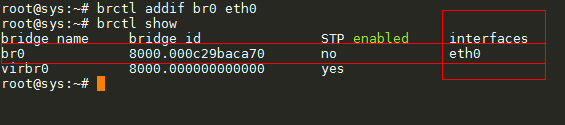

# Báo cáo tìm hiểu về Linux Bridge - Bridge Network Connections

# Mục lục

- [Giới thiệu](#introduction)
- [Cài đặt công cụ](#installing)
- Cấu hình cho Bridge
	+ [Cấu hình thủ công bridge](#manual-set-up)
	+ [Cấu hình trong file /etc/network/interfaces](#interfaces-set-up)
- <a href="KVM-QEMU.md#kvm-bridging">KVM and Bridge</a>
- Các khái niệm trong Bridge
	+ [Port in Bridge](#concept-port)
	+ [Tap interfaces](#concept-tap)

___

# Nội dung

- # <a name="introduction">Giới thiệu về Linux Bridge</a>

	+ Linux Bridge là một khái niệm chỉ việc bắc cầu (nối kết) các kết nối mạng của bạn. Nó được xem như là một phương thức tiện dụng cho việc chia sẻ kết nối internet giữa hai hay nhiều máy tính với nhau. Nó thực sự hữu ích khi bạn không có đủ điều kiện để mua một router với nhiều hơn một port ethenet.
	
	+ Nói cách khác, Linux Bridge là khái niệm dùng để chỉ hành động biến một máy vật lý trở thành một con switch ảo cho phép các máy khác kết nối tới trong môi trường Linux.

___

- # <a name="installing">Cài đặt công cụ</a>

	+ Công cụ bạn cần cài đặt để thực hiện điều trên được biết đến là `brctl` nằm trong gói cài đặt <a href="https://packages.debian.org/bridge-utils">bridge-utils</a> của Linux. Hãy cài đặt nó bằng việc sử dụng câu lệnh sau:

		+ Debian/ Ubuntu: `sudo apt-get install bridge-utils`
		+ RedHat/ CentOS: `yum install bridge-utils`

	+ Công cụ trên cho phép bạn thiết lập và sử dụng bridge interfaces. Bridge interfaces giống như các interfaces thông thường và là một interfaces ảo lấy dữ liệu từ một interfaces thật của máy vật lý.

___

- # Cấu hình cho Bridge
	- <a name="manual-set-up">Cấu hình thủ công bridge</a>
		
		Chú ý: tất cả các câu lệnh sau đây sẽ được sử dụng trên máy tính có kết nối mạng. Để thiết lập bridge, bạn có thể sử dụng dhcp hoặc sử dụng một địa chỉ tĩnh. Các câu lệnh được thực hiện với quyền siêu người dùng (sudo)

		+ Bước 1: Tạo mới một bridge interfaces
			> `brctl addbr br0`
			
			Với câu lệnh trên, chúng ta đã tạo ra được một interfaces mới có tên là br0. Kết quả là:

			> 

		+ Bước 2: Gán bridge interfaces đã tạo với một interfaces đã tồn tại có kết nối internet.
			> `brctl addif br0 eth0` # chỉ gán 1 interfaces cho br0
			
			hoặc

			> `brctl addif br0 eth0 eth1` # gán nhiều interfaces cho br0. Ở đây là gán eth1 và eth0 cho br0

			Thực hiện gán bridge interfaces br0 vừa tạo với interfaces đã tồn tại trên máy vật lý là eth0. Kết quả được như sau:

			> 
			
			trong trường hợp bạn gắn 2 hay nhiều port vào br0 thì cần phải thiết lập thứ tự ưu tiên cho các port để br0 dễ dàng nhận địa chỉ IP của. Ta sử dụng câu lệnh sau để thiết lập câu lệnh. Lưu ý: port nào có chỉ số cao hơn thì được ưu tiên trước. Ví dụ:

			> `brctl setportprio br0 eth0 3`

			> `brctl setportprio br0 eth1 1`

			Các giá trị: 3, 1 được xem là các chỉ số ưu tiên.
		+ Bước 3: Cấu hình bridging trong /etc/network/interfaces  
			Bạn hãy chỉnh sửa file cấu hình này với nội dung như sau:
      
				
				# auto eth0
				iface eth0 inet manual # Disable eth0 đi để tránh mâu thuẫn khi sử dụng bridge.
        
				...
        
				auto br0
				iface br0 inet dhcp  # Thiết lập dhcp cho br0
				bridge_ports eth0 
			
			tương tự như hình sau:
			> 
			
			nếu như bạn đã gắn nhiều hơn 1 interfaces cho br0 thì cần chỉnh nội dung dòng `bridge_ports ports`. Ví dụ:
				
				iface eth0 inet manual
				iface eth1 inet manual
				
				...

				bridge_ports eth0 eth1

			Trong trường hợp bạn muốn cấu hình cho bridging interfaces br0 tĩnh. Thì hãy chỉnh sửa file /etc/network/interfaces lại như sau:

				# auto eth0
				iface eth0 inet manual # Disable eth0 đi để tránh mâu thuẫn khi sử dụng bridge.
        
				...
        
				auto br0
				iface br0 inet dhcp  # Thiết lập dhcp cho br0
				bridge_ports eth0
				address 192.168.178.130
				network 192.168.178.130
				netmask 255.255.255.0
				broadcast 192.168.178.255
				gateway 192.168.178.1
				#dns-nameservers 192.168.178.1
				bridge_stp yes # Khởi động chế độ chống loop gói tin (Spanning Tree Protocol)
			
			tương tự như hình sau:
			> 
			
			ngoài ra trong bridge còn có các chế độ sau:

		        bridge_waitport 0    # no delay before a port becomes available
		        bridge_fd 0          # no forwarding delay
		        bridge_ports none    # if you do not want to bind to any ports
		        bridge_ports regex eth* # use a regular expression to define ports

		+ Bước 4: Khởi động lại internet.
			Trong trường hợp này, nếu tôi chỉ sử dụng câu lệnh:
			> `ifup br0`

			Kết quả nhận được là:

			

			Bạn hãy nhìn vào các vùng mà mình đã đóng khung màu đỏ. Bạn sẽ thấy 2 interfaces này có cùng một địa chỉ IP. Vì vậy mà ở bước trên chúng ta cần phải thiết lập cho interfaces eth0 là `iface eth0 inet manual` là vì điều này.

			Để được một kết quả hoàn hảo sau quá trình thiết lập, bạn hãy sử dụng câu lệnh sau:
			> `ifdown -a && ifup -a` hoặc `reboot now`

			Kết quả của hành động thực hiện câu lệnh `ifdown -a && ifup -a`, tôi nhận được:

			

___

- # Các khái niệm trong Linux Bridge
	
	+ <a name="concept-port">Khái niệm về ports</a>

		Port trong Linux Bridge được hiểu như khái niệm của các ports thông thường khác.

	+ <a name="concept-tap">Khái niệm về tap</a>

		Tap interfaces là khái niệm được hiểu như các ports ảo của switch trong môi trường server ảo. Bạn có thể đọc rõ hơn [tại đây](http://www.innervoice.in/blogs/2013/12/08/tap-interfaces-linux-bridge/)

___

Tài liệu tham khảo:

- [Understanding Virtual Networks – Ports and VLAN](http://www.innervoice.in/blogs/2012/08/30/understanding-virtual-networks-ports-and-vlan/)

- [Tap Interfaces and Linux Bridge](http://www.innervoice.in/blogs/2013/12/08/tap-interfaces-linux-bridge/)