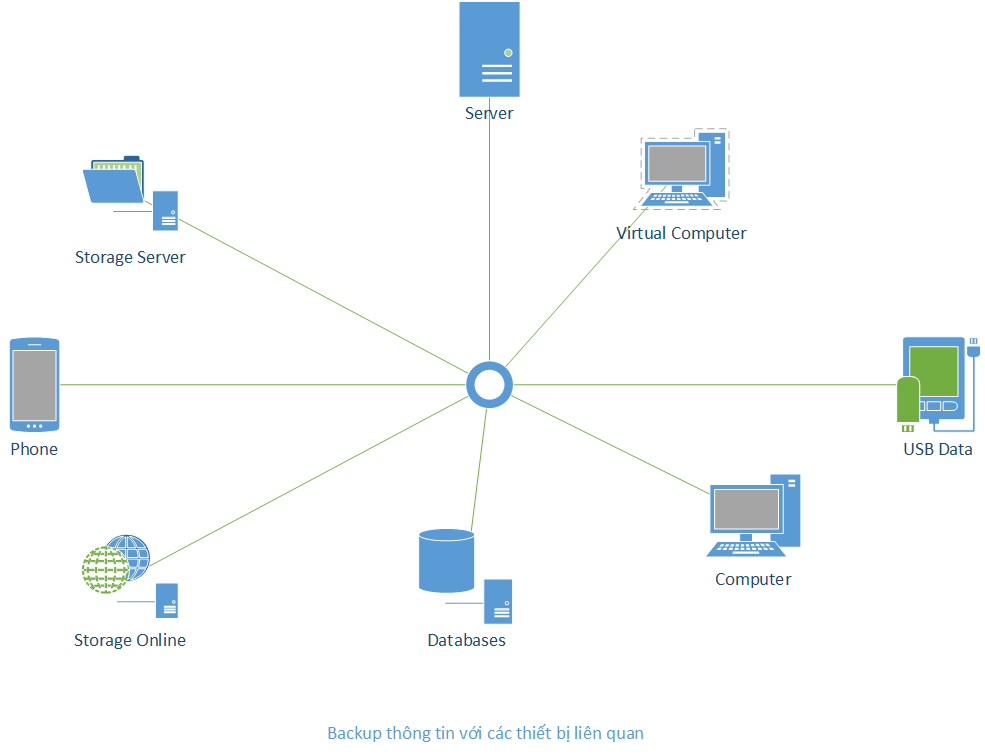

# 1. Cách Backup Database MySQL và File cài đặt, cấu hình quan trọng trên Ubuntu

____

# Mục lục

- [1.1. Đưa ra vấn đề](#issue)
- [1.2. Phương pháp backup MySQL](#backup-mysql)
- [1.3. Backup file cài đặt, cấu hình quan trọng](#backup-file)
- [1.4. Restore dữ liệu MySQL](#restore-mysql)
- [Các nội dung khác](#content-others)

____

# <a name="content">Nội dung</a>

- ### <a name="issue">1.1. Đưa ra vấn đề</a>

    - Trong cở sở hạ tầng của các hệ thống mạng. Việc đảm bảo cho hệ thống ở trạng thái hoạt động với thời gian nhiều nhất có thể luôn được chú ý. Một loạt các giải pháp và thiết kế hệ thống được đưa ra với các tính năng gọi chung là High Availability nhắm đảm bảo cho hệ thống hoạt động một cách ổn định nhất và hạn chế những sự cố phát sinh trong quá trình hệ thống đang được sử dụng.

    - Việc thực hiện backup các dữ liệu quan trọng như database, các file cấu hình, các file cài đặt cũng là một công việc không thể thiếu trong quá trình đảm bảo cho hệ thống hoạt động ổn định và thời gian để khắc phục lỗi phát sinh ít nhất có thể.

    - Backup là một công việc sao lưu lại các thông tin mà bản thân ta cảm thấy quan trọng cho hệ thống và cần thiết từ một thiết bị A sang một thiết bị B. Các thiết bị có thể chỉ là một chiếc USB, một máy chủ, ...

        > 

- ### <a name="backup-mysql">1.2. Phương pháp backup MySQL</a>

    - Trong một hệ thống các máy chủ, việc sao lưu dữ liệu của database là một công việc khá là quen thuộc. Bởi database chứa và cung cấp các thông tin thuộc về hệ thống như dữ liệu của hệ thống, log, các thông tin về con người, về công việc, ...

    - Trong MySQL cũng đã cung cấp cho chúng ta một công cụ là `mysqldump` có thể giúp cho chúng ta thực hiện công việc backup dữ liệu của database. Vậy cụ thể việc thực hiện như thế nào?

        + Backup database MySQL:

            - Để thực hiện backup thì trước tiên database(s) sẽ được backup cần phải có trong server của bạn và bạn có quyền truy cập vào database(s). Hãy sử dụng câu lệnh có cấu trúc như sau sau để thực hiện backup:

                    mysqldump -u usename -p database_name > database_name.sql

                trong đó:

                - `username` là tên người dùng hợp lệ có thể truy cập database với quyền hạn backup
                - `database_name` là tên database được backup
                - `database_name.sql`: là tên một file dump của database. Thông thường thì tên file được đặt trùng với tên của database được backup

                Khi thực hiện câu lệnh, bạn sẽ được yêu cầu nhập mật khẩu ứng với username đã nhập trước đó.

            - Để thực hiện backup cho một database ta sử dụng câu lệnh sau:

                    mysqldump -u root -p database_name > database_name.sql

            - Để thực hiện backup cho nhiều hơn một database ta sử dụng câu lệnh sau:

                    mysqldump -u root -p --databases database_name_1st database_name_2th database_name_nth > n_database_file.sql

                trong đó:

                - `database_name_1st`, `database_name_2th`, `database_name_nth` lần lượt là các database cần backup

            - Để thực hiện backup tất cả các database, ta sử dụng câu lệnh đơn giản sau:

                    mysqldump -u root -p --all-databases > all_databases.sql

            - Để thực hiện backup mỗi cấu trúc của database mà không cần đến dữ liệu, ta sử dụng câu lệnh:

                    mysqldump -u root -p --no-data database_name > database_name_struc.sql

            - Để thực hiện backup mỗi dữ liệu của database mà không cần đến cấu trúc, ta sử dụng câu lệnh:

                    mysqldump -u root -p --no-create-db --no-create-info database_name > database_name_data.sql

            - Để thực hiện backup một tables trong database ta sử dụng câu lệnh sau:

                    mysqldump -u root -p database_name tables_name > tables_name_database_name.sql

                trong đó:

                - `tables_name`:  là tên của table cần backup. Nếu có nhiều hơn một table thì tên của các table ngăn cách nhau bởi dấu cách " ".

            - Để thực hiện backup database từ một remote server, ta kết hợp các câu lệnh trên đi kèm với tham số `-h `. Ví dụ, để thực hiện backup toàn bộ database từ server có địa chỉ IP là `10.10.10.254`, ta sử dụng câu lệnh như sau:

                    mysqldump -h 10.10.10.254 -u root -p --all-databases > all_database.sql

                trong đó:

                - file backup sẽ được lưu tại local server.

            - Việc cuối cùng, ta cần phải đưa các thông tin về file backup sang một hay nhiều thiết bị khác để lưu trữ, đề phòng trường hợp máy chủ thực hiện backup xảy ra sự cố và không thể nào lấy lại được không tin dữ liệu.

        + Hiện tại, trên hệ điều hành Ubuntu có hỗ trợ gói `automysqlbackup` phục vụ cho việc backup các database trên local server. Đây là công cụ mã nguồn mở hỗ trợ thực hiện backup tại các thời điểm khác nhau, nhưng hàng ngày, hàng tuần, hàng tháng. Công cụ sử dụng công cụ `mysqldump` để backup một hay nhiều databases đồng thời. Cung cấp tính năng như thông báo email, tăng số lượng backup, nén, mã hóa bản backup và nhiều tính năng khác. Để cài đặt gói `automysqlbackup` trên Ubuntu ta thực hiện sử dụng câu lệnh:

                apt-get update -y
                apt-get upgrade -y
                apt-get install -y automysqlbackup

            khi cài đặt, ta sẽ được yêu cầu cấu hình `postfix` cho mail server. Hãy chọn `No configuration` để bỏ qua.

            + Tiếp theo, ta sẽ cần cấu hình cho AutoMySQLBackup:

                - Mặc định `automysqlbackup` được cấu hình tại `/etc/default/automysqlbackup`. Đường dẫn lưu các backup tại `/var/lib/automysqlbackup`. Để biết chi tiết về file cấu hình, ta sử dụng câu lệnh `man automysqlbackup`.

                - Việc cấu hình cũng có chỉnh sửa tại `/usr/sbin/automysqlbackup` nếu như file `/etc/default/automysqlbackup` không tồn tại.

            + Để thực hiện backup, ta sử dụng câu lệnh:

                    automysqlbackup

                kết quả, ta thu được các file backup đã được nén lưu tại `/var/lib/automysqlbackup`.

- ### <a name="backup-file">1.3. Backup file cài đặt, cấu hình quan trọng</a>

    - Backup các file cài đặt:

        + Trong hệ điều hành Ubuntu, có hỗ trợ cho chúng ta việc lưu lại các gói cài đặt sử dụng để cài đặt phần mềm khi ta sử dụng với câu lệnh `apt-get`. Các file được lưu trữ tại đường dẫn `/var/cache/apt/archives`. Thư mục này chứa toàn bộ các file `*.deb` được dùng để cài đặt gói phần mềm còn lưu lại. Ta có thể thực hiện copy toàn bộ các file cài đặt ra một vị trí khác để có thể tái sử dụng với câu lệnh:

                dpkg -i *.deb

    - Backup các file cấu hình:

        + Thông thường, trong Ubuntu các file cấu hình của các phần mềm thường được lưu trữ dưới dạng `*.conf` nằm trong thư mục `/etc`. Việc backup có thể đơn giản là việc copy các file cấu hình ra một thiết bị khác. Khi ta muốn phục hồi thì lại copy nguyên file cấu hình vào vị trí cũ. Giúp ta có tiết kiệm thời gian đáng kể.

- ### <a name="restore-mysql">1.4. Restore dữ liệu MySQL</a>

    - Để thực hiện restore database, đôi khi, ta cần phải có một database trống trong server. Đơn giản chỉ là thực hiện tạo ra một database rồi sau đó không cần phải tạo thêm các bảng. Sau đó, ta sử dụng câu lệnh có dạng sau để restore database:

            mysql -u root -p database_name < database_name.sql

        hoặc 

            mysql -u root -p --one-database database_name < all_databases.sql

        để chỉ restore database_name trong file all_databases.sql

____

# <a name="content-others">Các nội dung khác</a>

- Tài liệu tham khảo [Vultr - How to install and configure automysqlbackup](https://www.vultr.com/docs/how-to-install-and-configure-automysqlbackup-on-ubuntu-16-04)