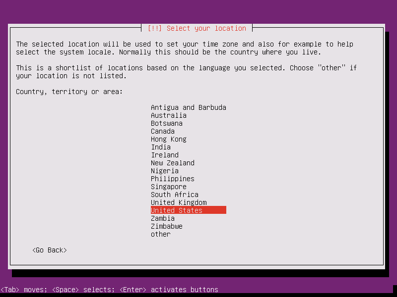
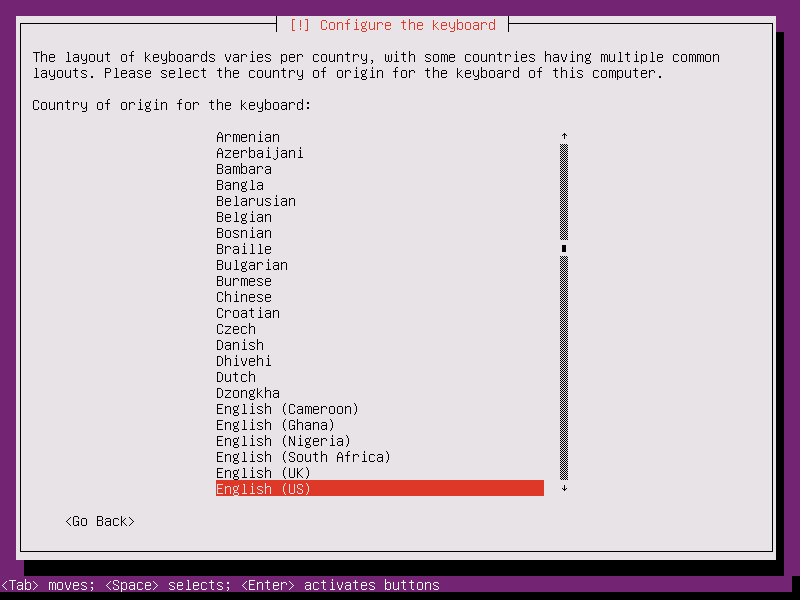
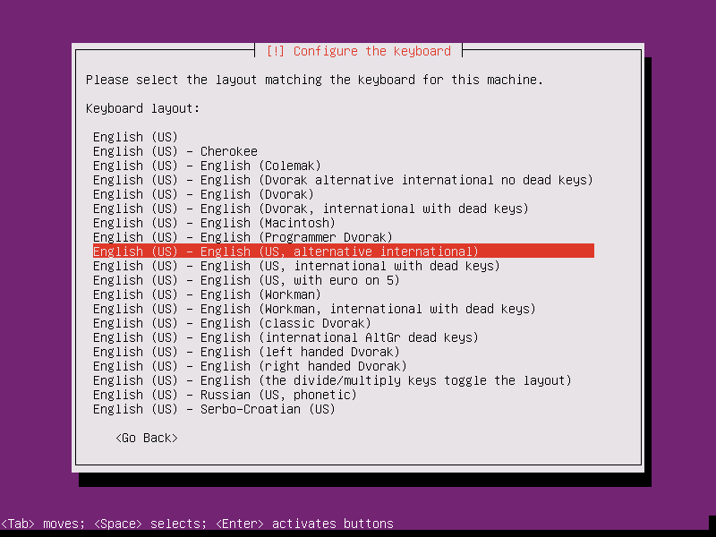
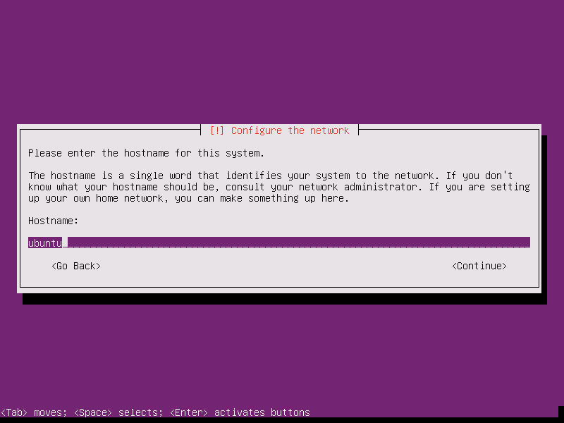
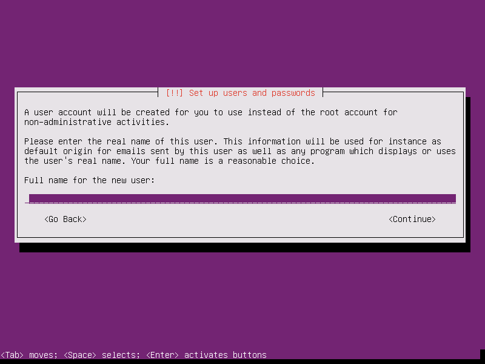
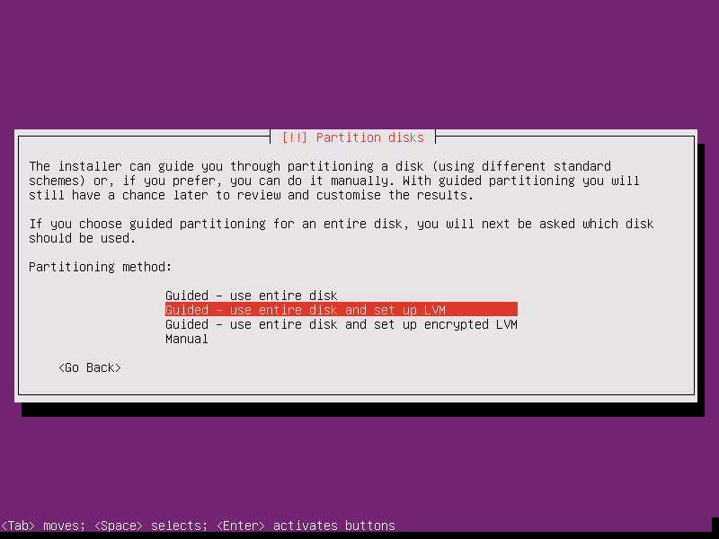
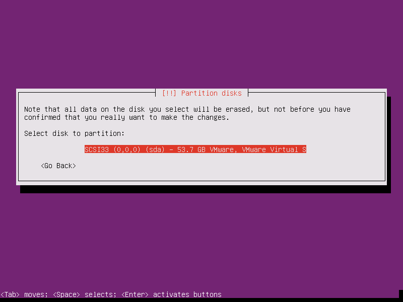
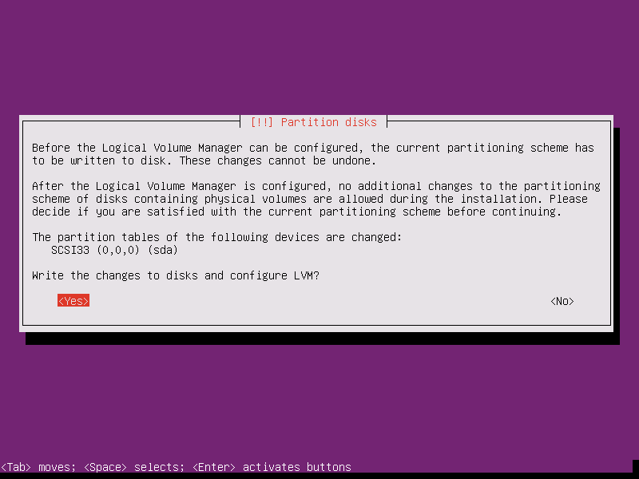
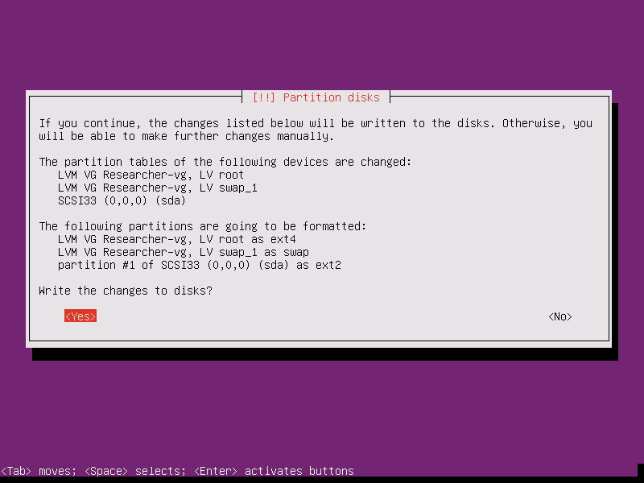
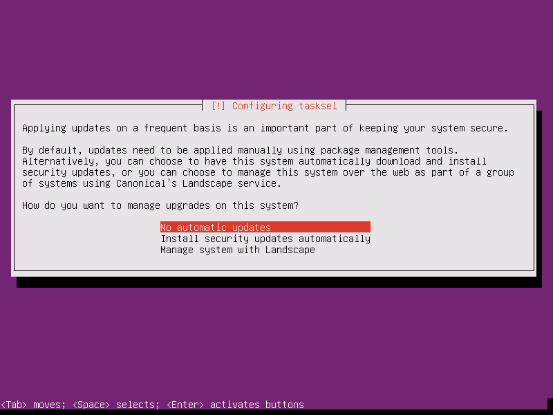

# Báo cáo: Cách cài đặt Ubuntu Server (Ubuntu Server 16.04 - 64bit)

# 1. Giới thiệu
Ubuntu Server 16.04 là bản distro mã nguồn mở được phát hành vào tháng 04 năm 2016
Hiện có thể download tại [Ubuntu](https://www.ubuntu.com/download/server) hoặc tại [Releases Ubuntu](http://releases.ubuntu.com/)

# 2. Các bước tiến hành cài đặt Ubuntu Server

> Dùng phím `Tab` để di chuyển đến các mục, `Spaces` để lựa chọn các mục, `Enter` để chấp nhận.

### 2.1 Sau khi vào chế độ boot của máy tính để tiến hành cài đặt. Ta được hình như sau:

Phần này, có chức năng chọn ngôn ngữ được hiển thị trong suốt quá trình cài đặt và cũng là ngôn ngữ được hiển thị bởi hệ thống sau khi cài đặt thành công.
Nhấn `Enter` nếu muốn lựa chọn Tiếng Anh (Enlish).

### 2.2 Tiếp theo sẽ là mục lựa múi giờ (location):

Phần này, tùy vào vị trí hiện tại của bạn =)) (Cái này tùy). Giả sử hiện tại mình đang ở US, nhấn `Enter`.

### 2.3 Cài đặt type cho keyboard.

Ở mục này, ta nên chọn `No` để thiết lập một cách thủ công.
Ở lần cài đặt đầu tiên, mình đã chọn `Yes` nhưng sau đó mình đã không làm được đúng mục tiếp theo lên các phím gõ sẽ bị chệch.
Vd: nhấn `a` có thể ra `e` hay một phím bất kỳ nào khác.

### 2.4 Lựa chọn kiểu nhập cho bàn phím.

Ở mục này, tùy theo vị trí và ngôn ngữ bạn sử dụng mà chọn.
Đối với mình, mình chọn `English (US)` > nhấn `Enter`.

### 2.5 Lựa chọn layout khớp với kiểu nhập của bàn phím.

Tùy theo lựa chọn ở mục trước, mà bạn chọn phần này sao cho phù hợp.
Vd: `English (US) - English (US)`

### 2.6 Thiết lập tên hostname

Nhập tên hostname theo ý muốn của bạn.

### 2.7 Thiết lập user.

Nhập tên theo ý muốn của bạn. Mặc định, đây là tên người dùng quản trị.

### 2.8 Thiết lập cho username

Nhập username - Đây là username dùng để đăng nhập vào hệ thống.

### 2.9 Thiết lập cho password

Nhập password cho username ở mục trước. Nó kết hợp với username để đăng nhập vào hệ thống!
Nếu không có password. 99% bạn sẽ không làm được gì cả. Hãy thật cẩn trọng nhớ cặp đôi username và password này =)

### 2.10 Confirm password

Mục này là mục xác nhận lại password bạn đã nhập ở mục trước! Hãy chắc chắn rằng bạn nhập chính xác password đã được sử dụng ở mục cài đặt trước.

### 3.0 Mã hóa home directory.

Nếu bạn chọn `Yes` thì home directory sẽ được mã hóa. Điều này sẽ làm tăng tính bảo mật hơn trong trường hợp thiết bị của bạn bị đánh cắp dữ liệu. Bởi các dữ liệu của các chương trình trong hệ thống sẽ được lưu tại home directory.

Chọn `Yes`.

### 3.1 Xác nhận lại múi giờ

Hãy chắc chắn rằng, bạn đã chọn đúng múi giờ của mình và tiếp tục.

### 3.2 Cấu hình phân vùng ổ cứng.

Ví dụ: Chọn `Guide (LVM)`

Nếu bạn chọn `Guide (LVM)`, ta được:

Mục này có chức năng lựa chọn đĩa để tạo phân vùng ổ cứng.
Nhấn `Enter`

Nếu đúng, chọn `Yes`

Nhập vào giá trị một lượng bộ nhớ cho LVM volume group.
VD: 200GB > Nhấn `Continue`

Nếu đúng, chọn `Yes`

### 3.3 Setting

Quá trình cài đặt hệ thống đang được diễn ra. Bạn cần chờ từ 5 ~ 10 phút để hệ thống được cài đặt trên thiết bị của bạn.

Hãy thiết lập Proxy nếu bạn muốn sử dụng bằng việc nhập vào 1 proxy! Ngược lại hãy để trống rồi nhấn `Enter`

Hãy chọn nó nếu bạn thiết lập cập nhật tự động. cập nhật tự động rất tiện lợi nhưng đôi khi nó gây phiền hà, vì vậy nếu bạn sử dụng máy chủ này làm một nhiệm vụ quan trọng như một Server, thì hãy không sử dụng cập nhật tự động, tốt hơn hết bạn hãy để cập nhật bằng tay sau khi xác minh.

Select `No automatic updates` > `Enter`

Đây là mục lựa chọn các phần mềm để cài cho hệ thống. Theo quan điểm của mình, bạn nên chọn tất cả bằng việc sử dụng phím `Space` Sau đó nhấn `Enter`. Điều này sẽ tốt hơn việc bạn chỉ cài những phần mềm mà hệ thống bạn cần có.

Chọn `Yes`

Chọn `Continue`

### 3.4 Running

Nhập `username` ở mục *2.8* rồi nhấn `Enter`.
Nhập `passowrd` ở mục *2.9* rồi nhấn `Enter`.

Vậy là bạn đã cài đặt hoàn thiện Ubuntu Server và đang truy cập nó.

Chúc các bạn cài đặt thành công. =))
