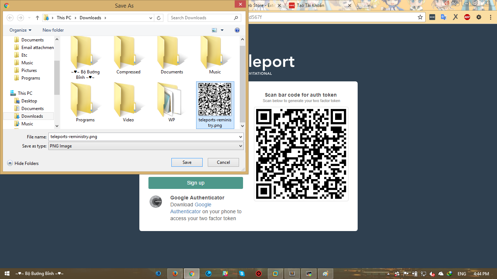

# Tạo một user để sử dụng hệ thống teleport

Lưu ý:
	Các câu lệnh được thực hiện với quyền user root.

- Người sử dụng `teleport` được định nghĩa trên mức cluster và tất cả các người dùng `teleport` phải được liên kết với một tên người dùng mức OS để có thể xác thực trong quá trình đăng nhập gọi là `user mapping`. Nếu như bạn không chỉ định các ánh xạ, người dùng `teleport` sẽ được liên kết vào một mapping cùng tên với người dùng đó. Thông thường, ta nên tạo người dùng có cùng tên với người dùng hệ thống để dễ dàng phân biệt ai đã sử dụng hệ thống này trong việc remote.

- Để tạo một người sử dụng `teleport` ta hãy mở một tab console khác và thực hiện câu lệnh sau:
	> `tctl users add $USER`
	
		$USER sẽ trả về tên mà người dùng đang thực hiện câu lệnh

	Kết quả ta nhận được 
	> 

	Đường link được cung cấp chỉ tồn tại trong vòng 3600s. Bạn hãy truy cập nó bằng trình duyệt của bạn và thay sys là địa chỉ ip của máy. Ví dụ: Theo đường link trong hình và địa chỉ ip của máy mình là 10.245.25.41 thì truy cập vào địa chỉ: https://10.145.25.41:3080/web/newuser/3075a938f676d916d2b15cf938b4749a. Kết quả ta nhận được:
	> 

- Tại thời điểm này, chúng ta cần quan tâm đến token sử dụng api của google authencators để có thể đăng nhập vào hệ thống. Có 2 cách để xử lý nó đó là:

	+ Cách 1: Download Google Authencators và cài đặt về smart phone theo hướng dẫn tại đây [Google Authencators](https://support.google.com/accounts/answer/1066447?hl=en) và làm theo các hướng dẫn tại đó để có được token.

	+ Cách 2: Sử dụng công cụ online của 2 trang web sau: [Read QR Code](https://online-barcode-reader.inliteresearch.com/) và [GAuth](https://gauth.apps.gbraad.nl/). Thứ tự các bước thực hiện là:
		+ Bước 1: Lưu lại hình ảnh của QR Code tại trang đăng nhập
			> 

		+ Bước 2: Truy cập trang [Read QR Code](https://online-barcode-reader.inliteresearch.com/). Lựa chọn vào mục:
			* [X] QR code
		+ Bước 3: Chọn tệp hình ảnh vừa lưu để tải lên và click Read button:
			> 

		+ Bước 4: Copy lại giá trị của `secret` mà ta nhận được:
			> 

		+ Bước 5: Truy cập trang [GAuth](https://gauth.apps.gbraad.nl/):
			- Click vào biểu tượng: 
			- Click vào biểu tượng: 
			- Điền `Account name` là tên `user` mà ta đã tạo:
			- Điền `Serect key` là giá trị `secret` mà ta vừa có được từ qr code:
				> 
			- Click vào biểu tượng:  ta được tương tự như sau:
				> 

				> Ở đây `219770` chính là token sử dụng để đăng nhập vào hệ thống. Hãy nhập nó và mật khẩu tùy ý để hoàn tất thủ tục đăng nhập.

		+ Bước 6: Kiểm tra kết quả, kết quả đăng nhập thành công được hiển thị tương tự như sau:
			> 

- Vậy là chúng ta đã hoàn thành quá trình tạo người sử dụng và đăng nhập thành công trên web để quản lý các phiên đăng nhập.
___

# Nội dung liên quan

- [Giới thiệu về Teleport](../README.md#about)
- Quickstart
	- [Cài đặt và sử dụng](installation.md)
	- [Thêm một Node mới vào Cluster](add-nodes.md#add-nodes)
	- [Tạo label cho Node](add-nodes.md#add-label)
	- [Chia sẻ phiên đăng nhập SSH](sharing-ssh)
	- [Teleconsole](teleconsole.md)
- Kiến trúc của Teleport
	> Sẽ cập nhật sau
- Hướng dẫn dành cho user
	> Sẽ cập nhật sau
- Hướng dẫn dành cho admin
	> Sẽ cập nhật sau