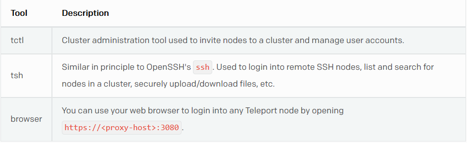

# Cài đặt Teleport

Lưu ý:

- `teleport` mặc định được chạy trên 3 loại dịch vụ đó là `nodes`, `proxies` và `auth server` với việc cung cấp của 3 công cụ cho phép thực hiện các chức năng theo mô tả sau:
	> 

- Các dịch vụ của `teleport` sử dụng mặc định các cổng sau để hoạt động:
	> 

- Các câu lện cài đặt sẽ được thực hiện với quyền root

Tiến hành cài đặt:

- Bước 1: Download bản cài đặt của Teleport:
	> `wget https://github.com/gravitational/teleport/releases/download/v2.1.0-alpha.2/teleport-v2.1.0-alpha.2-linux-amd64-bin.tar.gz`

- Bước 2: Giải nén, thực hiện cài đặt
	> `tar -zxf teleport-v2.1.0-alpha.2-linux-amd64-bin.tar.gz && make install`

- Bước 3: Tạo một thư mục để `teleport` có thể lưu trữ dữ liệu của nó. Mặc định thưc mục này là `/var/lib/teleport`
	> `mkdir -p /var/lib/teleport`

- Bước 4: Khởi động start
	> `teleport start`

	Kết quả nhận được giống như sau:
	> 

___

# Nội dung liên quan

- [Giới thiệu về Teleport](../README.md#about)
- Quickstart
	- [Cài đặt và sử dụng](installation.md)
	- [Thêm một Node mới vào Cluster](add-nodes.md#add-nodes)
	- [Tạo label cho Node](add-nodes.md#add-label)
	- [Chia sẻ phiên đăng nhập SSH](sharing-ssh)
	- [Teleconsole](teleconsole.md)
- Kiến trúc của Teleport
	> Sẽ cập nhật sau
- Hướng dẫn dành cho user
	> Sẽ cập nhật sau
- Hướng dẫn dành cho admin
	> Sẽ cập nhật sau