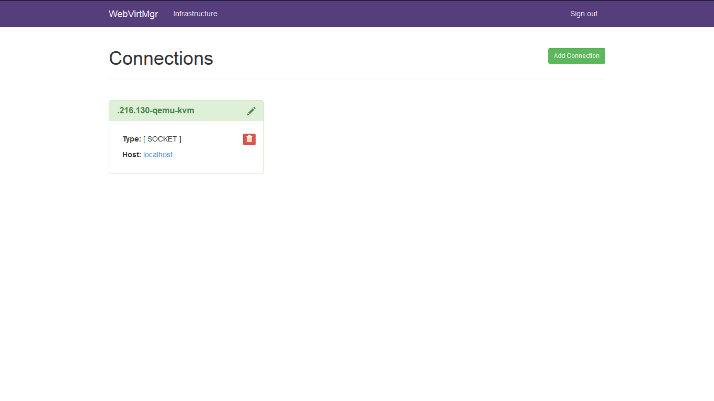
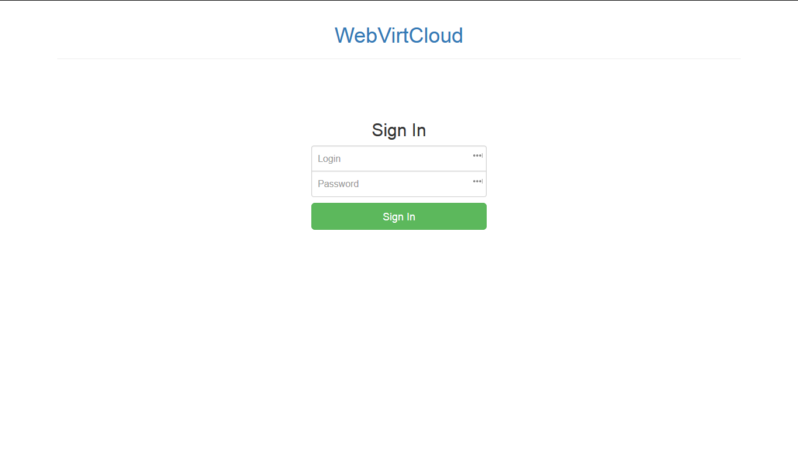

# Tạo một máy ảo kvm

# Mục lục

- [Tạo VMs sử dụng virt-install (CLI)](#virt-install)
	+ [Tạo VMs từ file cài đặt *.iso (CD-ROM)](#iso)
	+ [Tạo VMs từ file cài đặt internet (Netboot)](#netboot)
	+ [Tạo VMs từ file *.img có sẵn](#img)
	+ [Tạo VMs từ file *.xml](#xml)
- [Tạo VMs sử dụng virt-manager (GUI)](#virt-manager)
- [Tạo VMs sử dụng giao diện website (WWW)](#virt-web)
	+ [Webvirt](#Webvirt)
	+ [WebvirtCloud](#WebvirtCloud)
	+ [Convirt2](#Convirt)
	+ [Wok với kimchi plugins](#Wok)


# Nội dung

- # <a name="virt-install">Tạo VMs sử dụng virt-install (CLI)</a>
	+ virt-install hỗ trợ 3 cách tiến hành tạo máy ảo kvm từ CLI. Sau khi tiến hành thực hiện cài đặt qemu-kvm. Ta có thể sử dụng 1 trong 3 cách sau để tạo cho mình một VM. Trước khi tiến hành tạo VMs, ta hãy tạo một thư mục để chứ dữ liệu để lưu trữ các file dùng cho các VMs tạo ra. Ví dụ như sau:

			# mkdir /var/qemu-kvm/images	# Chứa file cài đặt image (*.img)

	+ # <a name="iso">Tạo VMs từ file cài đặt *.iso (CD-ROM)</a>

		* Để tiến hành cài tạo một VM từ file cài đặt *.iso chứa hệ điều hành nào đó. Ta sử dụng câu lệnh sau:

				# virt-install \		
				  --name firstVM \		
				  --ram 1024 \		
				  --disk path=/var/kvm/images/firstVM.img,size=10 \		
				  --vcpus 2 \		
				  --os-type linux \		
				  --os-variant ubuntutrusty \	
				  --network bridge=br0 \
				  --graphics vnc \
				  --console pty,target_type=serial \
				  --cdrom=/var/qemu-kvm/template.iso

		* Giải thích ý nghĩa câu lệnh

			1. virt-install 						: Câu lệnh thực hiện gọi chức năng virt-install (require)
			2. --name firstVM						: Khai báo tên cho VM (require)
			3. --ram 1024							: Khai báo kích thước RAM(Mb) cung cấp cho VM (require)
			4. --disk path=/var/kvm/images/firstVM.img,size=10
													: Khai báo đường dẫn của file storage của VM và  kích cỡ của nó (Gb)
			5. --vcpus 2 							: Khai báo số lượng CPU ảo cung cấp cho VM (require)
			6. --os-type linux 						: Khai báo loại hệ thống (option)
			7. --os-variant ubuntutrusty
													:
			8. --network bridge=br0					: Khai báo card mạng cho VM (option)
			9. --graphics vnc 						: Khai báo cho phép tiến hành cài đặt cùng với giao diện (require)
			10.--console pty,target_type=serial		: Khai báo loại CLI của hệ điều hành cài đặt nếu như sử dụng CLI (option)
			11.--cdrom=/var/qemu-kvm/..				: Khai báo đường dẫn chứa của file cài đặt hệ điều hành (*.iso) (require)

	+ # <a name="netboot">Tạo VMs từ file cài đặt internet (Netboot)</a>

		* Để tiến hành tạo một VM từ internet (Netboot). Ta sử dụng câu lệnh;

				# virt-install \
				  --name template \		
				  --ram 1024 \		
				  --disk path=/var/kvm/images/template.img,size=10
				  --vcpus 2 \										
				  --graphics none \
				  --console pty,target_type=serial \
				  --location 'http://jp.archive.ubuntu.com/ubuntu/dists/trusty/main/installer-amd64/' \
				  --extra-args 'console=ttyS0,115200n8 serial'		

		* Giải thích ý nghĩa câu lệnh


			1. virt-install		: Câu lệnh thực hiện gọi chức năng virt-install (require)
			2. --name template 	: Khai báo tên cho VM (require)
			3. --ram 1024  		: Khai báo kích thước RAM(Mb) cung cấp cho VM (require)
			4. --disk path=/var/kvm/images/template.img,size=10 : Khai báo đường dẫn của file storage của VM và kích cỡ của nó
			5. --vcpus 2 		: Khai báo số lượng CPU ảo cung cấp cho VM (require)
			6. --graphics none 	: Khai báo không cho phép tiến hành cài đặt cùng với giao diện (require)
			7. --console pty,target_type=serial : Khai báo loại CLI của hệ điều hành cài đặt nếu như sử dụng CLI (option)
			8. --location 'http://jp.archive.ubuntu.com/ubuntu/dists/trusty/main/installer-amd64/' 		
				: Khai báo đường dẫn url chứa file cài đặt netboot
				: netboot được cung cấp bởi nhà phân phối hệ điều hành
			9. --extra-args 'console=ttyS0,115200n8 serial'		: (require)

	+ # <a name="img">Tạo VMs từ file *.img có sẵn</a>

		* Trong Ubuntu System, các file cài đặt img được cung cấp và download miễn phí tại [Cloudy-Images Ubuntu](https://cloud-images.ubuntu.com/) hoặc bạn cũng có thể sử dụng các file *.img đã được tạo ra trước đó khi tạo một VMs để có thể tạo ra một VM mới (đối với file *.img được download từ *Cloudy-Images Ubuntu*) hoặc một bản sao hệ điều hành cũ đã tạo (đối với file *.img đã được tạo ra trước đó). Để tiến hành tạo một VM từ file *.img có sẵn ta sử dụng câu lệnh sau:

				# virt-install \
				  --name template \
				  --ram 512 \
				  --vcpus 1 \
				  --disk path=/var/kvm/images/template.img --import --force

		* Giải thích ý nghĩa câu lệnh

		1. virt-install														: Câu lệnh thực hiện gọi chức năng virt-install (require)
		2. --name template 													: Khai báo tên của VM tạo ra là template
		3. --ram 512														: Khai báo kích thước RAM của VM là 512 Mb
		4. --disk path=/var/kvm/images/template.img --import --force		: Khai báo đường dẫn chứa file *.img để sử dụng cho VMs

	+ # <a name="xml">Tạo VMs sử dụng file *.xml có sẵn</a>

		* Thông thường, khi bạn tạo VMs bằng bất cứ cách nào đều sẽ sinh ra một file cấu hình có dạng *.xml nằm trong thư mục */etc/libvirt/qemu* với tên file là tên của VMs. File *.xml này thực chất là một file cấu hình của VMs quy định nội dung cấu hình cho  *domains*, *networks*, network *filtering*, *storage*, storage *encryption*, *capabilities*, domain *capabilities*, node *devices*, *secrets*, *snapshots* cho VMs đó.

		* Để tạo một VMs mới, bạn có thể sử dụng lại từ 1 file *.xml đã được tự động tạo ra nằm trong thư mục */etc/libvirt/qemu* trước đó hoặc tạo mới một file xml cho việc tạo VMs mới. Bạn có thể tìm hiểu cách tạo một file xml để tạo VMs tại website [Libvirt XML](http://libvirt.org/format.html).
		
		* Giả sử bạn hiện đang có một file là template.xml. Để thực hiện tạo một VM từ file template.img này. Trước tiên, bạn cần phải tạo một file *.img cho VM sẽ tạo bằng việc sử dụng câu lệnh:

				# qemu-img create -f qcow2 template.img 3G && mv template.img /var/qemu-kvm/images

		* Giải thích ý nghĩa của câu lệnh trên:

			1. qemu-img						: Thực hiện gọi chương trình quản lý.
			2. create						: Gọi hàm khởi tạo file images
			3. -f qcow2 template.img 3G		: Tạo ra một file template.img có kích thước là 3Gb có *Image types* là *qcow2*
			4. Bạn có thể tham khảo thêm về các *Image types* và cách sử dụng, tạo các VMs từ file xml cùng nhiều thông tin khác tại website [Wikibooks - QEMU](https://en.wikibooks.org/wiki/QEMU/Images#Image_types)
			5. mv template.img /var/qemu-kvm/images		: Di chuyển file images vừa tạo tới thư mục */var/qemu-kvm/images*

		* Sau khi đã thực hiện tạo ra một file img như trên, bạn cần thêm thuộc tính để khai báo nó trong file cấu hình xml mà chúng ta sẽ thực hiện để tạo ra một VM mới, bằng việc thêm nội dung sau vào file xml đó:

			```
			...
				<disk type='file' device='disk'>
					<driver name='qemu' type='qcow2'/>
					<source file='/var/qemu-kvm/images/template.img'/>
					...
				</disk>
			...
			```

		* Tính cho đến thời điểm bạn đã tạo hoặc có sẵn một file xml để tạo ra một VMs mới thì có 2 cách để tạo ra một VM từ file XML này đó là sử dụng câu lệnh:

			1. virsh create template.img
			2. virsh define template.img

		* Vậy tại sao lại có 2 cách trên? Sự khác nhau giữa chúng là gì? Trong trường hợp này, virsh đã quy định rất rõ rằng: một trường hợp ta sử dụng *create* và một trường hợp ta sử dụng *define*. Sự khác nhau giữa chúng đã ảnh hưởng đến kết quả tạo ra VMs.

			1. Khi sử dụng *virsh create template.img* - một VM mới có tên *template* sẽ được tạo ra và ngay lập tức được khởi chạy. Thời gian tồn tại của VMs này tồn tại cho tới khi bạn khởi động lại máy chủ cài đặt KVM.

			2. Khi sử dụng *virsh define template.img* - một VM mới có tên *template* sẽ được tạo ra. Thời gian tồn tại của VM này sẽ tồn tại mãi cho tới khi bạn thực hiện *undefine* nó.

- # <a name="virt-manager">Tạo VMs sử dụng virt-manager</a>

	+ Trong bộ công cụ của thư viện libvirt có chứa công cụ virt-manager hỗ trợ cho việc tạo VMs sử dụng giao diện (GUI) thông qua phiên đăng nhập SSH. Trước khi bắt tay vào việc tạo VMs mới. Ta cần cài đặt virt-manager bằng câu lệnh:

			# apt-get install virt-manager

	+ Đối với người dùng sử dụng windows, nếu như bạn cài đặt công cụ *Super Putty* thì để sử dụng virt-manager. Bạn cần cài đặt phần mềm *XMing* để có thể hiển thị giao diện GUI của virt-manager, bạn có thể tìm thấy phần mềm *XMing* tại trang website [Source Forge - Xming X Server for Windows](https://sourceforge.net/projects/xming/?source=directory).

	+ Đối với công cụ *MobaXtern* (bản version 9.0 trở đi), bạn không cần cài đặt *XMing* để có thể sử dụng virt-manager. Trong nội dung phần này, tôi chỉ nói về cách sử dụng virt-manager cùng với MobaXtern. Khi thực hiện SSH tới guest operating system bằng phần mềm MobaXtern, ta chạy câu lệnh sau để thấy được GUI của virt-manager:

			# virt-manager

	+ Khi chạy câu lệnh trên, một cửa sổ windows sẽ hiển thị ra cho phép bạn tiến hành tạo VMs sử dụng giao diện. Cách sử dụng tương tự như khi bạn tạo VMs sử dụng VMWare trên windows. Bạn có thể xem ví dụ tham khảo tiến hành cài đặt *Ubuntu Server* sử dụng VMWare [tại đây](../../CaiDatUbuntuServer.md)


- # <a name="virt-web">Tạo VMs sử dụng giao diện website (WWW)</a>

	+ Hiện nay, trong cộng đồng phát triển ảo hóa có tạo ra rất nhiều công cụ hỗ trợ cho việc quản lý và sử dụng các VMs bằng giao diện website với đầy đủ tính năng nhiều nhất có thể. Dưới đây là top 4 công cụ được cộng đồng hưởng ứng nhiều nhất. Nội dung phần này, tôi chỉ nói về cách cài đặt các công cụ mà thôi!

		1. [Webvirt](#Webvirt) 
		2. [WebvirtCloud](#WebvirtCloud) - bản phát triển kế thừa từ *Webvirt*
		3. [Convirt2](#Convirt)
		4. [Wok với kimchi plugins](#Wok)


	+ #### <a name="Webvirt">Cài đặt Webvirt</a>
		- Webvirt hay WebvirtMgr là một công cụ được phát triển để quản lý các VMs. Nó hỗ trợ một số tính năng như: tạo, xóa, quản lý VMs. Có hỗ trợ truy cập VMs qua giao diện website. Quản lý các card network, và có thể xem được thông tin, tình trạng về hệ thống cài đặt VMs.
		- Sau đây là một vài hình ảnh khi sử dụng WebvirtMgr
			> 

			> 

		- Bạn có thể tiến hành tìm hiểu về công cụ này và tham khảo cách cài đặt tại [Github - WebvirtMgr](https://github.com/retspen/webvirtmgr)

	+ #### <a name="WebvirtCloud">Cài đặt WebvirtCloud</a>
		- WebvirtCloud là một công cụ được phát triển từ cơ sở của công cụ WebvirtMgr. Nói cách khác thì có thể coi WebvirtCloud là một phiên bản mới về chức năng so với Webvirt. Hỗ trợ việc tạo người dùng cho phép đăng nhập, quản lý, sử dụng hay tạo ra số lượng VMs là bao nhiêu, được sử dụng tối đa bao nhiêu tài nguyên của hệ thống, ...

		- Sau đây là một vài hình ảnh của WebvirtCloud:

			> 

			> 

			> 

		- Bạn có thể tìm hiểu về công cụ và cách cài đặt nó tại [Github - WebvirtCloud](https://github.com/retspen/webvirtcloud)

	+ #### <a name="Convirt">Cài đặt Convirt 2</a>

		- Là một công cụ hỗ trợ nhiều tính năng trong tạo và quản lý VMs. Xem chi tiết tại: [Convirt2](http://www.convirture.com/wiki/index.php?title=Convirt2_Installation)

	+ #### <a name="Wok">Cài đặt Wok</a>
		
		- Wok là một công cụ phát triển dựa trên *Kimchi* với hỗ trợ HTML5 cho phép tạo, quản lý tài nguyên các VMs thông qua giao diện website với sự hỗ trợ mạnh mẽ của 3 plugins Kimchi (Virtualization Management); Ginger Base (Basic host management) và Ginger (System Administration) cho phép bạn giám sát hệ thống một cách chi tiết nhất có thể.

		- Bạn có thể tìm hiểu về công cụ và cách cài đặt Wok cùng 3 plugins tại [Github - Wok](https://github.com/kimchi-project/wok)

# Nội dung khác

- [Giới thiệu về KVM](../README.md#about)
- [Cài đặt KVM](Installation.md)
- [Cấu hình mạng briding](Networking.md)
- [Tạo một máy ảo kvm](Guest-creation.md)
- [Quản lý các máy ảo kvm](Guest-management.md)
- [Truy cập, sử dụng các máy ảo](Guest-console-access.md)