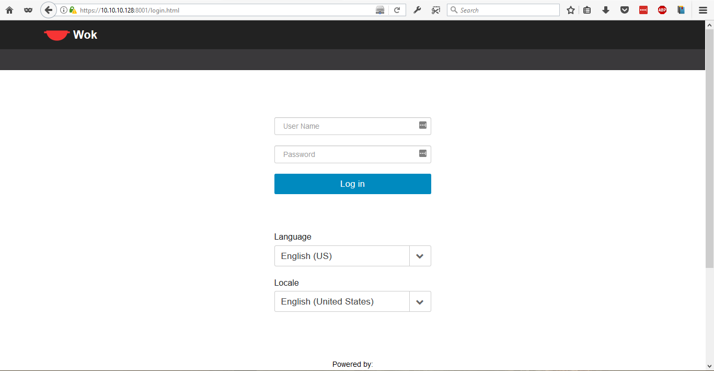

# 7. Tiến hành cài đặt công cụ Wok và các plugins để quản lý KVM

____

# Mục lục

- [7.1 Giới thiệu về Wok và các Plugins](#about)
    - [7.1.1 Wok](#about-wok)
    - [7.1.2 Plugin Kimchi](#about-kimchi)
    - [7.1.3 Plugin Ginger](#about-ginger)
    - [7.1.4 Plugin Ginger Base](#about-ginger-base)
- [7.2 Cách cài đặt công cụ Wok và plugins](#install)
- [7.3 Cách sử dụng cơ bản](#run)
- [Các nội dung khác](#content-others)

____

# <a name="content">Nội dung</a>

- ### <a name="about">7.1 Giới thiệu về Wok và các Plugins</a>
    - #### <a name="about-wok">7.1.1 Wok</a>

        - Wok là một web framework cherrypy-base hỗ trợ HTML5 và hoạt động chính nhờ các plugins với các chức năng được tìm thấy thông qua REST APIs.

        - Wok hoạt động thông quan wokd daemon.

    - #### <a name="about-kimchi">7.1.2 Plugin Kimchi</a>

        - Kimchi cung cấp giao diện HTML5 cho công cụ Wok để quản lý KVM. Được thiết kế với mục đích tạo lên sự dễ dàng nhất có thể trong việc quản lý KVMs

        - Kimchi quản lý KVM thông qua libvirt. Giao diện quản lý được truy cập qua trình duyệt web có hỗ trợ HTML5

        - Kimchi hoạt động như một plugin của Wok.

    - #### <a name="about-ginger">7.1.3 Plugin Ginger</a>

        - Ginger là một plugin mã nguồn mở cho phép quản lý host trong Wok. Cung cấp các công cụ cơ bản để cấu hình và vận hành hệ thống Linux. Bao gồm:

            - Theo dõi trạng thái CPU, RAM, DISK của hệ thống.
            - Quản lý tài khoản người dùng đăng nhập.
            - Cấu hình network interfaces.
            - Cấu hình backup.

    - #### <a name="about-ginger-base">7.1.4 Plugin Ginger Base</a>

        - Ginger Base là một plugin mã nguồn mở cho phép quản lý host trong Wok. Cung cấp các công cụ cơ bản để cấu hình và vận hành hệ thống Linux. Bao gồm:

            - Quản lý trạng thái host: Shutdown, Restart, ...
            - Hiển thị thông tin cơ bản, trạng thái hệ thống.
            - Sofware Update.
            - Repository Management.

- ### <a name="install">7.2 Cách cài đặt công cụ Wok và plugins</a>

    - Có 2 cách cài đặt wok và plugins đó là:

        - Cài đặt từ Source Code
        - Cài đặt từ Packages

        tuy nhiên, việc cài đặt từ `Source Code` khá là lâu và phức tạp. Vì vậy trong nội dung của bài viết này, mình chỉ để cập đến vần đề cài đặt Wok và plugins từ Packages.

    - Để cài đặt Wok ta thực hiện sử dụng câu lệnh sau:

        - Đầu tiên, ta cần phải cài đặt NGINX. Tham khảo [Cách cài đặt NGINX](https://github.com/hocchudong/ghichep-nginx/blob/master/docs/nginx-install.md#2). Sau đó mới tiến hành cài đặt các Packages cần thiết.

        + Đối với CentOS:

                yum install -y https://github.com/kimchi-project/kimchi/releases/download/2.5.0/wok-2.5.0-0.el7.centos.noarch.rpm
                
        + Đối với Ubuntu:

                dpkg -i https://github.com/kimchi-project/kimchi/releases/download/2.5.0/wok-2.5.0-0.noarch.deb

    - Để cài đặt Kimchi ta thực hiện sử dụng câu lệnh sau:

        + Đối với CentOS:

                yum install -y https://github.com/kimchi-project/kimchi/releases/download/2.5.0/kimchi-2.5.0-0.el7.centos.noarch.rpm

        + Đối với Ubuntu:

                dpkg -i https://github.com/kimchi-project/kimchi/releases/download/2.5.0/kimchi-2.5.0-0.noarch.deb

    - Để cài đặt Ginger ta thực hiện sử dụng câu lệnh sau:

        + Đối với CentOS:

                yum install -y http://kimchi-project.github.io/ginger/downloads/latest/ginger.el7.centos.noarch.rpm

        + Đối với Ubuntu:

                dpkg -i http://kimchi-project.github.io/ginger/downloads/latest/ginger.noarch.deb

    - Để cài đặt Ginger Base ta thực hiện sử dụng câu lệnh sau:

        + Đối với CentOS:

                yum install -y http://kimchi-project.github.io/gingerbase/downloads/latest/ginger-base.el7.centos.noarch.rpm

        + Đối với Ubuntu:

                dpkg -i http://kimchi-project.github.io/gingerbase/downloads/latest/ginger-base.noarch.deb

    - Cuối cùng, ta cần khởi động ứng dụng Wok với câu lệnh:

            service wokd start
            service wokd enable

- ### <a name="run">7.3 Cách sử dụng cơ bản</a>

    - Sau khi cài đặt và khởi chạy Packages. Từ cửa sổ trình duyệt, ta truy cập tới địa chỉ:

            https://ip_server:8001

        trong đó: `ip_server` là địa chỉ IP của máy cài đặt Wok.

    - Tại bước trên, nếu như bạn không thể truy cập vào địa chỉ trên, ta cần phải thực hiện mở port 8001 và tắt SELinux Policy (đối với CentOS) với câu lệnh sau:

            firewall-cmd --add-port=8001/tcp --permanent
            firewall-cmd --reload

            setenforce 0

    - Tại giao điện đăng nhập của trang web, ta thực hiện nhập username và password của người sử dụng có trong máy cài đặt Wok để tiến hành đăng nhập.

        > 

    - Tiến hành tạo một VM, ta cần phải có file cài đặt ISO. Hãy sử dụng câu lệnh sau để download một bản cài đặt:

            mkdir /var/lib/kimchi/isos && cd /var/lib/kimchi/isos

            wget http://releases.ubuntu.com/16.04.2/ubuntu-16.04.2-server-amd64.iso

        tại giao diện website, lần lượt ta làm các bước như sau: `Virtualization` > `Templates` > `+ Add Template`. Nhập tên của Template và điền /var/lib/kimchi/isos/ubuntu-16.04.2-server-amd64.iso vào `File Path` và chọn `Create`.

    - Chọn `Guest` > `+ Guest`. Sau đó chọn template vừa tạo và click vào `Create`. Như vậy là ta đã tạo xong một VM. Để quản lý VM này, ta chọn vào `Actions`. Một cửa sổ sẽ trượt xuống, ta chọn `Start` > `View Console`.
____

# <a name="content-others">Các nội dung khác</a>
