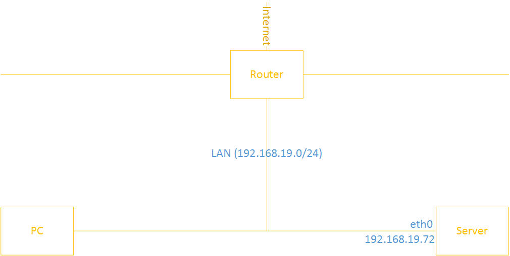

# Bài thực hành số 1. Cấu hình chỉ cho phép các kết nội cục bộ trong mạng

____

# Mục lục

- [1.1 Đặt vấn đề](#issue)
- [1.2 Mô hình](#models-l1)
- [1.3 Hướng giải quyết](#config)
- [1.4 Kiểm tra kết quả](#checking)
- [Các nội dung khác](#content-others)

____

# <a name="content">Nội dung</a>

- ### <a name="issue">1.1 Đặt vấn đề</a>

    - Trong các hệ thống cần chú trọng về bảo mật, thì các kết nối từ bên ngoài muốn truy cập vào được các dịch vụ cung ứng bởi hệ thống chỉ là có thể khi truy cập qua một kết nối trung gian nhằm chuyển hướng các request tới các máy chủ dịch vụ.

    - Việc ta cần làm ở đây đầu tiên đó là cấu hình firewall sao cho chỉ nhận các kết nối trong mạng cục bộ và từ chối các kết nối khác đến máy chủ. Theo đó mà ta có mô hình như sau:

- ### <a name="models-l1">1.2 Mô hình</a>

    > 

    - Máy chủ sử dụng hệ điều hành Centos 7 và iptables làm firewalls.
    - Cấu hình được thực hiện trên VMWare.

- ### <a name="config">1.3 Hướng giải quyết</a>

    - Với mô hình như trên, các công việc chủ yếu cần được giải quyết như sau:

        1. Từ chối các kết nối đi tới.
        2. Cho phép gói tin đi ra từ hệ thống.
        3. Cho phép thiết lập các kết nối đi vào hệ thống.
        4. Chấp nhận các kết nối loopback
        5. Chấp nhận kết nối SSH cho việc remote xuất phát từ mạng LAN.

    - Chi tiết các bước làm trên máy chủ Server như sau:

        - Có thể thực hiện chạy câu lệnh này nếu bạn muốn xóa các rules đã có của iptables và tạo ra các rule cho các chains mới hoàn toàn:

                iptables -F
                iptables -X

            trong đó:

                - tham số `-F`: có tác dụng xóa tất cả các quy tắc (rules)
                - tham số `-X`: xóa các chain do người dùng khai báo

        1. Từ chối kết nối đi tới:

                iptables -P INPUT DROP

        2. Cho phép gói tin đi ra từ hệ thống:

                iptables -P OUTPUT ACCEPT

        3. Cho phép thiết lập các kết nối đi vào hệ thống:

                iptables -A INPUT -m state --state ESTABLISHED,RELATED -j ACCEPT

        4. Chấp nhận các kết nối loopback:

                iptables -A INPUT -s 127.0.0.1 -d 127.0.0.1 -j ACCEPT

        5. Chấp nhận kết nối SSH cho việc remote xuất phát từ mạng LAN:

                iptables -A INPUT -p tcp -m state -state NEW -m tcp -s 192.168.19.0/24 \
                -d 192.168.19.72 --dport 22 -j ACCEPT

        6. Cho phép các kết nối ping với giới hạn 5 lần 1 phút đối với các kết nối từ mạng cục bộ:

                iptables -A INPUT -p icmp --icmp-type echo-request -s 192.168.19.0/24 \
                -d 192.168.19.72 -m limit --limit 1/m --limit-burst 5 -j ACCEPT

        7. Lưu lại cấu hình:

                iptables-save
                systemctl restart iptables

- ### <a name="checking">1.4 Kiểm tra kết quả</a>

    - Thêm một card mạng cho máy chủ Server với địa chỉ mạng `10.10.10.0/24` và địa chỉ IP là `10.10.10.72`. Sau đó ta sẽ thực hiện kết nối tới Server bằng SSH với câu lệnh:

            ssh root@10.10.10.72

        nếu không thể thực hiện SSH. Chứng tỏ ta đã cấu hình thành công vì kết nối trên mâu thuẫn với điều thứ `5. Chấp nhận kết nối SSH cho việc remote xuất phát từ mạng LAN` mà ta đã cấu hình.

    - Như vậy, hiện giờ ta muốn SSH tới Server chỉ có thể thông qua câu lệnh tương tự như sau:

            ssh root@192.168.19.72

        trong đó địa chỉ IP `192.168.19.72` là bắt buộc không được thay đổi.

____

# <a name="content-others">Các nội dung khác</a>
