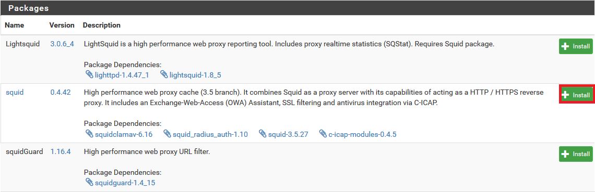
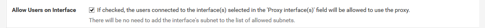
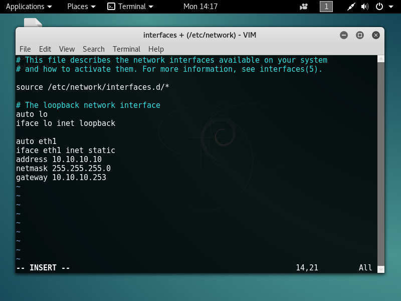
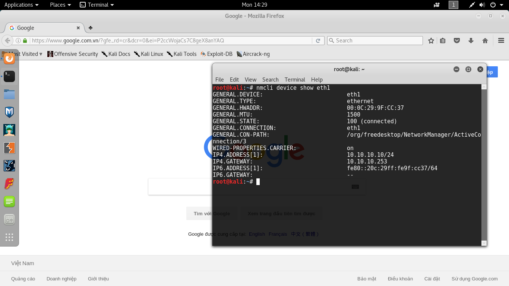
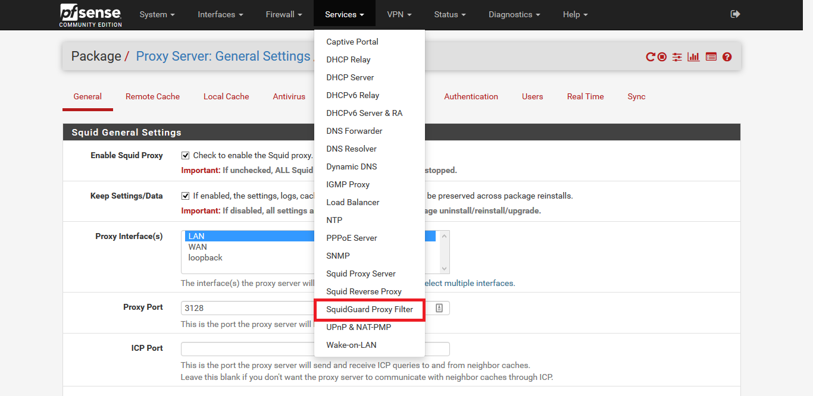
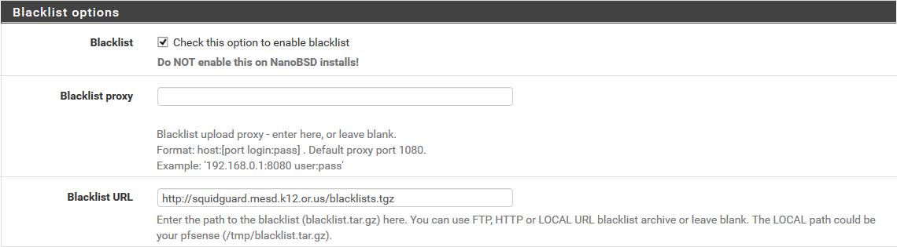
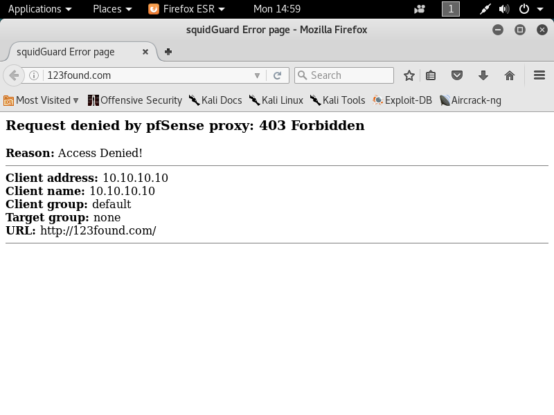
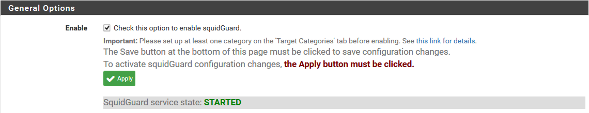
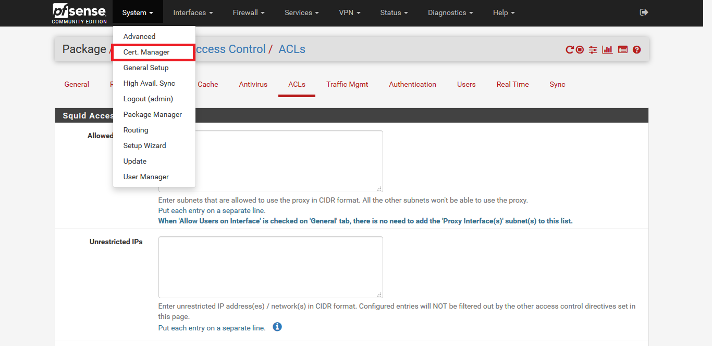

# 1. Cấu hình pfSense với tính năng như một Proxy Server

____

# Mục lục

- [1.1 Mục đích thực hiện?](#issue)
- [1.2 Mô hình](#models)
- [1.3 Các bước thực hiện cấu hình cơ bản](#step-config)
- [1.4 Các bước thực hiện cấu hình cản lọc request](#filter)
- [1.5 Các bước thực hiện cấu hình chặn truy cập một số trang website](#block-website)
- [Các nội dung khác](#content-others)

____

# <a name="content">Nội dung</a>
- ### <a name="issue">1.1 Mục đích thực hiện?</a>

    - Trong nội dung của bài thực hành này, ta sẽ tiến hành thực hiện cấu hình Proxy Server sử dụng pfSense.

    - Mục đích chính đó là thực hiện quản lý, giám sát các truy cập internet của client trong LAN.

- ### <a name="models">1.2 Mô hình</a>

    - Cùng xem mô hình thực hiện cấu hình sau đây:

        

    - pfSense sử dụng trong mô hình với phiên bản 2.4.1
    - Network Interface `em1` có địa chỉ IP là: `10.10.10.253/24`
- ### <a name="step-config">1.3 Các bước thực hiện</a>

    - Đầu tiên, ta cần truy cập đến Web Interface của pfSense để tiến hành cài đặt các packages cần thiết cho việc cấu hình, bao gồm 3 packages:

        | Tên packages | Phiên bản | Chức năng |
        | ------------ | --------- | --------- |
        | squid | 0.4.42 | Cung cấp chức năng cấu hình Proxy Server |
        | squidGuard | 1.16.4 | Web Proxy URL Filter |
        | Lightsquid | 3.0.6_4| Công cụ thống kê Web Proxy |

    - Thứ tự thực hiện cài đặt một packages như sau:

        + Tại giao diện của Web Interface, ta chọn `System`. Sau đó chọn `Package Manager`:

            

        + Chọn tab `Available Packages`. Sau đó nhập `squid` vào ô tìm kiếm và chọn `Search` để thực hiện tìm kiếm packages:

            

        +   Chọn `Install` cùng với hàng của tên gói packages để tiến hành cài đặt packages tương ứng:

            

        + Tiếp tục chọn `Confirm` để xác nhận cài đặt packages:

            

        + Hãy chờ một vài phút cho đến khi hệ thống cài đặt xong packages sẽ hiển thị thông báo như sau:

            

            Hãy tiến hành tương tự để thực hiện cài đặt 2 packages còn lại để hoàn tất quá trình này.

    -  Đầu tiên, để cấu hình chung cho squid, ta cần phải cấu hình bên tab `Local Cache` trước thì mới có thể lưu lại cấu hình cho squid. Thứ tự thực hiện như sau:

        + Chọn menu `Services`, sau đó chọn `Squid Proxy Server`:

            

        + Tại tab `Local Cache`, ta nhập giá trị `128` vào vị trí của `Memory Cache Size` để thiết lập dung dượng RAM sử dụng làm cache: 

            

        + Nhập giá trị `1024` vào vị trí của `Hard Disk Cache Size` để thiết lập dưng lượng ổ cứng sử dụng để làm cache:

            

        + Tóm lại, khi kết thúc bước trên, ta được cái nhìn tổng quan về cài đặt trong tab `Local Cache` này như sau:

            

            Nhấn `Save` để lưu lại cài đặt.

    - Tiếp theo, ta chuyển sang tab `General` để thực hiện cấu hình chung cho squid. Thứ tự thực hiện các bước như sau:

        + Tại phần `Enable Squid Proxy`, hãy tích vào ô vuông bên cạnh để khởi động dịch vụ squid.

            

        + Tại phần `Proxy Interface(s)`, hãy chọn `LAN`:

            

        + Tại phần `Allow Users on Interface` hãy tích vào ô vuông bên cạnh để cho phép người dùng được sử dụng proxy trên Interface LAN.

            

        + Tại phần `Tranparent HTTP Proxy` hãy tích vào ô vuông bên cạnh để cho phép chuyển hướng tất cả các request http đi qua proxy server:

            

        + Tóm lại, ta có được cái nhìn tổng quan về cấu hình trong phần này là:

            

            Chọn `Save` để lưu lại cấu hình.

        - Tiếp theo cấu hình cho PC trong mô hình ở phần đầu đã đề cập. Trong nội dung phần này, chỉ làm với cấu hình PC sử dụng hệ điều hành `Kali Linux` (cấu hình trong các hệ điều hành khác sẽ tương tự). Mục đích trong việc làm này là cho phép các PC đứng trong LAN (phía sau pfSense) có thể truy cập internet. Cách làm đơn giản chỉ đơn giản là cấu hình địa chỉ `Default Gateway` của PC thành địa chỉ IP của pfSense có trong mạng LAN. Các bước thực hiện như sau:

            + Tại `Terminal`, ta nhập lệnh:

                    vi /etc/network/interfaces

                nhấn `Enter` và màn hình sẽ hiển thị như sau:

                

                sau đó nhấn `I` để vào chế độ `Insert`. Sau đó, nhập thêm nội dung như hình dưới đây:

                

                trong đó:

                    - eth1 là tên network interface mạng LAN (10.10.10.0/24)
                    - 10.10.10.253 là địa chỉ IP của pfSense trong LAN (10.10.10.0/24)

                sau khi nhập thông tin như hình trên xong. Nhấn `Esc` và nhập `:wq` tiếp tục nhấn `Enter` để lưu lại cấu hình vừa rồi.

            + Tiếp theo nhập lệnh:

                    ifdown eth1 && ifup eth1

                để thực hiện khởi động lại network interface eth1 để có thể nhận IP mới.

            + Kết quả cuối cùng ta được:

                

            + Hiện tại, PC này đã có thể truy cập Internet. Hãy xem hình ảnh dưới đây:

                

- ### <a name="filter">1.4 Các bước thực hiện cấu hình cản lọc request</a>

    - Trong nội dung của phần này, sẽ không nói đến việc cản lọc request sử dụng firewall kết hợp với các rule (nội dung này sẽ được nói trong một bài viết khác). Nội dung trong phần này sẽ thực hiện cấu hình, kiểm soát quyền truy cập của PCs đối với một số trang (thể loại) website nhất định. Ta vẫn sẽ tiếp tục sử dụng mô hình ở phần đầu đã nêu ra.

    - Đầu tiên, ta truy cập chức năng để chuẩn bị cho việc cấu hình tại Web Interface. Ta chọn menu `Services`, sau đó chọn `SquidGuard Proxy Filter`.

        

    - Trong mục `General Options`, tại phần `Enable`, hãy tích vào ô vuông bên cạnh để khởi động tính năng:

        

    - Tại mục `Blacklist Options`, tại phần `Blacklist` hãy tích vào ô vuông bên cạnh để hiển thị việc cản lọc `Blacklist`. Tại phần `Backlist URL` hãy nhập vào `http://squidguard.mesd.k12.or.us/blacklists.tgz`:

        

        nhấn `Save` để lưu lại cấu hình.

    - Tiếp tục, ta chuyển sang tab `Blacklist`. Sau đó chọn `Download` để thực hiện cập nhật nội dung của `blacklists` cho việc cấu hình:

        

        hãy đợi cho đến khi pfSense thực hiện cập nhật xong. Nó sẽ xuất hiện thông báo như sau:

        

    - Chuyển sang tab `Common ACL`. Tại phần `Target Rule`, hãy chọn vào dấu `+` để hiển thị danh sách `ACL`:

        

        kết quả sẽ hiển thị tương tự như sau:

        

    - Thực hiện kiểm tra kết quả cấu hình bằng một vài hành động chặn nhỏ. Ta thực hiện chọn các phần sao cho giống như hình dưới đây:

        

        như bên trên, ta đã cấm client truy cập vào các trang website thuộc thể loại có chứa quảng cáo, spyware. Tuy nhiên, điều này chỉ mang tính tương đối.

    - Thêm thông tin để giải thích với client về việc bị chặn truy cập tại mục `Redirect Info`. Ví dụ:

        

    - Kiểm tra kết quả, từ máy PC có địa chỉ IP `10.10.10.10` ta đã cấu hình ở phần trên. Truy cập tới địa chỉ:

            http://123found.com

        ta nhận được kết quả như sau:

        

        hãy thử truy cập tới một vài trang website khác để có thể tự kiểm chứng kết quả.
        
    - Lưu ý, mỗi khi thực hiện thay đối cấu hình của `SquidGuard Filter`, ta cần phải quay trở lại trang cấu hình `General settings`, tìm đến mục `Enable` và chọn `Apply` để chấp nhận thay đổi:

        

- ### <a name="block-website">1.5 Các bước thực hiện cấu hình chặn truy cập một số trang website</a>

    - Trong nội dung cấu hình của phần này, sẽ vẫn tiếp tục sử dụng mô hình ở phần đầu bài viết. Mục đích của việc cấu hình là chặn việc truy cập của PCs tới tên miền của một trang website nhất định, chặn download, ...

    - Việc thực hiện cấu hình với mục đích trên có 2 cách:

        1. Sử dụng Squid Server Proxy
        2. Sử dụng SquidGuard Proxy Filter

    - Đầu tiên, ta sẽ nói về việc sử dụng Squid Server Proxy để thực hiện cấu hình. Các bước thực hiện như sau:

        + Truy cập đến trang `General` của `Squid Server Proxy`, bằng cách chọn menu `Services` rồi chọn `Squid Server Proxy`:

            

        + Tiếp theo, chọn sang tab `ACLs`, ta hãy chú ý tới 5 mục:

            1. Allowed Subnets - Cho phép các mạng con sử dụng proxy
            2. Unrestricted IPs - Danh sách các địa chỉ IPs không bị cấm.
            3. Banned Hosts Addresses - Danh sách các host bị cấm.
            4. Whitelist - Danh sách các rule, các trang website, ... có thể được phép truy cập.
            5. Blacklist - Danh sách các rule, các trang website, ... không được phép truy cập.

        + Giả sử trong trường hợp này, ta muốn chặn không cho PCs truy cập tới trang website google, facebook. Ta cần phải làm như sau:

            - Tìm tới mục `Blacklist`, nhập vào ô trống với 3 dòng nội dung sau:

                    .*google.com.*
                    .*facebook.com.*
                    .*fb.com.*

                chọn Save để lưu lại.

            - Vì 2 trang website ta muốn chặn có hỗ trợ giao thức HTTPS, trong khi ngay từ phần cấu hình chung cho proxy, ta chỉ lựa chọn filters http request. Để có thể filter https requests, ta cần phải tạo ra CA (Certificate Authorities) mới có thể thực hiện được. Hãy chọn menu `System`, tiếp theo chọn `Cert. Manager`:

                

                chọn `Add` để thêm một CA mới:

                

            - Hãy nhập thông tin tương tự như hình dưới đây:

                

                chọn Save để lưu lại.
            - Quy trở lại phần cấu hình `General` của `Squid Proxy Server`. Tìm đến mục `HTTPS/SSL Interception`, tích vào ô vuông bên cạnh để cho phép filter https request:

                

            - Tìm đến phần `SSL/MITM Mode` chọn `Splice All`:

                

            - Tìm đến phần `CA`, chọn tên CA vừa tạo ra:

                

            - Tìm đến phần `Remote Cert Checks` và `Certificate Adapt` rồi lựa chọn như hình dưới đây:

                

            - Cuối cùng, ta có cấu hình tổng quan như sau cho phần này:

                

                chọn Save để lưu lại.

            - Từ máy client, thực hiện truy cập website với các trang đã chặn và các trang khác để kiểm tra kết quả. Một số hình ảnh về kết quả như sau:

                > [Kali-Linux-2017.1-vm-amd64-2017-11-28-11-27-04](../images/Kali-Linux-2017.1-vm-amd64-2017-11-28-11-27-04.png)

                > [Kali-Linux-2017.1-vm-amd64-2017-11-28-11-27-17.png](../images/Kali-Linux-2017.1-vm-amd64-2017-11-28-11-27-17.png)

            - Khi truy cập một số trang website, ta gặp phải lỗi tương tự như sau:

                

                ta hãy chọn `Advanced` đối với trình duyệt `FireFox`, chọn `Add Exception`hay `Continue Processing` đối với `Google Chrome` để có thể tiếp tục duyệt website bình thường.

____

# <a name="content-others">Các nội dung khác</a>
