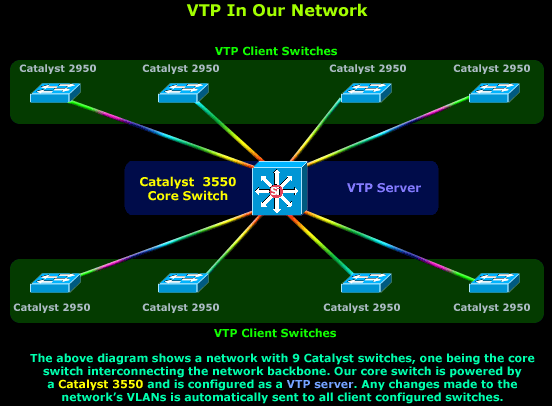
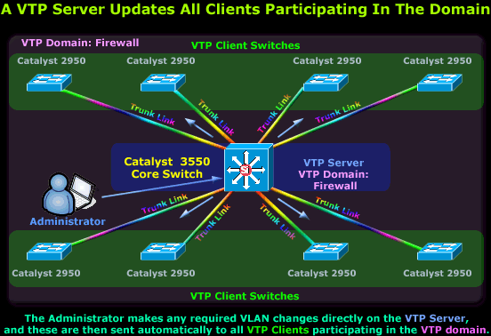
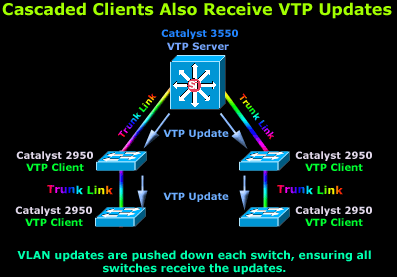
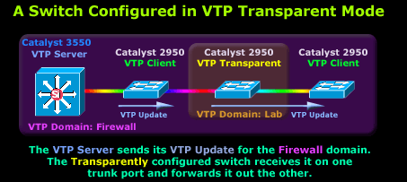
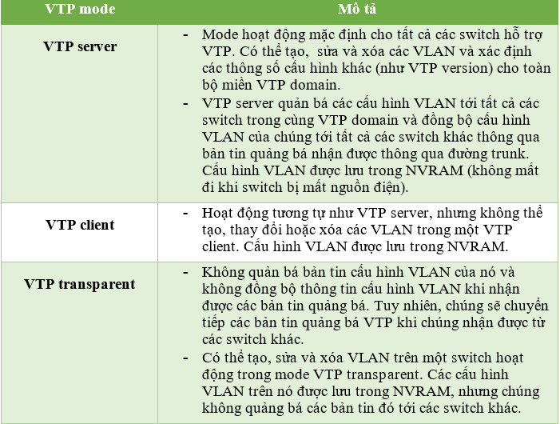
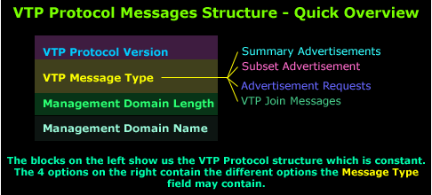
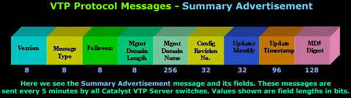
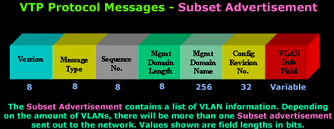
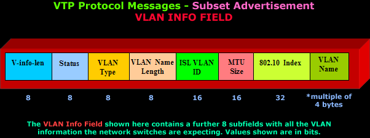
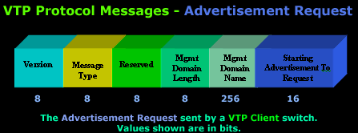

# Tìm hiểu giao thức VTP - Virtual Trunk Protocol

### ***Mục lục***

[1. VTP INTRODUCTION & MODES](#1)

- [1.1.	Giới thiệu](#1.1)

- [1.2. VTP versions](#1.2)

- [1.3. VTP modes](#1.3)

- [1.4. Một số lưu ý](#1.4)

[2. Phân tích bản tin VTP](#2)

- [2.1 Summary Advertisement](#2.1)

- [2.2 Subset Advertisement](#2.2)

- [2.3 Advertisement request](#2.3)

- [2.4 VTP Join Message](#2.4)

[3.	Tham khảo](#3)

---

**Giới thiệu và phân tích giao thức VTP - Virtual Trunk Protocol, được sử dụng để tự động cập nhật tất cả các switch trong một mạng VLAN, với tất cả thông tin về các VLAN mới, đảm bảo tất cả các switch đều cập nhận và nhận biết được các VLAN.**

# 1. VTP INTRODUCTION & MODES 

## 1.1.	Giới thiệu  
   - VTP là giao thức độc quyền của Cisco, được thiết kế bởi Cisco nhằm giảm thiểu chi phí quản lý và khả năng gây lỗi.  
   - Khi một VLAN mới được tạo và cấu hình trên switch mà không kích hoạt VTP, thì người quản trị mạng phải cấu hình bằng tay thông tin về mạng mới này đến tất cả các switch trong mạng để chúng có thể nhận biết được VLAN này. Công việc này sẽ làm tốn nhiều thời gian và chi phí phụ thuộc vào kích cỡ của mạng.   
   - Cấu hình VLAN bao gồm số hiệu VLAN, tên và một số thông số khác. Các thông tin này được lưu trong NVRAM của switch và bất kì sự thay đổi nào của VLAN trên bất kì switch nào cũng dẫn tới phải cấu hình thủ công lại thêm thông tin thay đổi trên tất cả các swtich trong mạng.
   - Nếu mô hình mạng nhỏ thì điều này đơn giản, nhưng tưởng tượng, khi mạng của bạn có tới 15 đến 20 switch và phải cập nhật vài lần một tuần, thì thật đáng sợ.  
   - Với cấu hình và kích hoạt giao thức VTP, bạn có thể quên việc phải chạy vòng vòng để cập nhật tất cả các switch trong mạng vì bạn chỉ cần thay đổi thông tin trên VTP server trong mạng. Điều này đảm bảo tất cả các thay đổi được thực hiện cập nhật trên tất cả các switch trong mạng bất kể chúng ở đâu. 

## 1.2. VTP versions 

VTP hiện tại có 3 version là 1, 2 và 3. Sau đây là một số khác biệt giữa các version:   
- Trong VTP version 1 và 2, khi cấu hình ***VLAN Extended*** và ***private Vlan*** (Các VLAN chỉ có ảnh hưởng trên nội bô switch) trên switch, các switch phải hoạt động ở chế độ VTP transparent. VTP version 3 hỗ trợ tạo các VLAN Extended trong cả mode client và server.   
- Trong VTP version 1, switch hoạt động trong mode Transparent sẽ xem xét các bản tin VTP về tên domain và version rồi mới chuyển tiếp gói tin chỉ khi version và domain name trùng khớp. Bởi vì, VTP version 2 chỉ hỗ trợ một domain, nên nó sẽ chuyển tiếp  các bản tin VTP trong mode Transparent mà không phải kiểm tra version và domain của bản tin.   
- Version 2 hỗ trợ Token Ring Vlan. 
- VTP version 3 hỗ trợ các tính năng chưa được hỗ trợ trong Verions 1 và 2 như sau:  
	- Tính năng xác thực được nâng cao hơn: Có thể cấu hình xác thực chế độ **hiddent** và **secret**. Với chế độ hidden, key bí mật từ chuỗi mật khẩu được lưu vào trong file Vlan database, và không xuất hiện ở dạng plain text trong file cấu hình. Thay vào đó, key được liên kết với mật khẩu được lưu dưới dạng các chữ số hệ thập lục phân trong cấu hình đang chạy. Bạn phải gõ lại để xác nhận password. Khi sử dụng từ khóa secret, bạn có thể cấu hình trực tiếp password secret key.  
	- Hỗ trợ truyền các thông tin Vlan mở rộng. VTP version 1 và 2 chỉ hỗ trợ truyền các VLAN từ 1 tới 1005. Nếu VLAN mở rộng được cấu hình, bạn không thể chuyển VTP version từ 3 về 1 hoặc 2 được.   
	- Hỗ trợ private Vlan.   
	- Có thể kích hoạt hoặc vô hiệu hóa VTP trên từng port riêng biệt.  
- Một số lưu ý về cấu hình VTP version:   
	- Tất cả các siwtch trong cùng miền VTP domain phải cấu hình VTP domain name giống nhau, nhưng chúng không cần hoạt động trong cùng một version.   
	- Một switch có khả năng chạy version 2 có thể hoạt động trong cùng miền VTP domain như version 1 nếu version 2 bị vô hiệu hóa trên switch đó.  
	- Nếu một switch chạy VTP version 1 nhưng có khả năng chạy version 2  mà nhận được một bản tin VTP quảng bá version 3 thì nó sẽ tự động chuyển sang hoạt động ở VTP version 2.  
	- Nếu một switch đang chạy VTP version 3 được kết nối các switch chạy version 1, thì switch version sẽ chuyển sang version 2 và switch version 3 gửi bản tin VTP hạ thấp version để switch VTP version có thể cập nhật database của nó.    
	- Một switch chạy version 3 không thể chuyển về chạy verion 1 và version 2 nếu nó có các dữ liệu về Extended Vlan.    
	- Không kích hoạt VTP version 2 trừ khi tất cả các switch trong cùng miền domain có khả năng hoạt động ở version 2. Khi kích hoạt version 2 trên một switch, tất cả các switch có khả năng hoạt động ở version 2 sẽ kích hoạt sang version 2. Nếu switch chỉ hoạt động ở version 1, nó sẽ không thay đổi thông tin VTP với các switch mà hoạt động ở version 2.   
	- Nên đặt cắc switch hoạt động ở VTP version 1 và 2 ở phần rìa mạng (edge of network) bởi vì chúng không forward những bản tin quảng bá VTP version 3.   
	- VTP version 1 và 2 không truyền các thông tin cấu hình cho các VLAN Extended (từ 1006 tới 4094). Bạn phải cấu hình các VLAN này thủ công trên mọi thiết bị. VTP version 3 hỗ trợ VLAN Extended. Bạn không thể chuyển đổi từ VTP version 3 sang VTP version 2 nếu Extended Vlan được cấu hình.    
	- Một switch hoạt động ở VTP version 3 không chấp nhận các thông tin cấu hình từ các thiết bị hoạt động ở VTP version 1 hoặc 2.   
	- Các thiết bị chỉ hoạt động ở version 1 không thể tương thích với các thiết bị hoạt động ở version 3.   
  

## 1.3. VTP modes  
- VTP là một giao thức khá là phức tạp nhưng lại dễ hiểu và triển khai một khi đã nắm được nó. Hiện nay VTP tồn tại 3 version là 1, 2 (hỗ trợ mạng Token Ring) và 3, trong đó version 1 đầu tiên được sử dụng trong hầu hết các mạng.   
- Mặc dù có nhiều phiên bản, song VTP cũng hoạt động trong 3 chế độ khác nhau là: server, client và transparent mode, đem đến sự linh hoạt tối đa trong việc thay đổi các cấu hình switch trong mạng. Để cho mọi thứ đơn giản và tránh gặp một số lỗi, ở đây sẽ tìm hiểu về phiên bản đầu tiên của VTP là VTP v1 - được sử dụng trong tới hơn 90% các mạng.   
- Các chế độ hoạt động của giao thức VTP:  
	-	VTP Server mode  
	-	VTP Client mode  
	-	VTP Transparent mode  
- Mỗi mode được thiết kế với từng kiểu thiết lập và nhu cầu từng mạng.  

	

- Mô hình thông thường sẽ có ít nhất 1 switch  được cấu hình làm VTP server, và một số switch còn lại được cấu hình như là VTP client. Logic đằng sau thiết kế này là tất cả các thông tin liên quan tới các VLAN được lưu trữ chỉ trong switch VTP server từ tất cả các bản cập nhật của các client còn lại. Bất kì thay đổi nào trong dữ liệu của VLAn sẽ được kích hoạt cập nhật từ VTP server tới tất cả các VTP client nên chúng có thể tự động cập nhật dữ liệu của chúng.  
- Cuối cùng, các bản tin cập nhật VTP chỉ được truyền thông qua đường trunk. Nghĩa là bạn phải đám bảo tất cả các switch phải kết nối tới network backbone thông qua đường trunk, nếu không thì sẽ không có bản tin VTP update nào tới được switch.  
- Khi triển khai VTP trên hệ thống, bạn sẽ có ba sự lựa chọn chế độ làm việc cho Switch của mình: Server, Client và Transparent. Tùy thuộc vào mục đích quản trị và hạ tầng mạng mà ta lựa chọn sao cho hợp lý. Bảng sau đây tóm tắt sự khác nhau giữa ba chế độ làm việc:

### 1.3.1. VTP SERVER MODE
- Mặc định, tất cả các switch được cấu hình hoạt động như VTP server khi lần đầu được khởi động. Tất cả thông tin về VLAN như số hiệu VLAN, tên VLAN được lưu trữ cụ bộ, trên NVRAM tách biệt từ file `startup-config`. Việc này chỉ xảy ra khi switch được cấu hình trong VTP server mode.  
- Trong các mạng nhỏ với số lượng switch và VLAN giới hạn, việc lưu trữ tất cả các thông tin về VLAN trên mỗi switch thì không phải là vấn đề, nhưng trong môi trường mạng lớn và số lượng VLAN ngày càng tăng, việc lưu trữ thông tin VLAN sẽ trờ thành vấn đề và phải quyết định chọn một vài switch hoạt động với công suất lớn làm VTP server và cấu hình tất cả các switch còn lại là VTP client.  

	

- Hình trên mô tả một switch Cisco Catalyst 3550 được chọn đảm nhận vai trò của VTP server trong mạng ví nó là switch mạnh nhất trong mạng. Tất các các switch còn lại được cấu hình như VTP client, chứa các thông tin VLAN và cập nhật tới 3550 VTP server.   
- Khái niệm VTP DOMAIN - VLAN management domain.  
- VTP domain hoặc VLAN management domain là một thông số của VTP được cấu hình trên các switch kết nối tới mạng và được dùng để xác định các switch sẽ cập nhật khi có sự thay đổi trong miền VTP domain.   
- Đương nhiên, switch VTP Server và tất cả các switch khác tham gia vào cùng một miền domain, ví dụ như firewall, do đó, khi VTP Server quảng bá thông tin VLAN mới cho miền VTP firewall, chỉ các máy switch VTP client được cấu hình với cùng một tham số VTP Domain sẽ Chấp nhận và xử lý những thay đổi này, phần còn lại sẽ xử lý đơn giản là bỏ qua chúng.  

### 1.3.2. VTP Client mode  
-	Khi hoạt động ở mode client, switch sẽ chấp nhận và lưu thông tin tất cả các VLAN trong RAM từ các VTP server, tuy nhiên, các thông tin này cũng được lưu trong NVRAM, nên nếu switch tắt nguồn, nó sẽ không bị mất thông tin các VLAN.  
VTP client hoạt động giống như VTP server, nhưng không thể tạo, sửa và xóa các VLAN trên nó  

	

### 1.3.3	VTP transparent mode
- VTP transparent mode hoạt động giữa VTP server và VTP clinet nhưng không tham gia vào miền VTP domain.  
- Trong mode transparent, bạn có thể tạo, sửa và xóa các VLAN trên nội bộ switch đó, mà không ảnh hưởng tới các switch khác cho dù chúng hoạt động trong chế độ nào. Quan trọng nhất là nếu switch VTP transparent nhận được các bản tin quảng bá về thông tin các VLAN, nó sẽ bỏ qua nó và đồng thời forward nó luôn ra cổng trunk của nó tới các switch khác mà nó kết nối tới.  
- Có thể hiểu: VTP transparent switch sẽ hoạt động như một VTP relay (chuyển tiếp tất các các thông tin VTP nhận được ra ngoài cổng trunk của nó) chỉ với VTP version 2. Với VTP version 1, transparent sẽ chỉ đơn giản là bỏ qua bất kì bản tin VTP nào nó nhận được.  
- Tất cả các switch được cấu hình hoạt động trong mode transparent lưu thông tin cấu hình vào NVRAM nhưng không quảng bá bất kì thông tin VLAN nào của nó, mặc dù nó vẫn chuyển tiếp tất cả các thông tin VTP nhận được từ các switch khác.   

	

### 1.3.4. So sánh các VTP mode

- **Tạo bản tin VTP**: Bất cứ khi nào người quản trị tạo, xóa hay sửa một VLAN và muốn thông tin này quảng bá đến các Switch khác trong cùng một vùng, người quản trị phải cấu hình nó trên Switch đang làm việc ở chế độ Server. Do đó chế độ Server là một nguồn tạo bản tin VTP. Ngoài ra ở chế độ Client cũng có khả năng là nguồn của một bản tin VTP mặc dù nó không thể tạo, xóa hay sửa một VLAN. Đó là khi một Switch mới gia nhập vào hệ thống nhưng nó đã mang sẵn cấu hình VTP của vùng khác, với cùng VTP domain và chỉ số revision lớn hơn tất cả trong hệ thống của chúng ta. Đó là lý do đôi lúc ta thấy làm việc ở chế độ Client cũng có khả năng là nguồn tạo bản tin VTP.
Một Switch hoạt động ở chế độ Transparent hoàn toàn có thể tạo VLAN nhưng nó sẽ không gửi đi bản tin quảng bá VLAN mới đó. Hay nói cách khác nó chỉ hoạt động độc lập, do đó nó không phải là nguồn tạo một bản tin VTP.
- **Lắng nghe bản tin VTP**: Chỉ có những Switch hoạt động ở chế độ Client hay Server mới lắng nghe bản tin VTP từ những nguồn khác trong hệ thống. Khi một Switch nhận một thông tin quảng bá đến nó từ địa chỉ multicast 01-00-0C-CC-CC-CC nó sẽ tiến hành xử lý gói tin đó. Nếu thông số revision lớn hơn của nó, khi đó quá trình đồng bộ sảy ra, Switch sẽ cập nhật thông tin nó đang có với thông tin trong bản tin vừa nhận. Nếu thông số revision của bản tin vừa nhận nhỏ hơn của Swith thì nó sẽ hủy bản tin và gửi lại bản tin khác có thông số revision lớn hơn để cập nhật cho các thiết bị khác trong mạng.
Một Switch hoạt động ở chế độ Transparent không lắng nghe bản tin VTP quảng bá trong hệ thống. Nó vẫn nhận bản tin quảng bá nhưng không xử lý, nó chỉ có nhiệm vụ chuyển tiếp bản tin đó ra liên kết trunk.
- **Tạo, xóa, sửa VLAN**: Thuộc tính này có trên Switch hoạt động ở chế độ Server và Transparent. Tuy nhiên bản chất của nó là khác nhau. Khi người quản trị tạo, xóa hay sửa VLAN trên một Server, ngay lập tức thông tin quảng bá sẽ được gửi đến địa chỉ multicast 01-00-0C-CC-CC-CC với thông số revision tăng lên một. Quá trình cập nhật trong hệ thống với việc tăng thêm một VLAN mới sảy ra ngay sau đó. Việc này cũng có thể thực hiện trên Switch hoạt động ở chế độ Transparent, người quản trị dễ dàng tạo, xóa hay sửa thông tin một VLAN, nhưng bản tin VTP quảng bá không được tạo ra, không được gửi đi trong hệ thống do đó những Switch khác không cập nhật những thông tin mới chỉnh sửa. Switch hoạt động ở chế độ Transparent làm việc một cách cục bộ không ảnh hưởng đến toàn bộ hệ thống, nó chỉ có nhiệm vụ chuyển tiếp bản tin VTP quảng bá để hệ thống thông suốt liên tục.

## 1.4. Một số lưu ý
-	Tất cả các switch ở chế độ mặc định được cấu hình mode VTP server không cần cấu hình domain. Về điểm này, ta cần chọn các switch core (thường là các switch có công suất lớn) và cấu hình là VTP server, và cấu hình tất cả các switch còn lại hoạt động ở mode CTP client. Do đó, các bản tin VTP cập nhật gửi từ server sẽ chỉ được truyền thông qua các liên kết trunk.  
-	***Lưu ý***: Tất cả các bản tin VTP được gửi thông qua Management Vlan. Vlan đặc biệt này thường là Vlan đâu tiên trong mạng - VLAN 1 - và bởi các quy tắc mà không được sử dụng bởi bất kì ai khác ngoài chính các switch.   
-	Việc tạo một Management Vlan đảm bảo tất cả các switch có mạng của chính nó để giao tiếp với nhau mà không có bất kì gián đoạn nào.  

# 2. Phân tích bản tin VTP

Cấu trúc bản tin VTP: 

Các loại bản tin VTP:

## 2.1.  Summary Advertisement 

- Bản tin **Summary Advertisement**: được gửi bởi tất cả các switch VTP server trong chu kì thời gian 5 phút, hay mỗi 300 giây. Những bản tin này cho biết các switch gần đó với nhiều thông tin khác nhau như VTP domain name, số revision, timestamps, mã MD5 và số của subset quảng bá sau.  
- Số revision cho biết một giá trị mỗi khi có thay đổi mới được định nghĩa trong miền VTP domain. Mỗi khi cấu hình của VTP server thay đổi, số revision sẽ được tự động tăng thêm 1. 

	

- Khi switch nhận được một bản tin summary advertisement, đầu tiên nó sẽ so sánh VTP domain name của chính nó. Nếu khác, nó sẽ bỏ qua và chuyển tiếp bản tin đó qua các cổng trunk còn lại. Nếu trùng, nó sẽ kiểm tra số revision, nếu số revision bằng hoặc nhỏ hơn revision của nó, nó sẽ bỏ quan bản tin, nếu lớn hơn mọt bản tin advertisement request sẽ được gửi đi.

## 2.2. Subset Advertisement 

- Bản tin **Subset Advertisement**: Như đã để cập trước, khi thông tin Vlan thay đổi trên các switch VTP server, nó sẽ phát bản tin Summary Advertisement, theo sau bởi một bản tin Subser Advertisement. Phụ thuộc vào bao nhiêu VLAN được cấu hình trong domain, có thể có nhiều hơn một bản tin Subset Advertisement được gửi để đảm bảo rằng thông tin tất cả các VLAN được cập nhật trên các switch VTP client.

	

- Trường Code được set giá trị 0x02 trong khi trường Sequence NO chứa thứ tự các gói tin được gửi ngay sau bản tin summary advertisement.   
- Phần quan trọng nhất là trường VLAN info Field, chứa các trường con trong nó như sau:   
	

- Mỗi VLAN info field chứa tất các thông tin yêu cầu cho một VLAN. Nghĩa là, nếu trong mạng có hơn 10 VLAN, thì tổng cộng VTP server sẽ gửi 10 Subset Advertisement vì mỗi VLAN Info field chứa thông tin cho một VLAN.  

## 2.3. Advertisement request

- Khi tắt switch đi đồng thời cũng mất các thông tin VLAN được lưu trong RAM. Khi switch được bật trở lại, tất cả thông tin trong database được setup lại và do đó nó yêu cầu cập nhật phiên bản mới nhất có thể từ VTP server.  
- Một switch sẽ gửi bản tin Advertisement request khi nó “lắng nghe” thấy bản tin VTP summary advertisement từ một switch có revision cao hơn. Hay trong trường hợp, khi một yêu cầu được gửi từ một VTP domain membership thay đổi, mặc dù việc này khá hiếm xảy ra sau sau khi cấu hình ban đầu.  
- Cấu trúc bản tin VTP Advertisement request:

	

- Hầu hết các trường đều giống như 2 bản tin trước đó, ngoại trừ 2 trường: Reserverd và Starting Advertisement To Request.   

## 2.4. VTP Join Message

- Bản tin **VTP Join Message** giống như bản tin Advertisement Request nhưng khác trường Message Type và một vài thông số khác. Như tên gọi, VTP Join Message được gửi khi VTP Client lần đầu tham gia vào VTP domain, thông báo cho  các VTP server về sự hiện diện của nó trong mạng.

# 3.	Tham khảo

[1] http://www.vnpro.vn/khai-niem-va-phan-loai-vtp-mode/  
[2] http://www.firewall.cx/networking-topics/vlan-networks/virtual-trunk-protocol/223-vtp-introduction.html   
[3] https://www.cisco.com/c/en/us/support/docs/lan-switching/vtp/10558-21.html#vtp_modes   
[4] https://www.cisco.com/c/en/us/td/docs/switches/lan/catalyst3560/software/release/12-2_52_se/configuration/guide/3560scg/swvtp.html#wp1316856 
