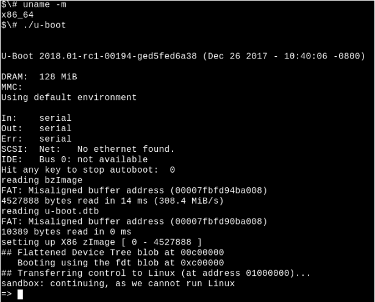

#  Phân tích quá trình khởi động của Linux

***Việc hiểu được hệ thống đang hoạt động tốt là sự chuẩn bị tuyệt với cho việc đối mặt với các vấn đề không thể tránh khỏi của hệ thống.***

Đã từng có câu nói đùa lâu đời trong làng phần mềm mã nguồn mở là: "the code is sel-documenting" (Code là tự ghi chép). Kinh nghiệm cho thấy rằng việc đọc source cũng giống nghe bản tin dự báo thời tiết: những người khôn ngoan vẫn ra ngoài và kiểm tra bầu trời.  Dưới đây là một số mèo để kiểm tra và quan sát các hệ thống linux trong quá trình khởi động (boot) bằng cách tận dụng hiểu biết về các công cụ debugging quen thuộc. Phân tích quá trình khởi động của hệ thống có đang hoạt động tốt sẽ chuẩn bị cho người dùng và các nhà phát triển đối phó được với những vấn đề lỗi không thể tránh khỏi.

Hiểu theo một số cách, thì quá trình khởi động khá là đơn giản đến kinh ngạc. Hạt nhân (kernel) khởi động đơn luồng và đồng bộ một lõi đơn và có vẻ như dễ ... Nhưng làm thế nào tự kernel có thể khởi động? Chức năng của `initrd` ([initial ramsidk](https://en.wikipedia.org/wiki/Initial_ramdisk)) và bootloader là gì? Và tại sao đèn LED trên port Ethernet luôn luôn sáng?

Đọc tiếp để tìm câu trả lời cho những câu hỏi này và các câu hỏi khác, code miêu tả cho các bài demo và bài tập thì cũng có sẵn trên Github. ([tại đây](https://github.com/chaiken/LCA2018-Demo-Code))

## Quá trình bắt đầu khởi động: trạng thái OFF

### Wake-on-LAN

Trạng thái OFF có phải là khi hệ thống không được cấp nguồn điện? ... Ví dụ, đền LED port Ethernet được chiếu sáng bởi tính năng Wake-on-LAN (WOL) được kích hoạt trên hệ thống. Kiểm tra bằng cách gõ lệnh sau:

```
 $# sudo ethtool <interface name>
```

Bộ xử lý sẽ đáp ứng cho MagicPacket có thể là một phần của interface hoặ có thể là [Baseboard Management Controller](https://lwn.net/Articles/630778/) (BMC).

### Intel Management Engine, Platform Controller Hub, and Minix (Cơ chế điểu khiển của Intel, Nền tảng điều khiển Hub, và Minix)

BMC không chỉ là vi điều khiển (MCU) mà có thể lắng nghe khi hệ thống off trên danh nghĩa. Hệ thống x86_64 bao gồm bộ phần mềm Intel Management Engine (IME) cho việc quán lý từ xa các hệ thống. Một loạt các thiết bị, từ các máy chủ tới laptop, bao gồm các công nghệ này, [cho phép các chức năng ](https://www.youtube.com/watch?v=iffTJ1vPCSo&index=65&list=PLbzoR-pLrL6pISWAq-1cXP4_UZAyRtesk) như là điều khiển từ xa KVM và Intel Capability Licensing Service. IME vẫn còn [các lỗ hổng chưa được vá](https://security-center.intel.com/advisory.aspx?intelid=INTEL-SA-00086&languageid=en-fr), theo như [Intel's ơn detection tool](https://www.intel.com/content/www/us/en/support/articles/000025619/software.html).
Tin xấu là, thật khó để vô hiệu hóa IME. Trammell Hudson đã tạo ra project [me_cleaner](https://github.com/corna/me_cleaner) để bỏ qua một số thành phần khôn ngoan của IME, như máy chủ web nhúng, nhưng cũng có thể gây brick cho hệ thống mà nó đang chạy. 

Firmware IME và phần mềm quản lý chế độ hệ thống (SMM - System management Mode) theo sau khi nó khởi động [dựa trên hệ điều hành Minix](https://lwn.net/Articles/738649/) và trên bộ xử lý Platform Controller Hub riêng rẽ, không phải CPU chính của hệ thống. SMM sau đó khởi chạy phần mềm Universal Extensible Firmware Interface (UEFI), (tham khảo [tại đây](https://lwn.net/Articles/699551/)), trên main. Nhóm Coreboot tại Google đã bắt đầu một dự án phần mềm [ Non-Extensible Reduced Firmware (NERF)](https://trmm.net/NERF) với mục đích thay thế không chỉ UEFI mà sẽ sớm là cả các thành phần userspace Linux như `systemd`. Trong lúc chờ đợi kết quả từ những nỗ lực mới này, người dùng Linux bây giờ có thể mua các laptop từ Purism, System 76, hoặc Dell [đã vô hiệu IME](https://www.extremetech.com/computing/259879-dell-now-shipping-laptops-intels-management-engine-disabled), chúng ta có thể hy vọng cho các laptop với [các bộ vi xử lý ARM 64 bit].

### Bootloader 

Bên cạnh việc khởi động phần mềm gián điệp, chức năng nào mà boot firmware sẽ sớm thực hiện? Công việc của Bootloader là tạo sẵn cho một bộ xử lý được hỗ trợ tài nguyên cần thiết để chạy một hệ điều hành chung như Linux. Khi bật nguồn, không chỉ không có bộ nhớ ảo, mà DRAM cũng chưa có cho tới khi controller của nó được bật lên. Bootloader sau đó bật nguồn cung cấp và quét các bus và các interface để định vị image trong kernel và hệ thống tệp tin root. Các bootloader phổ biến như U-Boot và GRUB đã hỗ trợ các interface quen thuộc như USB, PCI, và NFS, cũng như là các thiết bị nhúng như NOR và NAND flash. Bootloader cũng tương tác với các thiết bị bảo mật phần cứng như [Trusted Platform Modules (TPMs)](https://linuxplumbersconf.org/2017/ocw/events/LPC2017/tracks/639) để thiết lập một chain of trust từ khởi động sớm nhất.



Nguồn mở, bootloader được sử dụng rộng rãi như [U-Boot](http://www.denx.de/wiki/DULG/Manual) được hỗ trợ trên nhiều hệ thống từ Raspberry Pi tới thiết bị  Nintendo tới các board tự động cho Chromebooks. Không có  syslog, và khi mọi thứ đã diễn ra, thậm chí không có đầu ra console. Để tạo điều kiện debug, U-Boot team cung cấp một sandbox mà các bản vá lỗi có thể được test trên build-host, hoặc ngay cả trên một hệ thống được tích hợp liên tục. Việc sử dụng sandbox của U-Boot tương đối đơn giản trên một hẹ thống mà các công cụ phát triển phổ biến như Git và trình biên dịch GNU (GCC) đã được cài đặt. 

```
$# git clone git://git.denx.de/u-boot; cd u-boot
$# make ARCH=sandbox defconfig
$# make; ./u-boot
=> printenv
=> help
```

Bạn đang chạy U-Boot trên nền tảng x86_64 và có thể kiếm tra các tính năng như phân vùng lại [mock storage device](https://github.com/chaiken/LCA2018-Demo-Code),  TPM-based secret-key manipulation, và hotplug của các thiết bị USB. U-Boot sandbox có thể thực hiện từng bước một theo trình debug GDB. Việc phát triển bằng cách sử dụng sandbox nhanh hơn 10 lần so với testing bằng các nạp lại bootloader vào board, và một "bricked" sandbox có thể phục hồi với `Ctrl` + `C`

### Starting up the kernel (Khởi động kernel)

#### Provisioning a booting kernel 

Sau khi hoàn thành nhiệm vụ của nó, bootloader sẽ thực hiện nhảy tới mã kernel mà nó đã nạp vào bộ nhớ chính và bắt đầu xử lý, qua bất kì các tùy chọn dòng lệnh nào mà người dùng chỉ định.  Loại chương trình nào là kernel? `file /boot/vmlinuz` chỉ ra rằng đó là một bzlmage, nghĩa là một khối nén lớn (big compressed one).Linux source tree chứa công cụ [ extract-vmlinux tool](https://github.com/torvalds/linux/blob/master/scripts/extract-vmlinux) có thể được sử dụng để giải nén tệp:

```
$# scripts/extract-vmlinux /boot/vmlinuz-$(uname -r) > vmlinux
$# file vmlinux 
vmlinux: ELF 64-bit LSB executable, x86-64, version 1 (SYSV), statically 
linked, stripped
```
Kernel là một dạng nhị phân thực thi liên kết ([Executable and Linking Format (ELF)](http://man7.org/linux/man-pages/man5/elf.5.html)), như chương trình linux userspace. Nghĩa là chúng ta có thể yêu cầu từ gói `bituils` như `readelf`  để kiểm tra nó. So sáng đầu ra, ví dụ như: 

```
$# readelf -S /bin/date
$# readelf -S vmlinux
```

Danh sách các section trong nhị phân phần lớn là giống nhau.

Vì vậy, kernel phải bắt đầu một cái gì đó như các chương trình bị phân Linux ELF khác ...  nhưng làm thế nào các chương trình userspace thực sự khởi động? Có phải trong hàm `main()`? Không đúng. 

Trước khi hàm `main()` có thể chạy, các chương trình cần bối cảnh thực thi bao gồm các bộ nhớ heap và stack thêm vào với các file mô tả cho `stdio`, `stdout` và `stderr`. Chương trình userspace lấy các tài nguyên này từ các thư viện chuẩn, thường là `glibc` trên hầu hết các hệ thống linux. Xem xét những điều sau:

```
$# file /bin/date 
/bin/date: ELF 64-bit LSB shared object, x86-64, version 1 (SYSV), dynamically 
linked, interpreter /lib64/ld-linux-x86-64.so.2, for GNU/Linux 2.6.32, 
BuildID[sha1]=14e8563676febeb06d701dbee35d225c5a8e565a,
stripped
```

Các chương trình nhị phân ELF có một trình thông dịch, giống như các script Bash hoặc Python, nhưng các trình thông dịch không cần phải được chỉ định với `#!` như trong script, bởi ELF là định dạng tự nhiên của Linux. Trình thông dịch ELF [provisions a binary](https://0xax.gitbooks.io/linux-insides/content/Misc/program_startup.html) với các tài nguyên cần thiết bằng cách gọi tới `_start()`, một hàm có sẵn trong gõi `glibc` mà có thể [quan sát thông qua GDB](https://github.com/chaiken/LCA2018-Demo-Code/commit/e543d9812058f2dd65f6aed45b09dda886c5fd4e). Kernel  rõ ràng là không có trình thông dịch và phải cung cấp cho chính nó, nhưng làm thế nào?

Quan sát quá trình bật của kernel với GDB để có được câu trả lời. Đầu tiên cài đặt gói debug cho kernel chứa một phiên bản unstripped của `vmlinuz`, ví dụ: `apt-get install linux-image-amd64-dbg`, hoặc biên dịch và cài đặt kernel của riêng bạn từ nguồn, ví dụ, theo hướng dẫn tuyệt với từ [Debian Kernel Handbook](http://kernel-handbook.alioth.debian.org/).  `gdb vmlinux` được theo sau bởi `info files` chỉ ra trong ELF section `init.text`. Danh sách bắt đầu thực hiện chương trình thực thi trong `init.text` với `l*(address)`, nơi mà `address` là bắt đầu phần thập lục phân của `init.text`. GDB sẽ chỉ ra rằng kernel x86_64 khởi động trong file kernel [ arch/x86/kernel/head_64.S](https://github.com/torvalds/linux/blob/master/arch/x86/boot/compressed/head_64.S), nơi mà tìm thấy các hàm ghép nối `start_cpu0()` và code tạo ra một stack và giải nén zImage trước khi gọi tới hàm `x86_64 start_kernel()`. Kernel ARM 32 bit có giống với [arch/arm/kernel/head.S](https://github.com/torvalds/linux/blob/master/arch/arm/boot/compressed/head.S). `start_kernel()`không xác định kiến trúc, nên hàm này đặt trong [init/main.c](https://github.com/torvalds/linux/blob/master/init/main.c). `start_kernel()` được cho là hàm `main()` của Linux. 

### From start_kernel() to PID 1

#### The kernel's hardware manifest: the device-tree and ACPI tables

Trong quá trình boot, kernel cần thông tin về hardware vượt qua tầm kiểm soát loại bộ xử lý mà nó đã biên dịch. Các hướng dẫn trong code tăng bàng các dữ liệu cấu hình được lưu trữ riêng biêt, Có hai phương thức chính để lưu trữ dữ liệu: [ device-trees](https://www.youtube.com/watch?v=m_NyYEBxfn8) và [ACPI tables](http://events.linuxfoundation.org/sites/events/files/slides/x86-platform.pdf). Kernel học được phần cứng nào nó phải chạy ở mỗi lần khởi động bằng cách đọc các file này.

Với các thiết bị nhúng, device-tree thể hiện cho phần cứng đã được cài đặt. Device-tree đơn giản là một file được biên dịch cùng lúc với kernel source và thường nằm trong `/boot` bên cạnh `vmlinuz`. Để thấy những gì trong binary device-tree trên một thiết bị ARM, chỉ cần sử dụng lệnh `strings` từ gói `binutils` trên những file mà tên match với `/boot/*.dtb`, do `dtb` suy ra cho `device-tree binary`. Rõ ràng, device-tree có thể được sửa đổi đơn giản bằng cách chỉnh sửa các tệp tin giống như JSON để soạn và chạy lại trên trình biên dịch `dtc` đặc biệt được cung cấp cùng với kernel source. Trong khi device-tree là một tệp tĩnh, đường dẫn file thường được chuyển tới kernel bằng bootloader trên dòng lệnh, tính năng [xếp chồng device-tree](http://lwn.net/Articles/616859/) được thêm trong một vài năm gần đây, nơi mà kernel có thể tự động load thêm các fragment trong phần đáp ứng hotplug sau khi boot.

Gia đình x86 và nhiều thiết bị ARM64 cấp doanh nghiệp sử dụng cơ chế thay thế là [Advanced Configuration and Power Interface (ACPI)](http://events.linuxfoundation.org/sites/events/files/slides/x86-platform.pdf). Ngược lại với devcie-tree, thông tin ACPI được lưu trong hệ thống tệp tin ảo `/sys/firmware/acpi/tables ` được tạo bởi kernel trong quá trình boot bằng cách truy cập vào onboard ROM. Xác dễ dàng để đọc các bảng ACPI là với dòng lệnh `acpidump` từ gói `acpica-tools`. Đây là một ví dụ về bảng ACPI trên laptop Lenovo được thiết lập cho Windows 2001:


Vâng, hệ thống linux đã được thiết lập Window 2001, bạn nên cẩn thận trong việc cài đặt nó. ACPI có cả các phương thức và dữ liệu, không như device-tree, vốn có nhiều nôn ngữ mô tả phần cứng hơn. Các phương thức của ACPI tiếp tục hoạt động sau khi boot. Ví dụ, bắt đầu lệnh `acpi_listen` (từ gói `apcid`) và mở và đóng lại laptop sẽ cho thấy chức năng ACPI đang chạy mọi lúc. Trong khi việc ghi tạm thời và tự động [ghi đè lên các bảng ACPI](https://www.mjmwired.net/kernel/Documentation/acpi/method-customizing.txt) là có thể, việc thay đổi vĩnh viễn chúng bao gồm việc tương tác với BIOS khi boot hoặc reflashing  ROM. Nếu bạn đang gặp rắc rối đó, có lẽ bạn nên [cài đặt coreboot](https://www.coreboot.org/Supported_Motherboards) thay thế.

#### From start_kernel() to userspace

Code trong [init/main.c](https://github.com/torvalds/linux/blob/master/init/main.c) dễ đọc và dễ hiểu, vẫn mang nguyên bản gốc của Linus Torvalds từ năm 1991-1992. Các dòng tìm thấy trong `dmesg | head` ở đầu vào hệ thống mới khởi động bắt nguồn chủ yếu từ tệp tin này nguồn này. CPU đâì tiên được đăng ký với hệ thống, các cấu trúc dữ liệu global được khởi tạo, và trình lên lịch, bộ xử lý ngắt (IRQs), bộ đếm thời gian và giao diện điều khiển được đặt theo thứ tự nghiêm ngặt. Cho đến khi hàm `timekeeping_init()` chạy, tất cả timestamps là 0. Phần khởi tạo của kernel được đồng bộ, nghĩa là quá trình xử lý xảy ra trong chính xác một luồng, và không chức năng nào được thực hiện cho đến khi ít nhất một cái hoàn thành và trở lại. Kết quả là, đầu ra `dmesg` sẽ được tái tạo lại hoàn toàn, ngay cả giữa 2 hệ thống, miễn là chugns có chung device-tree hoặc các bảng ACPI. Linux hoạt động giống như một trong những hệ điều hành RTOS (hệ điều hành thời gian thực) chạy trên các MCU, ví dụ như QNX hoặc VxWorks. Tình huống vẫn tồn tại trong hàm `rest_init()`, được gọi bởi ` start_kernel()` tại lúc kết thúc. Hình sau mô tả quá trình kernel boot: 


`rest_init()` spawn một thread mới chạy `kernel_init()`, which invokes `do_initcalls()`. Người dụng có thể truy cập vào `initcalls` trong hành động thêm vào `initcall_debug` vào dòng lệnh kernel, kết quả trong `dmesg` mọi lúc mà hàm `initcalls` chạy. `initcalls` trải qua 7 cấp độ:  early, core, postcore, arch, subsys, fs, device, và late. Phần người dùng dễ nhìn thấy nhất của `initcalls` là dò tìm và thiết lập tất cả các thiết bị ngoại vi của bộ xử lý: bus, network, storage, display, ... kèm theo bằng các load các module kernel của chúng. `rest_init()` cũng tạo ra một thread thứ hai trên bộ xử lý boot mà bắt đầu bằng cách chạy `cpu_idle()` trong khi nó chờ cho trình lên lịch gán nó làm việc lại.

`kernel_init()` cũng thiết lập các quá trình đa xử lý đối xứng ([Symmetric Multiprocessing - SMP](http://free-electrons.com/pub/conferences/2014/elc/clement-smp-bring-up-on-arm-soc)). Với nhiều kernel gần đây, tìm thấy điểm này trong `dmesg` đầu ra bằng cách tìm "Bringing up secondary CPUs..." SMP xử lý bưởi "hotplugging" CPU, nghĩa là nó quản lý vòng đời của chúng với máy trạng thái - đó là khái niệm tương tự như các hotplugged USB sticks. Hệ thống quản lý nguồn của kernel thường lấy các core riêng lẻ, sau đó đánh thức chúng khi cần thiết, để cùng một mã CPU hotplug được gọi để thiết lập đi thiết lập lại trên một máy không bận. Quan sát lời gọi hệ thống quản lý nguồn hệ thống của CPU hotplug với công cụ [BCC](http://www.brendangregg.com/ebpf.html) `offcputime.py`

Lưu ý rằng code trong `init/main.c` thì gần như đã kết thúc xử lý khi `smp_init()` chạy: Bộ xử lý boot đã hoàn thành hầu hết việc khưởi tạo một lần mà các core khác không phải lặp lại. Tuy nhiên, mỗi các thread mỗi CPU phải được tạo ra cho  mỗi core để quản lý ngắt (IRQs), workqueues, timers, và các power events. Ví dụ, nhìn vào các luồng trên mỗi CPU mà dịch vụ softirqs và workqueues hoạt động thông qua lệnh `ps -o psr`:

```
$\# ps -o pid,psr,comm $(pgrep ksoftirqd)  
 PID PSR COMMAND 
   7   0 ksoftirqd/0 
  16   1 ksoftirqd/1 
  22   2 ksoftirqd/2 
  28   3 ksoftirqd/3 

$\# ps -o pid,psr,comm $(pgrep kworker)
PID  PSR COMMAND 
   4   0 kworker/0:0H 
  18   1 kworker/1:0H 
  24   2 kworker/2:0H 
  30   3 kworker/3:0H
[ . .  . ]
```

Trường PSR đại diện cho "processer". Mọi core phải làm chủ thời gian của nó và xử lý hotplug `cpuhp`

Vậy cuối cùng thì làm thế nào userspace start? Gần cuối, `kernel_init()` tìm kiếm `initrd` mà có thể xử lý tiến trình `init` thay cho nó. Nếu không tìm thấy, kernel trực tiếp thực hiện `init`. Tại sao người ta có thể muốn một `initrd`?

#### Early userspace: who ordered the initrd?

Bên cạnh device-tree, một đường dẫn file khác được cung cấp tùy chọn cho kernel khi boot là `initrd`. `initrd` thường ở trọng `/boot` bên cạnh bzImage file vmlinuz trên x86, hoặc bên cạnh uImage và device-tree cho ARM. Liệt kê các nội dung của `initrd` với công cụ `lsinitramfs` là một phần của gói `initramfs-tools-core`. Distro `initrd` chứa các thư mục tối thiểu như `/bin`, `/sbin` và `/etc` cùng các module của kernel, cộng với một số file trong `/scripts`. Tất cả đều đã quá quen thuộc, vì `initrd` phần lớn chỉ đơn giản là một hệ thống tệp tin gốc linux tối thiếu. Sự giống nhau này sẽ tạo ra một chút nhầm lẫn, gần như tất cả thư mục `/bin`, `/sbin` bên trong ramdisk được liên kết tới [BusyBox binary](https://www.busybox.net/), kết quả là trong thư mục `/bin` và `/sbin`nhỏ hơn 10 lần so với của `glibc`.

Tại sao phải tạo ra một `initrd` nếu tất cả những gì nó thực hiện là nạp một số module và sau đó bắt đầu `init` trên hệ thống tệp tin gốc thường? Cân nhắc đến một hệ thống file gốc được mã hóa. Việc giải mã có thể dựa vào việc tải một module kernel được lưu trong `/lib/modules` trên tệp tin gốc, ... và không ngạc nhiên, `initrd` làm rất tốt. Module crypto có thể được biên dịch tĩnh trong kernel thay vì tải từ một file, nhưng có nhiều lý do khiến bạn không muốn làm như vậy. Ví dụ, việc biên dịch tĩnh trong kernel với các module làm cho nó vượt quá dung lượng có sẵn, hoặc việc biên dịch tĩnh có thể vi phạm các điều khoản của giầy phép phần mềm. Cũng chả ngạc nhiên, storage, network và các driver (HID) có thể có trong `initrd` basically any code that is not part of the kernel proper that is needed to mount the root filesystem. `inird` cũng thay thế nơi mà người dùng có thể stask code bảng [ACPI tùy chỉnh](https://www.mjmwired.net/kernel/Documentation/acpi/initrd_table_override.txt)


`initrd` cũng tuyệt vời cho việc thử nghiệm các hệ thống file và các thiết bị lưu trữ. Giữ các công cụ test trong `initrd` và chạy test của bạn từ bộ nhớ hơn là từ các đối tượng test. 

Cuối cùng, khi `init` chạy, hệ thống bật. Vì bộ xử lý thứ cấp hiện đang chạy, machine trở thành không đồng bộ, không thể đoán trước, hiệu quả cao. Quả thực, `ps -o pid,psr,comm -p 1` có thể cho thấy tiền trình `init` của userspace không cọn chạy trên bộ xử lý boot nữa. 

## Kết luận

Quá trình khởi động của Linux nghe có vẻ khó hiểu, việc xem xét số lượng các phần mềm khác nhau tham gia các sự kiện trên một thiết bị nhúng đơn giản. Nhìn vào những sự khác biệt, quá trình khởi động lại khá là đơn giản, vì sự phúc tạp gây bối dối do các tính năng như preemption, RCU, và các điều kiện bị thiếu trong khi khởi động. Tập trung vào kernel và PID 1 nhìn thấy một lượng lớn công việc mà bootloader và bộ vi xử lý phụ trợ có thể làm trong việc chuẩn bị platform cho kernel chạy. Trong khi kernel chắc chắn là duy nhất giữa các chương trình linux, một số cái nhìn sâu vào cấu trúc có thể áp dụng một số công cụ tương tự dùng để kiểm tra các chương trình ELF khác.  Nghiên cứ về quá trình khởi động khi hệ thống bảo trò tốt để chuẩn bị sửa các lỗi có thể xảy ra sau này.  


***Link bài gốc:*** https://opensource.com/article/18/1/analyzing-linux-boot-process