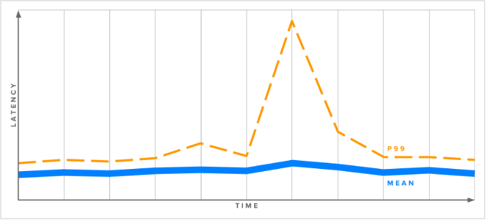
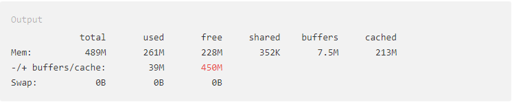
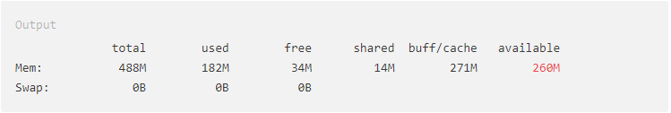
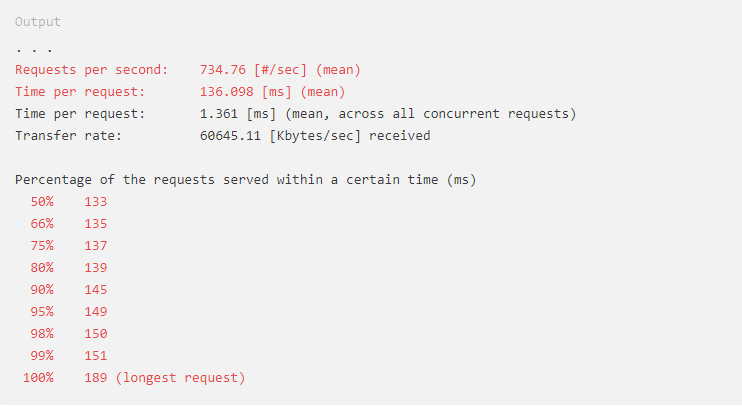
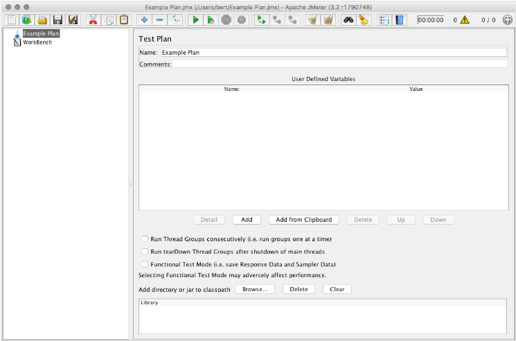
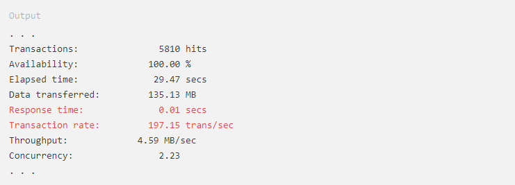
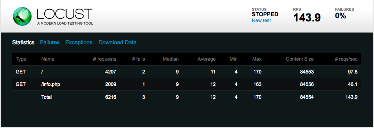
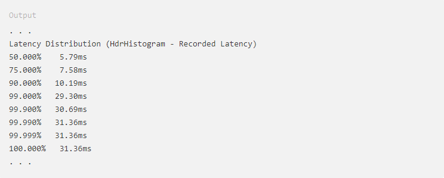

# Giới thiệu về Load Testing

## Giới thiệu
Vì các trang web và các ứng dụng web ngày càng có thêm nhiều tính năng phong phú và phức tạp, hiệu năng trở thành mối quan tâm chính của các nhà phát triển cũng như người sử dụng. Với [các nghiên cứu](https://wpostats.com/) cho thấy rằng các trang web đem lại kết quả một cách nhanh chóng sẽ được nhiều người sử dụng hơn, bán hàng nhiều hơn và tăng lưu lượng truy cập, thật quan trọng để quan tâm tới tốc độ mà trang web phục vụ người sử dụng và làm cho trang web của bạn hiển thị trên trình duyệt của họ.

Thuật ngữ chung cho lĩnh vực này được gọi là "Tối ưu hóa hiệu suất" (performance optimization), và trong vài năm qua đã cso nhiều phương pháp tốt nhất về kĩ thuật và công nghệ đã được phát triển để cải thiện trải nghiệm web. Nhiều kĩ thuật trong các kĩ thuật này tập trung vào việc giảm thiểu kích thước tải xuống của các trang web, tối ưu hóa JavaScript và giới hiệu số lượng yêu cầu HTTP riêng lẻ mà cần thiết cho một trang web.

Trong bài viết này, chúng tôi sẽ nói về một khía cạnh khác của hiệu suất web: Làm thế nào để máy chủ web của bạn có thể đám ứng được yêu cầu của người sử dụng? Chúng tôi sẽ xem xét tổng quan việc load testing (kiểm tra tải), từng bước một kế hoạch để tìm ra tỷ lệ đáp ứng tối đa của máy chủ và thảo luận về một số phần mềm mã nguồn mở để kiểm thử tải (load testing software).

## Một số thuật ngữ

Trước khi bắt đầu, hãy tìm hiểu làm rõ một số thuật ngữ và khái niệm:

- **Latency** (*Độ trễ*): thời gian để đo tốc độ đáp ứng các yêu cầu từ client của máy chủ. Thông thường được đo bằng đơn vị ms, độ trễ thường được gọi là thời gian đáp ứng. Độ trễ càng thấp càng cho thấy tốc độ phản ứng nhanh của máy chủ. Độ trễ được đo ở phía client, được tính kể từ thời điểm yêu cầu được gửi đi cho tới khi nhận lại được phản hồi. Tải mạng cũng bao gồm trong số này.

- **Throughput** (*Thông lượng*): là lượng yêu cầu mà máy chủ có thể xử lý trong một khoảng thời gian cụ thể, thường là số yêu cầu trong một giây.

- **Percentiles** (*Tỷ lệ phần trăm*): là một cách để nhóm các kết quả theo tỉ lệ phần trăm của toàn bộ mẫu. Nếu thời gian phản hồi phần trăm thứ 50 của bạn là 100ms, thì có nghĩa là 50% yêu cầu đã được trả lại trong vòng 100ms hoặc ít hơn. Biểu đồ sau cho thấy lý do tại sao nên xem các mẫu của bạn theo tỉ lyệ phần trăm.

	

	Biểu đồ trên cho biết độ trễ của một máy chủ web trong một khoảng thời gian. Mặc dù thời gian đáp ứng trung bình khá là phù hợp, vẫn có một sự tăng lên đột biến trong đường phân đoạn thứ 99. Nghĩa là 1% yêu cầu của người dùng thậm chí còn có kết quả tệ hơn lần đo thứ 99 tỉ lệ phần trăm này, trong khi mức trung bình vẫn tương đối ổn định. Vì lý do này, nên xem xét tỷ lệ phần trăm để có được cảm nhận chính xác hơn về những gì mà người sử dụng web của bạn thực sự trải nghiệm.


## Cơ bản về Load testing 

Load testing là việc thử nghiệm thực tiễn gửi lưu lượng truy cập HTTP mô phỏng đến máy chủ để đo hiệu suất và trả lời một số câu hỏi quan trọng, như:

- Máy chủ có đủ tài nguyên (CPU, bộ nhớ, vv...) để xử lý tải dự đoán?

- Liệu máy chủ có đáp ứng nhanh chóng đủ để cung cấp trải nghiệm tốt cho người sử dụng?

- Ứng dụng của chúng ta có hoạt động hiệu quả?

- Chúng ta có cần mở rộng tài nguyên phần cứng máy chủ, hoặc mở rộng ra trên nhiều máy chủ?

- Có bất kì trang web hoặc lời gọi API nào mà đòi hỏi tải nguyên lớn hay không?

Load testing được thực hiện bằng cách chạy phần mềm kiểm tra tải trên một máy (hoặc cụm máy) để tạo ra một lượng lớn yêu cầu tới tới một máy chủ web trên máy thứ hai (hoặc nền tảng phục vụ máy chủ web phức tạp khác). Có sẵn rất nhiều công cụ như vậy, và chúng ta sẽ xem xét một số phần mềm cụ thể sau. Bây giờ, chúng ta sẽ thảo luận về load testing theo các điểu khoản mà sẽ phù hợp với bất kì phần mềm nào mà bạn chọn. 

Mục đích chung của việc kiểm tra tải là tìm ra số yêu cầu tối đa mà server xử lý được mỗi giây. Điều này được thực hiện bằng cách gửi càng nhiều yêu cầu có thể tới một máy chủ và xem có bao nhiêu yêu cầu được xử lý thành công và gửi trả trở lại.

Việc này hữu ích như là bước đầu tiên để biết được khả năng tối đa của máy chủ, nhưng không cho chúng ta nhiều thông tin về độ trễ và hiệu suất thực tế hàng ngày mà người sử dụng trải nghiệm. Một máy chủ với khả năng chịu tải lớn có thể đáp ứng một nghìn phản hồi mỗi giây, nhưng nếu mỗi phản hồi mất tới 10s thì người sử dụng cũng không thấy vui vẻ gì.

Biểu đồ sau cho thấy mối quan hệ giữa thông lượng (throughput) (phản hồi/s) và độ trễ (latency):


Đây chỉ là một ví dụ, và mọi thiết lập sẽ có lại hồ sơ phản hồi duy nhất, tuy nhiên xu hướng chung là tải cao hơn (đáp ứng được nhiều yêu cầu mỗi giây) dẫn tới độ trễ cao hơn. Để có được ý tưởng thực tế về độ trễ của máy chủ ở một tải nhất định, chúng ta ca àn kiểm tra nhiều lần theo các tỷ lệ yêu cầu khác nhau. Không phải tất cả các phần mềm kiểm tra tải có khả năng thực hiện việc này, nhưng sau đó chúng ta sẽ thảo luận về `wrk2`, công cụ kiểm tra tải bằng dòng lệnh có thể thực hiện chức năng này.


```
Mục tiêu của mức độ trễ hợp lý là gì?

Mặc dù thười gian tải trang web phổ biến trong phạm vi 2 - 5s, phần thời gian do độ trễ của máy chủ web thường dao động trong khoảng 50 - 200ms. Điều phù hợp với bạn và trang web của bạn phục thuộc vào rất nhiều yếu tố (người dùng, thị trường, mục đích trang web, là giao diện người dùng hoặc dịch vụ API, ... ) để đưa ra một mục tiêu cụ thể hơn, nhưng hãy nhớ là hầu hết các nghiên cứu cho thấy rằng mọi tốc độ đều được tính toán và thậm chí những cải tiến "không nhận thấy được" sẽ mang lại những kết quả tốt hơn khi xem xét một cách tổng thể. 
```

Bây giờ chúng ta đã một số hiểu biết chung về Load testing, hãy thảo luận một kế hoạch cụ thể để khám phá ra hiệu suất máy chủ của chúng ta.

## Kế hoạch kiểm tra tải

Có một số bước chung mà bạn có thể thực hiện để biết được làm thế nào máy chủ của bạn và ứng dụng web thực hiện và đáp ứng tải. Đầu tiên, chúng ta sẽ đảm bảo rằng chúng ta đang theo dõi các tìa nguyên hệ thống trong suốt quá trình kiểm tra tải. Sau đó, chúng ta sẽ tìm ra được số lượng yêu cầu tối đa trong một giây mà máy chủ có khả năng đáp ứng. Cuối cùng, chúng ta sẽ tìm ra thông lượng tối đa mà các độ trễ của các máy chủ dẫn tới kết quả không chấp nhận được cho người sử dụng.

### Bước 1: Giám sát tài nguyên

Phần mềm kiểm tra tải sẽ cung cấp một số thông tin về yêu cầu và độ trễ, nhưng nó thật hữu ích để theo dõi một số chỉ số khác của hệ thống để xem máy chủ có bị hạn chế về tài nguyên khi giải quyết lượng truy cập lớn.

Chúng ta hầu hết quan tâm tới tải CPU và bộ nhớ trống: theo dõi những chúng trong khi đang máy chủ đang chịu tải nặng sẽ giúp bạn đưa ra các quyết định sáng suốt hơn về cách mở rộng cơ sở hạ tầng và nơi cần tập trung nỗ lực khi phát triển các ứng dụng của mình.

Nếu bạn đã biết cách thiết lập một hệ thống giám sát (như [Prometheus](https://www.digitalocean.com/community/tutorials/how-to-use-prometheus-to-monitor-your-ubuntu-14-04-server) hay [Graphite](https://www.digitalocean.com/community/tutorials/an-introduction-to-tracking-statistics-with-graphite-statsd-and-collectd) và [CollectD](https://www.digitalocean.com/community/tutorials/an-introduction-to-tracking-statistics-with-graphite-statsd-and-collectd)) thì hãy thiết lập nó. Nếu không, bạn login vào máy chủ web thông qua SSH và sử dụng những công cụ dòng lệnh sau đây để theo dõi tải nguyên thời gian thực.

Để kiểm tra bộ nhớ có sẵn, bạn có thể sử dụng lệnh `free`. Kết hợp với `watch` để theo dõi định kì (mặc định mỗi 2s một chu kì) để cập nhật đầu ra:

` $ watch free -h`

Cờ `-h` cho biết đầu ra của lệnh `free` là các số theo định dạng mà có thể đọc được thay vì các bytes:



Số được đánh dấu ở đầu ra thể hiện dung lượng trống của bộ nhớ sau khi đã sử dụng vào bộ đệm và bộ nhớ cache. Phiên bản mới hơn của `free` đã thay đổi đầu ra như sau:



Cột mới `available` được tính toán hơi khác, nhưng nói chung đại diện cho cùng một số liệu: bỗ nhớ sẵn có hiện tại cho các ứng dụng sử dụng.

Để theo dỗi lượng CPU sử dụng bằng dòng lệnh `mpstat` là một tiện ích tốt cung cấp một cái nhìn cập nhật về lượng tài nguyên CPU còn lại, `mpstat` không được cài đặt mặc định trên Ubuntu. Bạn có thể cài đặt nó bằng dòng lệnh sau:

`$ sudo apt-get install sysstat`

Khi bạn khởi động `mpstat` bạn cần chỉ ra số giây giữa các lần cập nhật: 

`$ mpstat 2`

Nó sẽ làm xuất ra một hàng tiêu đề, và sau đó là các hàng số liệu thống kê sau mỗi 2s: 


`%idle` cho thấy phần trăm CPU chưa được sử dụng. Nguyên nhân mà ta thấy **idle** thay vì bao nhiêu phần trăm được sử dụng **used** là bởi vì sử dụng CPU thường được chia thành nhiều loại khác nhau như **user** CPU và **system** CPU. 

Bây giờ chúng ta có thể quan sát tài nguyên máy chủ, hãy thử nghiệm kiểm tra tải để tìm ra được tỉ lệ đáp ứng tối đa của máy chủ.

### Bước 2: Tìm ra tỉ lệ đáp ứng tối đa

Như đã đề cập trước đó, hầu hết các phần mềm kiểm tra tài đặc biệt phù hợp với việc tìm ra tỷ lệ phản hồi tối đa của máy chủ web. Thông thường, chỉ các tùy chọn mà bạn sẽ cần thiết lập là *concurrency* mong muốn với thời gian kiểm tra.

Concurrency là thước đo số lượng kết nối song song được thực hiện với máy chủ. 100 là lựa chọn an toàn mặc định cho việc này, nhưng bạn có thể thực hiện một lựa chọn nhiều thông tin hơn bằng cách kiểm tra `MaxClients` (Số lượng máy client tối đa), `MaxThreads` (Số lượng luồng tối đa) hoặc các cài đặt tương tự của máy chủ web để xác định có bao nhiêu kết nối đồng thời có thể xử lý được.

Ngoài các việc đặt các tùy chọn đó, bạn cần phải chọn một URL để sử dụng cho việc test. Nếu phần mềm của bạn chỉ có thể xử ý được một URL tại cùng một thời điểm, bạn nên thử nhiều lần với một số URL khác nhau vì yêu cầu xử lý có thể khác nhau giữa - ví dụ: trang chủ và trang sản phẩm yêu cầu nhiều truy vấn vào cơ sở dữ liệu để tải.

Ngoài ra, một số phần mềm kiểm tra tải cho phép bạn chỉ định nhiều URL để test cùng một lúc. Đây là một cách hay để mô phỏng chính xác hơn lưu lượng truy cập thực tế. Nếu bạn đã có dữ liệu hiện tại của trang web (từ phần mềm phân tích hoặc log của máy chủ), bạn có thể kết hợp chặt chẽ các URL thử nghiệm với các giá trị quan sát được.

KHi bạn phân loại URL hoặc các URL để test, hãy chạy thử tải. Đảm bảo phần mềm của bạn đang gửi yêu cầu càng nhanh càng tốt. Nếu bạn đang sử dụng phần mềm yêu cầu bạn chọn tỉ lệ phát yêu cầu, hãy chọn một giá trị gần như chắc chắn là quá lớn. Nếu phần mềm của bạn có một sự trễ cấu hình giữa các yêu cầu, giảm nó xuống bằng 0.

Bạn nên thấy lượng CPU và bộ nhớ đang tiêu thụ. Phần CPU idle có thể đạt tới 0% và máy client thử tải có thể nhận được kết nối lỗi khi máy chủ của bạn cố gắng đáp ứng tất cả các yêu cầu. Điều này là bình thường, vì chúng ta đẩy máy chủ tới giới hạn của nó.

Khi quá hạn, phần mềm của bạn sẽ đưa ra một số thống kê, bao gồm số yêu cầu mỗi giây. Lưu ý: thời gian phản hồi: nó có thể rất tệ, vì máy chủ đã trở nên quá tải. Vì lý do này, số các yêu cầu trên mỗi giây không là một thứ để suy ra được thông lượng tối đa thực tế của máy chủ, nhưng đó cũng là một điểm khởi đầu tốt cho việc tìm hiểu thêm

Tiếp theo, chúng ta quay trở lại tải và kiểm tra lại tải một lần nữa để lấy thêm nhiều thông tin về cách mà máy chủ thực hiện khi nó bị đầy đến giới hạn tối đa của nó.

### Bước 3: Tìm thông lượng tối đa thực tế

Ở bước này, chúng ta cần phải sử dụng phần mềm kiểm tra tải mà có thể giảm tải một chút để kiểm tra hiệu suất của máy chủ ở các cấp độ khác nhau. Một số phần mềm thực hiện việc này bằng cách cho phép bạn xác định trễ giữa các yêu cầu, nhưng điều này làm cho khó có thể nhắm tới mục tiêu tìm được thông lượng chính xác.

May mắn là, `wrk2` cho phép bạn chỉ định chính xác số yêu cầu mỗi giây. Nó thực hiện việc này bằng cách chạy một số yêu cầu hiệu chuẩn được có được thời gian vừa phải.

Lấy tỉ lệ yêu cầu tối đa từ bước trước và giảm đi một nửa. Chạy thử nghiệm khác với tỉ lệ mới này và lưu ý thời gian phản hồi. Nó vẫn nằm trong phạm vi chấp nhận được?

Nếu có, tăng tỉ lệ theo hướng tối đa, kiểm tra cho đén khi độ trễ ở mức tối đa chấp nhận được. Đây là tỉ lệ phản hồi tối đa thực tế mà máy chủ của bạn có thẻ xử lý trước khi người dùng của bạn gặp phải sự cố.

```
Lưu ý: Như đã đề cập trong phần thuật ngữ, khi đo độ trễ bạn nên xem xét phần trăm thứ 99 hoặc thậm chí là phần trăm 99,999 để đảm bảo rằng tất cả người sử dụng được phục vụ trong thời gian đáp ứng chấp nhận được. Hãy nhớ rằng, hầu hết các trang web yêu cầu hàng chục yêu cầu tìm để load toàn bộ trang (bao gồm hình ảnh, JavaScripts, file CSS, ...) và hiển thị trang. Nếu trang web của bạn mất 10 yêu cầu để hoàn thành và bạn đang đo phần trăm thứ 99 thì khoảng 10% trang của bạn sẽ vẫn gặp một yêu cầu với độ trễ cao hơn.
```

Tiếp theo, chúng ta sẽ xem xét một số gói phần mềm nguồn mở có sẵn để giúp thực hiện kế hoạch kiểm thử tải.  

## Phần mềm kiểm thử tải

Có rất nhiều gói phần mềm mã nguồn mở có sẵn cho việc kiểm thử tải. Hơn nữa, có nhiều dịch vụ thương mại sẽ chạy cơ sở hạ tầng thử nghiệm tải cho bạn và tự động tạo ra các biểu đồ và báo cáo từ dữ liệu thử nghiệm. Những dịch vụ này có thể là một lựa chọn tốt cho  các doanh nghiệp cần tạo ra số lượng lớn tải để kiểm tra cơ sở hạ tầng quy mô lớn, vì hầu hết trong số họ chạy các cụm máy để tảo ra nhiều yêu cầu hơn là một máy chủ duy nhất có thể. 

Điều đó cho thấy, một số công cụ mã nguồn mở cũng có khả năng chạy trong chế độ cụm (cluster). Hãy xem xét một số công cụ mã nguồn mở phổ biến hiện nay và tóm tăt các tính năng của chúng:

#### [ab](https://httpd.apache.org/docs/2.4/programs/ab.html)

**ab** (hay ApacheBench) là một công cụ dòng lệnh đơn giản, có một luồng để làm tiêu chuẩn cho HTTP server. Mặc dù nó đã được phân phối ban đầu như một phần của máy chủ Apache HTTP, bạn có thể sử dụng ab để kiểm tra bất kì máy chủ HTTP hay HTTPS nào.

Lời gọi cơ bản của lệnh `ab` như sau:

`ab -n 1000 -c 100 http://example.com/`

Bạn chỉ định số yêu cầu (`-n`) và tùy chọn đồng thời (`concurrency` `-c`) và cung cấp một URL để nạp. Đầu ra chứa các yêu cầu trong mỗi giây, thời gian yêu cầu, và một danh sách các phần trăm thời gian phản hổi khác nhau:



#### [JMeter](https://jmeter.apache.org/)

JMeter là một ứng dụng thử nghiệm chức năng và kiểm tra tải mạnh mẽ và giàu tính năng từ Apache Software Foundation. Chức năng kiểm tra là JMeter cũng có thể kiểm tra để đảm bảo rằng trang Web hoặc ứng dụng của bạn đang sản xuất đúng lượng đầu ra.

JMeter có một giao diện Jave để thiết lập kế hoạch kiểm thử:



Kế hoạch kiểm thử có thể được ghi lại bằng cách sử dụng Web proxy của JMeter và một trình duyệt thông thường. Điều này cho phép bạn kiểm tra với lưu lượng truy cập mô phỏng chặt chẽ hơn việc sử dụng trong thực tế.

JMeter có thể xuất thông tin phần trăm dưới dạng HTML và các định dạng khác.

#### [Siege](https://www.joedog.org/siege-home/)

Siege là một công cụ dòng lệnh để kiểm thử tải khác, tương tự như `ab` nhưng với một vài tính năng khác nhau. Siege là đa luồng, cho phép thông lượng tương đối cao. Nó cũng cho phép bạn cung cấp một danh sách các URL để được kiểm thử. Lời gọi cơ bản như sau:

`$ siege -c 100 -t 30s http://example.com/`

Gọi 100 yêu cầu đồng thời (`-c 100`) và thử nghiệm trong 30s (`-t 30s`). Siege xuất ra thời gian đáp ứng trung bình và tỉ lệ yêu cầu:



Siege không cung cấp sự phân tích phần trăm cho các thống kê về độ trễ.

#### [Locust](http://locust.io/)

Locust là một công cụ kiểm thử tải dựa trên Python với giao diện web thời gian thực để theo dõi các kết quả giám sát:



Bạn viết kịch bản kiểm thử Locust bằng ngôn ngữ Python, cho phép một số cấu hình mạnh mẽ thuận tiện cho những người đã quen với ngôn ngữ này.

Locust có thể chạy ở chế độ phân tán (distributed mode), nơi bạn có thể chạy một cụm máy chủ Locust và cho phép chúng tạ ra tải theo một cách phối hợp. Điều này tạo điều kiện cho việc kiểm tra tải của cơ sở hạ tầng web mạnh mẽ.

Locust có thể cung cấp thống kê chi tiết và thông tin về phần trăm trong các tệp CSV tải xuống.

#### [wrk2](https://github.com/giltene/wrk2)

wrk2 là một công cụ kiểm thử giao diện dòng lệnh đa luồng có khả năng tạo ra tải ở một tỷ lệ yêu cầu cụ thể. Nó có thể cung cấp số liệu thống kê độ trễ chi tiếp và có thể scriptable với ngôn ngữ lập trình Lua.

wrk2 được thực hiện với dòng lệnh `wrk` ( nó là một nhánh của lệnh gốc `wrk`):

`$ wrk -t4 -c100 -d30s -R100 --latency http://example.com/`

Các tùy chọn trên chỉ định 4 luồng (`-t4` , bạn nên sử dụng đúng với số lượng lõi xử lý trên máy của bạn), 100 yêu cầu đồng thời (`-c100`), thử nghiệm trong 30s (`-30s`) và tỷ lệ yêu cầu 100 yêu cầu mỗi giây (-R100). Cuối cùng, chúng ta yêu cầu độ trễ đầu ra với tùy chọn `--latency`:



Trên là một phần đầu ra - thêm thông tin phần trăm độ trễ chi tiết cũng được đưa ra.

## Kết luận

Trong bài này, chúng ta cùng xem lại một số thuật ngữ về kiểm thử tải và các khái niệm cơ bản, tìm hiểu một kế hoạch để tìm ra được số lượng yêu cầu tối đa mỗi giây, các tìa nguyên hệ thống quan sát được để có hướng tìm ra các quyết định trong tương lai về việc phát triển phần cứng và nhìn vào một số phần mềm kiểm thử nguồn mở có sẵn.

Sau khi đo hiệu suất của cơ sở hạ tầng, bạn có thể muốn thực hiện các thông tin này để cố gắng cải thiện thời gian đáp ứng và giảm tải trên máy chủ. Bạn có thể muốn mở rộng phần cứng máy chủ web của mình, hoặc mở rộng ra với nhiều máy chủ và cân bằng tải. Bạn có thể thử tinh chỉnh cấu hình của máy chủ web để tối ưu số lượng kết nối mà nó cho phép hoặc số lượng tiến trình làm việc hoặc số luồng mà nó sử dụng. Bạn cũng có thể nhìn vào lượng bộ đệm thường xuyên truy cập dữ liệu trong bộ nhớ, để giảm tải cơ sở dữ liệu và thời gian truy vấn.

Bạn sẽ tìm thấy thông tin về các chủ đề trên và nhiều hơn nữa [tại đây.](https://www.digitalocean.com/community/tags/server-optimization?type=tutorials)


***Link bài gốc***: https://www.digitalocean.com/community/tutorials/an-introduction-to-load-testing