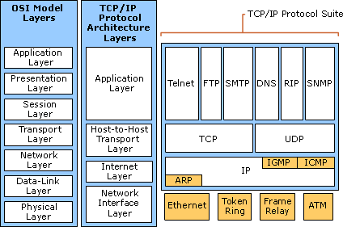
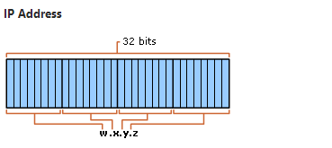
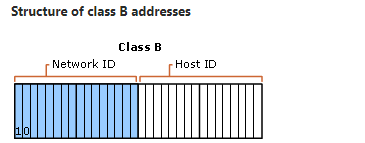
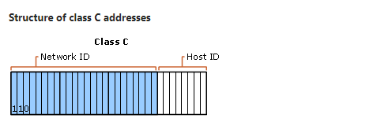
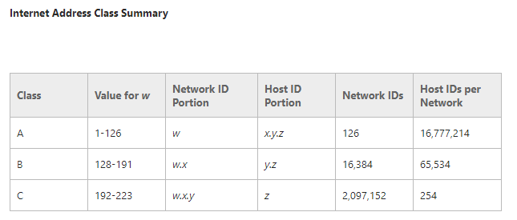
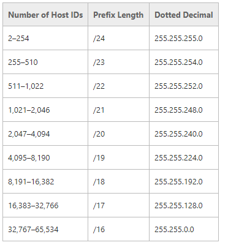
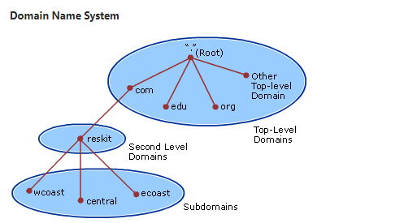
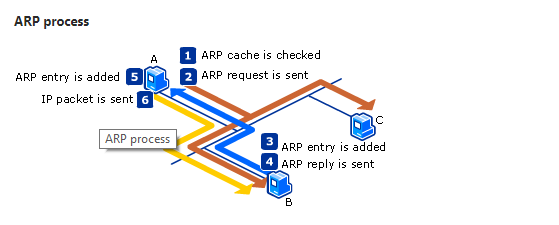

11# How TCP/IP Works

### ***Mục lục***

[TCP/IP Protocol Architecture ](#1)

[IPv4 Addressing ](#2)

[Name Resolution ](#3)

[IPv4 Routing ](#4)

[Physical Address Resolution ](#5)

[Related Information ](#6)

---

TCP/IP cho IPv4 là giao thức mạng phù hợp với người sử dụng Microsoft Windows để kết nối thông qua Internet với các máy tính khác. Nó tương tác với dịch vụ tên miền Windows như DNS và các công nghệ bảo mật, chủ yếu như IPsec, bởi giúp tạo điều kiện thuận lợi cho chuyển thành công và bảo mật các gói tin giữa các máy.

Lý tưởng nhất là TCP/IP được sử dụng với bất cứ máy tính Window nào truyền thông qua mạng.

Chủ đề chính bài viết này là mô tả các thành phần của bộ giao thức TCP/IP, kiến trúc giao thức, chức năng TCP/IP thực hiện, cách các địa chỉ được cấu trúc và phân công, và các cách gói tin được tạo ra và định tuyến.

Microsoft Windows Server 2003 cung cấp sự hỗ trợ rộng rãi cho bộ giao thức TCP/IP (Transmission Control Protocol/Internet Protocol), như là một giao thức và tập hợp các dịch vụ cho kết nối và quản lý mạng IP. Kiến thức các khái niệm cơ bản của TCP/IP là một yêu cầu tất nhiên cho sự hiểu biết chính xác về cấu hình, triển khai và xử lý sự cố của máy chủ Window 2003 và mạng intranet Microsoft Windows 2003.

<a name = '1'></a>
# TCP/IP Protocol Architecture

Các giao thức TCP/IP được chia thành 4 layer (4 lớp) chính được biết tới là mô hình DAPRA - được đặt tên theo cơ quan Chính phú Mĩ hình thành và phát triển TCP/IP. 4 layer của mô hình DAPRA là: Application (tầng Ứng dụng), Transport (tầng Chuyển vận), Internet (tầng kết nối, Internet), và Network Interface layer. Mỗi lớp trong mô hình DAPRA có trách nhiệm cho 1 hoặc nhiều hơn một lớp của 7 lớp trong mô hình OSI.

Hình sau mô tả kiến trúc bộ giao thức TCP/IP:



>> Lưu ý: Mô hình kiến trúc trên tưng ứng với giao thức mạng TCP/IP và không phản ánh tương tứng với IPv6. Để xem kiến trúc tương ứng IPv6, xem "How IPv6 Works" ở phần tham chiếu.

## Network Interface Layer

Lớp Network Interface (hay lớp Network Access) xử lý các gói tin TCP/IP vào phương tiện mạng (medium - môi trường truyền gói) và nhận gói tin từ medium. TCP/IP được thiết kế độc lập với các phương thức truy cập mạng, định dạng frame, và medium. Theo cách này, TCP/IP có thể được sử dụng để kết nối tới các loại mạng khác nhau; môi trường mạng LAN như Ethernet và Token Ring, công nghệ WAN như X.25 và Frame Relay. Sự độc lập với các phương tiện truyền thông mạng (medium) cho phép TCP/IP đáp ứng với các medium mới như mạng ATM (Asynchronouse transfer mode).

Network Interface layer gồm các lớp Data Link và Physical layer trong mô hình OSI. Lưu ý rằng lớp Internet không tận dụng các dịch vụ xác định tuần tự SEQ (sequencing) và ACK (acknowledgment) có thể có trong lớp Network Interface. Một Network interface layer không tin cậy được gia định, và truyền tin cậy thông qua sự thiết lập session và đánh thứ tự, ACK của gói tin là chức năng của lớp Transport. 

## Internet layer

Internetl layer xử lý việc đánh địa chỉ, đóng gói gói tin và định tuyến. Giao thức lõi của Internet layer là IP, ARP, ICMP và IGMP.

- Internet Protocol (IP) là một giao thức có thể định tuyến mà xử lý việc đánh địa chỉ, định tuyến, và phân mảnh cũng như ghép lại các gói tin.

- Giao thức phân giải địa chỉ (Address Resolution Protocol - ARP) xử lý phân giải ngược từ địa chỉ lớp Internet thành địa chỉ lớp Network Interface, như là địa chỉ phần cứng.

- Giao thức ICMP (Internet Control Message Protocol) có chức năng chẩn đoán và báo lỗi do việc truyền gói tin IP không thành công.

- Giao thức IGMP (Internet Group Management Protocol) quả lý các IP thuộc nhóm IP multicast.

Lớp Internet tương tự như lớp Network trong mô hình OSI.

## Transport Layer

Lớp Transport (hay được biết như là Host-to-Host layer) xử lý việc cung cấp cho lớp Application session và các dịch vụ truyền dữ liệu. Giao thức chính của Transport layer là Transmission Control Protocol (TCP) và User Datagram Protocol (UDP).

- TCP cung kết nối một - một, kết nối có hướng và truyền tin cậy. TCP thực hiện thiết lập một kết nối TCP, đánh số gói tin và xác nhận xem sự nhận được của gói tin đã gửi, và truyền lại các gói bị mất trên đường truyền. 

- UDP cung cấp kết nối một - một hoặc một - nhiều, không hướng kết nối, truyền không tin cậy. UDP được sử dụng khi số lượng dữ liệu cần truyền là nhỏ (như dữ liệu phù hợp với một gói duy nhất), khi bạn không muốn phải thực hiện quá trình thiết lập một kết nối TCP, hoặc khi các ứng dụng hoặc các giao thức lớp trên cung cấp sự truyền tin cậy. 

Lớp Transport trong mô hình TCP/IP tương ứng với lớp Transport trong mô  hình OSI.

## Application Layer

Lớp Ứng dụng _ Application layer cho phép các ứng dụng truy cập các dịch vụ của các lớp khác và định nghĩa các giao thức mà ứng dụng sử dụng để trao đổi dữ liệu. Có nhiều giao thức lớp Ứng dụng và nhiều giao thức mới đang được phát triển.

Các giao thức lớp Ứng dụng được biết đến rộng rãi là các giao thức dùng để trao đổi thông tin người dụng:

- HTTP (Hypertex Transfer Protocol) được sử dụng để truyền các file mà tạo nên trang web của www (World Wide Web).

- FTP (File Transfer Protocol) được sử dụng để tương tác truyền file.

- SMTP (Simple Mail Transfer Protocol) được sử dụng cho việc chuyển mail và đính kèm.

- Telnet - giao thức mô phỏng thiết bị đầu cuối, được sử dụng để đăng nhập từ xa đến các máy trong mạng.

Hơn nữa, các giao thức lớp Ứng dụng sau còn giúp tạo điều kiện cho việc sử dụng và quản lý các mạng TCP/IP:

- DNS (Domain Name System) được sử dụng để phân giải tên miền sang địa chỉ IP.

- RIP (Routing Information Protocol) là giao thức định tuyến mà router sử dụng để trao đổi thông tin định tuyến trong một mạng IP.

- SNMP (Simple Network management Protocol) được sử dụng giữa một trình điều khiển mạng và các thiết bị mạng (router, bridge, hub thông minh) để thu thập và trao đổi thông tin quản lý mạng. 

Các ví dụ về giao diện cho các ứng dụng TCP/IP là Window Sockets và NetBIOS. Windows Sockets cung cấp một giao diện chương trình ứng dụng (Application Programming Interface - API) dưới Windows Server 2003. NetBIOS là mọt giao diện chuẩn công nghiệp cho việc truy cập các dịch vụ giao thức như là session, datagram, và phân giải tên miền. Tìm hiểu kĩ hơn thông tin về Windows Sockets và NetBIOS ở phần sau.

Lớp Application có trách nhiệm tương đương như lớp Session, Presentation và lớp Application trong mô hình OSI.

## TCP/IP core Protocols

Các giao thức thành phần TCP/IP được cài đặt trên hệ điều hành mạng là một chuỗi các giao thức kết nối được gọi là giao thức lõi của TCP/IP. Tất cả các ứng dụng và giao thức khác trong bộ giao thức TCP/IP đều dựa trên các dịch vụ cơ bản được cung cấp bởi các giao thức: IP, ARP, ICMP, IGMP, TCP và UDP.

### IP

IP là giao thức không hướng kết nối và truyền không tin cậy, có nhiệm vụ chính là đánh địa chỉ và định tuyến gói tin giữa các host. Không hướng kết nối (Connectionless) nghĩa là phiên kết nối không được thiết lập trước khi truyền dữ liệu. Không tin cậy (Unreliable) nghĩa là việc truyền gói tin không được đảm bảo. IP luôn luôn thực hiện truyền tổng lực (best effort) một gói tin. Một gói tin IP có thẻ bị mất, truyền không đúng thứ tự, truyền gấp đôi hoặc bị trễ. IP không cố gắng phục hồi các lỗi này. Gói tin ACK được gửi và tìm ra sự mất gói là chức năng của giao thức lớp cao hơn, như là TCP. IP được định nghĩa trong RFC 791.

Một gói tin IP gồm IP header và IP payload. Bảng sau mô tả các trường chính trong phần IP header:

#### Key Fields in the IP Header

| Các trường IP header | Chức năng|
|----------------------|----------|
| Địa chỉ nguồn | Địa chỉ IP của máy nguồn sinh ra gói tin|
| Địa chỉ IP đích| Địa chỉ đích đến cuối cùng của gói tin |
| Identification | Được sử dụng để định danh datagram của gói tin và định danh tất cả các mảnh của một gói tin nếu có sự phân mảnh xảy ra.|
| Protocol | thông báo cho máy chủ đích gói tin IP đang chứa segment của giao thức TCP, UDP, ICMP hoặc các giao thức khác. |
| Checksum |  Phép toán đơn giản được sử dụng để xác minh sự toàn vẹn của IP header. |
| Tim-to-live (TTL) | Chỉ định số lượng segment mà gói tin được phép chuyển đi trước khi bị bỏ qua bởi router, TTL được thiết lập bởi máy gửi và được sử dụng để tránh các gói tin lưu thông không ngừng trong mạng IP.  chuyển tiếp một gói tin IP, các router sẽ được yêu cầu giảm TTL đi 1.|

#### Fragmentation and reassembly (Phân mảnh và ghép)

Nếu một router nhận được một gói tin IP mà nó quả lớn để chuyển trong mạng, gói tin sẽ bị phân mảnh từ gói tin ban đầu thành các gói tin nhỏ hơn phù hợp với băng thông của mạng. Khi các gói tin được chuyển tới đích cuối cùng, máy đích sẽ ghép các mảnh lại thành payload ban đầu. Quá trình xử lý này gọi là Fragmentation and Reassembly (Phân mảnh và ghép mảnh gói tin). Phân mảnh có thể xảy ra trong các môi trường kết hợp giữa các loại media mạng khác nhau như: Ethernet và Token Ring.
Phân mảnh và ghép mảnh làm việc như sau:

- Khi một gói tin được gửi bởi nguồn, nó được đánh dấu với một giá trị duy nhất trong trường Identification.

- Gói tin IP được nhận tại router. Router lưu ý về MTU của mạng mà gói tin sắp được chuyển tiếp có nhỏ hơn kích thước của gói tin hay không.

- Gói tin IP phần payload được phân thành các mảnh phù hợp với mạng kế tiếp. Mỗi mảnh được gửi với địa chỉ IP header của chính nó và bao gồm:

	- Trường **Identification** ban đầu đánh dấu giống nhau trên mọi mảnh của cùng một gói tin IP ban đầu.

	- Cờ **More Fragments Flag** chỉ ra rằng còn có mảnh nữa của gói tin theo sau mảnh này. Cờ **More Fragments Flag** không được set ở mảnh cuối cùng của gói tin bởi không còn mảnh nào theo sau nó nữa.

	- Trường **Fragment Offset** chỉ ra vị trí của mảnh so với payload ban đầu của gói tin.

Khi các mảnh được nhận bởi máy đích, chúng được định danh bởi trường **Identification** để xác định cùng thuộc về một gói tin. Rồi sau đó sử dụng trường **Fragment Offset**  để ghép các mảnh để được lại gói tin IP ban đầu.

### ARP

Khi gói tin IP được gửi trên một môi trường mạng chia sẻ sự truy nhập, truy nhập băng rộng - như Ethernet hoặc Token Ring - cần phải ánh xạ địa chỉ IP sang địa chỉ MAC để có thể chuyển tiếp các gói tin trong các môi trường này. ARP sử dụng broadcast tại lớp MAC để biết được địa chi MAC của địa chỉ IP tiếp theo forward tới. ARP được định nghĩa trong RFC 826.

### ICMP

Giao thức ICMP cung cấp sự thuận tiện cho việc xử lý sự cố và báo cáo lỗi khi gói tin không gửi đi được. Ví dụ, nếu IP không tìm được địa chỉ máy đích, ICMP gửi một bản tin Destination Unreachable về máy nguồn. Bảng sau mô tả một số bản tin ICMP hay gặp:

| ICMP message | Chức năng |
|--------------|-----------|
| Echo Request | Bản tin được sử dụng để kiểm tra kết nối tới máy đích. Công cụ `ping` sẽ gửi các bản tin ICMP Echo Request. |
| Echo Reply | Đáp trả cho một bản tin ICMP Echo Request. |
| Redirect | Gửi bởi một router để thông báo cho máy gửi một tuyến đường tốt hơn để tới địa chỉ đích. |
| Source Quench | Gửi bởi router dể thông báo tới máy gửi là IP datagram đã bị drop bởi sự tắc nghẽn xảy ra tại router. Máy gửi sẽ gửi lại với tốc độ chậm hơn. Source Quench là một bản tin ICMP tùy ý và thường không xuất hiện. |
| Destination Unreachable | Được gửi bưởi router hoặc máy đích để thông báo cho máy gửi rằng không thể gửi gói tin. |

Bảng sau mô tả các bản in ICMP Destination Unreachable hay gặp nhất:

| Destination Unreachable Message | Mô tả |
|---------------------------------|-------|
|Host Unreachable | Được gửi bởi router khi không tìm thấy định tuyến tới địa chỉ đích. |
| Protocol Unreachable | Được gửi bởi máy đích khi trường **Protocol** trong IP header không hợp với giao thức mà client hiện tại đã load. |
| Port Unreachable | Được gửi bởi máy đích khi Cổng đích trong UDP header không match với tiến trình sử dụng cổng đó. |
| Fragmentation Needed and DF Set | Được gửi bởi router khi phân mảnh phải xảy ra nhưng lại không được cho phép vì máy gửi thiết lập cờ **Dont't Fragment (DF)** trong IP header (không cho phép phân mảnh gói tin). |
| Source Route Failed | Được gửi bởi router khi gửi gói tin IP sử dụng thông tin định tuyến gốc (được lưu trữ dưới dạng định tuyến gốc ở các option của header) không thành công. |

ICMP không làm IP trở thành một giao thức đáng tin cậy. ICMP cố gắng báo lỗi và cung cấp phản hổi về các điều kiện cụ thể. Các bản tin ICMP được chuyển như là các gói tin ACK của gói tin IP và tự chúng cũng là không đáng tin cậy. ICMP được định nghĩa trong RFC 792. 

### IGMP

Internet Group management Protocol (IGMP) là một giao thức mà các bản tin từ các máy thành viên trong một nhóm IP multicast trong cùng một segment mạng. Một nhóm IP multicast được gọi là một nhóm máy chủ, là các máy được thiết lập cho lắng nghe các lưu lượng dành cho địa chỉ IP multicast cụ thể. Lưu lượng IP multicast được gửi đến từ một địa chỉ MAC duy nhất nhưng được xử lý bởi nhiều máy chủ IP. Một máy host cụ thể lắng nghe trên địa chỉ IP multicast cụ thể và nhận tất cả các gói tin được gửi tới địa chỉ đó.

Sau đây là một số thông tin bỏ sung về IP multicast:

- Các thành viên trong nhóm có thể thay đổi được, host có thể tham gia hoặc rời khỏi nhóm bất kì lúc nào.

- Một nhóm host có thể có bất kì kích thước nào.

- Các thành viên trong một nhóm group có thể  đi qua router qua nhiều mạng. Tình huống này yêu cầu IP multicast hỗ trợ trên router và có khả năng cho các host đăng kí thành thành viên nhóm với các local router. Sự đăng kí được thực hiện bằng cách sử dụng IGMP.

- Một host có thể gửi lưu lượng tới một địa chỉ IP multicast mà không cần thuộc về nhóm đó. 

Với một host khi nhận được IP multicast, một ứng dụng phải thông báo rằng nó sẽ nhận multicast tại địa chỉ IP multicast cụ thể đã chỉ định. Nếu công nghệ mạng hỗ trợ đa nhiệm dựa trên phần cứng, giao diện mạng được yêu cầu truyền các gói tin cho một IP multicast cụ thể. Trong trường hợp Ethernet, bộ chuyển đổi mạng (network adapter) được lập trình để đáp ứng một địa chỉ MAC multicst tương ứng với địa chỉ IP multicast đã chỉ định. 

Một host hỗ trợ IP multicast ở một trong các mức sau:

- Mức 0: Không hỗ trợ gửi và nhận các lưu lượng IP multicast.

- Mức 1: Hỗ trợ gửi nhưng không hỗ trợ nhận lương lượng IP multicast.

- Mức 2: Hỗ trợ cả gửi và nhận lưu lượng IP multicast. Windows Server 2003, Windows 2000, Mircrosoft Windows NT phiên bản 3.5 và sau đó, và TCP/IP hỗ trợ mức 2 cho IP multicast.

Giao thức được sử dụng để đăng ký tham gia vào nhóm multicast là IGMP, yêu cầu tất cả các host phải hỗ trợ IP multicast ở mức 2. Các gói tin IGMP được gử đu sử dụng một IP header. 

Bản tin IGMP có 3 form:

- **Host Membership Report**: Khi một host tham gia vào nhóm, nó sẽ gửi một bản tin IGMP Host Membership Report tới tất cả các host trong địa chỉ IP multicast (224.0.0.1) hoặc tới một địa chỉ IP multicast cụ thể để thông báo nó sẽ là thành viên của nhóm đang tham chiếu tới địa chỉ IP multicast đó. Một host có thể xác định các nguồn cụ thể từ lưu lượng multicast là cần thiết. 

- **Host Membership Query**: Khi một router thăm dò một mạng để đảm bảo rằng có các thành viên của một nhóm host cụ thể, nó gửi một bản tin IGMP Host Membership Query tới tất cả các host có địa chỉ IP multicast. Nếu không có phản hồi nào cho việc thăm dò sau vài lần, router sẽ giả định rằng không có thành viên của nhóm trong mạng đó và ngừng quảng bá thông tin nhóm multicast đó cho các router khác. 

- **Group Leave**: Khi một host không còn quan tâm đến việc nhận lưu lượng multicast được gửi đến từ một IP multicast cụ thể và nó đã gửi đi bản tin IGMP Host Membership Report trong phản hồi một IGMP Host Membership Query, nó gửi một bản tin IGMP Group Leave tới địa chỉ IP multicast cụ thể. Local router xác nhận rằng host gửi IGMP Group Leave là thành viên cuối cùng của nhóm cho địa chỉ IP multicast trên subnet đó. Nếu không cso phản hồi thăm dò sau khi thăm dò vài lần, router giả định rằng không còn thành viên nào trong nhóm trên subnet đó và ngừng quảng bá thông tin multicast tới các router khác.

Với IP multicast qua các router trong một mạng, các giao thức định tuyến multtcast được sử dụng để truyền thông tin các nhóm host để mỗi router hỗ trợ chuyển tiếp multicast biết được mạng nào đang có thành viên của nhóm nào. IGMP được định nghĩa trong RFCs 1112 và 2236.

### TCP 

TCP là dịch vụ truyền tin cậy và hướng kết nối. Dữ liệu được truyền trong các segment. Hướng kết nối có nghĩa là một kết nối phải được thiết lập trước khi các host trao đổi dữ liệu. Tin cậy đạt được bằng cách đánh số thứ tự trên mỗi segment được truyền đi, một Acknowledgment được sử đụng dể xác nhận rằng dữ liệu đã được nhận. Với mỗi segment được gửi, host nhận được phải gửi về một ACK xác nhận trong một khoảng thời gian xác định cho việc byte đã nhận được. Nếu không nhận được ACK, dữ liệu sẽ được gửi lại. TCP được định nghĩa trogn RFC 793.

TCP sử dụng kết nối byte-stream, trong đó, dữ liệu trong TCP segment được xử lý như một dãy các byte không có ranh giới dữ liệu. Bảng sau mô tả các trường chính trong TCP header:

| Trường | Chức năng |
|--------|-----------|
|Source Port | Cổng TCP của host gửi. |
| Destination Port | Cổng TCP của host đích. |
| Sequence Number | Số thứ tự của byte đầu tiên của dữ liệu trong TCP segment. |
| Acknowledgment Number | Số thử tự của byte mà người gửi mong muốn được nhận tiếp từ phía bên kia của kết nối. |
| Window | Kích thước hiện tại của bộ đệm TCP trên host gửi TCP segment này để lưu các segment đang đến. |
| TCP checksum | Xác nhận sự toàn vẹn bit dữ liệu của TCP header và TCP data. |

#### **TCP port**

TCP port cung cấp vị trí cụ thể để truyền các TCP segment. Số hiệu port dưới 1024 là các port đã được biết và đã được đăng kí bởi IANA (Internet Assigned Numbers Authority). bảng sau liệu kê một số TCP port đã sử dụng:

| TCP Port Number | Mô tả |
|-----------------|-------|
|20 | FTP (kênh truyền data)|
|21 | FTP (kênh điều khiển) |
| 23 | Telnet |
| 80 | HTTP được sử dụng cho WWW |
| 139 | dịch vụ của NetBIOS |

#### TCP three-way handshake (bắt tay 3 bước)

Một kết nối TCP được thiết lập thông qua quá trình bắt tay 3 bước. Mục đích của bắt tay 3 bước là đồng bộ số sequence number và ACK number giữa cả 2 bên kết nối và trao đổi kích thước cửa sổ (window) hoặc sử dụng kích thước cửa sổ lớn hơn hoặc TCP timestamps. Các bước xử lý như sau:

1. Bắt đầu thiết lập kết nối TCP, thường là một client, gửi một TCP segment tới server với một Sequence Number cho kết nối và một kích thước cửa sổ ban đầu ứng với kích thước bộ đệm của client để lưu các segment đến từ server. 

2. Phản hồi của kết nối TCP, thường là một server, gửi trả lại một TCP segment chứa số Sequence Number lựa chọn ban đầu, một ACK ứng với Sequence Number của client, và kích thước cửa sổ ban đầu được sinh ra ứng với kích thước bộ đệm mà server lưu các segment đang đến từ client. 

3. Phía đầu tiên gửi một TCP segment tới server chứa một ACK của Sequence Number của server. 


TCP sử dụng quá trình tương tự để xử lý đóng kết thúc kết nối. Việc này đảm bảo cho các host các bên đã hoàn thành truyền kết nối và tất cả data đều đã được nhận. 

### UDP

UDP cung cấp dịch vụ datagram không hướng kết nối mà cho phép sự không tin cậy nhưng truyền tổng lực (best-effort) các bản tin dữ liệu cần truyền đi. Điều này nghĩa là không có datagram cùng như không có cơ chế đánh thứ tự gói tin để việc truyền tin được đảm bảo. UDP không phục hồi lại dữ liệu đã mất bằng cách truyền lại. UDP được định nghĩa trong RFC 768.

UDP được sử dụng bưởi các ứng dụng mà không yêu cầu ACK cho những dữ liệu đã nhận được và thường truyền số lượng nhỏ dữ liệu trong cùng một thời điểm. NetBISO name service, NetBIOS datagram service, và SNMP là các dịch vụ và ứng dụng điển hình sử dụng UDP. Bảng sau mô tả các trường chính trong UDP header:

| Tên trường | Chức năng |
|------------|-----------|
| Source Port | UDP port của host gửi |
| Destination Port | UDP port của host đích |
|UDP checksum | Xác nhận độ toàn vẹn dữ liệu mức bit của UDP header và UDP  data |

**UDP port**

Để sử dụng UDP, một ứng dụng phải cung cấp địa chỉ IP và UDP port của ứng dụng đích cần gửi đến. Một port cung cấp vị trí cho việc gửi bản tin. Các chức năng của một port như là một hàng đợi bản tin đa kênh, nghĩa là nó có thể nhận nhiều bản tin trong cùng một thời điểm. Mọi port được định nghĩa bởi một số hiệu duy nhất. Quan trọng là các UDP port khác biệt và phân tách so với TCP port mặc dù một vài trong số chúng sử dụng port giống nhau. Bảng sau liệt kê một số UDP port đã biết:

| UDP port Number | Mô tả |
| 53 | Dành cho dịch vụ truy vấn DNS |
| 69 | Giao thức truyền file TFTP |
| 137 | dịch vụ NetBIOS name |
| 138 | NetBIOS datagram service |
| 161 | SNMP |


## TCP/IP Application Interfaces

Với các ứng dụng truy để cập các dịch vụ được cấp bởi các giao thức TCP/IP core theo cách tiêu chuẩn, hệ điều hành mạng như Windows Server 2003 thực hiện các giao diện lập trình ứng dụng (API) tiêu chuẩn có sẵn. Các API là các bộ chức năng và các lệnh lập trình được gọi bưởi code ứng dụng để thực hiện chức năng mạng. Ví dụ, một ứng dụng trình duyệt Web kết nối tới Web site cần truy cập vào dịch vụ thiết lập kết nối của TCP.

Hình sau cho thầy 2 thành phần chung của TCP/IP API, Windows Socket và NetBIOS, và quan hệ của chúng :

### Các API cho TCP/IP 


#### **Windows Sockets Interface**

Windows Socket API là một chuẩn API dưới quyền hệ điều hành Windows Server 2003 cho các ứng dụng sử dụng TCP và UDP. Các ứng dụng được viết cho Windows Sockets API chạy trên nhiều phiên bản của TCP/IP, các tiện ích TCP/IP và dịch vụ SNMP là các ví dụ về các ứng dụng được viết cho Windows Socket interface.

Windows Socket cung cấp các dịch vụ cho phép các ứng dụng tìm được port cụ thể và địa chỉ IP trên một host, khởi tạo và chấp nhận một kết nối, gửi và nhận dữ liệu, và đóng một kết nối. Có 2 kiểu socket: 

- Stream socket cung cấp 2 chiều, tin cậy, tuần tự và ngăn sao chép luồng dữ liệu sử dụng TCP. 

- Datagram socket cung cấp luồng 1 chiều và 2 chiều dữ liệu sử dụng UDP.

Một socket được định nghĩa bằng một giao thức và một địa chỉ trên host. Định dạng địa chỉ được xác định tùy theo từng giao thức. Trong TCP/IP, địa chỉ là sự kết hợp giữa địa chỉ IP và port. 2 socket, một bên mỗi phía của kết nối, tạo ra một đường truyền hai hướng. 

Để truyền thông, một ứng dụng xác định giao thức, địa chỉ IP của host đích, và cổng của ứng dụng đích cần gửi đến. Sau khi ứng dụng được kết nối, thông tin có thể được gửi và nhận.

#### **NetBIOS interface**

NetBIOS cho phép các ứng dụng truyền thông trong một mạng. NetBIOS định nghĩa 2 thực thể, giao diện mức session và quản lý session và một giao thức truyền dữ liệu. 

NetBIOS interface là một API chuẩn cho các ứng dụng người dùng để chấp nhận các luồng I/O trong mạng và chỉ thị điều khiển cho giao thức phần mềm dưới lớp mạng. Một chương trình sứng dụng mà sử dụng NetBIOS interface API cho truyền thông qua mạng có thể chạy trên bất kì phần mềm giao thức nào mà hỗ trợ NetBIOS interface. 

NetBIOS cũng đĩnh nghĩa một giao thức mà các chức năng ở mức session/transport. Điều này được thực hiện bằng các phần mềm giao thức bên dưới (như NetBIOS Frames Protocol NBFP - một phần của NetBEUI hoặc NetBIOS qua TCP/IP (NetBT), thực hiện yêu cầu vào ra (I/O) của mạng đẻ đáp ứng lệnh NetBIOS interface). NetBIOS qua TCP/IP được định nghĩa trong RFC 1001 và 1002. NetBT mặc định được kích hoặc, tuy nhiên, Windows Server 2003 cho phép bạn vô hiệu NetBT trong một môi trường mà không chứa client hoặc ứng dụng dựa trên NetBIOS. 

NetBIOS cung cấp các lệnh và hỗ trợ cho NetBIOS Name Management, NetBIOS Datagrams, và NetBIOS Sessions.

#### **NetBIOS name management**

NetBIOS name management là dịch vụ cung cấp các chức năng sau: 

- **Name registration and release**: Khi một TCP/IP host khởi tạo, nó đăng kí với NetBIOS của chính nó bằng cách quảng bá hoặc chuyển hướng các yêu cầu đăng kí tới một NetBIOS Name Server như một WINS server. Nếu đã có host nào đó đã đăng kí cùng tên NetBIOS name, hoặc host hoặc NetBIOS Name Server phản hồi với một phản hồi đăng kí tên tiêu cực. Kết quả, host khởi tạo nhận được một lỗi khởi tạo. Khi dịch vụ máy trạm trên một host ngwngfm host không tiếp tục quảng bá phản hồi đăng kí tên tiêu cức khi một máy khác cố sử dụng tên và gửi release name tới một NetBIOS Name Server. NetBIOS name đã được sử dụng cho host khác. 

- **Name Resolution** : Khi một ứng dụng NetBIOS muốn liên kết với một ứng dụng NetBIOS khác, địa chỉ IP của ứng dụng NetBIOS phải được phân giải. NetBT đảm nhận chức năng này bằng cách quản bá truy vấn tên NetBIOS trên mạng cục bộ hoặc gửi một truy vấn tên NetBIOS tới một NetBIOS Name Server. 

Dịch vụ NetBIOS name sử dụng UDP cổng 137.

#### **NetBIOS datagram**

Dịch vụ NetBIOS datagram cung cấp việc chuyển các datagram không hwogns kết nối, không tuần tự và không tin cậy, Datagram có thể được chuyển hướng tới một NetBIOS name hoặc quảng bá tới một nhóm tên. Việc chuyển này là không tin cậy mà chỉ các user đăng nhập vào mạng nhận được bản tin. Datagram service cả quản bá và chuyển hướng bản tin. NetBIOS datagram seervice sử dụng UDP port 138.

#### **NetBIOS sessions***

Dịch vụ NetBIOS session cung cấp việc chuyển các bản tin NetBIOS có hướng liên kết, tuần tự và đáng tin cậy. NetBIOS session sử dụng kết nối TCP và cung cấp thiết lập kết nối, keepalive và giải phóng. Dịch vụ NetBIOS cho phép truyền dữ liệu đồng thời theo cả 2 hướng sử dụng TCP port 139. 

<a name = '2'></a>
# IPv4 Addressing

Với IPv4, mỗi máy chủ TCP/IP được địa nghĩa bởi một địa chỉ logic là IP. Địa chỉ IP là địa chỉ lớp mạng va không phụ thuộc vòa địa chỉ lớp Data-Link (như là địa chỉ MAC). Một địa chỉ IP duy nhất được yêu cầu cho mọi host và các thành phần mạng mà truyền thông sử dụng TCP/IP và có thể được gán thủ công hoặc bởi giao thức cấp phát động DHCP.

Địa chỉ IP định danh một vị trí của hệ thống trên mạng giống như là địa chỉ đường xác định vị trí ngôi nhà trong một thành phố. Giống như địa chỉ đường phố phải định danh một vị trí duy nhất, địa chỉ Ip phải là duy nhất toàn cục trên mạng và phải định dạng giống nhau.

Mỗi địa chỉ IP bao gồm phần ID mạng và ID host.

- ID mạng (hay cũng gọi là địa chỉ mạng) định danh các hệ thống mà nawmgf trên cùng một cùng mạng vật lý ngăn bởi các router. Tất cả các hệ thống trong cùng mạng vật lý phải có cùng ID mạng. ID mạng phải là duy nhất trên toàn mạng.

- ID host (cũng gọi là địa chỉ host) định danh máy trạm, server, router, hoặc bất kì máy TCP/IP nào trong một mạng. Địa chỉ host là phải là duy nhất trong cùng ID mạng.

## IPv4 Address syntax

Địa chỉ IP gồm 32 bit. Thay vì diễn tả 32 bit địa chỉ mạng theo nhị phân, chúng được chuẩn hóa chia 32 bit đó thành các trường 8bit gọi là *octets*. Mỗi octet được chuyển thành số nhị phân từ 0 - 255 và phân tách bởi dấu chấm. Định dạng này gọi là *dotted decimal notation*. Bảng sau cung cấp ví dụ về địa chỉ IP ở dạng nhị phân và dạng phân cách thập phân

| Định dạng nhị phân | Định dạng thập phân |
|--------------------|---------------------|
|11000000 10101000 00000011 00011000 | 192.168.3.24|

Ví dụ, địa chỉ IPv4 của  11000000101010000000001100011000 là:

- Tách thành các khối 8 bit: 11000000 10101000 00000011 00011000.

- Mỗi khố được chuyển sang số thập phân: 192 168 3 24

- Các octet kết tiếp nhau được phân tách: 192.168.3.24.

Kí hiệu w.x.y.z được sử dụng khi tham chiếu tới địa chỉ IP như sau:



Các loại địa chỉ IPv4:

- *Unicast*: Gán với một interface trên một subnet trên mạng và được sử dụng để truyền thông một - một.

- *Multicast*: Gán với một hoặc nhiều interface trên nhiều subnet trong mạng và được sử dụng để truyền thông một - nhiều.

- *Broadcast*: Gán với tất cả các interface trong một subnet mạng và được sử dụng để truyền thông từ một tới tất cả các host trong mạng.

Phần sau mô tả chi tiết các loại địa chỉ IPv4:

### IPv4 Unicast Address

Địa chỉ IPv4 Unicast định danh một interface trong mạng giống như đánh địa chỉ một ngôi nhà trong thành phố. Địa chỉ là duy nhất trong mạng và được định dạng cùng kiểu.

Mỗi địa chỉ unicast IPv4 bao gồm phần network ID và host ID

- Network ID (địa chỉ mạng) là kết hợp của phần địa chỉ IPv4 unicast được đặt trên các interface trong cùng mạng vật lý hoặc một segment mạng logic giới hạn bởi các router. Một segment mạng trong mạng TCP/IP cũng được coi là một mạng con (subnet). Tất cả các hệ thống trong cùng mạng vật lý hoặc mạng con logic phải sử dụng chung network ID và network ID phải là duy nhất trong toàn mạng TCP/IP.

- Host ID (Địa chỉ host) là phần địa chỉ IPv4 unicast mà được sử dụng để định danh interface của node mạng trên một mạng con. Host ID phải là duy nhất trong cùng một network ID. 

Nếu network ID là duy nhất trong mạng TCP/IP và host ID là duy nhất trong một network ID, thì toàn bộ địa chỉ IPv4 là duy nhất trong toàn mạng TCP/IP.

### IPv4 Multicast Address

IPv4 multicast address được sử dụng cho việc chuyển một gói tin từ một máy tới nhiều máy. Trên một mạng intranet kích hoạt multicast, một gói tin IPv4 được đánh địa chỉ multicast sẽ được chuyển tới các router ở các subnet mà có host lắng nghe lưu lượng gửi tới địa chỉ multicast. Địa chỉ IPv4 multicast cung cấp một dịch vụ truyền một - nhiều hiệu quả cho nhiều kiểu truyền thông.

Ipv4 multicast được định nghĩa trong mạng lớp D: 224.0.0.0/4. Địa chỉ IPv4 multicast giới hạn từ 224.0.0.0 tới 239.255.255.255. Các địa chỉ trong dải 224.0.0.0/24 (từ 224.0.0.0 đến 224.0.0.255) được dành riêng cho lưu lượng multicast cục bộ.

### IPv4 Broadcast Address

IPv4 sử đụng địa chỉ quảng bá (broadcast) để cung cấp cơ chế truyền từ một tới tất cả các máy trong cùng subnet. Các gói tin được gửi tới địa chỉ IPv4 broadcast được sử lý bởi tất cả các interface trong mạng con đó. Sau đây là các loại địa chỉ IPv4 broadcast:

- **Netword broadcast**: được hình thành bằng cách đặt tất cả các bit phần host thành 1. Ví dụ: địa chỉ network broadcast cho lớp mạng đấy đủ 131.107.0.0/16 là 131.107.255.255. Network broadcast được sử dụng để gới các gói tin tới tất cả các interface trong cùng một mạng đầy đủ. Các router IPv4 không chuyển tiếp các gói tin quảng bá loại này.

- **Subnet broadcast**: Hình thành bằng cách thiết lập tất cả các bit phần host thành 1 trong một lớp mạng không đầy đủ (classless). Ví dụ: địa chỉ quảng bá của lớp mạng con 131.107.26.0/24 là 131.107.26.255. Subnet broadcast được sử dụng để gởi các gói tin tới tất cả các host trong một mạng con. Các router IPv4 không chuyển tiếp các gói tin này. Với một lớp mạng con không đầy đủ (classless), không có địa chỉ network broadcast, chỉ có địa chỉ subnet broadcast.

- **All-subnets-directed broadcast**: Hình thành bằng cách thiết lập tất cả các bit phần host của lớp mạng đầy đủ thành 1. Một gói tin được đánh địa chỉ này được định nghĩa là tìm tới tất cả các host trong tất cả các subnet con của mạng này. Ví dụ: địa chỉ all-subnets-directed broadcast của địa chỉ cho mạng con 131.107.26.0/24 là 131.107.255.255. Địa chỉ all-subnets-directed broadcast là địa chỉ mạng quảng bá của lớp mạng đầy đủ network ID. IPv4 router có thể chuyển tiếp các bản tin loại này, tuy nhiên sử dụng địa chỉ này đã bị phản đối trong RFC 1812.

- **Limited broadcast**: Thiết lập bằng cách đặt tất cả 32 bit thành 1. Nó được sử dụng cho truyền một tới tất cả trên một mạng con nội bộ khi network ID nội bộ chưa rõ. Các node IPv4 thông thường chỉ sử dụng địa chỉ limited broadcast trong các quá trình xử lý cấu hình tự động như BOOTP hay DHCP. Ví dụ, với DHCP, một DHCP client phải sử dụng địa chỉ Limited broadcast cho tất cả các lưu lượng cho tới khi DHCP biết được và cho phép cấu hình địa chỉ IPv4. Các router không forward loại gói tin này.

## Internet Address Classes

Truyền thông trong Internet thường ddianhj nghĩa các lớp mạng để kết hợp nhiều loại địa chỉ và mạng với nhiều kích thước khác nhau. Lớp mạng định nghĩa bit nào được sử dụng cho network ID và bit nào sử dụng cho host ID. Nó cũng định nghĩa số lượng mạng và số lượng host có thể trong mạng. 5 lớp mạng: A, B, C được dùng cho IPv4 unicast; mạng lớp D được sử dụng cho IPv4 multicast và lớp E được sử dụng cho mục đích nghiên cứu.

### Class A

Mạng lớp A có phần network ID được gán với các mạng có số lượng host lớn. Bit đầu tiên trong mạng lớp A luôn được đặt là 0, là phần tiền tố mạng lớp A và các mạng 0.0.0.0/1 (hoặc 0.0.0.0, 128.0.0.0). Bảy bit tiếp (hoàn toàn trong octet đầu tiên) được sử dụng để liệt kê cho ID mạng lớp A. Do đó, phần ID mạng lớp A có độ dài 8 bit (/8 hoặc 255.0.0.0). 24 bit còn lại (3 octet cuối) được sử dụng cho phần host ID. Địa chỉ 0.0.0.0/0 ( hoặc 0.0.0.0) được sử dụng làm mạng dự trữ và 127.0.0.0/8 (hoặc 127.0.0.0, 255.0.0.0) được sử dụng cho địa chỉ loopback. Trong tổng số 128 lớp mạng A, có 126 mạng và 16777214 host trong mỗi mạng.

> Lưu ý:

- Địa chỉ 0.0.0.0 được dự trữ.

- Khi liệt kê các host ID trong một network ID được đưa ra: 2 host ID mà phần host thiết lập là 0 hoặc là 1 hết thì được dành riêng và không thẻ gán với bất kì interface nào trong mạng. Do vậy, việc tính toán trên trong 24 bit host mạng lớp A, tổng số host có thể là 16777216 (224). Khi trừ đi 2 host ID dành riêng, thì tổng số host ID có thể sử dụng là 16777214.

Hình sau mô tả cấu trúc địa chỉ mạng lớp A:


### Class B

Netword ID lớp B được gán với các mạng có kích thước trung bình tới lớn. 2 bit đầu tiên trong mạng lớp B luôn được đặt là 10, nó sẽ làm cho phần tiền tố cho tất cả các mạng lớp B và địa chỉ 128.0.0.0/2 (hoặc 128.0.0.0, 192.0.0.0). 14 bit tiếp theo (hoàn toàn trong 2 octet đầu tiên) được sử dụng để đánh địa chỉ network ID lớp B. Do đó, phần tiền tố địa chỉ cho mạng lớp B có độ dài 16 bit (/16 hoặc 255.255.0.0). 16 bit còn lại (2 octet cuối) được sử dụng cho phần host ID. Với 14 bit mô tả phần network ID và 16 bit cho phần host ID, điều này cho phép lớp B có 16384 mạng và 65534 host trong mỗi mạng.

Hình sau mô tả cấu trúc mạng lớp B:




### Class C

Địa chỉ lớp C được gán với các mạng nhỏ. 3 bit đầu tiên luôn được thiết lập là 110, nên vùng địa chỉ mạng lớp C là 192.0.0.0/3 (hoặc 192.0.0.0, 224.0.0.0). 21 bit tiếp theo (hoàn toàn trong 3 octet đầu) được sử dụng để đánh network ID. Do đó, phần tiền tố mạng lớp có độ dài 24 bit (/24 hoặc 255.255.255.0). 8 bit còn lại (octet cuối) được sử dụng cho phần host ID. Với 21 bit cho phần network ID và 8 bit phần host ID, có tất cả 2097152 mạng và 254 host trong mỗi mạng lớp C.

Hình sau mô tả cấu trúc địa chỉ mạng lớp C:



### Class D

Mạng lớp D được dành riêng cho địa chỉ multicast. 4 bit đầu trong địa chỉ mạng lớp D luôn được thiết lập là 1110, phần mạng lớp D là 224.0.0.0/4 (hoặc 224.0.0.0, 240.0.0.0)

### Class E

Địa chỉ lớp  E được dành riêng cho mục đích thí nghiệm. Các bit đầu tiên trong địa chỉ mạng lớp E được thiết lập là 1111, phần tiền tố địa chỉ mạng lớp E là 240.0.0.0/4 (hoặc 240.0.0.0)

Bảng sau tóm tắt thông tin địa chỉ mạng lớp A, B, C có thể sử dụng cho địa chỉ IPv4 unicast.



## Modern Internet Addresses

Đánh địa chỉ theo các lớp mạng là một phương pháp phân bổ địa chỉ đã trở nên lỗi thời mà chứng minh là một cách không hiệu quả khi chỉ định network ID và địa chỉ cho các tổ chức kết nối Internet. Ví dụ, một tổ chức lớn với địa chỉ mạng lớp A có thể có lên tới 16777214 host. Tuy nhiên, nếu tổ chức chỉ sử dụng 70000 host, thì khả năng sử dụng 16777214 địa chỉ thì quả là lãng phí.

Internet hiện nay, phần tiền tố được quyết định dựa trên nhu cầu mà tổ chức cần và sử dụng phương pháp CIDR (Classless Inter-Domain Routing). Ví dụ, tổ chức quyết định cần 2000 địa chỉ IPv4 unicast có thể truy cập Internet. Tổ chức ICANN hoặc nhà cung cấp (ISP)cấp phát một dải địa chỉ với 21 bit được cố định sẵn và cho phép 11 bit phần host ID thay đổi. Từ 11 bit phần host ID, tổ chức có thể tạo được 2032 địa chỉ IPv4 unicast dùng được, 

CIDR-based cấp phát địa chỉ thường bắt đầu với 8 bit. Bảng sau liệt kê số bit host yêu cầu để và độ dài prefix yêu cầu để cấp phát dựa trên CIDR:



### Public and Private Address

Nếu bạn muốn chuyển hướng (định tuyến) kết nối ra Internet, thì bạn phải có địa chỉ public. Nếu bạn muốn kết nối gián tiếp (thông qua proxy hoặc dịch) ra Internet, bạn có thể sử dụng địa chỉ private hoặc public. Nếu internet không kết nối ra Internet theo bất kì cách nào, bạn có thể sử dụng địa chỉ IPv4 unicast mà bạn muốn. Tuy nhiên, nên sử dụng địa chỉ private để tránh phải sắp xếp lại khi mạng Intranet cuối cùng lại kết nối được ra Internet.

#### Public Address

Địa chỉ public được gán bởi ICANN phân bổ dựa trên class-based, CIDR-based được sử dụng để đảm bảo đủ duy nhất toàn cầu trên Internet. Đối với các địa chỉ CIDR-based, giá trị *w* (octet đầu tiên) trong dải từ 1 tới 126 và 128 tới 223, và trừ ra phần địa chỉ dải private. 

Khi được gán địa chỉ public, định tuyến được thêm vào các router trên Internet để lưu lượng được gửi tới một địa chỉ public phù hợp với phần prefix có thể tìm ra tổ chức được gán địa chỉ đó. Ví dụ, khi một tổ chức được gán một địa chỉ prefix trong phần network ID và độ dài prefix, địa chỉ prefix cũng tồn tại như mốt định tuyến trong các router trên Internet. Các gói in IPv4 được dẫn tới địa chỉ trong địa chỉ prefix được gán để chuyển tới đích cuối cùng. 

#### Private Address

Mỗi interface Ipv4 yêu cầu một địa chỉ duy nhất trong mạng IPv4. Trong trường hợp mạng Internet, mỗi interface IP4 trong một mạng con kết nối ra Internet yêu cầu một địa chỉ IP duy nhất trên Internet. Khi Internet mở rộng, các tổ chức kết nối ra Internet yêu cầu một địa chỉ public cho mỗi interface trong mạng Intranet của họ. Việc này làm tăng nhu cầu lớn về số lượng IP public sẵn có.

Khi phân tích địa chỉ cần cho các tổ chức, các nhà thiết kế của Internet lưu lý rằng rất nhiều tổ chức, hầu hết các host trong cùng một mạng Intranet của tổ chức không yêu cấu được kết nối trực tiếp ra Internet. Những host này yêu cầu một dịch vụ Internet cụ thể, như truy cập Web và e-mail, thường truy cập dịch vụ Internet thông qua các cổng lớp ứng dụng như proxy server và e-mail server. Kết quả là hầu hết các tổ chức chỉ yêu cầu một số lượng nhỏ địa chỉ public cho các node đó (như các proxy, server, router, firewall, và translator) mà được kết nối trực tiếp ra Internet.

Với các host trong tổ chức không  yêu cầu truy cập Internet trực tiếp, địa chỉ IPv4 yêu cầu không trùng lặp với địa chỉ public đã gán. Để giải quyết vấn đề đánh địa chỉ, các nhà thiết kế Internet dành riêng một phần không gian địa chỉ IPv4 và đặt tên cho vùng địa chỉ này là địa chỉ private. Một địa chỉ IPv4 trong không gian địa chỉ private không bao giờ được gán như một địa chỉ public. Các địa chỉ trong vùng private được biết đến như địa chỉ private. Bởi vì địa chỉ public và private không chồng lấp nhau, địa chỉ private không bao giờ bị trùng với địa chỉ public. 

Không gian địa chỉ private được định nghĩa trong RFC 1918 và định nghĩa các prefix sau:

- 10.0.0.0/8 (10.0.0.0, 255.0.0.0): Cho ơheps dải sau: từ 10.0.0.1 tới 10.255.255.254. Địa chỉ prefix 10.0.0.0/8 có 24 bit phần host mà có thể được sử dụng cho bất cứ tổ chức private nào.

- 172.16.0.0/12 (172.16.0.0, 255.240.0.0): Cho phép dải từ 172.16.0.1 tới 172.131.255.254. Địa chỉ prefix 172.16.0.0/12 có 20 bit phần host mà có thể được sử đụng dể đánh địa chỉ private cho bất kì tổ chức nào.

- 192.168.0.0/16 (192.168.0.0, 255.255.0.0): cho phép dải địa chỉ từ 192.168.0.1 tới 192.168.255.254. Địa chỉ prefix 192.168.0.0/16 có 16 bit phần host mà có thể được dùng để đánh địa chỉ private cho bất cứ tổ chức nào. 

Bởi vì địa chỉ IPv4 trong không gian private sẽ không bao giờ được gán bởi ICANN cho một tổ chức kết nối ra Internet, nên sẽ không có định tuyến cho các địa chỉ prefix private trong các router Internet. Bạn không thể kết nối địa chỉ private ra Internet. Do đó, một host có địa chỉ private phải gửi lưu lượng ra Internet thông qua cổng ứng dụng (như proxy) để có một địa chỉ public hợp lệ hoặc thông qua NAT để dịch địa chỉ public sang địa chỉ public hợp lệ.

#### Illegal addresses

Các mạng Intranet trong các tổ chức private không cần kết nối Internet có thể chọn bất kì địa chỉ nào mà họ muốn, thậm chí sử dụng cả địa chỉ public được gán bởi ICANN. Nếu tổ chức sau đó quyết định kết nối ra Internet, địa chỉ hiện tại có thể không bao gồm các địa chỉ đã được ICANN gán cho các tổ chức khác. Việc xung đột địa chỉ với địa chỉ public đã được gán bởi ICANN và được gọi là địa chỉ không hợp lệ. Kết nối từ địa chỉ không hợp lệ tới Internet là không thể bởi các router trên Internet gửi lưu lượng tới các địa chỉ được cấp phát bởi ICANN gán cho các tổ chức, không tổ chức nào sử dụng địa chỉ không hợp lệ.

Ví dụ, một tổ chức private chọn sử dụng địa chỉ prefix 206.73.118.0/24 cho mạng Intranet của nó. Địa chỉ prefix public 206.73.118.0/24 đã được gán bởi ICANN cho Microsoft Corpration và các định tuyến đã tồn tại trong các router Internet để gửi tất cả các gói tin trong tới mạng 206.73.118.0/24 tới cho các router của Microsoft. Miễn là tổ chức private đó không kết nối ra Internet, không có vấn đề gì xảy ra bơi 2 địa chỉ prefix trong mạng IPv4 tách biệt, do vậy chúng là duy nhất và tách biệt nhau. Nếu tổ chức private sau đó kết nối trực tiếp ra Internet và tiếp tục sử dụng địa chỉ 206.73.118.0/24, bất kì phản hồi lưu lượng mà địa chỉ hợp với 206.73.118.0/24 sẽ được gửi đến cho router của Microsoft, không phải là router trong tổ chức private kia.

#### Automatic Private IP Addressing

Một Interface trên một máy tính chạy Window Server 2203 và Windows XP được cấu hình địa chỉ IPv4 một cách tự động mà không liên lạc thành công với DHCP server sử dụng cấu hình thay thế của nó, được chỉ động trong tab Alternate Configuration.

Nếu tùy chọn đánh địa chỉ Private được chọn trong tab Alternate Configuration và DHCP server không được tìm thấy, Windows TCP/IP sử dụng Automatic Private IP Addressing (APIPA). Windows chọn ngẫu nhiên một địa chỉ IPv4 trong dải 169.254.0.0/16 và gán với subnet mask 255.255.0.0. Địa chỉ này được dành riêng bởi ICANN bởi nó không thể tìm thấy trên Internet. APIPA cho phép một mạng SOHO nhỏ sử dụng TCP/IP mà không cần cấu hình tĩnh hoặc quản trị một DHCP server. APIPA không cấu hình một default gateway. Do đó, chỉ lưu lượng nội bộ trong mạng con được phép.

#### Special IPv4 Address

Một số địa chỉ IPv4 đặc biệt: 

- 0.0.0.: được biết là địa chỉ không xác định, nó được sử dụng để chỉ ra sự vắng mặt của một địa chỉ. Địa chỉ này được sử dụng chi như địa chỉ nguồn khi node không được cấu hình với địa chỉ IP4 và đang cố lấy một địa chỉ thông qua giao thức DHCP.

- 127.0.0.1: là địa chỉ loopback, nó được gán tới loopback interface nội bộ, có khả năng gửi gói tin cho chính nó.

#### Unicast IPv4 Addressing Guidelines

Khi gán network ID cho các subnet của một tổ chức, sử dụng các hướng dẫn sau:

- Network ID phải là duy nhất trên mạng: Neus network ID cho một subnet mà các host có thể truy cập trực tiếp ra Internet, bạn phải sử dụng dải địa chỉ được cung cấp bởi ICANN hoặc nhà cung cấp. Nếu network ID cho một subnet không cần truy cập trực tiếp ra Internet, có thể sử dụng địa chỉ public không hợp lệ hoặc địa chỉ private mà là duy nhất trong mạng Intranet của bạn.

- Network ID không thể bắt đầu bởi 0 và 127: Cả 2 giá trị trên của octet đầu tiên đã được dành riêng và không thể sử dụng cho địa chỉ IPv4 unicast.

Khi gán host ID cho các interface của node trong một subnet, sử dụng theo các chỉ dẫn sau:

- Host ID phải là duy nhất trên subnet.

- Bạn không thể sử dụng toàn bit 0 hoặc toàn bit 1 cho phần host ID.

Khi xác định dải địa chỉ unicast hợp lệ cho một prefix được đưa ra, sử dụng các chuẩn sau:

- Với địa chỉ IPv4 đầu tiền trong dải, thiết lập tất cả các bit phần host thành 0, trừ bit thấp nhất cuối cùng thiết lập thành 1.

- Với địa chỉ cuối cùng, thiết lập tất cả các bit phần host thành 1 trừ bit thấp nhất cuối cùng thành 0.

Ví dụ, để mô tả dải địa chỉ của prefix 192.168.16.0/20:

- Địa chỉ unicast đầu tiền của dải là: 11000000 10101000 0001**000000000001** (bit phần host được in đậm), hoặc là 192.168.16.1.

- Địa chỉ cuối cùng trong dải là 1000000 10101000 0001**111111111110** (bit phần host được in đậm), hay 192.168.31.254.


<a name = '2'></a>
# Name Resolution

Khi IP được thiết kế để làm việc với 32 bit địa chỉ IP của host nguồn và host đích, người dùng máy tính tốt hơn là dùng và nhớ tên hơn là nhớ địa chỉ ip.

Khi một tên được sử dụng như ánh xạ cho một địa chỉ IP, một cơ chế phải tồn tại để gán tên đó tới node IP thích hợp - để đảm bảo tính duy nhất và sự phân giải tới địa chỉ IP của nó.

Trong phần này, các cơ chế được sử dụng để gán và phân giải tên host (được sử dụng bởi ứng dụng Socket của Windows), và NetBIOS name (được sử dụng bởi các ứng dụng NetBIOS) được thảo luận.

## Host Name Resolution 

Một tên máy chủ là một ánh xạ gán với địa chỉ IP để định danh nó như một TCP/IP host. Tên máy chủ có thể lên tới 255 kí tự và có thể chứa chữ cái, số và kí tự "-", "." . Nhiều tên máy chủ có thể được gán cho cùng một host. Với các máy tính Windows Server 2003-based, tên máy chủ không phải hợp với tên máy Windows Server 2003.

Các ứng dụng socket Windows, như Mircrosot Internet Explorer, có thể sử dụng một trong 2 giá trị để kết nối tới đích: địa chỉ IP hoặc tên máy chủ. Khi địa chỉ IP được xác định, phân giải tên là không cần thiết. Khi một tên máy chủ được xác định, tên máy chủ phải được phân giải thành địa chỉ IP trước khi kết nối dựa trên IP với tải nguyên mong muốn có thể bắt đầu.

Tên máy chủ hầu hết có định dạng của một tên miền với cấu trúc theo các quy ước của Internet. Phân giải tên, và tên miền làm việc như nhau mặc dù chúng được sử dụng cho địa chỉ IPv4 và IPv6.

### Domain names

Để đáp ứng được nhu cầu khả năng đặt tên có thể mở rộng và tùy biến khác nhau cho nhiều tổ chức, InterNIC đã tạo và duy trì không gian tên phân cấp gọi là Hệ thống tên miền (Domain Name System - DNS). Sơ đồ đặt tên DNS giống như cấu trúc thư mục cho các tệp trên đĩa. Thường thì bạn theo đường dẫn tệp từ thư mục ốc tới các thư mục con tới vị trí cuối cùng và tên file của nó. Tuy nhiên, một tên máy chủ theo vị trí cuối cùng của nó trở ngược lại miền cha của nó tới gốc. Tên duy nhất của host, đại diện cho vị trí của nó trong hệ thống phân cấp, là tên miền đủ điều kiện (Fully Qualified Domain Name - FQDN). Không gian tên mức cao nhất với mức thứ 2 và các miền con được chỉ ra trong hình sau:



Không gian miền bao gồm các thể loại sau:

- Miền gốc, được chỉ ra bởi "" (null), đại diện cho gốc của không gian tên.

- Các domain mức cao, trực tiếp sau miền gốc, đại diện cho các kiểu tổ chức. InterNIC có trahcs nhiệm duy trì tên miền mức top-level trên Internet. Bảng sau chứa danh sách các tên miền top-level trên Internet:

	

- Các domain mức 2, ngay sau domain top-level, đại diện cho các tổ chức cụ thể trong miền domain top-level. InterNIC có trách nhiệm duy trì và đảm bảo tính duy nhất của tên miền mức 2 trên Internet.

- Các tên miền con (subdomain) theo ngay sau tên miền méc 2. Các tổ chức cá nhân có trách nhiệm tạo và duy trì các miền con này.

Ví dụ, với FQDN **websrv.wcoast.rekit.com**:

- Dấu kết thúc (.) chỉ ra rằng đầy là một tên miền đầy đủ có tên liên quan tới gốc của không gian tên miền. Phần này thường không bắt buộc với các tên đầy đủ và nếu có thiếu thì nó vẫn được cho là có mặt.

- **com** là miền mức top-level, chỉ ra một tổ chức thương mại (commercial)

- **reskit** là miền mức 2, chỉ ra là Resource Kit Corpotation.

- **wcoast** là miền con của reskit.com chỉ ra phân khúc West Coast của Resource Kit Corporation.

- **websrv**: tên của Web server trong phân khúc West Coast.

Các tên miền không phân biệt chữ hoa và chữ thường.

Các tổ chức không kết nối Internet có thể thực hiện bất cứ tên miền mức top và mức 2 nào mà họ muốn. Tuy nhiên, việc triể khai thông thường theo yêu cầu của InterNic để cuối cùng khi kết nối Internet sẽ không bị yêu cầu đổi lại tên.

### Host name Resolution Using a Hosts File

Cách thông thường để phân giải một tên miền ra địa chỉ IP là sử dụng file dữ liệu được lưu trữ nội bộ mà chứa ánh xạ giữa IP và tên miền. Trên hầu hết các hệ thống UNIX, file `/etc/hosts`. Trên các hệ thống WIndows Server 2003, là file `Hosts` trong thư mục **%systemroot%\System32\Drivers\Etc**.

Ví dụ nội dung một file Hosts:

```
#
Table of IP addresses and host names
#
127.0.0.1    localhost
131.107.34.1    router
172.30.45.121    server1.central.reskit.com s1
```

Trong file Hosts: 

- Nhiều tên máy chủ được gán với cùng một địa chỉ IP. Lưu ý rằng máy chủ tại IP 172.30.45.121 có thể tham chiếu tới tên miền đầy đủ server1.central.reskit.com hoặc nickname (s1). Điều này cho phép người dùng máy tính tham chiếu tới server này sử dụng nickname **s1** thay vì gõ toàn bộ tên miền đầy đủ.

- Các mục có thể phân biệt chữ hoa thường tùy thuộc nền tảng. Các mục trong file Hosts cho máy UNIX là không phân biệt chữ hoa thường. Các mục trong file Hosts cho Windows Server 2003, Windows XP, và Windows 2000 - based thì không phân biệt chữ hoa và chữ thường.

Với các máy tính chạy nền tảng Window Server 2003, Windows XP, và Windows 2000, các mục trong file Hosts được tải vào bộ cache phân giải tên miền của DNS client. Khi phân giải các tên máy, bộ cache phân giải tên miền thì luôn được kiểm tra.

Lợi ích của việc sử dụng file Hosts là có thể tùy chỉnh theo người dùng. Người dùng có thể tạo bất kì mục nào mà họ muốn, bao gồm các tên dễ nhớ cho các tài nguyên thường xuyên truy cập. Tuy nhiên, việc duy trì riêng file Hosts không thể mở rộng tốt để lưu trữ lượng lớn các ánh xạ FQDN.

### Host Name Resolution Using a DNS Serve

Để mở rộng khả năng phân giải tên miền và quản lý tập trung, địa chỉ IP ánh xạ cho tên miền đầy đủ FQDn được lưu trong các máy chủ DNS. Để kích hoạt truy vấn một DNS server bởi một máy tính, mọt thành phần được gọi là bộ phân giải DNS được kích hoạt và cấu hình với địa chỉ IP của DNS server. Bộ phân giải DNS được xây dựng trong các ngăn xếp giao thức TCP/IP được cung cấp với hầu hết các hệ điều hành mạng, bao gồm Windows Server 2003.

Khi một ứng dụng Windows Socket được đưa ra tên miền đầy đủ như vị trí cho địa chỉ đích, ứng dụng với tới hàm Windows Sockets để phân giải tên ra một địa chỉ IP. Yêu cầu được đưa tới cho bộ phân giải DNS trong giao thức TCP/IP. Bộ phân giải DNS đóng gói yêu cầu FQDN dưới dạng mọt truy vấn tên DNS và gứi nó tới DNS server.

DNS là một hệ thống phân bổ tên. Thay ví lưu tất cả các bản gi về toàn bộ không gian tên trên mọi DNS server, mỗi DNS server chỉ lưu một vài phần cụ thể của không gian tên. DNS server là đọc quyền cho các phần không gian tên tương ứng với các bản ghi được lưu trữ trên server đó. Trong trường hợp của Internet, hàng trăm DNS server lưu trữ các phần khác nhau của không gian tên Internet. Để tạo thuận lượi cho việc phân giải bất kì tên miền hợp lệ nào bởi DNS server, các DNS server cũng được cấu hình với các bản ghi trỏ tới các DNS server khác.

Quy trình sau đây phác thảo những gì xảy ra khi thành phần phân giải DNS trên máy gửi đi một truy vấn DNS tới DNS server. Tieens trình này được chỉ ra trong hình dưới và được đơn giản hóa để bạn có thể có được một sự hiểu biết cơ bản về quá trình phân giải DNS:

1) Thành phần phân giải DNS của DNS client định dạng một bản tin yêu cầu truy vấn tên DNS chứa tên đầy đủ FQDN và gửi nó tới DNS server mà đã được cấu hình.

2) DNS server kiểm tra FQND trong bản tin đó lại lần nữa trong các bản ghi được lưu trữ cục bộ trong máy. Nếu bản ghi được tìm thấy, địa chỉ IP tương ứng với FQDN yeu cầu được gửi lại về cho client.

3) Nếu FQDN được tìm thấy, DNS server chuyển tiếp yêu cầu đó tới DNS server mà có thông tin cho FQDN.

4) DNS server độc quyền gửi lại phản hồi, chứa địa chỉ IP được phân giải tương ứng, ngược lại cho DNS server đầu tiên.

5) DNS server đầu tiên gửi lại thông tin ánh xạ địa chỉ IP đó cho client.


Để có được địa chỉ IP của một server có thẩm quyền cho FQDN, các DNS server trên Internet đi qua một quá trình lặp đi lặp lại truy vấn tới nhiều máy chủ DNS cho tới khi máy chủ có thẩm quyền được tìm thấy. Để biết thêm nhiều thông tin hơn về tiến trình phân giải tên miền DNS, tham khảo [tại đây (DNS Technical Reference).](https://technet.microsoft.com/en-us/library/cc779926(v=ws.10).aspx)

### Combining a Local Database File with DNS

Triển khai TCP/IP, bao gồm cả trên Windows Server 2003, cho phép sử dụng cả các tên cơ sở dữ lieuj cụ bộ và một DNS server để phân giải tên máy chủ. Khi người dùng xác định tên máy chủ trong ứng dụng TCP/IP windows sockets-based:

- TCP/IP kiểm tra bộ cache phân giải của DNS client (tải lại các mục từ file Hosts và các tên máy chủ đã được phân giải trước đó) để tìm tên phù hợp. Nếu không có tên nào phù hợp trong file cơ sở dữ liệu cục bộ, tên máy chủ dược đóng gói như một bản tin yêu cầu truy vấn tên DNS và gửi tới DNS server đã được cấu hình.

Các phương thức kết hợp cho phép người dùng có file cơ sở dữ liệu cục bộ phân giải các nickname cá nhân và sử dụng cơ sở dữ liệu phân bổ DNS toàn cục để phân giải FQDN

## NetBIOS Name Resolution

Phân giải tên NetBIOS là tiến trình ánh xạ thành công tên NetBIOS ra một địa chỉ IP. Một tên NetBIOS gồm 16 byte địa chỉ được sử dụng để định danh một tài nguyên NetBIOS trên mạng. Một tên netBIOS hoặc là một tên duy nhất (độc quyền) hoặc nhóm (không độc quyền). Khi một tiến trình NetBIOS liên lạc với một tiến trình cụ thể trên một máy tính cụ thể, tên duy nhất được sử dụng. Khi một tiến trình NetBIOS liên lạc với nhiều tiến trình trên nhiều máy tính, một nhóm tên được sử dụng.

Tên NetBIOS hoạt động như định danh cho ứng dụng lớp Session. Ví dụ, dịch vụ phiên NetBIOS hoạt động thông qua TCP cổng 139. Tất các các yêu cầu phiên NetBT được gửi tới cổng đích là TCP 139. Khi xác định một ứng dụng NetBIOS để thiết lập phiên NetBIOS, tên NetBIOS được sử dụng.

Một ví dụ về tiến trình sử dụng tên netBIOS  là chia sẻ File và Máy tin trong các thành phần mạng Microsoft (dịch vụ máy chủ) trên máy tính Windows Server 2003-based. Khi bạn khởi động máy tính, dịch vụ máy chủ đăng kí một tên netBIOS duy nhất dựa vào tên máy của bạn. ên chính xác được sử dụng bởi dịch vụ máy chủ là tên máy tính 15 kí tự cộng với kí tự thứ 16 của 0x20. Nếu tên máy không dài đủ 15 kí tự, nó sẽ được chèn khoảng trắng cho tới khi dài đủ 15 kí tự. Các dịch vụ mạng khác, như là dịch vụ máy trạm hoặc gửi tin, cũng sử dụng tên máy để xây dựng nên tên NetBIOS của chúng. Kí tự thứ 16 được sử dụng theo cách định danh duy nhất tùy theo mỗi dịch vụ.

> Note

- Dịch vụ gửi tin được đề cập ở đây không phải là Windows Mesenger. Windows Messenger là một ứng dụng của Microsoftbao gồm trong Windows Server 2003 cho phép gửi tin nhắn thời gian thực và hội nghị.

Dịch vụ máy chủ trên file server phải xác định tương ứng một tên NetBIOS cụ thể. Ví dụ, khi bạn cố gắng kết nối với một máy tính có tên CORPSERVER, tên NetBIOS tương ứng với dịch vụ máy chủ là "CORPSERVER <20>" (lưu ý là phần đệm vào chỗ trống sử dụng khoảng trắng). Trước khi một kết nối chia sẻ file và máy in được thiết lập, một kết nối TCP phải được tạo. Để kết nối TCP được thiết lập, tên NetBIOS "CORPSERVER <20>" phải được phân giải ra một địa chỉ IP.

Để xem các tên NetBIOS được đăng kí bởi các tiến trình NetBIOS trên máy WIndows Server 2003, gõ **nbtstat -n** vào command prompt của Windows Server 2003.

### NetBIOS Node Types

Cơ chế chính xác mà tên NetBIOS được phân giải thành địa chỉ IP phụ thuộc vào kiểu node NetBIOS được cấu hình. RFC 1001 định nghĩa các kiểu Node NetBIOS được liệt kê trong bảng sau:


Khi NetBT được kích hoạt, máy Windows server 2003 - based là B-node theo mặc định và trở thành H-node khi được cấu hình cho một server WINS. Windows Server 2003 cũng sử dụng một file cơ sở dữ liệu gọi là Lmhosts để phân giải các tên NetBIOS ở xa.

<a name = '3'></a>
# IPv4 Routing

Sau khi tên máy chủ hoặc tên NetBIOS được phân giải thành địa chỉ IP, gói tin IP phải được gửi tới máy mà có địa chỉ IP được phân giải. Định tuyến là quá trình chuyển tiếp gói tin dựa trên địa chỉ IP đích. Định tuyến liên quan cả tới máy chủ TCP/IP và router IP. Một router là thiết bị mà chuyển tiếp các gói tin từ một mạng tới mạng khác. Các router cũng thường hoạt động như một gateway. Cả máy gửi và router cần xác định rõ gói tin được chuyển tiếp như thế nào.

Để tạo được những quyết định, kết quả là lớp IP có một bảng định tuyến được lưu trong bộ nhớ. Các mục trong bản định tuyến được tạo mặc định khi TCP/IP khởi tạo và các mục thêm vào thủ công bởi người quản trị hệ thống hoặc tự động thông qua liên lạc với các router khác.

## Direct and Indirect Delivery (Chuyển trực tiếp và Gián tiếp)

Các gói tin IP sử dụng ít nhất một trong hai kiểu chuyển dựa trên địa chỉ đích cuối cùng nằm trên một mạng được gán trực tiếp. Hia loại vận chuyển được biết đến là chuyển trực tiếp và chuyển gián tiếp

- Chuyển trực tiếp xảy ra khi node IP (hoặc là node gửi hoặc là một router) chuyển tiếp một gói tin tới địa chỉ đích cuối cùng trên một mạng được gán trực tiếp. IP node đóng gói gói tin IP trong một khung định dạng cho lớp Network Interface (như là Ethernet hoặc Token ring) chuyển tới địa chỉ MAC đích.

- Chuyển gián tiếp xảy ra khi IP node (bên gửi hoặc router) chuyển tiếp gói tin tới một node trung gian (một router khác) bởi vì đích cuối cùng không được gán trực tiếp vào mạng. IP node đóng gói gói tin IP vào định dạng khung cho lớp Network Interface (Ethernet hoặc Token Ring) để gửi tới địa chỉ MAC của router.

Định tuyến IP là sự kết hợp giữa chuyển trực tiếp và gián tiếp.

Trong hình sau, khi gửi gói tin tới node B, node A thực hiện chuyển trực tiếp. Khi gửi gới tin tới Node C, node A thực hiện chuyển gián tiếp tới router 1, router 1 thực hiện chuyển gián tiếp tới router 2, và rồi router 2 thực hiện chuyển trực tiếp tới node C.


## IP Routing Table (Bảng định tuyến IP)

Một bảng định tuyến đại diện cho tất cả các node IP. Bảng định tuyến lưu thông tin về mạng IP và cahcs mà chúng có thể được tìm thấy (hoặc trực tiếp hoặc gián tiếp). Vì tất cả các node IP thực hiện một số dạng định tuyến IP, các bảng định tuyến không chỉ dành cho các router. Bất kì node nào tải giao thức TCP/IP có một bảng định tuyến. Một chuỗi các mục mặc định theo cấu hình của node và các mục thêm có thể được nhập vào thủ công thông qua các công cụ TCP/IP hoặc tự động thông qua tương tác với các router. 

Khi một gói tin IP được chuyển tiếp, bảng định tuyến được sử dụng để quyết định:

- **Địa chỉ IP tiếp theo**: với kiểu chuyển trực tiếp, địa chỉ IP tiếp theo là địa chỉ đích trong gói tin IP. Với kiểu chuyển gián tiếp, địa chỉ IP tiếp theo là địa chỉ của một router.

- **Interface tiếp theo**: Interface tiếp theo định danh một interface vật lý hoặc logic, như là một bộ chuyển đổi mạng, mà được sử dụng để chuyển tiếp gói tin tới hoặc là đích là hoặc là router tiếp theo.

## IP Routing Table Entry Types (Các loại entry trong bảng định tuyến)

Các mục trong bảng định tuyến IP chứa các thông tin sau:

- **Network ID**: Network ID hoặc địa chỉ đích tương ứng với định tuyến. Network ID có thể định danh một subnet cụ thể, có thể là tóm tắt một tuyến, hoặc là một địa chỉ IP cho một máy chủ định tuyến. Trong bảng định tuyến Windows Server 2003, nó là cột Network Destination. 

- **Network mask**: mặt nạ mạng được sử dụng để so địa chỉ IP đích với network ID. Trong bảng định tuyến của Windows Server 2003, nó là cột Netmask.

- **Next hop**: Địa chỉ IP của hop tiếp theo. Trong bảng định tuyến của Windows Server 2003, đó là cột Gateway.

- **Interface**: một ứng cử cho network interface được sử dụng để chuyển tiếp gói tin IP.

- **Metric**: Một số được sử dụng để chỉ ra giá của tuyến được nên tuyến đường tốt nhất giữa các tuyến đường cùng dẫn tới đích sẽ được chọn. Thường sử dụng metric để chỉ ra số chặng (hop - số router) tới network ID.

Các mục trong bảng định tuyến có thể được lưu các kiểu định tuyến sau:

- **Network ID được gán trực tiếp**: Một tuyến đường cho các network ID mà được kết nối trực tiếp. Với các mạng kết nối trực tiếp, trường Next Hop có thể để trống hoặc chứa địa chỉ IP của interface trên mạng đó.

- **Network ID ở xa**: Một tuyến đường cho các network ID mà không được gán trực tiếp nhưng có thể tới được thông qua các router khác. Với các định tuyến máy chủ, network ID là địa chỉ IP của một host cụ thể và mặt nạ mạng là 255.255.255.255

- **Default route** (định tuyến mặc định): Định tuyến mặc định được thiết kế để sử dụng khi có nhiều hơn network ID cụ thể hoặc định tuyến máy chủ không tìm thấy. Định tuyến mặc định có network ID là 0.0.0.0 với mặt nạ mạng là 0.0.0.0

## Route Determination Process (Tiến trình xác định định tuyến)

Để xác định xem entry nào trong bảng định tuyến được sử dụng để tìm ra địa chỉ next-hop và interface , IP sử dụng các tiến trình sau:

- Với mọi entry trong bảng định tuyến, IP thực hiện phép toàn AND các bit của địa chỉ đích với mặt nạ mạng. Nó so sánh kết quả với network ID để tìm kết quả trùng.

- Một list các định tuyến trùng được tổng hợp. Định tuyến mà trùng nhiều nhất ( định tuyến mà số bit trùng nhiều nhất với địa chỉ IP đích) được chọn. Định tuyến trùng dài nhất là tuyến được trực tiếp tới địa chỉ IP đích. Nếu nhiều entry phù hợp được tìm thấy (ví dụ: các định tuyến tới cùng một network ID), router sử dụng metric thấp nhất để chọn ra tuyến đường tốt nhất. Nếu nhiều tuyến đường trùng với cùng mức metric thấp nhất, router sẽ chỉ định một trong số chúng. Với Windows Server 2003 TCP/IP, tuyến đường được chọn tương ứng với tuyến đường kết nối với interface đầu tiên tìm thấy.

Kết quả cuối cùng của quá trình xác định định tuyến là một định tuyến trong bảng định tuyến mang lại địa chỉ IP và interface tiếp theo. Nếu quá trình định tuyến thất bại khi tìm đường, IP chỉ ra rằng định tuyến bị lỗi. Với máy gửi, một bản tin lỗi định tuyến được gửi lên giao thức lớp cao hơn, như TCP hoặc UDP. Với router, một bản tin ICMP Destination Unreachable - Host Unreachable được gửi lại cho máy gửi gói tin.

## Routing Table for Windows Server 2003

Bảng sau cho thấy bảng định tuyến mặc định của các máy chủ chạy Windows Server 2003 - based (không phải router). Máy host với một bộ chuyển đổi mạng (network adapter) và có địa chỉ IP 157.60.27.90, subnet mask 255.255.240.0, và default gateway là 157.60.16.1


### Default router 

Entry có tương ứng với cấu hình cho default gateway là địa chỉ mạng đích 0.0.0.0 với mặt nạ mạng 0.0.0.0. Bất kì địa chỉ IP đích nào mà AND với 0.0.0.0 kết quả đều là 0.0.0.0. Do đó, bất kì địa chỉ IP nào thì đường định tuyến mặc định luôn trùng. Nếu định tuyến mặc định được chọn bởi không có đường nào tốt hơn được tìm thấy, gói tin IP được chuyển tiếp tới địa chỉ IP trong cột Gateway

### Loopback Network (mạng loopback)

Mạng loopback được thieets ké để lấy bất kì địa chỉ IP định dạng 127.x.y.z và chuyển tiếp tới địa chỉ loopback đặc biệt 127.0.0.1

### Directly Attached Network (Mạng gán trực tiếp)

Entry mạng cục bộ tương ứng với mạng được gán trực tiếp. Các gói tin IP đích đến tới mạng gán trực tiếp không được chuyển tiếp tới router mà được gửi thẳng tới đích. Lưu ý là các cột Gateway và Interface trùng với địa chỉ IP của node. Điều này chỉ ra rằng gói tin được gửi từ một bộ chuyển đổi mạng tương ứng với địa chỉ IP của node.

### Local Host

Entry local host là một định tuyến máy chủ (mặt nạ mạng là 255.255.255.255) tương ứng với địa chỉ IP của host. Tất cả các gói tin gửi tới địa chỉ IP của host được chuyển tới địa chỉ loopback.

### Network Broadcast (Mạng quảng bá)

Network broadcast entry là một định tuyến máy chủ (mặt nạ mạng 255.255.255.255) tương ứng với tất cả các mạng con gán trực tiếp địa chỉ broadcast (tất cả các mạng con của lớp B network ID 157.60.0.0). Các gói tin địa chỉ tới tất cả các mạng con gán trực tiếp broadcast được gửi từ network adapter tương ứng với địa chỉ IP của node.

### Multicast

Định tuyến cho các địa chỉ multicast được sử dụng để gửi bất kì gói tin IP multicast nao từ network adapter tới địa chỉ ip của node.

### Limited Broadcast

Địa chỉ quảng bá hạn chế là định tuyến máy chủ (mặt nạ mạng 255.255.255.255). CÁc gói tin địa chỉ tới địa chỉ quảng bá hạn chếtđược gửi từ một network adapter tương ứng tới IP của node.

### Viewing the IP Routing Table (Xem bảng định tuyến)

Để xem bảng định tuyến trên máy tính Windows Server 2003-based, gõ **route print** trong command prompt.

Khi xác định đại chỉ IP tiếp theo và interace từ định tuyến tỏng bảng định tuyến:

- Nếu địa chỉ gateway giống với địa chỉ của interface, địa chỉ IP tiếp teo được thiết lập là địa chỉ đích của gói tin IP.

- Nếu địa chỉ gateway không giống địa chỉ interface, địa chỉ IP tiếp theo được thiết lập là địa chỉ gateway.

Ví dụ, khi lưu lượng được gửi tới 157.60.16.48, định tuyến phù hợp nhất tới mạng gán trực tiếp (157.60.16.0/20. Địa chỉ IP tiếp theo được thiết lập tới địa chỉ IP đích (157.60.16.48) vf interface là network adapter mà được gán với địa chỉ 157.60.27.90

Khi gửi lưu lượng tới 192.168.0.79, định tuyến phù hợp nhất là default route (0.0.0.0/0). Địa chỉ IP tiếp thwo được thiết lập là địa chỉ của gateway (157.60.16.1) và interface là adapter network mà được gán địa chỉ 57.60.27.90

## Maintenance of routing Table Entries (Duy trì bảng định tuyến)

Dể định tuyến IP hiệu quả giữa các router trong mạng, các router phải được cấu hình với các network ID ở xa hoặc một default route. Trong một mạng IP lớn, một trong các thách thức mà các nhà quản trị mạng phải đối mặt là làm thế nào để duy trì các bảng định tuyến trên các router để luồng lưu lượng đi theo các đường tốt nhất và có khả năng chịu lỗi.

Có 2 phương pháp để duy trì bảng định tuyến trên các router:

### Manual (thủ công)

Các router tĩnh có bảng định tuyến không thay đổi trừ khi có sự tác động thủ công của người quản trị mạng.

Định tuyến tĩnh dựa trên việc quản lý thủ công bảng định tuyến. Network ID từ xa không được phát hiện bởi các router tĩnh và phải được cấu hình thủ công. Các router tĩnh không phải bị lỗi. Nếu một router tĩnh bị tắt, các router lân cận không cảm nhận được lỗi và báo cho các router khác.

### Automatic (Tự động)

Một router động có bảng định tuyến mà được thay đổi tự động dựa vào sự thay đổi thông tin định tuyến từ các router khác.

Định tuyến động triển khai sử dụng các giao thức định tuến, như RIP và OSPF, để cập nhật tự động thông bảng định tuyến thông qua sự thay đổi thông tin định tuyến giữa các router. Các network ID tư xa được phát hiện bởi các router động và tự động chèn vào bảng định tuyến. Các router động không chịu lỗi. Nếu một router động bị tắt, lỗi sẽ được phát hiện bởi các router lân cận, chúng sẽ gửi thông tin định tuyến đã thay đổi tới các router khác trong mạng.

<a name = '4'></a>
# Physical Address Resolution (phân giải địa chỉ vật lý)

Dựa trên địa chỉ ip đích và quá trình định tuyến, IP quyết định địa chỉ IP tiếp theo và interface gửi gói tin. IP gửi gói tin IP, địa chỉ IP tiếp theo, và interface để thực hiện ARP. 

Nếu địa chỉ IP tiếp theo giống địa chỉ đích, ARP thực hiện chuyển trực tiếp. Trong chuyển trực tiếp, địa chỉ MAC tương ứng với IP đích phải được quyết định.

Nếu địa chỉ IP tiếp theo khác địa chỉ IP đích, ARP thực hiện chuyển gián tiếp. ĐỊa chỉ IP tiếp theo là dịa chỉ của router giữa node hiện tại và địa chỉ đích cuối cùng. Trong chuyển gián tiếp, địa chỉ MAC tương ứng với địa chỉ IP địc của router phải được quyết định.

Để quyết định một địa chỉ IP tiếp theo với địa chỉ MAC của nó, ARp sử dụng lưu lượng quản bá trên media chia sẻ truy cập (như Ethernet hoặc Token Ring) để gửi đi khung yêu cầu ARP quảng bá. Một bản tin ARP reply, chứa địa chỉ MAC tương ứng với địa chỉ IP yêu cầu, được gửi lại tới máy gửi ARP request.

## ARP cache

Để giữ các khung ARP request ở mức ít nhất, rất nhiều giao thức TCP/IP kết hợp một bộ nhớ cache ARP, là một bảng địa chỉ IP được quyết định gần đây và một địa chỉ MAC tương ứng. TCP/IP kiểm tra ARP cache trước khi gửi đi một khung ARP request.  Mọi interface đều có ARP cache của chính nó. 

Phụ thuộc vào việc triển khai của nhà cung cấp, ARP cache có thể có các loại sau:

- Các entry ARP cache có thể là động (dựa trên ARP reply) hoặc tĩnh. Các entry ARP tĩnh là vĩnh viễn và được thêm thủ công bằng cách sử dụng các tiện ích tCP/IP như ARP tool cung cấp cùng với Windows Server 2003. Các entry ARP tĩnh được sử dụng để ngăn chặn các request ARP thông thường sử dụng trong mạng IP cục bộ, như là router và server. Vấn để với ARP tĩnh là chúng phải được cập nhật thủ công khi các thiết bị interface thay đổi.

- Các entry ARP động được gán với một giá trị time-out để chúng tự động bị loại bỏ sau một thời gian nhất định. ARP động cho Windows Server 2003 được đưa cho lượng thời gian tối đa là 10'  trước khi bị xóa khỏi cache.

Để xem ARP cache trên má Windows Server 2003 - based, gõ **arp -a** trong command prompt.

## ARP Process (Tiến trình ARP)

IP gửi ARP gói tin IP, địa chỉ IP tiếp theo, và interface tiếp theo. Cho dù thực hiện chuyển gói tin trực tiếp hay gián tiếp, ARP thực hiện quy trình như hình sau:



1) Dựa trên địa chỉ và interface tiếp theo, ARP so trong ARP cache để tìm được địa chỉ phù hợp với IP tiếp theo. Nếu tìm thấy, nó sẽ nhảy tới bước 6.

2) Nếu không tìm thấ, ARP tạo một khu ARP request chứa địa chỉ MAC của interface gửi gói tin, địa chỉ IP của interface gửi gói tin, và địa chỉ IP tiếp theo. ARP sẽ gửi quảng bá bản tin ARP request sử dụng interface thích hợp.

3)  Tất cả host nhận được khung quảng bá và xử lý. Nếu IP của host nhận được trùng với IP yêu cầu, ARP cache của nó cập nhật địa chỉ ánh xạ trong ARP request của máy gửi,

4) Nếu host nhận có IP không trùng IP yêu cầu cần tìm, khung ARP sẽ bị bỏ qua.

5) Host nhận định dạn một bản tin ARP reply chứa địa chỉ MAC yêu cầu và gửi nó trực tiếp lại cho máy gửi ARP request.

6) Khi ARp reply được nhận bởi máy gửi ARP request, nó cập nhật vào ARP cache ánh xạ địa chỉ,

7) Máy gửi ARP request và máy đáp ARP reply đã có địa chỉ  MAC ánh xạ với IP của nhau.

8) Arp gửi gói tin IP tới địa chỉ tiếp theo bằng cách gửi nó tới địa chỉ MAC vừa có.

<a name = '5'></a>
# End-to-End Delivery 

Các quá trình xử lý định tuyến IP cho tất cả các node có liên quan trong quá trình chuyển gói tin gồm host gửi, router trung gian và host nhận.

## IP on the Sending Host

Khi một host gửi gói tin, gói tin được gửi từ các giao thức lớp trên (TCP, UDP, hoặc ICMP) tới IP, và IP trên host gửi thực hiện như sau:

1) Thiết lập giá trị Time-to-Live (TTL) một giá trị mặc định hoặc giá trị mà ứng dụng chỉ định.

2) Kiểm tra bảng định tuyến để tìm đường đi tốt nhất tới địa chỉ đích.

Nếu không tìm thấy, IP gửi bản tin định tuyến lỗi lên các giao thức lớp trên (TCP, UDP, hoặc ICMP).

3) Quyết định địa chỉ IP tiếp theo và interface, dựa trên định tuyến phù hợp.

4) Gửi gói tin, tới địa chỉ IP tiếp theo, interface tiếp theo tới ARP, ARP thực hiện để ánh xạ địa chỉ IP ra địa chỉ MAC và chuyển tiếp gói tin.

## IP on Router

Khi một gói tin được nhận bởi route, gói tin đưa tới IP, và IP trên router thực hiện như sau:

1) Xác nhận IP header checksum.

Neus IP header checksum lỗi, gói tin sẽ bị hủy mà không được thông báo tới người dùng. Gọi là silent discard (hủy trong im lặng)


2) Xác nhận địa chỉ IP đích trong gói IP tương ứng với địa chỉ IP được gán cho một giao diện trên router.
Nếu có, router sẽ xử lý gói tin IP như là host đích (xem bước 3 phần trên)

3) Nếu địa chỉ đích không nằm trên outer, IP giảm TTL.

Nếu TTL là 0, router sẽ hủy gói tin và gửi ề một bản tin ICMP Time Expired (hết TTL) lại cho máy gửi.

4) Nếu TTL là 1 hoặc lớn hơn, IP cập nhật trường TTL và tính toán lại IP header checksum mới.

5) IP kiểm tra bảng định tuyến của nó tìm ra đường tốt nhất cho địa chỉ IP đích tong gói tin IP.

Nếu không tìm được, router hủy gói tin và gửi về một bản tin ICMP Destination Unreachable - không tìm thấy host đích tới cho máy gửi.

6) Dựa trên định tuyến tốt nhất tìm thấy, IP quyết định địa chỉ IP và interface tiếp theo.

7) IP gửi gói tin, địa chỉ IP tiếp theo và interface tới ARP, và ARP chuyển tiếp gói tin tới địa chỉ MAC thích hợp.

Toàn bộ quá trình được lặp lại trên các router trên đường đi của gói tin giữa host gửi và host nhận.

## IP on the Destination Host 

Khi gói tin được nhận ở host đích, nó sẽ qua lớp IP và IP trên host đích thực hiện như sau:

1) Xác nhận lại IP header checksum.

Nếu xác nhận sai, gói tin sẽ hủy trong im lặng.

2) Xác nhận địa chỉ đích trên gói tin IP có tương ứng với IP được gán cho host hay không.

Nếu không, gói tin hủy trong im lặng.

3) Truyền gói tin IP không có phần IP header tới giao thức lớp cao phù hợp, dựa vào trường IP protocol.

Nếu giao thức không tồn tại, ICMP gửi bản tin Destination Unreachable-Protocol Unreachable lại cho bên gửi.

4) Với các gói tin TCP và UDP, IP kiểm tra cổng đích và xử lý các TCP segment hoặc UDP header.

Nếu không có ứng dụng tồn tại cho số port UDP, ICMP gửi lại bản tin Destination Unreachable-Port Unreachable lại cho bên gửi. Nếu không có ứng dụng tồn tại cho port TCP, TCP gửi khung thiết lập lại kết nối tới bên gửi.


<a name = '6'></a>
# Related Information (thông tin liên quan)

Để biết thêm thông tin về các RFC, xem trong cơ sở dữ liệu RFC của IETF.


***Link bài gốc***: https://technet.microsoft.com/en-us/library/cc786128(v=ws.10).aspx#w2k3tr_tcpip_how_mfmq