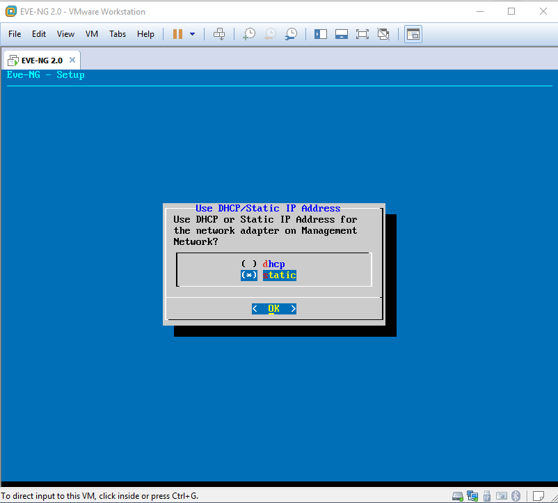

# TÌM HIỂU EVE-NG

### ***Mục lục***

[1.	Tổng quan](#1)    
- [1.1.	Đặt vấn đề](#1.1)   
	- [1.1.1.	Một số công cụ giúp mô phỏng và giả lập các thiết bị mạng](#1.1.1)  
	- [1.1.2.	So sánh giữa Unetlab và GNS3](#1.1.2)  
- [1.2.	Giới thiệu EVE-NG](#1.2)  
- [1.3.	Một số ưu điểm vượt trội của EVE-NG](#1.3) 

[2.	Cài đặt EVE-NG](#2)  
- [2.1.	Chuẩn bị](#2.1)  
- [2.2.	Cài đặt và cấu hình](#2.2)

	- [Bước 1: Mở máy ảo mới từ file OVA:](#2.2.1)

	- [Bước 2: Cấu hình các thông số cho máy ảo EVE](#2.2.2)

	- [Bước 3: Hoàn thành cài đăt, kiếm tra giao diện trên trình duyệt:](#2.2.3)

	- [Bước 4: Cài đặt các gói phần mềm đi kèm telnet, VNC, rpd để console vào các thiết bị được tạo bởi EVE-NG.](#2.2.4)

	- [Bước 5: Cấu hình sử dụng Wireshark](#2.2.5)

[3. Tham khảo](#3)  

---

# 1.	Tổng quan

## 1.1.	Đặt vấn đề

### 1.1.1.	Một số công cụ giúp mô phỏng và giả lập các thiết bị mạng

- **Dynamips**

	-	Tầm 8 - 10 năm về trước, ta sẽ gặp chương trình giả lập Dynamips. Dynamips là một chương trình giả lập router Cisco và được viết bởi Christophe Fillot. Chương trình có khả năng giả lập các dòng sản phẩm của Cisco, dựa vào việc chạy trực tiếp các IOS thật của các dòng sản phẩm. Một số ưu điểm của Dynamips là: 

	-	Được sử dụng như là một công cụ cho phép các học viên tham gia các khóa đào tạo của Cisco có thẻ thực hành trên một mô hình giả lập nhưng có tính năng như thật. Cho phép mọi người có thể làm quen dễ dàng hơn với các thiết bị của Cisco. 

	-	Kiểm tra được các tính năng mà các dòng sản phẩm IOS Cisco có thể hỗ trợ. 

	-	Kiểm tra nhanh các cấu hình giống như trên thiết bị thật.

	-	Dynamips hỗ trợ rất tốt trên nền tảng OS WinXP. Tuy nhiên ở thời điểm hiện tại thì gần như uits được sử dụng do hạn chế nhiều thứ như mất nhiều thời gian setup, khả năng mở rộng thấp, không ổn định trên các nền tảng window kế cận (Window 7, 8, 10, ...)

- **Packet Tracert**

	-	[Packet Tracert](https://www.netacad.com/courses/packet-tracer-download/) 

	-	Cisco Packet Tracert được chính Cisco thiết kế để hỗ trợ việc giả lập các thiết bị Router, switch, máy tính, ... Hiện tại phầm mềm này được cung cấp miễn phí cho mọi người. 

	-	Bạn có thể thấy một số hình ảnh về phần mềm này ở dưới, một số phiên bản cập nhật mới đây (phiên bản 6.0.1 trở lên) của phần mềm đã cho phép hỗ trợ thêm các dòng Ỉ, ASA5505, để có thể giúp người học hiểu sơ lược hoặc mô phỏng nhanh thiết bị mà không cần tốn quá nhiều tìa nguyên CPU. 

	-	Hình ảnh giao diện Packet Tracert: 

		

	-	Phần mềm này có một vài ưu điểm như tốn ít tài nguyên, xem được đường đi gói tin, giả lập được lab ở mức cơ bản, mang đến cái nhìn tổng quan nhất cho những người học không có điều kiện mô phỏng thực tế, ...

	-	Bên cạnh những ưu điểm thì cũng tồn tại khá nhiều hạn chế như tính năng của thiết bị, mức độ tin cậy thấp, ...

- **GNS3**

	-	[GNS3](https://www.gns3.com/) 

	-	Tiền thân của GNS3 chính là phiên bản Dynamips ở trên và GNS3 được cập nhật thêm một vài tính năng tiêu biểu như giao diện đồ họa.

	-	GNS3 có thể kết hợp với VMWare hay Virtualbox để có thể làm đợc các lab có nhiều thiết bị khác nhau không chỉ switch hay router mà còn có thể là firewall hay giả lập máy tính linux, window,...

	-	Các phiên bản GNS3 say này có sự nâng cấp đáng kể để vừa hạn chế vừa tiêu tốn tài nguyên máy tính mà còn tối ưu về mặt thiết bị có thể tích hợp. 

	-	Giao diện GNS3 như sau: 

		

- **Unetlab-EVE**

	-	Có thể xem GNS3 ở trên gần như là một công cụ hỗ trợ đắc lực cho người học mạng vì có thể vừa mô phỏng mà lại có thể tích hợp được các công cụ bên thứ 3, tuy nhiên mới đây đã có sự cải tiến vượt bậc về một thế hệ tool khác cho người học mạng chính là Emulated Virtual Environment (EVE)  
	-	Sự kết hợp giao diện đồ họa, tối ưu tài nguyên và mô phỏng gần như tất cả các thiết bị mạng của nhiều hãng khác nhau mà lại không cần phải host riêng từng máy ảo như điều từng làm với GNS3.   
	-	Giờ đây, việc cài đặt một bài lab với nhiều thiết bị của các hãng khác nhau sẽ được thực hiên nhanh hơn do chỉ cần cấu hình trên một máy tính nhất định. 

### 1.1.2.	So sánh giữa Unetlab và GNS3

-	Phần trên giới thiệu sơ bộ một số chương trình giả lập phổ biến về việc thực hiên mô phòng một hệ thống mạng của Cisco hoặc giả lập một thiết bị cảu các hãng khác nhau.  
-	Dưới đây sẽ so sánh một số khác biệt giữa Unetlab và GNS3:

	

## 1.2.	Giới thiệu EVE-NG  
-	Như trên đã khái quát, ***UNetLab***, viết tắt cho **U**nified **Net**working **Lab**, là một bản phân phối của Linux cho phép bạn xây dựng hệ thống các bài lab network. UNetLab có thể xem như là một hypervisor cho các image thường chạy trên các thiết bị mạng vật lý hoặc các máy ảo tách biệt bên trong.   
-	Nó cho phép triển khai giả lập các thiết bị mạng như switch, router, firewall, ... và các thiết bị cuối để kiểm tra thiết kế, kiểm thử các hoạt động của mô hình lab thực tế.  
-	Điều tuyệt vời về UnetLab (và do đó cũng về EVE-NG) là tất cả mọi thứ được chứa trong một máy ảo, và bạn sử dụng một giao diện web để tạo và quản lý các bài lab bạn. Chỉ cần đẩy image vào đó (EVE-NG hỗ trợ rất nhiều image các thiết bị từ nhiều nhà cung cấp khác nhau), và từ đó cấu hình bắt đầu lab.  
-	**EVE-NG** (Emulated Virtual Environment – Netx Generation) là phiên bản kế thừa những tính năng mạnh mẽ và vượt trội hơn so với Unetlab.  
-	EVE-NG là một công cụ mô phỏng mạng cung cấp giao diện người dùng thông qua trình duyệt. Người dùng có thể tạo các node mạng từ một thư viện các tempalte sẵn có, kết nối chúng lại với nhau và cấu hình chúng. Người dùng chuyên nghiệp hoặc quản trị viên có thể thêm các image phần mềm vào thư viện và tạo các mẫu các thiết bị mạng tùy chỉnh để hỗ trợ hầu hết các mô hình lab.  
-	EVE-NG hỗ trợ cấu hình nhiều hypervisors trên một máy ảo. Nó chạy phần mềm thiết bị mạng thương mại trên Dynamips và IOU và chạy các thiết bị mạng khác, chẳng hạn như bộ định tuyến router mã nguồn mở, trên QEMU.  
-	EVE-NG là một dự án nguồn mở và mã nguồn EVE-NG được đăng trên GitLab.  

## 1.3.	Một số ưu điểm vượt trội của EVE-NG  
-	Hỗ trợ thêm giao diện người dùng html5, triển khai thêm các tính năng telnet, vnc, và rpd kết nối trên các thiết bị mà không cần phải mở thêm một TCP port mới. Điều này cho phép dễ dàng hơn trong việc chạy EVE trên các máy chủ server ở bất kì đâu và cung cấp cơ chế remote để có thể làm việc với nhiều người dùng hơn.   
-	Các node đã tắt giờ đã được phân biệt các node khác thông qua màu sắc (màu xám cho các node đã tắt thay vì chỉ toàn màu xanh cho mọi node), do đó có thể dễ dàng nhận ra node nào đang chạy và node nào đã tắt.   
-	[UKSM](http://kerneldedup.org/en/projects/uksm/introduction/)  được thực hiện và kích hoạt mặc định, làm giảm thiểu đáng kể bộ nhớ khi so sánh với Unetlab.  
-	Nhiều loại image được hỗ trợ hơn. Thêm vào đó, bạn có thể tìm và lọc ra image khi thêm node mới, điều này thật tuyệt với bởi vì nếu một list dài các image thì sẽ làm tốn công tìm image mà mình mong muốn.  

# 2.	Cài đặt EVE-NG

Cài đặt EVE-NG 

\- Có 2 cách cài đặt EVE-NG: Một là download file ova của EVE và mở trực tiếp. Hai là cài đặt từ file iso. 

\- File ova và iso của EVE phiên bản mới nhất có thể download [tại đây](http://www.eve-ng.net/index.php/downloads/eve-ng).  
\- Trong phần này sẽ trình bày các bước cài đặt và cấu hình EVE trên Vmware Work Station trong môi trường Window (Thực chất, ova là file chứa image EVE-NG đã được cài đặt sẵn, chạy trên nhân Linux. Khi cài đặt bằng OVA người dùng sẽ không tốn thời gian cài đặt các bước cài đặt môi trường Linux nữa). Hướng dẫn cài đặt từ file iso có thể tham khảo thêm tại [link.](https://www.youtube.com/watch?v=Kxt5dvuAfNk)

## 2.1.	Chuẩn bị
 Các gói cài đặt cần có:  
-	File EVE ova download tại trang chủ.  
-	Các gói phần mềm Telnet, VNC, rpd đi kèm dành cho môi trường Window download [tại đây.](http://www.eve-ng.net/index.php/downloads/windows-client-side-pack)  
-	Cài sẵn VMware Work Station (ở đây mình dùng Vmware version 12 pro).

## 2.2.	Cài đặt và cấu hình  
Sau khi đã download các gói phần mềm cần thiết, mở Vmware lên thực hiện các bước như sau:   
(Tham khảo tại: https://www.youtube.com/watch?v=nia7BEQEOHk)   

### Bước 1: Mở máy ảo mới từ file OVA: 
- 
	

- Chọn đường dẫn tới thư mục chứa file OVA vừa download và mở ra như sau: 

	

	

- Sau khi import máy ảo thành công, click Edit virtual machine setting và chỉnh sửa lại như sau: 

	

- Sau đó click ok và bật máy ảo lên.

  
### Bước 2: Cấu hình các thông số cho máy ảo EVE  
- Ban đầu, khi mới bật máy ảo lên, màn hình sẽ hiển thị thông tin đăng nhập vào người dùng `root` với mật khẩu mặc định là `eve` để cấu hình cho hệ thống. 

	

- Tiếp theo, cung cấp một số thông tin được yêu cầu sau bởi EVE-NG setup script. Sau đó, script sẽ tự động chạy và cài đặt EVE-NG. Đầu tiên là tạo lại mật khẩu cho root. Bạn cần gõ lại mật khẩu lần thứ hai để xác nhận:

	

- Đặt lại tên hostname cho máy ảo:   
	
- Cấu hình domain DNS cho máy ảo (gõ domain tùy ý):   
	
- Cấu hình địa chỉ IP cho hệ thống (ấn xuống, backspace để chọn): Nên cấu hình địa chỉ tĩnh để tiện cho sau này dùng trình duyệt tương tác:  
	
- Điền địa chỉ IP và netmask (chọn địa chỉ phù hợp với địa chỉ mạng được gán với máy ảo EVE. Tốt nhất nên dùng dải NAT của Vmware để tránh các thay đổi khi di chuyển giữa các mạng):   
	

	

	

	

	

	

	

- EVE-NG setup script sẽ hoàn thiện và máy ảo sẽ được khởi động ngay lập tức. Khi đó, bạn sẽ nhìn thấy biểu tượng của EVE-NG hiện lên màn hình như sau (biểu tượng này sẽ hiển thị mỗi khi bạn bật EVE-NG):  
	

### Bước 3: Hoàn thành cài đăt, kiếm tra giao diện trên trình duyệt   
- Đăng nhập lại vào hệ thống sử dụng mật khẩu mới đã đổi, thành công được như sau:   
	
- Mở trình duyệt gõ địa chỉ IP tĩnh mình cấu hình, hoặc hiện lên như hình trên được như sau là cài đặt thành công EVE-NG trên VMware Work Station:   
	

	

### Bước 4: Cài đặt các gói phần mềm đi kèm telnet, VNC, rpd để console vào các thiết bị được tạo bởi EVE-NG.
- Mở file cài đặt bằng quyền admin như sau:     
	

	

	

	

	

	

	

	

	

Các bước cài đặt tiếp theo tương tự, tham khảo tại: https://www.youtube.com/watch?v=Ea4U93991dw

### Bước 5: Cấu hình sử dụng Wireshark   
- Để sử dụng wireshark bắt các gói tin trên các thiết bị trong lab EVE-NG, ta cấu hình tại file `wireshark_wrapper.bat`  trong thư mục chứa các file cài đặt các gói phần mềm cho EVE-NG trên máy Window chứa trình duyệt như sau:   
	Chỉnh sửa file sau:   

	

- Chỉnh sửa lại password cho user `root` mà mình đã đổi lại ở phần trên, ví dụ như sau: 

	

Cách sử dụng EVE-NG tạo bài lab tham khảo [tại đây.](./3.Su_dung_EVE-NG.md)

# 3. Tham khảo  
[1] https://cuongquach.com/so-sanh-giua-unetlab-va-gns3-gia-lap.html   
[2] https://interestingtraffic.nl/2017/01/05/eve-ng-preview-released/   
[3] http://www.pnh.vn/index.php?module=news&id=500&alias=cong-cu-ho-tro-lab-ccnp-ccie-phan-1   
