# LAB VTP - VLAN trên EVE-NG

### ***Mục lục***

[1.	Mô hình và chuẩn bị](#1)

[2.	Cấu hình VTP](#2)

- [2.1.	VTP mode server](#2.1)

- [2.2.	VTP mode client](#2.2)

- [2.3.	VTP transparent](#2.3)

- [2.4. Cấu hình password cho VTP domain](#2.4)

[3.	Cấu hình VLAN](#3)

- [3.1.	Bước 1: Cấu hình switch port access và trunk](#3.1)

- [3.2.	Bước 2: Cấu hình 2 port trunk trên switch 1:](#3.2)

- [3.3.	Bước 3: Tiến hành cấu hình IP cho máy ảo và ping thử](#3.3)

- [3.4.	Bước 4: Cấu hình InterVlan](#3.4)

[4. Một số cấu hình nâng cao khác](#4)

- [4.1. Cấu hình VLAN chia sẻ chung giữa các switch VTP Server, Client và switch VTP transparent](#4.1)

[5. Tham khảo](#5)

---

<a name = '1'></a>
# 1. Mô hình và chuẩn bị

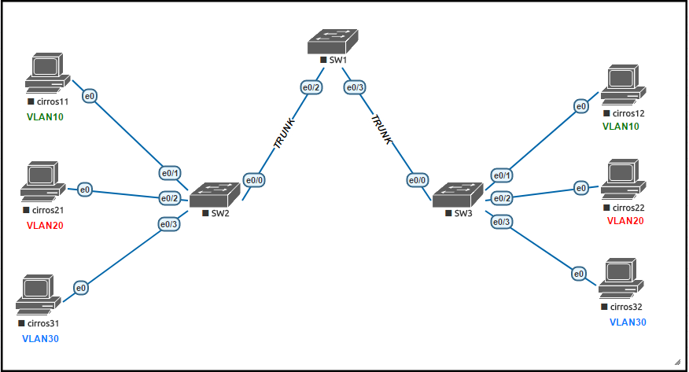

- Chuẩn bị: Tạo mô hình 3 switch layer 2 và 6 máy ảo cirros như hình trên. 

- Mục đích bài lab: 

	-	Cấu hình VTP tự động đồng bộ thông tin các VLAN giữa các switch.

	-	Cấu hình tính năng VLAN trên các switch. 

- IP plan: 

	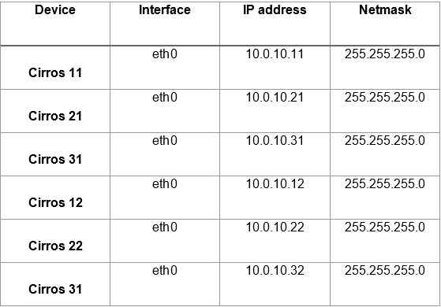


<a name = '2'></a>
# 2.	Cấu hình VTP

<a name = '2.1'></a>
## 2.1.	VTP mode server 

Phần này cấu hình các switch hoạt động ở chế độ VTP server. 

### Bước 1: Cấu hình VTP mode và VTP domain cho các switch:

- Switch 1: 

	```
	Switch 1: 
	SW1#conf t
	SW1(config)# vtp mode server
	Device mode already VTP Server for VLANS.
	SW1(config)# vtp domain VTPlab
	Changing VTP domain name from NULL to VTPlab
	```

- Switch 2: 

	```
	SW2#conf t
	SW2(config)# vtp mode server
	Device mode already VTP Server for VLANS.
	SW2(config)# vtp domain VTPlab
	Changing VTP domain name from NULL to VTPlab
	```
- Switch 3: Chưa cấu hình VTP domain.

### Bước 2: Kiểm tra lại trạng thái VTP và các VLAN trên các switch: 

```
SW1# show vtp status
VTP Version capable             : 1 to 3
VTP version running             : 1
VTP Domain Name                 : VTPlab
VTP Pruning Mode                : Disabled
VTP Traps Generation            : Disabled
Device ID                       : aabb.cc00.1000
Configuration last modified by 0.0.0.0 at 0-0-00 00:00:00
Local updater ID is 0.0.0.0 (no valid interface found)

Feature VLAN:
--------------
VTP Operating Mode                : Server
Maximum VLANs supported locally   : 1005
Number of existing VLANs          : 5
Configuration Revision            : 0
MD5 digest                        : 0x53 0x62 0x6A 0x51 0xBF 0x61 0x37 0xEF
                                    0x26 0x0A 0x70 0xA1 0xE5 0x4B 0x01 0x34

SW1#show vlan

VLAN Name                             Status    Ports
---- -------------------------------- --------- -------------------------------
1    default                          active    Et0/0, Et0/1, Et0/2, Et0/3
1002 fddi-default                     act/unsup
1003 token-ring-default               act/unsup
1004 fddinet-default                  act/unsup
1005 trnet-default                    act/unsup

VLAN Type  SAID       MTU   Parent RingNo BridgeNo Stp  BrdgMode Trans1 Trans2
---- ----- ---------- ----- ------ ------ -------- ---- -------- ------ ------
1    enet  100001     1500  -      -      -        -    -        0      0
1002 fddi  101002     1500  -      -      -        -    -        0      0
1003 tr    101003     1500  -      -      -        -    -        0      0
1004 fdnet 101004     1500  -      -      -        ieee -        0      0
1005 trnet 101005     1500  -      -      -        ibm  -        0      0

Primary Secondary Type              Ports
------- --------- ----------------- ------------------------------------------
```

Ban đầu, khi chưa cấu hình VLAN, các switch đều có VLAN 1 là VLAN mặc định, trạng thái các VTP đều hoạt động trong mode server và domain **VTPlab**. 

### Bước 3: Cấu hình thêm các VLAN vào Switch 1: 

```
SW1#vlan database
% Warning: It is recommended to configure VLAN from config mode,
  as VLAN database mode is being deprecated. Please consult user
  documentation for configuring VTP/VLAN in config mode.

SW1(vlan)#vlan 10
VLAN 10 added:
    Name: VLAN0010
SW1(vlan)#vlan 20
VLAN 20 added:
    Name: VLAN0020
SW1(vlan)#vlan 30
VLAN 30 added:
    Name: VLAN0030
SW1(vlan)#exit
APPLY completed.
Exiting....
SW1#show vlan

VLAN Name                             Status    Ports
---- -------------------------------- --------- -------------------------------
1    default                          active    Et0/0, Et0/1, Et0/2, Et0/3
10   VLAN0010                         active
20   VLAN0020                         active
30   VLAN0030                         active
1002 fddi-default                     act/unsup
1003 token-ring-default               act/unsup
1004 fddinet-default                  act/unsup
1005 trnet-default                    act/unsup

VLAN Type  SAID       MTU   Parent RingNo BridgeNo Stp  BrdgMode Trans1 Trans2
---- ----- ---------- ----- ------ ------ -------- ---- -------- ------ ------
1    enet  100001     1500  -      -      -        -    -        0      0
10   enet  100010     1500  -      -      -        -    -        0      0
20   enet  100020     1500  -      -      -        -    -        0      0
30   enet  100030     1500  -      -      -        -    -        0      0
1002 fddi  101002     1500  -      -      -        -    -        0      0
1003 tr    101003     1500  -      -      -        -    -        0      0
1004 fdnet 101004     1500  -      -      -        ieee -        0      0
1005 trnet 101005     1500  -      -      -        ibm  -        0      0

Primary Secondary Type              Ports
------- --------- ----------------- ------------------------------------------

SW1#
```

### Bước 4: Kiểm tra thông tin đã cập nhật trên các SW2 và SW3: 

-	Kiểm tra trên switch 2: 

	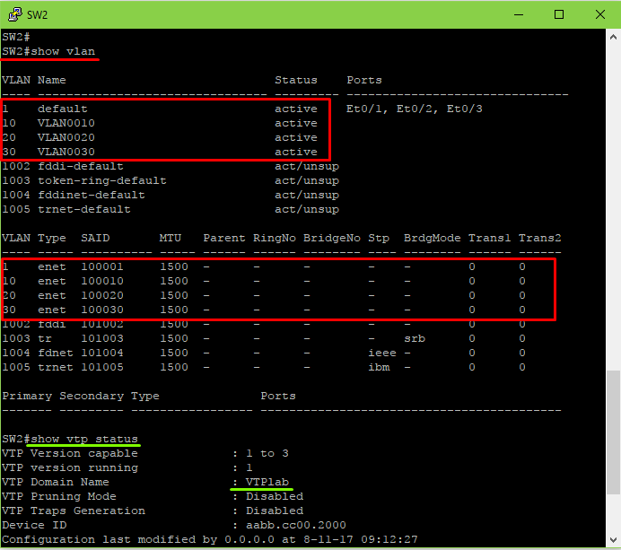

	Ta thấy các thông tin về VLAN 10, 20 và 30 được tạo từ switch 1 đã được cập nhật trên switch 2 do cùng miền VTP domain VTPlab. 

- Kiểm tra trên switch 3: 

	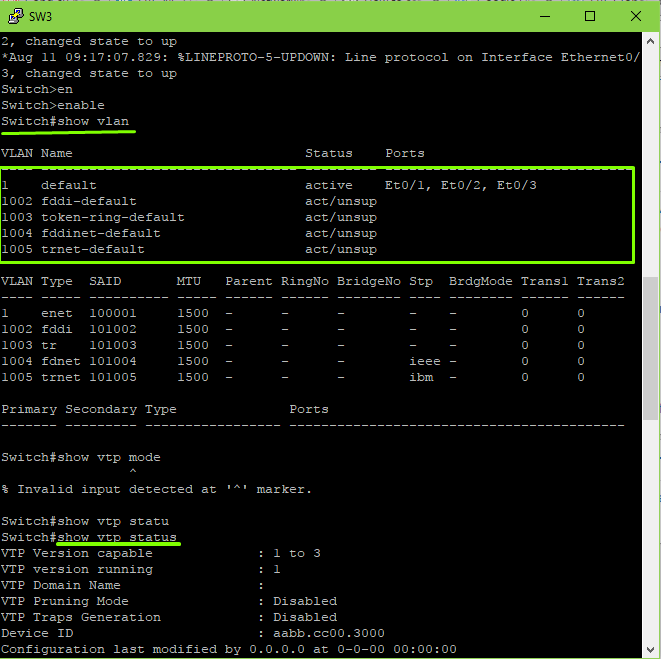

	Ban đầu, khi mới khởi động, Switch 3 chưa nhận được các bản tin VTP quảng bá nên nó chưa cập nhật các thông tin VLAN. Sau một thời gian, các bản tin VTP được gửi từ switch 1 tới động bộ với switch cả về VTP domain theo cấu hình mặc định. Thông tin các VLAN được hiển thị trên switch 3 như sau: 

	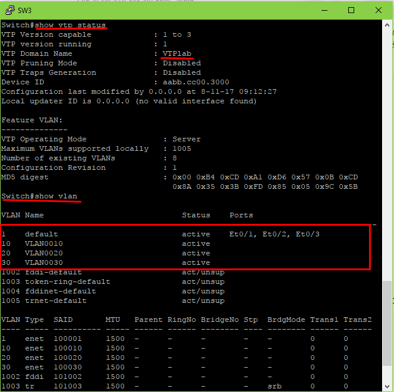

### Bước 5: Cấu hình Switch 3 có VTP domain khác với 2 switch còn lại: trên switch 2 tạo thêm vlan 40. Sau đó show kết quả như sau:

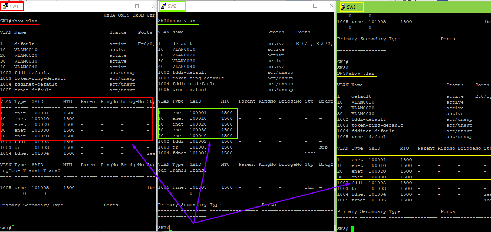

Ta thấy, các thông tin VLAN được đồng bộ trên switch 1 và switch 2  do cùng miền VTPlab domain, switch 3 do ở miền VTP domain ABC nên không cập nhật thông tin VLAN 40 được switch 2 thêm vào. 

<a name = '2.2'></a>
## 2.2.	VTP mode client

- Khi switch hoạt động ở mode client thì nó chỉ cập nhật các bản tin VTP từ các Switch VTP server. Nó không có khả năng tạo thêm VLAN và tạo các bản tin VTP quảng bá. Khi cố tình tạo VLAN, sẽ xuất hiện thông báo lỗi như sau: 

	```
	SW3#conf t
	Enter configuration commands, one per line.  End with CNTL/Z.
	SW3(config)#vtp mode client
	Setting device to VTP Client mode for VLANS.
	SW3(config)#vlan 50
	VTP VLAN configuration not allowed when device is in CLIENT mode.
	SW3(config)#
	```

- Cấu hình switch 3 về cùng domain VTPlab với switch 1 để nhận được thông tin cập nhật thêm VLAN 40 như sau:

	```
	SW3(config)#vtp domain VTPlab
	Changing VTP domain name from ABC to VTPlab
	SW3(config)#
	*Aug 11 09:41:34.081: %SW_VLAN-6-VTP_DOMAIN_NAME_CHG: VTP domain name changed to VTPlab.
	SW3#show vla
	*Aug 11 09:41:55.903: %SYS-5-CONFIG_I: Configured from console by console
	SW3#show vlan

	VLAN Name                             Status    Ports
	---- -------------------------------- --------- -------------------------------
	1    default                          active    Et0/1, Et0/2, Et0/3
	10   VLAN0010                         active
	20   VLAN0020                         active
	30   VLAN0030                         active
	40   VLAN0040                         active
	1002 fddi-default                     act/unsup
	1003 token-ring-default               act/unsup
	1004 fddinet-default                  act/unsup
	1005 trnet-default                    act/unsup

	VLAN Type  SAID       MTU   Parent RingNo BridgeNo Stp  BrdgMode Trans1 Trans2
	---- ----- ---------- ----- ------ ------ -------- ---- -------- ------ ------
	1    enet  100001     1500  -      -      -        -    -        0      0
	10   enet  100010     1500  -      -      -        -    -        0      0
	20   enet  100020     1500  -      -      -        -    -        0      0
	30   enet  100030     1500  -      -      -        -    -        0      0
	40   enet  100040     1500  -      -      -        -    -        0      0
	1002 fddi  101002     1500  -      -      -        -    -        0      0
	1003 tr    101003     1500  -      -      -        -    srb      0      0
	1004 fdnet 101004     1500  -      -      -        ieee -        0      0

	VLAN Type  SAID       MTU   Parent RingNo BridgeNo Stp  BrdgMode Trans1 Trans2
	---- ----- ---------- ----- ------ ------ -------- ---- -------- ------ ------
	1005 trnet 101005     1500  -      -      -        ibm  -        0      0

	Primary Secondary Type              Ports
	------- --------- ----------------- ------------------------------------------

	SW3#
	```

<a name = '2.3'></a>
## 2.3.	VTP transparent

- Thêm switch 4 vào topology, thực hiện cấu hình switch 3 làm switch transparent như sau: 

	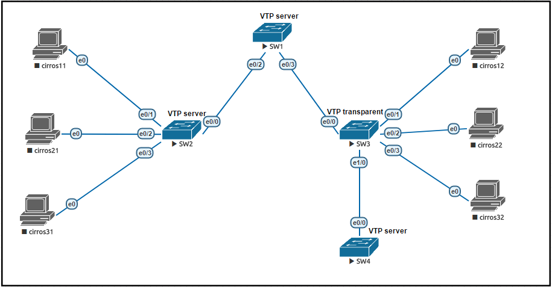

- Như phần trên đang cấu hình switch 3 hoạt động ở mode VTP client. Khi thêm switch 4 kết nối tới switch 3, mặc định ban đầu, switch 4 hoạt động ở mode VTP server. Switch 4 được đồng bộ về thông tin VLAN và VTP domain như sau: 

	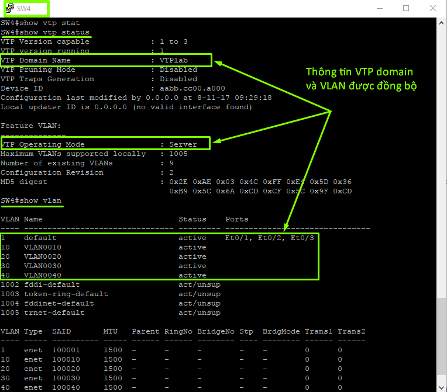

- Thực hiện cấu hình switch 3 hoạt động mode VTP transparent, chỉ forward các thông tin VLAN và không cập nhật các bản tin VTP mới nữa: 

	```
	SW3#conf t
	SW3(config)#vtp mode transparent
	Setting device to VTP Transparent mode for VLANS.
	SW3(config)#exit
	SW3#show vtp status
	VTP Version capable             : 1 to 3
	VTP version running             : 1
	VTP Domain Name                 : VTPlab
	VTP Pruning Mode                : Disabled
	VTP Traps Generation            : Disabled
	Device ID                       : aabb.cc00.3000
	Configuration last modified by 0.0.0.0 at 8-11-17 09:29:18

	Feature VLAN:
	--------------
	VTP Operating Mode                : Transparent
	Maximum VLANs supported locally   : 1005
	Number of existing VLANs          : 9
	Configuration Revision            : 0
	MD5 digest                        : 0x70 0x98 0x94 0x5C 0xF9 0x3F 0xE5 0xA1
										0xAB 0xE4 0xFD 0xBB 0xB5 0x23 0x29 0xC0
	SW3#
	```

- Kiểm tra lại, từ Switch 1: thực hiện thêm vlan 50. Sau một thời gian các bản tin VTP được quảng bá tới tất cả các switch trong cùng domain VTPlab, kiểm tra trên switch 3 và switch 4 thông tin VLAN ta được kết quả như sau: 
	Vlan 50 được tạo trên switch 1: 

	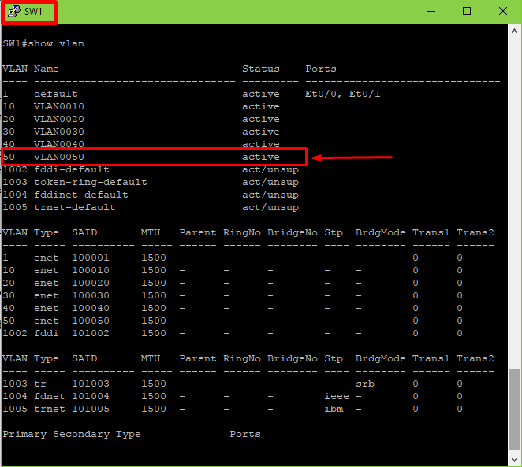

- Switch 3 không cập nhật thêm thông tin Vlan 50 cho dù trong cùng miền VTP domain:

	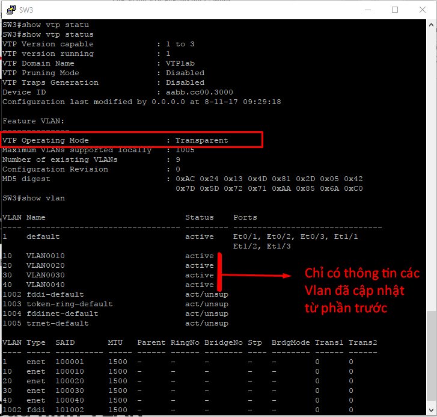

- Tuy nhiên, switch 4 đã nhận được các bản tin VTP quảng bá được chuyển tiếp qua VTP transparent là switch 3:

	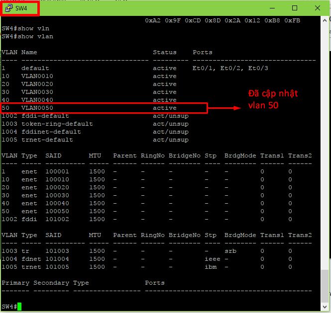
- Thực hiện tạo vlan thành công trên switch 3: 

	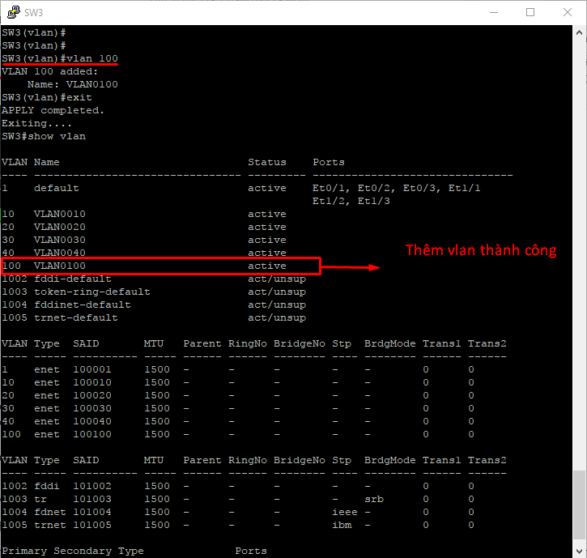

- Kiểm tra trên các switch còn lại không thấy cập nhật thông tin Vlan 100 mà switch 3 tạo:   
	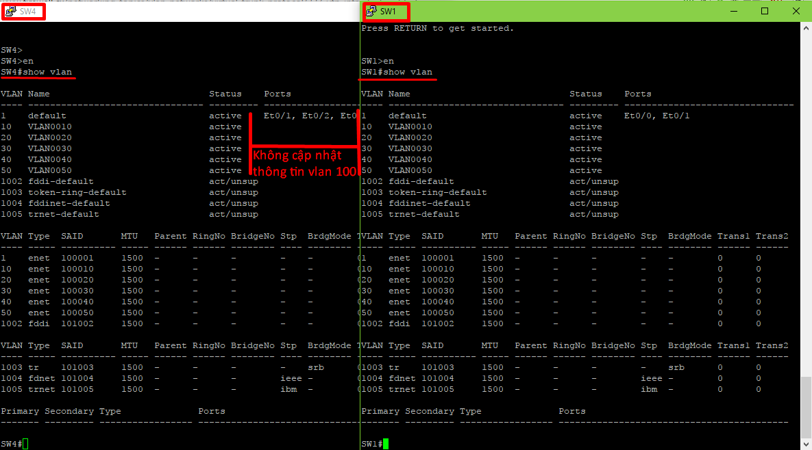

<a name = '2.4'></a>
## 2.4.	Cấu hình password cho VTP domain

Phần này sẽ thực hiện cấu hình để hiểu rõ tính năng của VTP password và revision number. Sử dụng mô hình lab 2 switch đơn giản như sau:

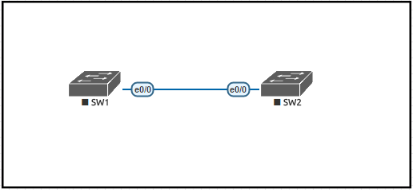

Đầu tiên, cấu hình 2 Switch trên cùng 1 domain , sau đó cấu hình VTP password 2 bên khác nhau. Như vậy mặc dầu cổng trunk đã chạy . Nhưng 2 Switch vẫn chưa thấy được nhau . Chúng ta sẽ cấu hình lần lượt các Vlan 2,3 trên Switch1 và vlan 4 trên Switch2 . Sau khi cấu hình 2 trên . Chúng ta theo dõi Switch có số revision number cao hơn và sau đó cấu hình lại VTP password cho đúng , lúc này Switch có số revision number cao hơn sẽ update các vlan cho switch còn lại.

Các bước cấu hình

### Bước 1. Cấu hình cho vtp domain name , vtp password 

- Cấu hình dành cho Switch 1

	```
	SW1#conf t
	SW1(config)#vtp domain VTP
	SW1(config)#vtp password cisco
	```

- Cấu hình dành cho Switch 2

	```
	SW2#conf t
	SW2(config)#vtp domain VTP
	SW2(config)#vtp password cisco123
	```

### Bước 2. Cấu hình trunk

- Ta thấy 2 vtp password của 2 Switch khác nhau . Vì vậy nếu như ta cấu hình trunk ở cả 2 đầu switch thì đường trunk cũng không chạy. Các Vlan sẽ không trao đổi thông tin cho nhau được . 

	```
	SW2(config)#int e0/0
	SW2(config-if)#switchport trunk encapsulation dot1q
	SW2(config-if)#switchport mode trunk
	SW2(config-if)#no shut
	SW2(config-if)#exit
	```

### Bước 3. Ta cấu hình các vlan ở hai đầu switch. Ở đây ta có thể dùng cách cấu hình trong vlan database ( vlan number name hoặc cấu hình trong mode config vlan). Thường thì cách 2 phổ biến hơn cách thứ nhất.

- Cấu hình switch 1:

	```
	SW1(config)#vlan 2
	SW1(config-vlan)#name VLAN2
	SW1(config)#exit
	SW1(config)#vlan 3
	SW1(config-vlan)#name VLAN3
	SW1(config)#interface e0/0
	SW1(config-if)#switch trunk encapsulation dot1q
	SW1(config-if)#switchport mode trunk
	SW1(config-if)#no shutdown
	SW1(config-if)#exit
	```
- Cấu hình switch 2:

	```
	SW2(config)#vlan 4
	SW2(config-vlan)#name VLAN4
	SW2(config)#exit
	SW2(config)#interface e0/0
	SW2(config-if)#switch trunk encapsulation dot1q
	SW2(config-if)#switchport mode trunk
	SW2(config-if)#no shutdown
	SW2(config-if)#exit
	```

### Bước 4: Chúng ta có thể xem các thông tin vlan, vtp bằng các lệnh: `show vtp status`

- Kiểm tra trên 2 switch ta có kết quả như sau:

	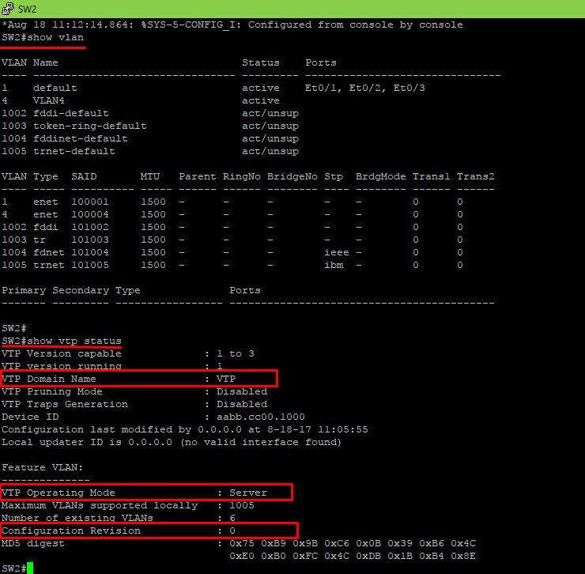

	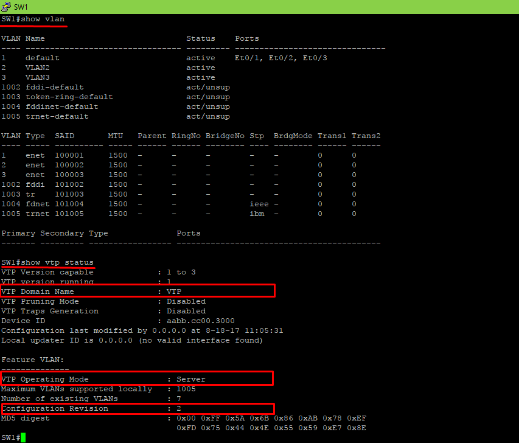

- Như vậy, dù 2 switch cùng hoạt động trong mode VTP server nhưng do không cấu hình cùng password nên không cập nhật thông tin vlan của nhau. Điều này đảm bảo, khi có một kẻ lạ nào có ý định tần công bằng cách gán thêm một switch hoạt động ở mode server và thực hiện tác động vào thông tin hệ thống, nếu không có được password sẽ không làm gì được.  
- Như hình trên ta thấy các switch1 có số revision number cao hơn . Như vậy khi đường trunk hoạt động switch1 sẽ update vlan 2,3 cho switch2 và vlan 4 ở switch2 sẽ biết mất. Như vậy chúng ta có thể thấy tầm quan trọng của vtp password. Nó chống các switch lạ khi cắm vào mạng sẽ gây ra sự xáo trộn các vlan. Bây giờ ta cấu hình vtp password cisco trên Switch 2 ta sẽ thấy, thông tin Vlan 4 trên switch 2 sẽ mất, các bản tin từ Switch 1 có revision cao hơn sẽ cập nhật thông tin vlan sang switch 2. 

	

<a name = '3'></a>
# 3.	Cấu hình VLAN

Có nhiều kiểu cấu hình VLAN, phần này trình bày cách cấu hình VLAN chia theo port trên switch. 

Sau khi cấu hình VTP ở phần trên, ta thực hiện các bước cấu hình VLAN trên các switch như sau (cấu hình VLAN theo kiểu chia VLAN theo các cổng trên switch): 

<a name = '3.1'></a>
## 3.1	Bước 1: Cấu hình switch port access và trunk

- Cấu hình trên switch 2 và switch 3 như sau: 

	```
	SW2#conf t
	Enter configuration commands, one per line.  End with CNTL/Z.
	<Cau hinh cac port access>
	SW2(config)#interface ethernet 0/1
	SW2(config-if)#switchport mode access
	SW2(config-if)#switchport access vlan 10
	SW2(config-if)#exit
	SW2(config)#interface ethernet 0/2
	SW2(config-if)#switchport mode access
	SW2(config-if)#switchport access vlan 20
	SW2(config-if)#exit
	SW2(config)#interface ethernet 0/3
	SW2(config-if)#switchport mode access
	SW2(config-if)#switchport access vlan 30
	SW2(config-if)#exit
	<Cau hinh port trunk>
	SW2(config)#interface ethernet 0/0
	SW2(config-if)#switchport trunk encapsulation dot1q
	SW2(config-if)#switchport mode trunk
	SW2(config-if)#exit
	```

- Cấu hình trên switch 3: 

	```
	SW3#conf t
	Enter configuration commands, one per line.  End with CNTL/Z.
	<Cau hinh cac port access>
	SW3(config)#interface ethernet 0/1
	SW3(config-if)#switchport mode access
	SW3(config-if)#switchport access vlan 10
	SW3(config-if)#exit
	SW3(config)#interface ethernet 0/2
	SW3(config-if)#switchport mode access
	SW3(config-if)#switchport access vlan 20
	SW3(config-if)#exit
	SW3(config)#interface ethernet 0/3
	SW3(config-if)#switchport mode access
	SW3(config-if)#switchport access vlan 30
	SW3(config-if)#exit
	<Cau hinh port trunk>
	SW3(config)#interface ethernet 0/0
	SW3(config-if)#switchport trunk encapsulation dot1q
	SW3(config-if)#switchport mode trunk
	SW3(config-if)#exit
	```
- Show thông tin cấu hình như sau: 

	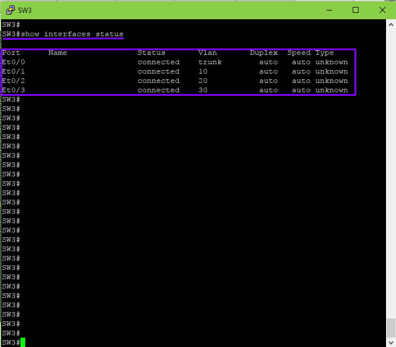

<a name = '3.2'></a>
## 3.2.	Bước 2: Cấu hình 2 port trunk trên switch 1: 

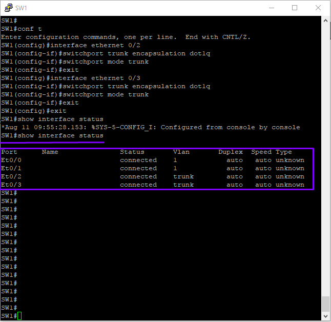


<a name = '3.3'></a>
## 3.3. Bước 3: Tiến hành cấu hình IP cho máy ảo và ping thử

-	Ping giữa máy cirros11 và cirros21 cùng switch như khác vlan: 

	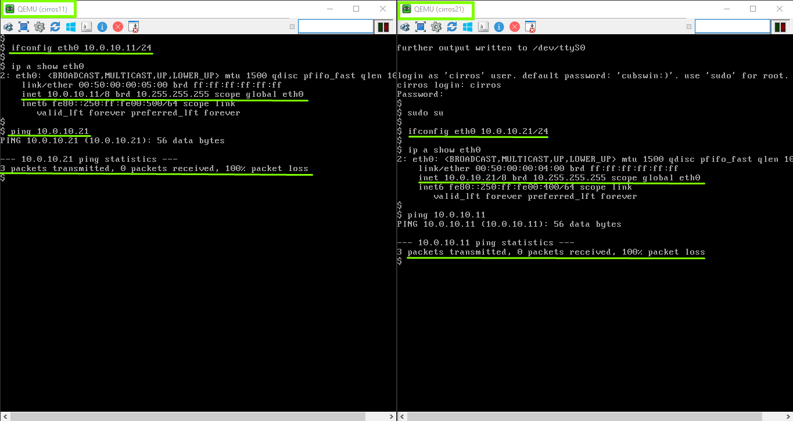

-	Ping giữa cirros11 và cirros12 cùng vlan 10: 

	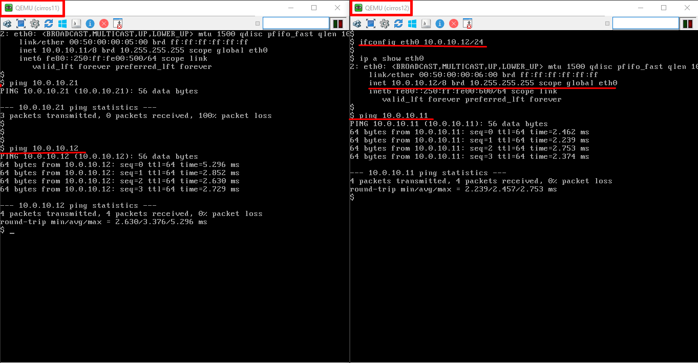


<a name = '3.4'></a>
## 3.4. Bước 4: Cấu hình InterVlan

- Để cho phép kết nối Vlan 10 và Vlan 30, ta thực hiện cấu hình InterVlan như sau: 

- Trên các switch 2 và 3, thêm các interface Vlan 10 và Vlan 30, đặt IP cùng dải mạng như sau (thực hiện như nhau trên 2 switch): 

	```
	SW2#conf t
	SW2(config)#interface vlan 10
	SW2(config-if)#ip address 10.10.10.2 255.255.255.0
	SW2(config-if)#no shutdown
	SW2(config-if)#exit
	SW2(config)#interface vlan 30
	SW2(config-if)#ip address 10.10.30.2 255.255.255.0
	SW2(config-if)#no shutdown
	SW2(config-if)#end
	SW2#show ip in br
	Interface              IP-Address      OK? Method Status                Protocol
	Ethernet0/0            unassigned      YES unset  up                    up
	Ethernet0/1            unassigned      YES unset  up                    up
	Ethernet0/2            unassigned      YES unset  up                    up
	Ethernet0/3            unassigned      YES unset  up                    up
	Vlan10                 10.10.10.2      YES manual up                    up
	Vlan30                 10.10.30.2      YES manual up                    up
	```            


	```
	SW3#conf t
	SW3(config)#interface vlan 10
	SW3(config-if)#ip address 10.10.10.3 255.255.255.0
	SW3(config-if)#no shutdown
	SW3(config-if)#exit
	SW3(config)#interface vlan 30
	SW3(config-if)#ip address 10.10.30.3 255.255.255.0
	SW3(config-if)#no shutdown
	SW3(config-if)#end
	SW3#show ip in br
	Interface              IP-Address      OK? Method Status                Protocol
	Ethernet0/0            unassigned      YES unset  up                    up
	Ethernet0/1            unassigned      YES unset  up                    up
	Ethernet0/2            unassigned      YES unset  up                    up
	Ethernet0/3            unassigned      YES unset  up                    up
	Vlan10                 10.10.10.3     YES manual up                    up
	Vlan30                 10.10.30.3     YES manual up                    up
	```

- 	Tiến hành kiểm tra giữa 2 máy cirros31 trên switch 2 thuộc vlan 30  và cirros 12 trên switch 3 thuộc vlan 10, gán địa chỉ IP của cirros cùng dải mạng với các interface VLAN trên các switch tương ứng, ta được kết quả như sau: 

	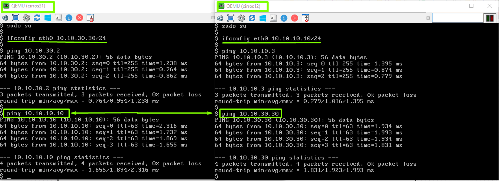

<a name = '4'></a>
# 4.	Một số cấu hình nâng cao khác

<a name = '4.1'></a>
# 4.1.	Cấu hình VLAN chia sẻ chung giữa các switch VTP Server, Client và switch VTP transparent

Giả sử ta có kịch bản như sau: 

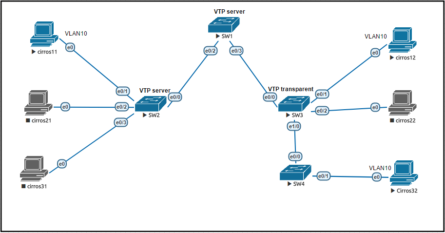

Trong đó: Các switch 1, 2 và 4 được cấu hình ở mode VTP server để có thể tự động nhận các bản tin quảng bá VTP và cập nhật thông tin VLAN vào database của nó. Switch 3 hoạt động ở chế độ VTP transparent, chuyển tiếp các bản tin VTP giữa switch 1 và switch 4. Vấn đề đặt ra là: Nếu muốn cấu hình cho Switch 3 vẫn forward các bản tin VTP cập nhật thông tin VLAN từ các switch 1, 2 và 4 trong mạng, nhưng không cập nhật dữ liệu đó vào trong database của mình; nhưng vẫn mong muốn Switch 3 có cho phép các luồng dữ liệu của Vlan 10 đi trong nó và truyền thông với các thiết bị thuộc Vlan 10 nhưng lại kết nối với switch 3 (trong mô hình mạng trên tức là: Switch 1, 2, 4 được cấu hình các Vlan 10, 20, 30, 40. Máy Cirros 11 và Cirros32 thuộc Vlan 10. Bây giờ, nếu muốn giải quyết vấn đề: máy Cirros12 kết nối với Switch 3 nhưng vẫn thuộc Vlan 10, thì việc kết nối giữa các máy Cirros 11, 12 và 32 có thực hiện được không? Do switch 3 đang hoạt động ở mode VTP transparent nên không cập nhật thông tin VLAN 10 vào database của nó).  
Để giải quyết vấn đề trên, ta đơn giản là thực hiện như sau: Trên switch 3, thêm thủ công Vlan 10 vào database. Khi đó, các gói tin được gửi từ máy Cirros12 được switch 3 gán tag của Vlan 10 và gửi ra các đường trunk và đến được switch 2, switch 2 bỏ tag và gửi được tới máy cirros11. 

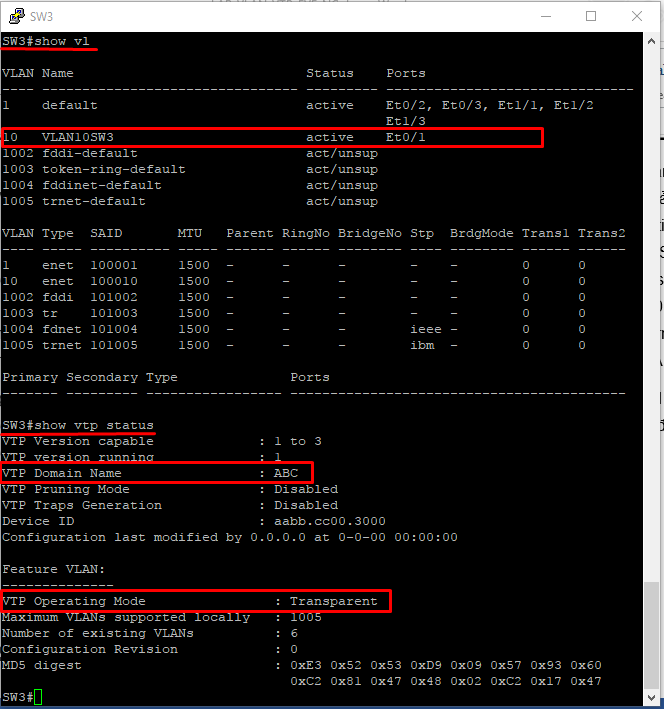

Khi đó, thực hiện cấu hình các máy Cirros11 có IP: `10.10.10.11/24` ; máy Cirros12 có địa chỉ IP: `10.10.10.12/24` ; và máy Cirros32 `10.10.10.32/24`. Thực hiện ping giữa các máy thành công như sau:

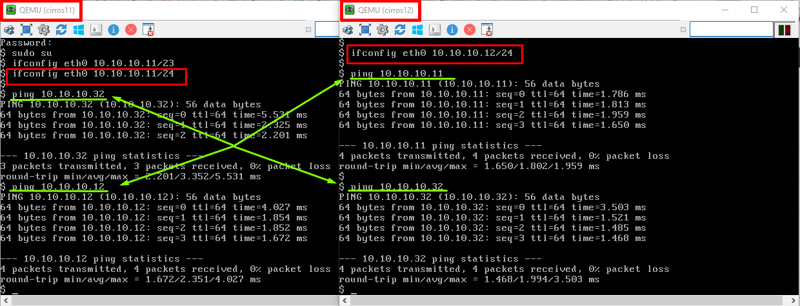

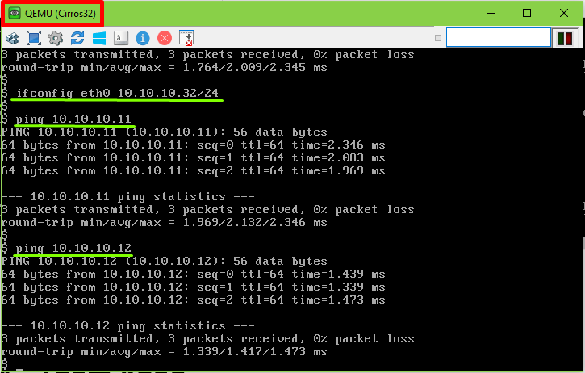

***Giải thích***: Thực ra các gói tin khi của các Vlan trước khi gửi ra khỏi các cổng trunk được đóng gói 4 byte tag 802.1q. Trong đó, có chứa 12 bit biểu diễn VLAN_ID. Nên khi trên switch 3, tuy trong mode VTP transparent – không cập nhật các bản tin cấu hình VLAN nhưng vẫn giữ vai trò gán tag và chuyển các lưu lượng Vlan ra khỏi cổng trunk của nó. Do đó, vẫn có một số Vlan được cấu hình dùng chung với với các switch VTP mode server và client. 

<a name = '4'></a>
# 5. Tham khảo

[1] https://manthang.wordpress.com/2011/05/18/ccna-lab-series-bai-36-c%E1%BA%A5u-hinh-giao-th%E1%BB%A9c-vtp/ 

[2] http://www.vnpro.org/forum/forum/cclabpro/ccna-labpro/4469-lab-2-4-vlan-trunking 

[3] http://www.vnpro.org/forum/forum/ccna%C2%AE/icnd-2-lan-switching/5888-lab-6-4-vtp-revision-number-vtp-password-vtp-domain  