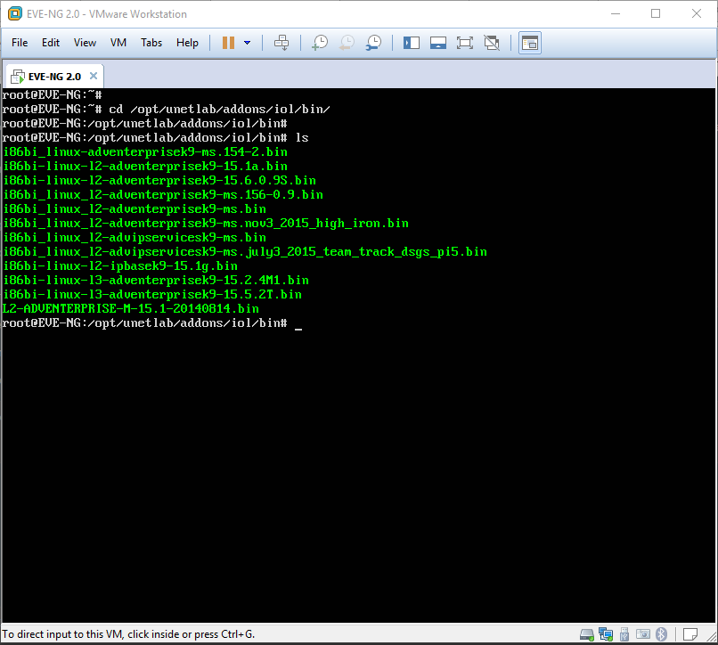
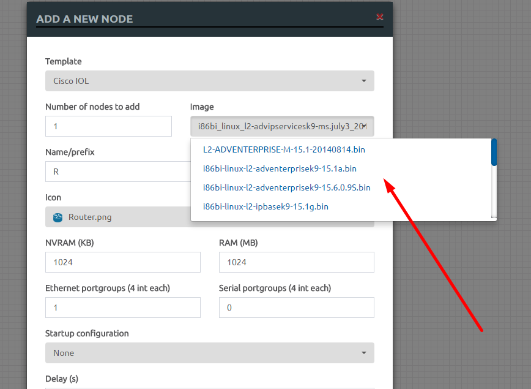
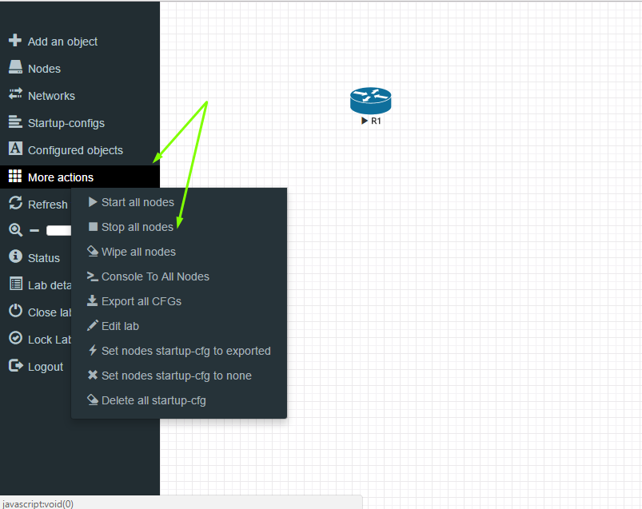

# Sử dụng EVE-NG

### ***Mục lục***

[1.	Một số khái niệm cần biết](#1)

- [1.1.	Cisco IOS là gì?](#1.1)

- [1.2.	Cisco IOU là gì?](#1.2)

- [1.3.	IOU chạy trên hệ điều hành gì?](#1.3)

- [1.4.	Khi nào cần dùng IOU?](#1.4)

- [1.5.	Chọn IOU image.](#1.5)

- [1.6.	Cách sử dụng Cisco IOU.](#1.6)

[2.	Các thư mục lưu trữ image](#2)

[3.	Add Cisco IOU IOL](#3)

[4.	Add virtual machine QEMU](#4)

- [4.1. Add template Ubuntu server 16.04](#4.1)

- [4.2. Add template Cirros](#4.2)

[5.	Một số thao tác với EVE-NG tạo mô hình lab](#5)

- [5.1.	Add a new lab](#5.1)

- [5.2.	Add a new node](#5.2)

- [5.3.	Add a new network](#5.3)

- [5.4.	Kết nối các node](#5.4)

[6.	Tham khảo](#6)

---

<a name = '1'></a>
# 1.	Một số khái niệm cần biết trước khi cài đặt

<a name = '1.1'></a>
## 1.1.	Cisco IOS là gì?

Cisco IOS (Internetwork Operating System) là hệ điều hành đa nhiệm được sử dụng rộng rãi trên các sản phẩm Router và Switch của hãng Cisco.

<a name = '1.2'></a>
## 1.2.	Cisco IOU là gì?

Theo Cisco Engineering Education Web Site (khá lâu trước đây): Cisco IOS on Unix, còn được gọi là Cisco IOU, là một phiên bản hoàn thiện của IOS chạy trên một process mức người dùng của hệ điều hành Unix (Solaris), chỉ được chia sẻ trong nội bộ Cisco. IOU được xây dựng như một image thuần túy trên Solaris và chạy như mọi chương trình khác. IOU hỗ trợ mọi giao thức và tính năng mà không phụ thuộc vào nền tảng.

<a name = '1.3'></a>
## 1.3.	IOU chạy trên hệ điều hành gì?

Ban đầu, Cisco tạo ra IOU chỉ chạy trên Solaris SPARC (Solaris cài trên server có kiến trúc SPARC của hãng Sun). Hiện nay đã có những bản build IOS on Linux (IOL) chạy trên nền tảng x86/amd64. 

Do không phải ai cũng có thể sở hữu server SPARC nên phiên bản được sử dụng nhiều nhất hiện nay là IOL, nhưng vì mọi người đã quá quen với thuật ngữ IOU, nên chúng ta sẽ dùng IOU để chỉ phiên bản IOS trên Linux.

<a name = '1.4'></a>
## 1.4.	Khi nào cần dùng IOU?

- Cisco Packet Tracer và GNS3 là 2 phần mềm chính mô phỏng mạng được sử dụng cho việc đào tạo chứng chỉ CCNA, CCNP hoặc test các đặc trưng của mạng. 

- Đối với những người học CCNA, chúng ta chỉ cần dùng phần mềm Cisco Packet Tracer - phẩn mềm mô phỏng (simulate) những giao thức, tính năng cơ bản của Router/Switch Cisco. Nhược điểm của Cisco Packet Tracer đó là phần mềm chỉ mô phỏng các hiện tượng, chứ không có gói tin chạy thật sự. 

- Để lab những giao thức, tính năng nâng cao hơn như trong chương trình CCNP, bạn có thể dùng GNS3 - phần mềm giả lập phần cứng Router và chạy IOS thật trên đó. Nhược điểm của GNS3 đó là chiếm dụng tài nguyên của máy, không chạy được IOS của switch nên không lab được các tính năng nâng cao của Switch. 

- Khi muốn lab tính năng nâng cao của switch Cisco hoặc những bài lab CCIE cần chạy hàng chục, thậm chí hàng trăm thiết bị cùng lúc, bạn nên dùng IOU. IOU hỗ trợ hầu hết các tính năng của IOS thật, tùy thuộc vào image bạn sử dụng.

<a name = '1.5'></a>
## 1.5.	Chọn IOU image.

- IOU image chia thành 2 bản chính đó là L2 (switch) và L3 (router). Mỗi bản có rất nhiều image được build với mục đích khác nhau, ví dụ ipbase có tính năng cơ bản, tpgen có công cụ tạo gói traffic, adventerprise có đầy đủ tính năng, adventerprisek9 thì có tính năng bảo mật và mã hóa mạnh hơn...

- Tuy các image IOL chỉ được dùng nội bộ với các kĩ sư của Cisco nhưng bạn có thể tìm được một số bản image được chia sẻ trên mạng. 
Kiểm tra thông tin các image mà EVE-NG hỗ trợ [tại đây](http://www.eve-ng.net/index.php/documentation/supported-images) 

<a name = '1.6'></a>
## 1.6.	Cách sử dụng Cisco IOU.

- Để chạy được IOU, bạn cần 1 máy chạy hệ điều hành Linux, 32-bit hay 64-bit đều được. Ngoài file image IOU, để tạo được lab bạn cần file IOURC và file NETMAP.

- IOURC là file cấu hình của Cisco IOU, image IOU khi khởi động sẽ tìm license key trong file này. License key hợp lệ có thể nằm trong một trang web nội bộ của Cisco. License key phụ thuộc vào 2 yếu tố: hostname và hostid của máy Linux mà IOU chạy trên đó. Tuy nhiên, một vài người đã dịch ngược mã nguồn IOU image và tạo ra keygen.

- NETMAP là file mô tả topology của bài lab, có nhiệm vụ kết nối dây giữa các IOU instance với nhau.

- Khi có đủ IOU image, IOURC và NETMAP file, bạn có thể tạo bài lab bằng lệnh trên Linux. Việc này yêu cầu bạn phải có kiến thức về quản trị Linux - một điều khá khó khăn với nhiều người. 

- Hiện nay có 2 công cụ front-end interface cho phép tạo lab IOU đơn giản đi rất nhiều, đó là GNS3 và Unified Networking Lab (UNetLab). Hai công cụ này chỉ quản lý lab ở mặt topology, back-end vẫn là IOU chạy trên máy ảo Linux.

<a name = '2'></a>
# 2.	Các thư mục lưu trữ image

- EVE-NG không cung cấp sẵn các image của các thiết bị mạng. Người dùng phải tìm các image của phần mềm mô phỏng các thiết bị mà trong mô hình mạng mà EVE-NG hỗ trợ. Kiểm tra các image hiện tại mà EVE-NG hỗ trợ [tại đây](http://www.eve-ng.net/index.php/documentation/supported-images)

- Các image các thiết bị được lưu trong thư mục `/opt/unetlab/addons/`

- Thư mục `/opt/unetlab/addons/` chứa 3 thư mục chính phân ra như sau: 

	-	`dynamips`: Thư mục chứa các file image dùng để giả lập các IOS của các thiết bị mạng như switch, router, … (hoạt động kiểu dynamips được giới thiệu tại phần 1. Tổng quan)  
	-	`iol`: Thư mục chứa các file bin mô phỏng các hệ điều hành IOS các thiết bị mạng của Cisco.   
	-	`qemu`: Thư mục chứa các template dùng để tạo các máy ảo qemu giả lập các thiết bị cuối như máy ảo PC, Laptop, điện thoại, …

- Sau đây sẽ hướng dẫn nạp các file image để mô phòng các thiết bị mạng của Cisco qua IOL và image giả lập các thiết bị cuối qua máy ảo qemu vào eve-ng.

<a name = '3'></a>
# 3.	Add Cisco IOU IOL

- Các file bin của IOU/IOL các thiết bị mạng của Cisco thường để tạo các thiết bị layer 2 (switch) hoặc thiết bị layer 3 (router) được sử dụng nội bộ, tuy nhiên bạn vẫn có thể dễ dàng download được một số file này trên mạng do một số kĩ sư của Cisco chia sẻ cho cộng đồng.   
- Sau khi download các file bin, bạn sử dụng trình putty hoặc ssh client để chuyển các file này vào thư mục `/opt/unetlab/addons/iol/bin` của máy EVE-NG. Giả sử, mình sử dụng MobarXterm như sau:

	
- Kiểm tra lại trên máy EVE-NG được như sau:   
	
- Tạo file `scritp.py` để dịch ngược ra license của các image cho phép EVE-NG sử dụng chúng có nội dung như sau:   

	```
	#! /usr/bin/python
	print "\n*********************************************************************"
	print "Cisco IOU License Generator - Kal 2011, python port of 2006 C version"
	import os
	import socket
	import hashlib
	import struct
	# get the host id and host name to calculate the hostkey
	hostid=os.popen("hostid").read().strip()
	hostname = socket.gethostname()
	ioukey=int(hostid,16)
	for x in hostname:
	 ioukey = ioukey + ord(x)
	print "hostid=" + hostid +", hostname="+ hostname + ", ioukey=" + hex(ioukey)[2:]
	# create the license using md5sum
	iouPad1='\x4B\x58\x21\x81\x56\x7B\x0D\xF3\x21\x43\x9B\x7E\xAC\x1D\xE6\x8A'
	iouPad2='\x80' + 39*'\0'
	md5input=iouPad1 + iouPad2 + struct.pack('!L', ioukey) + iouPad1
	iouLicense=hashlib.md5(md5input).hexdigest()[:16]
	# add license info to $HOME/.iourc
	print "\n*********************************************************************"
	print "Create the license file $HOME/.iourc with this command:"
	print " echo -e '[license]\\n" + hostname + " = " + iouLicense + ";'" + " | tee $HOME/.iourc "
	print "\nThe command adds the following text to $HOME/.iourc:"
	print "[license]\n" + hostname + " = " + iouLicense + ";"
	# disable phone home feature
	print "\n*********************************************************************"
	print "Disable the phone home feature with this command:"
	print " grep -q -F '127.0.0.1 xml.cisco.com' /etc/hosts || echo '127.0.0.1 xml.cisco.com' | sudo tee -a /etc/hosts"
	print "\nThe command adds the following text to /etc/hosts:"
	print "127.0.0.1 xml.cisco.com"
	print "\n*********************************************************************"
	```

- Chạy script trên với lệnh sau: 

	`python2 script.py`

	

- Tạo file `iourc` với nội dung là license vừa được sinh ra vào thư mục hiện tại.

	
- Cuối cùng, đảm b ảo rằng các quyền đã được thiết lập chính xác. EVE-NG cung cấp một script để fix bất kì các vấn đề liên quan tới permission. Bạn nên chạy lệnh sau mỗi khi thêm vào một image mới:   
	`# /opt/unetlab/wrappers/unl_wrapper -a fixpermissions`
- Vậy là đã hoàn thành import các file image IOL  của các thiết bị Cisco vào EVE-NG. Kiểm tra trên trình duyệt, thử add node mới thấy các template về CiscoIOL đã được kích hoạt như sau: 

	
- Sau đó, khi lựa chọn các thông số tùy chỉnh cho node, có hiển thị các thông tin lựa chọn các  image từ các file bin mình đã import vào như sau:   
	
- Như vậy, sau này, khi bạn muốn mô phỏng bất kì thiết bị nào của Cisco thì chỉ cần tìm file image bin IOL cho thiết bị đó và import vào EVE-NG là dùng được. 

<a name = '4'></a>
# 4.	Add virtual machine QEMU

- EVE-NG hỗ trợ tạo các thiết bị cuối thông qua giả lập máy ảo qemu. Thư mục `/opt/unetlab/addons/qemu/` chứa các file image tạo máy ảo.   
- Tuy nhiên, cách đặt tên các image trong qemu có đôi chút khác so với iol. Tham khảo cách đặt tên các image [tại đây](http://www.eve-ng.net/index.php/documentation/images-table)  
- Như vậy, giả sử muốn thêm vào một template các thiết bị cuối là các máy tính chạy hệ điều hành Linux, đối với từng kiểu thiết bị khác nhau, ta tạo ra một thư mục riêng cho thiết bị đó với tên bắt đầu là linux. Ví dụ: sau đây sẽ tạo 2 template dành cho các node linux là Ubuntu server 16.04 và node Cirros như sau: 

<a name = '4.1'></a>
## 4.1. Add template Ubuntu server 16.04

- Tạo template mô phỏng máy ubuntu server 16.04 ta tạo thư mục như sau: 
	
	```
	cd /opt/unetlab/addons/qemu/
	mkdir linux-US16.04
	```
- Trong thư mục linux-US16.04 vừa tạo, thực hiện thêm file iso của Ubuntu server 16.04 vào đó. Và đổi tên thành cdrom.iso, giả sử như sau:   

	```
	wget http://releases.ubuntu.com/16.04/ubuntu-16.04.3-server-amd64.iso
	mv ubuntu-16.04.3-server-amd64.iso cdrom.iso
	```
- Tạo ổ cứng dành cho máy ảo linux đó theo định dạnh `qcow2` của qemu như sau: 

	`/opt/qemu/bin/qemu-img create -f qcow2 hda.qcow2 30G`

- Chạy script để fix các vấn đề liên quan tới permission như phần image iol như trên: 

	`# /opt/unetlab/wrappers/unl_wrapper -a fixpermissions`

- Thực hiện thêm node linux trong bài lab ta được kết quả như sau là ok:

	

	

- Tham khảo thêm tại đây: http://www.eve-ng.net/index.php/documentation/howto-s/106-howto-create-own-linux-image

<a name = '4.2'></a>
## 4.2. Add template Cirros

- Hướng dẫn thêm một máy ảo cirros từ image cirros có sẵn. Cirros là một phiên bản cực kì nhẹ mô phỏng được hầu hết các tính năng của linux trong vấn đề test mạng. Khi bạn chỉ có nhu cầu test mạng đơn giản, thì nên dùng cirros cho nhẹ. 

- Tạo thư mục riêng dành cho template cirros (đặt tên bắt đầu bằng `linux-` )

	`mkdir -p /opt/unetlab/addons/qemu/linux-cirros`

- Download file image cirros vào thư mục vừa tạo. 

	```
	cd /opt/unetlab/addons/qemu/linux-cirros
	wget http://download.cirros-cloud.net/0.3.5/cirros-0.3.5-x86_64-disk.img
	mv cirros-0.3.5-x86_64-disk.img hda.qcow2
	```

- Vì image cirros đã được cài đặt sẵn, chỉ việc bật lên là dùng được, không cần trải qua quá trình cài đặt như dùng từ file iso, nên sau khi download file image cirros, ta thực hiện đổi tên thành `hda.qcow2` để hệ thống EVE-NG nhận diện được template cirros. 

	

- Phần trên vừa trình bày cách thêm các template mẫu cho các node trong mạng vào EVE-NG. Để thực hiện thêm nhiều loại node khác, các bạn tham khảo [tại đây](http://www.eve-ng.net/index.php/documentation/howto-s)

<a name = '5'></a>
# 5.	Một số thao tác với EVE-NG và tạo mô hình lab

Mở trình duyệt gõ vào địa chỉ IP của EVE ta có giao diên hiển thị và thực hiện một số thao tác như sau: 

<a name = '5.1'></a>
## 5.1.	Add a new lab

Click vào add the new lab và điền thông tin vào form sau:


Sau khi điền thông tin, click vào save. 

<a name = '5.2'></a>
## 5.2.	Add a new node

Sau khi vừa tạo một file lưu cấu hình lab, bạn sẽ thấy hiển thị một màn nền trống. Thực hiện thêm các node trong vào tooopology, click chuột phải vào phần màn hình trống chọn đối tượng cần thêm: node, network, picture, custom shape và text. Bạn sẽ được yêu cầu chọn template muốn sử dụng, sau khi chọn template sẽ chọn file image tương ứng với loại thiết bị đó. Giả sử chọn một thiết bị sử dụng Cisco IOL image như sau:


Điền các thông số của thiết bị sau đó nhấn save:


<a name = '5.3'></a>
## 5.3.	Add a new network

Các network trong EVE-NG được bridge trực tiếp tới các interface đại diện cho các adapter được quản lý bởi hệ điều hành Linux trong hệ thống EVE.

Chọn thêm network: 


Các mạng được hiển thị từ Cloud1 tới Cloud9 tương ứng với các adapter pnet0 tới pnet9 như sau: 


Trong đó, cloud0 như hình là mạng được bridge tới card mạng eth0 của EVE-NG nên có thể ra được mạng ngoài, Cloud0 coi như có thể biểu diễn cho mạng Internet trong mô hình lab. 

<a name = '5.4'></a>
## 5.4.	Kết nối các node 

Các thiết bị muốn kết nối với nhau phải ở trong trạng thái off. Click chuột phải chọn Start để bật các thiết bị lên. Sau đó để telnet hoặc vnc vào các thiết bị, click chuột vào biểu tượng của thiết bị. 

Dừng tất cả các node, chọn More acctions trên thanh menu bên trái và chọn `Stop all nodes`: 



Hiển thị thông tin tài nguyên đang dùng: Click Status trên thanh menu bên trái. 

<a name="6"></a>
# 6. Tham khảo

[1] http://www.eve-ng.net/index.php/documentation/howto-s/106-howto-create-own-linux-image 

[2] http://www.brianlinkletter.com/how-to-set-up-the-eve-ng-network-emulator-on-a-linux-system/ 

[3] https://www.lab-time.it/2016/11/29/networking-lab-setup-with-unetlab/ 
