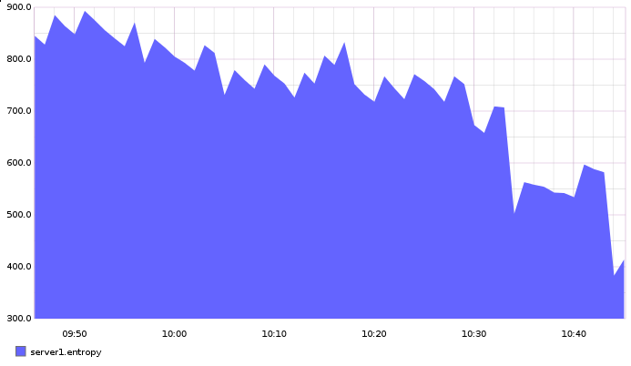
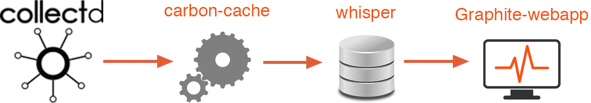
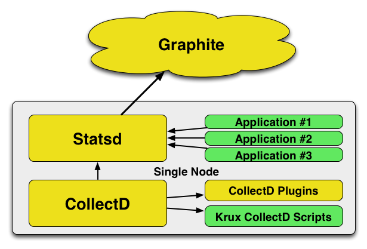

# Tổng quan về sự giám sát hệ thống và Graphite

### ***Mục lục***

[1.	Giới thiệu](#1)

[2.	Tại sao lại theo dõi dữ liệu](#2)

[3.	Graphite Web app](#3)

[4.	Carbon](#4)

[5.	Whisper](#5)

[6.	Các giao thức](#6)

[7.	Collectd](#7)

[8.	StatsD](#8)

[9. Tham khảo](#9)

---

## 1. Giới thiệu

- Có vô vàn lý do lý giải cho việc tại sao thu thập các số liệu thống kê về máy chủ, các ứng dụng và lưu lượng lại là một ý tưởng tốt. Việc thu thập và tổ chức dữ liệu có thể giúp bạn tự tin trong các quyết định mở rộng, xử lý sự cố, và theo dõi các điểm chết trong cấu hình của bạn.

- Có nhiều công cụ có thể được sử dụng để theo dõi các thông số trên máy, và chúng thường đại diện cho một phần nhỏ của tiến trình xử lý. Chúng ta có thể kết hợp các công cụ này với nhau để tạo ra được một hệ thống thu thập, ghi lại và hiển thị kết quả.

- Phần này mô tả một số công nghệ sẽ cho phép bạn thu thập, lưu trữ và hiển thị dữ liệu sinh ra bởi server và các ứng dụng trên hệ thống của bạn.

- **Graphite** là một thư viện đồ họa được tạo ra bởi một số thành phần có thể được sử dụng để hiển thị hình ảnh dữ liệu theo thời gian. 

- **Collectd** là một daemon có khả năng thu tập các thông tin thời gian thực về máy chủ đang chạy. 

- **StatsD** là một trình tổng hợp số liệu linh hoạt có thể được sử dụng để thu thập và tổ chứa dữ liệu tùy ý.

## 2.	Tại sao lại theo dõi dữ liệu

- Lý do khá đơn giản: càng có nhiều dữ liệu, chúng ta càng có nhiều khả năng hiểu những gì đang xảy ra tại bất kì thời điểm nào được đưa ra. Giúp chúng ta có khả năng sao lưu các quyết định với dữ liệu cứng và xem trước thời điểm nếu có một sự thay đổi tại một thành phần nào đó. 

- Theo dõi các số liệu cung cấp nguồn thông tin bổ sung mà không thể có trong log của các ứng dụng.

- Hầu hết (nhưng không phải tất cả) các hệ thống ghi log không biết được sự tương quan dữ liệu từ các ứng dụng khác nhau hoặc các sự kiện kết nối tới các trạng thái hệ thống nhất định vì chúng cơ bản biển diễn các kết quả đầu ra khép kín. Việc này có thể gây khó khăn khi xây dựng một cái nhìn toàn diện các trường hợp xung quang một sự kiện.

	Giả sử nếu máy chủ dữ liệu database bị tắt. Trong khi đọc log, bạn có thể được thông báo rằng vào lúc 15:35:28 UTC, dịch vụ MySQL bị tắt bởi lỗi OOM (Out Of memory). Vậy là vấn đề ở bộ nhớ, nhưng chúng ta không có ý tưởng về nguyên nhân gây ra vấn đề làm hết bộ nhớ trong một máy chủ chạy rất ổn định trước đó.

	Nếu theo dõi dữ liệu về máy chủ và các ứng dụng, chúng ta có thể ghép các phần tách biệt của dữ liệu hệ thống để giúp chúng ta hiểu được toàn cảnh giống như lúc xảy ra vấn đề và tìm ra nguyên nhân gây tăng bộ nhớ đột ngột.

- Trong tình huống khác, chúng ta có thể dùng để so sánh hệ thống trước và sau khi triển khai. Nếu code mới tạo một vài điều kiện lạ, chúng ta có thể thấy được sự ảnh hưởng của nó tới các thành phần, và so sánh hiệu suất so với code cũ. Chúng ta có thể xác định các vị trí mà code mới cải tiến và những chỗ mà có lỗi.

- Với việc thu thập dữ liệu thông minh, chúng ta có thể thấy hệ thống như một hệ thống, thay vì như một tập hợp các thành phần không liên quan.

## 3. 	Graphite Web app

- Thành phần rõ ràng là linh động nhất trong cài đăt Graphite là ứng dụng **Graphite web**.
Là thứ mà có thể sử dụng để phác họa nên đồ thự dữ liệu của bạn:

	

- **Graphite** là một giao diện linh hoạt để thiết kế đồ thị. Bạn có thể kết hợp nhiều loại thông số dữ liệu, nhãn điều khiển, kiểu chữ, màu sắc và các đường, và bạn có thể tùy chỉnh kích thước và tao tác dữ liệu theo ý muốn.

- Ý tưởng chính là Graphite render đồ thị dựa trên các điểm dữ liệu nó nhận được và chuyển tới bạn. Nó không ngay lập tức in đồ thị ra và vứt dữ liệu đi. Bạn có thể render bất kì dữ liệu nào mà bạn muốn.

- Ứng dụng web cũng cho phép bạn lưu các thông số đồ thị và layout, để bạn có thể đẩy lên giao diện monitor với các thiết lập mong muốn. Bạn có thể có nhiều giao diện dashboard, nghĩa là có thể có dashboard tách biệt với mỗi máy hoặc ứng dụng. Nếu bạn cần tương quan dữ liệu các dữ liệu này, chỉ cần kéo và thả các đồ thị để kết hợp hiển thị.

- Hơn nữa, Graphite cho phép bạn render đồ thị tại một URL trống để nhúng vào các giao diện khác nhau. Bạn cũng có thể xuất dữ liệu ra các định dạng khác như JSON hoặc CSV, hoặc xuất ra SVG với thông tin dữ liệu nhúng.

***Các thành phần khác của Graphite:***

## 4. Carbon

- **Carbon** là backend lưu trữ cho cấu hình Gaphite. Một cấu hình Graphite đơn giản sẽ có một hoặc nhiều Cardbon daemon chịu trách nhiệm xử lý dữ liệu được gửi thông qua các tiến trình khác được thu thập và truyền số liệu thống kê (bộ thu thập không là thành phần của Graphite)

- Có nhiều loại daemon Carbon, mỗi loại xử lý dữ liệu theo cách khác nhau. Cơ bản nhất trong số đó là `carbon-cache.py`. Daemon này lắng nghe dữ liệu trên một port và ghi dữ liệu vào đĩa khi nó đến một cách hiệu quả.

- Nó lưu dữ liệu đến và đẩy vào đĩa sau một khoảng thời gian đã định trước. Điều quan trọng là thành phần Carbon xử lý các quy trình nhận và flush dữ liệu. Nó không xử lý các cơ chế lưu trữ thực tế. 

- Daemon `carbon-cache.py`  cho biết các định dạng, giao thức và các cổng đang làm việc. Đồng thời cũng cho biết các chính sách để sử dụng lưu trữ dữ liệu. Những thứ này được đưa tới **whisper**. Với hầu hết cấu hình cơ bản, một `carbon-cache.py` là đủ để xử lý việc tiếp nhận dữ liệu.

- Nhiều trường hợp có thể chạy cùng lúc khi thiết lập của bạn phát triển hơn. Có thể cân bằng tải bởi daemon `carbon-relay.py` hoặc `carbon-aggregator.py` ở phía trước.

- Daemon `carbon-relay.py` có thể được sử dụng để gửi các request tới tất cả daemon backend để phòng bị. Nó cũng có thể được sử dụng để chia sẻ dữ liệu thông qua các `carbon-cache.py` khác để phân tải được được trên nhiều vị trí lưu trữ.

- Daemon `carbon-aggrerator.py` có thể buffer dữ liệu rồi đẩy nó vào `carbon-cache.py` sau một khoảng thời gian. Điều này làm giảm tác động của quá trình xử lý số liệu thống kê trên hệ thống ở chi phí các chi tiết.

## 5.	Whisper

- **Whisper** là một thư viện cơ sở dữ liệu mà graphite sử dụng để lưu thông tin metric mà nó được gửi tới.

- Nó rất linh hoạt và cho phép dữ liệu theo loạt thời gian được lưu một cách chi tiết tuyệt vời. Nó tạo các kho lưu trữ ở các mức độ chi tiết khác nhau, để sử dụng trong thực tế, thông tin bị giảm xuống thành các độ phân giải thấp hơn khi nó vượt qua một ngưỡng nhất định đã cấu hình.
	
	Ví dụ, bạn có thể lưu trữ điểm dữ liệu theo từng giây cho một số liệu nhất định. Bạn có thể nói với whisper là những dữ liệu chi tiết này nên được giữ trong vòng 5h. Bạn cũng có thể lưu trữ dữ liệu với độ phân giải thấp hơn. Nó có thể chỉ lưu một điểm mỗi phút và giã nó trong khoảng thời gian 6 tháng.

- Mỗi điểm trong lưu trữ với độ phân giải thấp được tính toán từ cùng dữ liệu mà nó ghi lại ở mức phân giải cao. Có thể có nhiều lưu trữ của các độ phân giải khác nhau và duy trì tỉ lệ như bạn mong muốn. Có thể cấu hình cách mà whisper tính toán dữ liệu độ phân giải thấp phụ thuộc vào kiểu số liệu theo dõi.

	Ví dụ, số liệu có thể là toàn bộ số lần xảy ra sự kiện trong khoảng thời gian ngắn. Để tạo một điểm cho khoảng thời gian lớn hơn ở mức phân giải thấp, bạn thêm vào các điểm dữ liệu mức cao để tóm tắt các giá trị thông qua quét khoảng thời gian rộng hơn.

- Whisper có thể tính toán dữ liệu phân giải mức thấp theo nhiều cách khác nhau phụ thuộc vào thuộc tính của số liệu. Ví dụ, một vài dữ liệu được sinh ra bằng cách tính trung bình, trong khi một số khác thì theo dõi giá trị lớn nhất. Với giá trị trung bình, giá trị được tính từ các điểm phân giải cao hơn để tạo các điểm phân giải thấp hơn. Với giá trị lớn nhất, giá trị lớn nhất nên được giữ lại và phần còn lại không dùng đến để duy trì ý nghĩa các con số.

- Whisper tính toán và ghi lại dữ liệu phân giải mức thấp tại thời điểm mà nó nhận được dữ liệu (sau khi một khoảng thời gian cần thiết để thu được giá trị). Nó đơn giản thu thập các điểm dữ liệu cần thiết để thực hiện kĩ thuật tập hợp dữ liệu (data aggegation technique) (trung bình, lớn nhất, …) và ghi nó.

- Graphite sẽ sử dụng lưu trữ phân giải mức cao mà chứa các khung thời gian yêu cầu khi nó truy vấn dữ liệu để vẽ đồ thị.

- Như đã nói, Graphite tự nó không thu thập dữ liệu. Thay vào đó, nó dựa vào việc cung cấp thông tin từ các dịch vụ khác. Điều này cho phép duy trì sự tập trung và cho phép nó tương tác modul với một loạt các dịch vụ đầu vào.

	

Phần này thảo luận về các giao thức mà Graphite có thể hiểu, và 2 chương trình thu thập metric là collectd và statsD, được sử dụng để đưa dữ liệu tới Carbon để xử lý.

## 6.	Các giao thức

Có 3 giao thức khác nhau có thể sử dụng để gửi dữ liệu tới Graphite:

- Đầu tiên là plain text. Đây là loại định dạng linh hoạt nhất bởi vì hầu hết bất kì ứng dụng hoặc dịch vụ có thể tạo ra dữ liệu text đầu ra và có thể dược sử dụng để đưa tới Graphite hoặc một công cụ trung gian.

	Các bản tin plain text chứa thông tin về tên số liệu, giá trị và nhãn thời gian của chúng. Những bản tin này có thể được gửi thẳng tới Carbon trên một port được chỉ định sẵn cho plain text mà không định dạng gì thêm.

- Bởi vì Graphite được tạo bởi Python, Graphite cũng chấp nhận dữ liệu định dạng “pickle”. Chuẩn Python này cho phép bạn đệm lại và gửi nhiều giá trị theo thời gian trong một giao dịch đơn.

- Graphite cũng chấp nhận dữ liệu sử dụng các bản tin AMQP. Điều này cho phép xử lý lượng tải lớn dữ liệu. Bạn có thể đưa một lượng lớn số liệu thống kê và xử lý ngắt trong kết nối mạng giữa các máy chủ từ xa mà không bị mất dữ liệu.

	

## 7.	Collectd

- Một cách dễ nhất để thu thập thông tin chi tiết vê server với daemon gọi là collectd.

- Collectd có thể kết hợp các số liệu thống kê của nhiều thành phần khác nhau của máy chủ. Nó cho phép dễ dàng theo dõi các số liệu thông thường như lượng bố nhớ sử dụng, CPU, lưu lượng mạng, … đồng thời cho phép dễ dàng tương quan các sự kiện với trạng thái của hệ thống. 

- Ngoài việc thu thập các thông tin hệ thống chuẩn, collectd cũng có thêm một hệ thống plugin mở rộng các chức năng của nó. Nghĩa là bạn có thể dễ dàng theo dõi các phàn mềm phổ biến như Apache, Nginx, iptables, memcache, MySQL, PostgreSQL, OpenVPN và nhiều hơn nữa.

- Collectd cung cấp cách đơn giản để lấy dữ liệu từ các ứng dụng dã xây dựng và các dịch vụ phổ biến trên server. Và được sử dụng dể theo dõi cách hoạt động của cơ sở hạ tầng và các dịch vụ của bạn.

## 8.	StatsD

- **StatsD** là một daemon rất đơn giản mà có thể được sử dụng để gửi các dữ liệu khác tới Graphite.

- StatsD hoạt động bằng cách lắng nghe trên một interface các gói tin UDP đơn giản đại diện cho một điểm dữ liệu đơn. Nghĩa là nó có thể chấp nhận một lượng thông tin không có hướng kết nối. Nó có thể tập hợp các giá trị mà nó nhận được và gửi chúng tới Graphite.

- Hệ thống này cho phép gửi số liệu thống kê với số lượng lớn mà không phải lo lắng về việc tăng thời gian chờ của ứng dụng. Dịch vụ StatsD sẽ thu thập tất cả các dữ liệu đến, tập hợp và gửi đi, các điểm dữ liệu tóm tắt tới Graphite vào khoảng thời gian mong đợi.

- Với những  lợi ích trên, statsD thực sự là một trung gian tốt cho bất kì loại dữ liệu nào gửi đến Graphite.

- StatsD là sự lựa chọn hoàn hảo bởi nó là một daemon chấp nhận lưu lượng UDP. Có nhiều thư viện phía client trong nhiều ngôn ngữ lập trình có thể gửi dữ liệu trực tiếp tới một StatsD. Nghĩa là những ứng dụng mà bạn xây dựng có thể dễ dàng gửi dữ liệu đi để theo dõi.

## 9. Tham khảo

https://www.digitalocean.com/community/tutorials/an-introduction-to-tracking-statistics-with-graphite-statsd-and-collectd